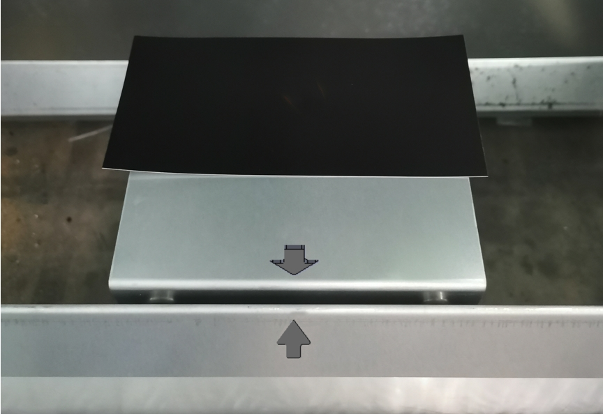

= Cleaning and setting work

== Creating a spot image

The program is used to check the optical path for contamination. With K59, Creating two spot images with different focal diameter. With BM111, Creating one spot image.
Condition
* Service user level is activated.
* No pallet inside the machine.
Means, Tools, Materials
* Photographic paper, black, mat. no. 1335798.
* Holding plate for photographic paper, mat. no. 2826297.
[arabic]
. Move the cutting unit to the front.
Creating a spot image via
service program
[arabic, start=2]
. Attach a nozzle (EAA27) to the nozzle holder.
. Fit the holding plate with magnetic support to the front bulkhead, aligning by the arrow mark.
.Hydraulic pallet changer version Fig. 3‑11
[width="100%",cols="52%,1%,47%",options="header",]
|image:img/image327.png[img/image327,width=305,height=259] |image:img/image328.png[img/image328,width=302,height=259] |

|1 Holding plate for photo paper | |3 Magnets
|2 Front bulkhead | |
[arabic, start=4]
. Double layer pallet changer version:
* Move the lower pallet into the machine.
* Place the holding plate on the pallet against the middle sheet stop.
* Align the marked spot to the center of middle sheet stop.
.Two-level pallet changer version Fig. 3‑12
[width="100%",cols="50%,50%",options="header",]
|image:img/image329.png[img/image329,width=382,height=258] |

|1 Marked spot |2 Middle sheet stop
[arabic, start=5]
. Place the photo paper at the marked spot on the holding plate.
.Fig. 3‑13
[width="100%",cols="100%",options="header",]
|

[arabic, start=6]
. Open HMI, select “Controls”.
. Click “Target shot”.
.Fig. 3‑14
[width="100%",cols="100%",options="header",]
|image:img/image331.png[img/image331,width=382,height=235]

[arabic, start=8]
. Set the parameters.
* Focus diameter: 150 µm.
* Focus position: 0 mm.
* Laser power: 1500 Watts.
* Duration: 0.02 s.
.Fig. 3‑15
[width="100%",cols="100%",options="header",]
|image:img/image332.png[img/image332,width=382,height=252]

* Need Vulcan service user level to modify the parameters.
* The energy value to be programmed depends on the paper thickness.
* If the spot image is over burn, try to reduce power or duration appropriately.
[arabic, start=9]
. Close the safety door and lock it.
. Click “Exhaust ON” in HMI.
. Make sure the laser is standby:
* Standby button on control panel is illuminated.
* Laser icon at the bottom-right corner of HMI is active.
.Fig. 3‑16
[width="100%",cols="100%",options="header",]
|image:img/image333.png[img/image333,width=288,height=173]

[arabic, start=12]
. Press START button.
The spot image of focus diameter 150 µm will be created.
[arabic, start=13]
. Change the parameters.
* Focus diameter: 210 µm.
* Focus position: 0 mm.
* Laser power: 1500 Watts.
* Duration: 0.001 s.
.Fig. 3‑17
[width="100%",cols="100%",options="header",]
|image:img/image334.png[img/image334,width=382,height=254]

[arabic, start=14]
. Press START button
The spot image of focus diameter 210 µm will be created.
[arabic, start=15]
. Check the spot image for contamination.
.Fig. 3‑18
[width="100%",cols="32%,19%,28%,21%",options="header",]
|image:img/image335.png[img/image335,width=182,height=185] | |image:img/image336.png[img/image336,width=184,height=185] |

|Good spot image |image:img/image337.png[img/image337,width=32,height=28] |Poor spot image |image:img/image338.png[img/image338,width=33,height=28]

[arabic, start=16]
. Rotate the protective glass by 90°.
Procedure for
contamination
[arabic, start=17]
. Create another spot image.
. If the dirt is at a different point:
. Clean or replace protective glass.
. Create another spot image.
. If there is still contamination:
. Clean the cutting lens from below.

== Centering the beam to the nozzle (Tapeshot)

* The service user level is activated.
Means, Tools, Materials
* Measuring magnifier (10 to 20 fold magnification).
* Adhesive tape (transparent Tesa Film).
* Permanent felt-tip marker (for example, Edding 400).
* Allen key 4 mm AF.
* Allen key 3 mm AF.
[arabic]
. Move the cutting unit to the front.
. Attach a nozzle (EAA10) to the nozzle holder.
. Mark directly in front of the nozzle.
.Fig. 3‑19
[width="100%",cols="100%",options="header",]
|image:img/image339.png[img/image339,width=307,height=223]

[arabic, start=4]
. Stick adhesive strips without tension over the nozzle orifice.
* Do not touch the adhesive strips in the scorching areas toprevent impurities.
.Fig. 3‑20
[width="100%",cols="50%,50%",options="header",]
|image:img/image340.png[img/image340,width=382,height=140] |

|1 Correct |2 Incorrect
[arabic, start=5]
. Select “Controls” in HMI.
. Click “Nozzle center”.
.Fig. 3‑21
[width="100%",cols="100%",options="header",]
|image:img/image341.png[img/image341,width=382,height=161]

[arabic, start=7]
. Go with setting:
* Focus diameter: 150 µm.
* Focus position: 0 mm.
* Power: 1000 Watts.
* Duration: 0.001 s.
* Need Vulcan service user level to modify the parameters.
* If the adhesive strip isn’t burnt through, increase the “Dwell time” appropriately.
.Fig. 3‑22
[width="100%",cols="100%",options="header",]
|image:img/image342.png[img/image342,width=382,height=256]

[arabic, start=8]
. Close the safety door and lock it.
. Press the START button.
. Open the safety door.
. Screw out the nozzle.
* If no hole or only one hole can be seen at the very edge of the nozzle orifice despite the laser beam being ignited,then a nozzle with larger diameter must be used.
[arabic, start=12]
. Check that the hole in the adhesive strip is centered in the nozzle orifice with the aid of measuring magnifier.
.Fig. 3‑23
[width="100%",cols="100%",options="header",]
|image:img/image343.png[img/image343,width=382,height=261]

[arabic, start=13]
. If the hole in the adhesive strip is not centered in the nozzle orifice, use the mark made on the nozzle to determine the direction in which the adjustment must be made.
* KL59 and BM111 have the same adjusting direction.
.Fig. 3‑24
[width="100%",cols="46%,54%",options="header",]
|image:img/image344.png[img/image344,width=382,height=260] |

|1 Nozzle orifice |2 Nozzle with marking from below
|3 Adhesive strip |4 Beam adjustment direction
|Nr.1 Adjusting screw 1 |Nr.2 Adjusting screw 2
[arabic, start=14]
. Use the adjusting screws to center the beam to the nozzle in the diagonal direction.
* For KL59, one turn of the adjusting screw, shifting the lens by 0.25mm.
* For KL59, if the adjusting screws are stiff, the screws canbe replaced individually.
.Fig. 3‑25
[width="100%",cols="55%,45%",options="header",]
|image:img/image345.png[img/image345,width=310,height=230] |image:img/image346.png[img/image346,width=278,height=230]

|Left: KL59 |Right: BM111
|1 Adjusting screw 1 |3 Adjusting screw (2x)
|2 Adjusting screw 2 |
[arabic, start=15]
. Stick a new adhesive strip on the nozzle hole and perform a tapeshot after every adjustment.
. Repeat this procedure until the hole is centered in relation to the nozzle orifice.

== Determining the focal position

The machine is not equipped with “BrightLine fiber” and BM111 has only one focal diameter. With KL59, two focus combs with different focal diameters are cut. With BM111, only one focus comb is cut.
Difference with different
cutting unit
Conditions
* The protective glass has been checked and replaced, if nec-essary (see “link:#checking-and-cleaning-protective-glass-kl59[Checking and cleaning protective glass (KL59)]”,pg. xxx).
* Nozzle centering has been checked and set, if necessary (see “link:#centering-the-beam-to-the-nozzle-tapeshot[Centering the beam to the nozzle (Tapeshot)]”, pg. xxx).
* The service user level is active.
Means, Tools, Materials
* Mild or stainless-steel sheet, sheet thickness 1 mm.
* Feeler gauge.
[arabic]
. Select “Controls” in HMI.
Cutting focusing comb
[arabic, start=2]
. Press “Focus Comb”.
.Fig. 3‑26
[width="100%",cols="100%",options="header",]
|image:img/image347.png[img/image347,width=382,height=223]

[arabic, start=3]
. Select 150µm for the “Focus Diameter”.
* With KL59, another focus comb of focus diameter 210µm needs to cut later.
* With BM111, select “EFocusDiameter.TwoHundred” for the “Focus Diameter”.
* The technology will be chosen automatically according to the focus diameter.
.Fig. 3‑27
[width="100%",cols="100%",options="header",]
|image:img/image348.png[img/image348,width=382,height=183]

[arabic, start=4]
. Apply the appropriate nozzle according to the technology.
* KL59: EAA23.
* BM111: size 2.0.
[arabic, start=5]
. Place a 1 mm thick sheet on the pallet (according to the technology).
. Select “Setup” > “work offset” to set work offset:
* “Positioning diode” to start cutting the reference part at the positioning diode.
* “Nozzle center” to start cutting the reference part at the center of the nozzle.
.Fig. 3‑28
[width="100%",cols="100%",options="header",]
|image:img/image349.png[img/image349,width=382,height=202]

[arabic, start=7]
. Back to the program “Focus comb”.
. Close the safety door and lock it.
. Make sure the laser is standby.
* Standby button on control panel is illuminated.
* Laser icon in the bottom-right corner of HMI is active.
.Fig. 3‑29
[width="100%",cols="100%",options="header",]
|image:img/image333.png[img/image333,width=288,height=173]

[arabic, start=10]
. Press the START button.
The focus comb will be cut.
[arabic, start=11]
. Repeat the above step to cut the focus comb with focal diameter 210 µm.
. Determine the smallest kerf “K” (= focus position) in the focuscomb:
Determining the focus
position and entering
offset
* With the suitable feeler gauge (e.g., 0.25 mm), starting from the left and right, respectively, check every individual kerf.
* Mark the kerf where the feeler gauge sticks on both left and right sides.
.Fig. 3‑30
[width="100%",cols="100%",options="header",]
|image:img/image350.png[img/image350,width=370,height=175]

[arabic, start=13]
. Calculate the focus shift and enter it under “Focus Shift1”.
*Example*: Old focus shift A mm, smallest kerf K mm.
Focus shift = A + K.
.Fig. 3‑31
[width="100%",cols="100%",options="header",]
|image:img/image351.png[img/image351,width=382,height=166]

* If the values are outside the tolerance specified bellow, the cutting unit may need to be replaced in coordination with the service department or according to the “Checklist for replacing the cutting unit”.
Machine with KL59, TruFiber Laser
.Focal position tolerances Tab. 3‑21
[width="100%",cols="50%,50%",options="header",]
|*150 µm* |*210 µm*
|-3.0/ +3.0 mm |-3.0/ +3.0 mm
|Max. difference between two focal position 3 mm |
Machine with BM111, TruFiber Laser
.Focal position tolerances Tab. 3‑22
[width="100%",cols="100%",options="header",]
|*200 µm*
|-4.0 / +4.0 mm

== Checking and cleaning protective glass (KL59)

* The straight protective glass is monitored by scattered light.
The exact procedure for cleaning and replacing the protective glass can be seen in the following YouTube video:
Protective glass cleaning
on YouTube
* Link DE: https://youtu.be/mQ9w2L14ZUk
* Link EN: https://youtu.be/s02bY8pHito
.QR codes for the videos on YouTube Fig. 3‑32
[width="100%",cols="100%",options="header",]
|image:img/image352.png[img/image352,width=403,height=209]

Condition
* Service user level in Vulcan system is activated.
Means, Tools, Materials
* Cleaning kit, mat. no. 1675885.
* LED lamp, mat. no. 1632115.
* Allen key 3 mm AF.
[arabic]
. Select “Controls” in HMI.
Checking the straight
protective glass
[arabic, start=2]
. Press “Lumi measure”.
.Fig. 3‑33
[width="100%",cols="100%",options="header",]
|image:img/image353.png[img/image353,width=382,height=192]

[width="100%",cols="35%,65%",options="header",]
|image:img/image10.png[img/image10,width=192,height=34] a|

*Destruction of components by reflected laser radiation!*
* Do not place any sheet metal under the measuring position.
[arabic, start=3]
. Go with default settings or modify the measuring position if the sheet metal is on the pallet.
.Fig. 3‑34
[width="100%",cols="100%",options="header",]
|image:img/image354.png[img/image354,width=382,height=189]

[arabic, start=4]
. Select whether new protective glass has been installed.
* Offline: old protective glass.
* Reference: new installed protective glass.
[arabic, start=5]
. Press START button.
. Depending on the result, clean or replace the protective glass.
* 80%-90%: clean.
* < 80%: replace.
.Fig. 3‑35
[width="100%",cols="100%",options="header",]
|image:img/image355.png[img/image355,width=382,height=277]

[arabic, start=7]
. Undo the knurled nut using the hook wrench and unscrew it completely.
Removing the protective
.Fig. 3‑36
[width="100%",cols="50%,50%",options="header",]
|image:img/image356.png[img/image356,width=288,height=396] |

|1 Protective glass |2 Knurled nut with groove for hook wrench
|3 Nozzle |4 Air blast nozzle
[width="100%",cols="35%,65%",options="header",]
|image:img/image10.png[img/image10,width=192,height=34] a|

*Protective glass is only laid on.*
*The protective glass may fall down.*
* Pull out the cartridge downwards without tilting it.
[arabic, start=8]
. Pull out the cartridge with the straight protective glass carefully downwards and out of the cutting unit and set it down.
. Pull on fingers covers onto the thumb and index finger. The protective glass must not be exposed to skin contact.
. Seal the opening of the cutting head with green adhesive tape from the cleaning set.
. Set down protective glass in cleaning device.
Clean the protective glass
.Fig. 3‑37
[width="100%",cols="100%",options="header",]
|image:img/image357.png[img/image357,width=364,height=253]

|1- Bore for swabs
[arabic, start=12]
. Place the flashlight in the cleaning device and switch it on.
. Remove loose dirt with a bellows.
[width="100%",cols="35%,65%",options="header",]
|image:img/image10.png[img/image10,width=192,height=34] a|

*Scratches in the protective glass due to soiled swabs.*
* Insert the swab in the hole in the cleaning fixture that is intended for this purpose.
* Dispose of the swab after use.
[arabic, start=14]
. Drip methanol on to the swab. Shake out excess methanol.
.Drip methanol over the swab Fig. 3‑38
[width="100%",cols="100%",options="header",]
|image:img/image358.png[img/image358,width=364,height=249]

[arabic, start=15]
. Remove coarse dirt by rubbing with the moistened swab.
.Cleaning the protective glass with the swab Fig. 3‑39
[width="100%",cols="100%",options="header",]
|image:img/image359.png[img/image359,width=379,height=334]

[width="100%",cols="35%,65%",options="header",]
|image:img/image10.png[img/image10,width=192,height=34] a|

*Protective glass contaminated by deposits.*
* Do not deposit swabs on the protective glass.
[arabic, start=16]
. Remove fine contamination with the flat side of the swab by evenly and slowly drawing it across the surface from one edge to the other.
. Wipe the swab slowly over the protective glass once more to remove the methanol haze.
. Turn the protective glass over and clean the rear side as described above.
. Clean the sealing surface, the inside and outside of the cartridge with the swab while it is still wet.
* The swab may not be used to clean the protective glass again.
[arabic, start=20]
. Dispose of the swab.
. Insert the protective glass into the cartridge. Make sure that the O-ring the protective glass rest on is present and not damaged.
[width="100%",cols="35%,65%",options="header",]
|image:img/image10.png[img/image10,width=192,height=34] a|

*Damage to the protective glass possible.*
* Make sure that the protective glass does not collide with the housing of the cutting head.
[arabic, start=22]
. Insert the cartridge and tighten the knurled nut with the hook wrench, until the arrow is exactly below the lock symbol.
.Arrow marking in the cutting unit Fig. 3‑40
[width="100%",cols="47%,53%",options="header",]
|image:img/image360.png[img/image360,width=379,height=247] |

|1- Lock symbol |2- Arrow
[arabic, start=23]
. If the contamination cannot be completely removed, replace the straight protective glass.

== Checking and cleaning protective glass (BM111)

Need to discuss with the R&D guys and SCC
