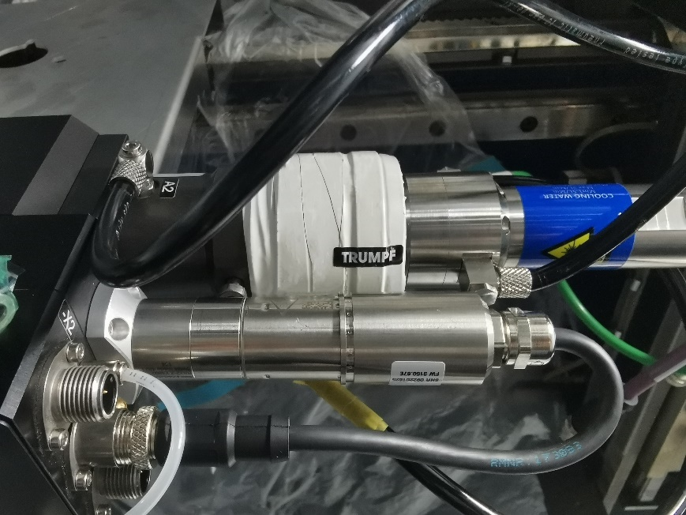

= Working on KL59 cutting unit

== Replacing the motor for lens adjustment, KL59

* The power supply to the cutting unit is disconnected.
* Compressed air supply is switched off.
* The cutting unit and the area around it must be clean.
Means, Tools, Materials
* Loctite 242/243.
* Torque screwdriver 1 Nm.
* 12 Nm torque wrench, AF 12.
* The following work can be performed with the cutting unit either removed or installed.
[arabic]
. If the cutting unit is installed: unplug CAN bus and voltage supply.
Remove the motor
[arabic, start=2]
. Remove the compressed air supply from the cylinder.
[width="100%",cols="35%,65%",options="header",]
|image:img/image10.png[img/image10,width=192,height=34] a|

*Loose spring on the cylinder*
*Spring may fall down*
* Remove the spring.
[arabic, start=3]
. Remove the compressed air cylinder.
.Compressed air cylinder with spring Fig. 3‑59
[width="100%",cols="100%",options="header",]
|image:img/image379.png[img/image379,width=316,height=237]

[width="100%",cols="35%,65%",options="header",]
|image:img/image10.png[img/image10,width=192,height=34] a|

*The guides are sensitive to dirt!*
*Damage to the cutting unit*
* Clean the environment.
* Cover up slides after opening.
[arabic, start=4]
. Using a suitable tool, lift the cover and remove it.
.Cover of electronics lid Fig. 3‑60
[width="100%",cols="100%",options="header",]
|image:img/image380.png[img/image380,width=316,height=237]

[arabic, start=5]
. Unplug the motor cable.
.KL59 cutting unit motor cable Fig. 3‑61
[width="100%",cols="100%",options="header",]
|image:img/image381.png[img/image381,width=249,height=333]

[arabic, start=6]
. Remove the electronics lid.
.Electronics lid Fig. 3‑62
[width="100%",cols="100%",options="header",]
|image:img/image382.png[img/image382,width=379,height=283]

[arabic, start=7]
. Remove four screws from the motor flange.
. Push the slide to its uppermost position and lift the motor.
. Undo the recirculating ball nut (12 mm).
.Disassembly of motor KL59 Fig. 3‑63
[width="100%",cols="50%,50%",options="header",]
|image:img/image383.png[img/image383,width=379,height=311] |

|1 Recirculating ball nut |2 Slide top position
[arabic, start=10]
. Remove the motor.
. Before installing the new motor: clean the flange surfaces/ support area on cutting unit and motor.
Mount the motor
[arabic, start=12]
. Align connection cable of the new motor at the front.
. Place a drop of Loctite 242/243 on the recirculating ball nut and insert the motor
. Screw the ball nut to a torque of 12 Nm.
* It must still be possible to shift the flange surface around.
[arabic, start=15]
. Fit the motor screws.
. By moving the slide, align the motor in its uppermost position.
. Tighten the motor screws to a torque of 1 Nm.
* It must be as easy to move the slide over its entire range of movement.
[arabic, start=18]
. Manually move the slide to check its function.
. If slide is difficult to move, detach the motor and realign it.
. Screw on the electronics lid.
. Plug in the motor cable.
. Setting reference switch KL59. (see “link:#setting-reference-switch-kl59[Setting reference switch KL59]”, pg. xxx)
Performing follow-up work
[arabic, start=23]
. Attach the cover of the electronics lid.
[width="100%",cols="35%,65%",options="header",]
|image:img/image10.png[img/image10,width=192,height=34] a|

*Loose spring on the cylinder!*
*Malfunction of the cutting unit.*
* Install the spring again correctly.
[arabic, start=24]
. Install the compressed air cylinder with spring again and plugin the compressed air hose.
.Attachment of compressed air cylinder Fig. 3‑64
[width="100%",cols="50%,50%",options="header",]
|image:img/image384.png[img/image384,width=379,height=311] |

|1 Cover |2 Compressed air supply
|3 Compressed air cylinder |
[arabic, start=25]
. If the cutting unit is installed: reattach the cable that was detached.
. Checking lens replacement KL59. (see “link:#checking-lens-replacement-kl59[Checking lens replacement KL59]”, pg. xxx)
. Determine the focus position.

== Setting reference switch KL59

switch
.Reference switch Fig. 3‑65
[width="100%",cols="100%",options="header",]
|image:img/image385.png[img/image385,width=382,height=292]

The nominal value for the increments is in the range 750 ± 250.
Reading out incremental
values
One revolution of the measuring system corresponds to 3000 increments or 2 mm travel.
[arabic]
. Go to HMI, select “Controls” > “Focus Ref Setting”.
.Fig. 3‑66
[width="100%",cols="100%",options="header",]
|image:img/image386.png[img/image386,width=382,height=206]

[arabic, start=2]
. Select “Ref adjust” and press the START button.
.Fig. 3‑67
[width="100%",cols="100%",options="header",]
|image:img/image387.png[img/image387,width=382,height=232]

[arabic, start=3]
. Check the incremental value under “Ref adjust”.
Nominal value: 750 ± 250.
[arabic, start=4]
. If the incremental value exceeds the permissible tolerance, then keep shifting the proximity switch until it is within the specified tolerance.
Setting reference switch
[arabic, start=5]
. Detach cover if required.
.Reference switch setting Fig. 3‑68
[width="100%",cols="100%",options="header",]
|image:img/image388.png[img/image388,width=382,height=285]

[arabic, start=6]
. Undo the screws of the reference switch and shift it.
* Measurements made with loose screws can falsify the incremental value.
[arabic, start=7]
. Tighten the screws.
. Check the reference switch clearance again.
If the reference switch has been set: Determine the reference point offset value.
Determine the reference
point offset value
[arabic, start=9]
. Switch to “Ref measure” and press the START button.
.Fig. 3‑69
[width="100%",cols="100%",options="header",]
|image:img/image389.png[img/image389,width=382,height=241]

[arabic, start=10]
. Switch to “Write offset” option.
. Press START button to apply the new offset value.
.Fig. 3‑70
[width="100%",cols="100%",options="header",]
|image:img/image390.png[img/image390,width=382,height=273]

[arabic, start=12]
. Acknowledge the dialog box.
. Mount cover and peunmatic cylinder.
Performing follow-up work
[arabic, start=14]
. Checking lens replacement (KL59) (see “link:#checking-lens-replacement-kl59[Checking lens repl-acement KL59]”, pg. xxx).
. Determine the focus position (see “link:#determining-the-focal-position[Determining the focal po-sition]”, pg. xxx).

== Checking lens replacement KL59

Currently we check the lens replacement manually by the program “Focal Distance”.
[arabic]
. Go to HMI, open the program “Focal Distance”.
. Acknowledge the current focus diameter (e.g., 150 µm).
.Fig. 3‑71
[width="100%",cols="100%",options="header",]
|image:img/image391.png[img/image391,width=382,height=244]

[arabic, start=3]
. Modify the “Focus Diameter” to 210 µm.
. Press START button.
. Check if the “Active Focus Diameter” changed successfully.
. Modify the “Focus Diameter” back to 150 µm.
. Press START button again.
. Check if the “Active Focus Diameter” changed successfully.

== Replacing and cleaning cutting lens KL59

* The power supply to the cutting unit is disconnected.
* Compressed air supply is switched off.
* The cutting unit and the area around it must be clean.
* The sealing gas must be active (if equipped).
* The spare parts and additional equipment must be available.
Means, Tools, Materials
* Allen key set.
* Lens cleaning set.
* New lens.
* The following work can be performed with the cutting unit either removed or installed.
[width="100%",cols="35%,65%",options="header",]
|image:img/image10.png[img/image10,width=192,height=34] a|

*Contamination of the internal optics.*
*Destruction of cutting unit.*
* Pay attention to cleanliness in the work area.
[arabic]
. Remove the cartridge and protect it, to ensure that it stays clean.
Removing the cutting lens
[arabic, start=2]
. Remove four screws from the cutting head.
.Fig. 3‑72
[width="100%",cols="50%,50%",options="header",]
|image:img/image392.png[img/image392,width=304,height=225] |image:img/image393.png[img/image393,width=301,height=225]

|Left: Cutting head fixed with adhesive tape |Right: Cutting head cover
[arabic, start=3]
. Either
* Adhesive tape is used to fix the cutting head onto the cutting unit.
* Remove cover of cutting head.
* Disconnect the electrical connections (see the following figure).
* Undo the cutting head screws.
* Carefully feed the cable though.
* Remove the cutting head and protect it, to ensure that it stays clean.
.Cutting head electrical connections Fig. 3‑73
[width="100%",cols="50%,50%",options="header",]
|image:img/image394.png[img/image394,width=326,height=270] |

|1 Connecting cable X1 |2 Ground cable
* The following work must be done promptly.
* Should the cutting lens be removed and cleaned, then green adhesive tape from the cleaning set must be used to keep the cutting unit clean.
[arabic, start=4]
. Remove three screws from the lens adapter.
. Hold the cutting lens and then undo the fourth screw.
. Remove the cutting lens.
Installing the cutting lens
.A new lens with its protective film Fig. 3‑74
[width="100%",cols="100%",options="header",]
|image:img/image395.png[img/image395,width=382,height=248]

* When installing a new lens, only remove the adhesive tape shortly before the actual installation.
.Installing the lens Fig. 3‑75
[width="100%",cols="55%,45%",options="header",]
|image:img/image396.png[img/image396,width=328,height=249] |image:img/image397.png[img/image397,width=270,height=249]

[arabic, start=7]
. Remove the protective film from the top of the cutting lens and install the lens.
. Tighten the four screws for the lens uniformly to a maximum torque of 1 Nm.
* After removing the film, or immediately after checking the lens, install the cutting head.
[arabic, start=9]
. Remove the lower film and check that the lens is clean using the flashlight from the cleaning set.
. Mounting the cutting head.
[width="100%",cols="35%,65%",options="header",]
|image:img/image10.png[img/image10,width=192,height=34] a|

*Damage to the protective glass possible.*
* Make sure that the protective glass does not collide with the housing of the cutting head.
[arabic, start=11]
. Check that the protective glass is clean and fit the cartridge.
. Create a spot image in accordance with cutting unit (see “link:#creating-a-spot-image[Cr-eating a spot image]”, pg. xxx).
Complete work
[arabic, start=13]
. Perform a tapeshot (see “link:#centering-the-beam-to-the-nozzle-tapeshot[Centering the beam to the nozzle (Tapeshot)]”, pg. xxx).
. Determine the focus position (see “link:#determining-the-focal-position[Determining the focal position]”, pg. xxx).
. Carry out a variety of test cuts using the “Cutting Tools” program (not yet available).

== Replacing adjuster-holder KL59

* The power supply to the cutting unit is disconnected.
* Compressed air supply is switched off.
* The cutting unit and the area around it must be clean.
* The sealing gas must be active (if equipped).
* The spare parts and additional equipment must be available.
Means, Tools, Materials
* Allen key set.
* Cleaning kit.
* New adjustment unit.
* The following work can be performed with the cutting unit either removed or installed.
[width="100%",cols="35%,65%",options="header",]
|image:img/image10.png[img/image10,width=192,height=34] a|

*Contamination of the internal optics.*
*Destruction of cutting unit.*
* Pay attention to cleanliness in the work area.
[arabic]
. Remove the cartridge and protect it, to ensure that it stays clean.
Removing cutting head
[arabic, start=2]
. Remove cover of cutting head.
* When disconnecting electrical connections, pull by the plug housing. Do not pull on the cable.
.Cutting head electrical connections Fig. 3‑76
[width="100%",cols="50%,50%",options="header",]
|image:img/image394.png[img/image394,width=379,height=314] |

|1- Connecting cable X1 |2- Ground cable
[arabic, start=3]
. Disconnect the electrical connections.
. Undo the cutting head screws.
. Carefully feed the cable through.
. Remove the cutting head and protect it, to ensure that it stays clean.
. Either
* Remove the film on the lens.
* Clean and replace the lens if necessary (see “link:#replacing-and-cleaning-cutting-lens-kl59[Replacing and cleaning cutting lens KL59]”, pg. xxx).
[arabic, start=8]
. Open the adjuster-holder screws.
Replacing adjuster-holder
* Watch out for O-rings dropping off.
.The adjuster-holder screws Fig. 3‑77
[width="100%",cols="100%",options="header",]
|image:img/image398.png[img/image398,width=379,height=315]

(example here: Lens with scorching)
* The following work must be done promptly.
* Should the cutting lens be removed and cleaned, then green adhesive tape from the cleaning set must be used to keep the cutting unit clean.
* Carefully feed the cables through.
[arabic, start=9]
. Carefully remove the adjuster-holder.
.Removing the adjuster-holder Fig. 3‑78
[width="100%",cols="100%",options="header",]
|image:img/image399.png[img/image399,width=379,height=264]

* Do not use grease or anything similar to fix the O-rings.
[arabic, start=10]
. Replace the O-rings as required.
.Adjuster-holder with O-rings inserted Fig. 3‑79
[width="100%",cols="100%",options="header",]
|image:img/image400.png[img/image400,width=379,height=279]

* Ensure that the cutting lens is clean during installation.
[arabic, start=11]
. Remount the dismounted parts in the opposite order.
[width="100%",cols="35%,65%",options="header",]
|image:img/image10.png[img/image10,width=192,height=34] a|

*Contamination of the internal optics.*
*Destruction of cutting unit.*
* Remove the adhesive tape.
[arabic, start=12]
. After fitting the cutting lens, remove the adhesive tape.
. Create a spot image in accordance with cutting unit. (see “link:#creating-a-spot-image[Creating a spot image]”, pg. xxx).
Performing follow-up work
[arabic, start=14]
. Perform a tapeshot (see “link:#centering-the-beam-to-the-nozzle-tapeshot[Centering the beam to the nozzle (Tapeshot)]”, pg. xxx)
. Determine the focus position. (see “link:#determining-the-focal-position[Determining the focal position]”, pg. xxx)
. Carry out a variety of test cuts using the "Cutting Tools" program (not yet available).

== Preparing for work on the cutting unit

* Nitrogen supply is switched on.
* Sealing gas supply is switched on (if equipped).
* Drives are switched off.
* Process cooler is switched off.
* Laser is switched off.
Means, Tools, Materials
* Holding fixture, cutting unit, mat. no. 2770993.
* Flow box, mat. no. 1635336.
* Holding fixture for flow box, mat. no. 2771259.
* Cover foil with adhesive tape, mat. no. 1629149 from the service kit LLK and cutting unit, mat no. 2082194.
* Clean room wipes, mat. no. 0359506.
* Adhesive tape PVC 19 mm, mat. no. 1420313.
[arabic]
. Move the pallet with large sheet metal to the machine.
. Remove the bellows of the Y axis.
. Remove the covers for the cutting unit.
. Move the cutting unit to the position that the holes for flow box fixture are not far from the left of the Lanny valve.
.Holes for flow box fixture Fig. 3‑80
[width="100%",cols="100%",options="header",]
|image:img/image401.png[img/image401,width=382,height=275]

[arabic, start=5]
. Mount the holding fixture for the flow box on the motion unit.
.Fig. 3‑81
[width="100%",cols="100%",options="header",]
|image:img/image402.png[img/image402,width=364,height=284]

[arabic, start=6]
. Open the Z energy chain.
. Use cloths and clean room wipes to clean entire machine area (frame, roof, cutting unit, LLK, Z chain, bellows, etc.).
* Do not use compressed air to do the cleaning work.
[arabic, start=8]
. Fix the foil to the machine frame and the roof all around with adhesive tape.
. Roll the foil downwards.
.Fig. 3‑82
[width="100%",cols="100%",options="header",]
|image:img/image403.png[img/image403,width=382,height=286]

[arabic, start=10]
. Fasten more foil with adhesive tape at the end of the first foil layer.
.Fig. 3‑83
[width="100%",cols="100%",options="header",]
|image:img/image404.jpg[img/image404,width=382,height=286]

[arabic, start=11]
. Roll the second foil layer downwards.
. Cover the whole floor area with foil and secure it to the machine frame using holding magnets.
.Fig. 3‑84
[width="100%",cols="100%",options="header",]
|image:img/image405.png[img/image405,width=382,height=286]

[arabic, start=13]
. Using a foil cutter to have access to the cutting unit.
.Fig. 3‑85
[width="100%",cols="100%",options="header",]
|image:img/image406.png[img/image406,width=382,height=286]

[arabic, start=14]
. Clean the flow box and holding fixture with clean room wipes.
. Place the flow box on the holding fixture.
.Fig. 3‑86
[width="100%",cols="100%",options="header",]
|image:img/image407.png[img/image407,width=382,height=239]

[arabic, start=16]
. Attach the foil with adhesive tape to the flow box.
* Reserve enough space for service work.
* Do not roll the foil downwards yet.
.Fig. 3‑87
[width="100%",cols="100%",options="header",]
|image:img/image408.png[img/image408,width=382,height=252]

[arabic, start=17]
. Check the TRUMPF seal of the LLK connector to make sure it is intact.
.Fig. 3‑88
[width="100%",cols="100%",options="header",]
|image:img/image409.png[img/image409,width=382,height=359]

== Replacing cutting unit KL59

* Entire area around the cutting unit is clean and covered with film (see "link:#preparing-for-work-on-the-cutting-unit[Preparing for work on the cutting unit]", pg. xxx).
* Current checklist has been worked through.
* Nitrogen supply is switched on.
* Drives are switched off.
* Process cooler is switched off.
* Laser is switched off.
Means, Tools, Materials
* Holding fixture, cutting unit, mat. no. 2770993.
* Flow box, mat. no. 1635336.
* Holding fixture for flow box, mat. no. 2771259.
* Cleaning kit, mat. no. 1675885.
* Clean room wipes, mat. no. 0359506.
* Plug guard LLK-D cpl., mat. no. 1310309.
* EK D plug cpl., mat.-no. 1301765.
* UV lamp with holder, mat. no. 1873420.
* White plaster tape, mat. no. 1420313.
* TRUMPF seal, mat. no. 1660501.
* Service kit for replacing cutting unit/LLK, mat. no. 2082194.
* Measuring magnifier, mat. no. 1995032.
* Work through the checklist before replacing the cutting unit.
* Contact SCC for the latest checklist.
[arabic]
. Under the flow box, insert the cutting unit holding fixture on the guide rail.
Position the holding fixture
.Cutting unit holding fixture Fig. 3‑89
[width="100%",cols="50%,50%",options="header",]
|image:img/image410.png[img/image410,width=382,height=196] |

|1 Guide rail |2 Rack
[arabic, start=2]
. Close the compressed air supply.
Dismantle the cutting unit
[arabic, start=3]
. Remove all cables and hose connectors on the cutting unit except sealing gas line.
.Fig. 3‑90
[width="100%",cols="100%",options="header",]
|image:img/image411.png[img/image411,width=288,height=257]

|1 Sealing gas line
[arabic, start=4]
. Seal the open connections with plugs or adhesive tape.
. Disengage the cutting unit from the mounting flange.
. Remove the cutting unit and carefully place it on the fixture.
* Pay attention to the minimum bending radius and twistingthe laser light cable as little as possible.
.Fig. 3‑91
[width="100%",cols="100%",options="header",]
|image:img/image412.png[img/image412,width=382,height=214]

[arabic, start=7]
. Attach foil to the cutting unit and the LLK.
. Roll the foil attached to the flow box downwards.
. Seal the opening of the foil with the adhesive tape.
.Fig. 3‑92
[width="100%",cols="100%",options="header",]
|image:img/image413.png[img/image413,width=382,height=301]

[arabic, start=10]
. Run the flow box for at least 15 min.
.Fig. 3‑93
[width="100%",cols="100%",options="header",]
|image:img/image414.png[img/image414,width=382,height=239]

* Do not switch off flow box during the whole procedure.
[arabic, start=11]
. Disconnect the laser light cable:
* QD connector (see “link:#plugging-qd-connector-into-the-cutting-unit[Plugging QD connector into the cutti-ng unit]”, pg. xxx).
Install the cutting unit
[width="100%",cols="35%,65%",options="header",]
|image:img/image10.png[img/image10,width=192,height=34] a|

*Damage to the laser light cable!*
* Do not attach a cable tie to fasten the LLK on the cable carrier.
.Fig. 3‑94
[width="100%",cols="100%",options="header",]
|image:img/image415.png[img/image415,width=382,height=250]

[arabic, start=12]
. To install the cutting unit: Perform the removal steps in the reverse order.
. Wrap the locking mechanism of the laser light cable with white plastering tape until it is over the spring.
.Locking mechanism Fig. 3‑95
[width="100%",cols="100%",options="header",]
|image:img/image416.png[img/image416,width=382,height=228]

[arabic, start=14]
. Apply a TRUMPF seal to the plastering tape.
.Fig. 3‑96
[width="100%",cols="100%",options="header",]
|

[arabic, start=15]
. Set the sealing gas pressure reducer back to 4.5 bar again.
Perform follow-up work
[arabic, start=16]
. Check the sealing gas pressure.
Nominal value 40±5 mbar.
[arabic, start=17]
. Apply reference point offset value. (see “link:#setting-reference-switch-kl59[Setting reference switch KL59]”, pg. xxx).
. Create a spot image. (see “link:#creating-a-spot-image[Creating a spot image]”, pg. xxx).
. Check and set alignment of the laser light cable to the cuttingunit (LLK adjustment). (see “link:#checking-and-setting-alignment-of-the-laser-light-cable-to-kl59-llk-adjustment[Checking and setting alignment of the laser light cable to the cutting unit (LLK adjustment)]”, pg. xxx).
. Center the beam to the nozzle (Tapeshot). (see “link:#centering-the-beam-to-the-nozzle-tapeshot[Centering the beam to the nozzle (Tapeshot)]”, pg. xxx).
. Measure the laser power at the workpiece. (see “link:#measure-the-laser-power-at-workpiece[Measure the laser power at the workpiece]”, pg. xxx).
. Set the nominal laser power on the workpiece. (see “link:#set-the-nominal-laser-power-on-the-workpiece[Set the nominal laser power on the workpiece]”, pg. xxx).
. Determine the focal position. (see “link:#determining-the-focal-position[Determining the focal position]”, pg. xxx).

== Replacing the proximity switch for KL59 collision protection monitoring

* Clean room wipes, mat. no. 0359506.
* Loctite 242.
* Allen key size 2.5 mm (1/4").
[arabic]
. Clean the area around cutting unit with clean room wipes.
. Clean the pick-up flange from below.
. Fully disengage the cutting unit and place it on all four roller plungers.
.Disengaged cutting unit Fig. 3‑97
[width="100%",cols="100%",options="header",]
|image:img/image418.png[img/image418,width=382,height=247]

[arabic, start=4]
. Unplug the cable for collision protection monitoring.
.Fig. 3‑98
[width="100%",cols="50%,50%",options="header",]
|image:img/image419.png[img/image419,width=382,height=248] |

|1 Support ring |2 Pick-up flange
|3 Collision protection monitoring cable |
[arabic, start=5]
. Remove the 9x fastening screws at the bottom of the supportring (pinned to the pick-up flange).
. Remove the support ring downwards.
. Clean the pick-up flange with clean room wipes.
. Clean the support ring with clean room wipes.
. Remove the screws (4x) of the support ring.
. Separate the two parts of the support ring.
.Fig. 3‑99
[width="100%",cols="100%",options="header",]
|image:img/image420.png[img/image420,width=382,height=237]

|1 Proximity switch
[arabic, start=11]
. Replace the proximity switch.
. Clean all the parts with clean room wipes.
. Put both parts of the support ring back together.
. Glue the screws (4x) in place with Loctite 242.
.Fig. 3‑100
[width="100%",cols="100%",options="header",]
|image:img/image421.png[img/image421,width=382,height=237]

|1 Support ring screws (4x)
* Make sure all surfaces are clean.
[arabic, start=15]
. Mount support ring back in the pick-up flange.
. Glue in the fastening screws (9x) with Loctite 242.
. Insert the cable of collision protection monitoring and secure it with cable ties.
[width="100%",cols="35%,65%",options="header",]
|image:img/image10.png[img/image10,width=192,height=34] a|

*Damage of LLK during collisions!*
* Do not fix the LLK with cable ties.
[arabic, start=18]
. Lock the cutting unit.
