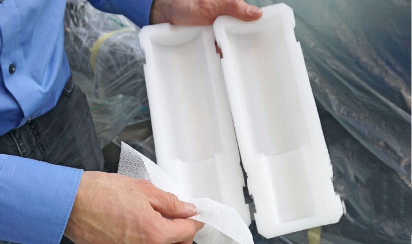
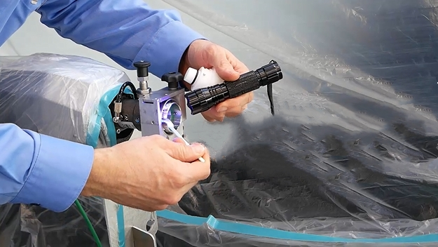
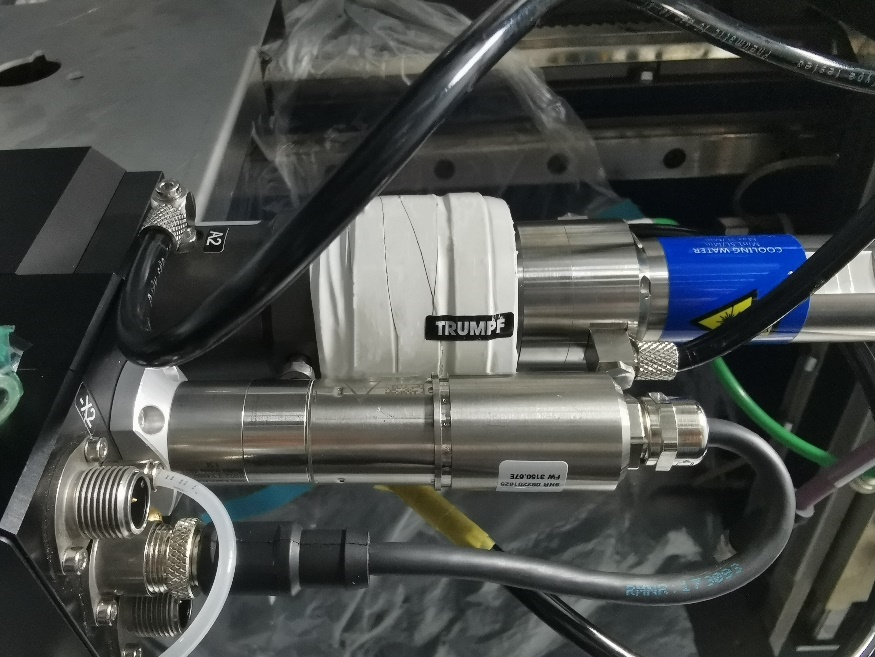

= Working on QD connector

== Checking and setting alignment of the laser light cable to KL59 (LLK adjustment)

Conditions
* Laser is ready for operation.
* Service user level is active.
Means, Tools, Materials
* Adhesive tape.
* Measuring magnifier.
* Felt-tip pen.
* Adjustment aid for cutting head (mat. no. 2277653).
* Small torque tool 4-25 Nm (mat. no. 0137954).
* AF 8 mm fork wrench insert for torque 4 Nm (mat. no. 2350848).
[arabic]
. Stick adhesive tape on the adjusting device without tension.
Leveling check (only KL59)
* Make sure no fingerprints on the target surface.
[arabic, start=2]
. Insert the adjusting device into the cutting unit.
. With a felt-tipped pen, make a marking in the direction of the lateral air blast nozzle.
.Adjusting device with adhesive tape Fig. 3‑41
[width="100%",cols="100%",options="header",]
|image:img/image361.png[img/image361,width=288,height=241]

|1 Felt-tipped pen marking
[arabic, start=4]
. Select “Controls” in HMI.
. Press “Nozzle center”.
. Select “210 µm” in “Focus Diameter” and go with the following parameters.
* Focus position: 3 mm.
* Power: 3000 Watts.
* Duration: 0.001 s.
.Fig. 3‑42
[width="100%",cols="100%",options="header",]
|image:img/image362.png[img/image362,width=382,height=185]

[arabic, start=7]
. Then execute the program.
* Do not remove the adhesive tape and nozzle.
[arabic, start=8]
. Stick another piece of adhesive tape onto the adjusting device without tension.
* Make sure no fingerprints on the target surface.
[arabic, start=9]
. Change the “Focus diameter” to 150 µm and go with the following parameters.
* Focus position: 0 mm.
* Power: 1000 Watts.
* Duration: 0.001 s.
.Fig. 3‑43
[width="100%",cols="100%",options="header",]
|image:img/image363.png[img/image363,width=382,height=182]

[arabic, start=10]
. Execute the program again.
. Remove the nozzle.
. Use a magnifying glass to check both scorchings.
* The small scorching must be centered on the large scorching.
* The eccentricity must not exceed 3/100 mm.
.Fig. 3‑44
[width="100%",cols="100%",options="header",]
|image:img/image364.png[img/image364,width=382,height=104]

[arabic, start=13]
. If required, adjust the LLK.
.Fig. 3‑45
[width="100%",cols="50%,50%",options="header",]
|image:img/image365.png[img/image365,width=382,height=164] |

|A outside the tolerance |B Within the tolerance
[arabic, start=14]
. Dismantle the cover of the cutting unit.
Align the LLK to the
cutting unit
[arabic, start=15]
. Cutting unit KL59: change the input coupling using the 4 adjusting screws.
* If there is an offset in X or Y direction, first unscrew the screw on the opposite side and then screw in the adjusting screw.
* Reinsert the screw on the opposite side (torque 1.5 Nm).
* Do not offset by more than a third of a rotation per correction.
.Example without plastering tape Fig. 3‑46
[width="100%",cols="100%",options="header",]
|image:img/image366.png[img/image366,width=382,height=285]

|1 Adjusting screws (4x) on the QD socket
* On cutting unit KL59, the position of the small hole is shifted (minimum focus diameter).
[arabic, start=16]
. Check the alignment of the LLK relative to the cutting unit again.
. Mount the cover of the cutting unit.

== Plugging QD connector into the cutting unit

* The machine interior has been taped and all cleaning work has been performed (see "link:#preparing-for-work-on-the-cutting-unit[Preparing for work on the cutting unit]", pg. xxx).
* Sealing gas supply is switched on.
* Cutting unit has been removed.
* Machine cooling has been switched off.
Means, Tools, Materials
* Holding fixture for cutting unit, mat. no. 2770993.
* Flow box, mat. no. 1635336.
* Holding fixture for flow box, mat. no. 2771259.
* LLK service kit and cutting unit, mat. no. 2082194.
* Cleaning kit, mat. no. 1675885.
* Clean room wipes, mat. no. 0359506.
* Plug guard LLK-D cpl., mat. no. 1310309.
* EK D plug cpl., mat. no. 1301765.
* Plug guard LLK-D (2x), mat. no. 1634404.
* Swab (mat. no. 1222024)
* Adhesive tape PVC 19 mm, mat. no. 1420313.
* TRUMPF seal, mat. no. 1660501.
* The following work to unplug/plug the LLK are all performed under the flow box.
[arabic]
. Remove the cutting unit:
Unplug the LLK
* KL59 (see “link:#replacing-cutting-unit-kl59[Replacing cutting unit KL59]”, pg. xxx).
* BM111 (see “link:#replacing-cutting-unit-bm111[Replacing cutting unit BM111]”, pg. xxx).
* Do not switch off flow box during the whole procedure.
[arabic, start=2]
. Disconnect the cooling hose and seal it with adhesive tape.
.Fig. 3‑47
[width="100%",cols="100%",options="header",]
|image:img/image367.png[img/image367,width=382,height=224]

|1 Cooling hose LLK plug
[arabic, start=3]
. Remove the white Teflon tape at the LLK plug.
. Thoroughly clean the LLK plug with clean room wipes.
. Clean the connector protection and plugs with clean room wipes.
.Fig. 3‑48
[width="100%",cols="100%",options="header",]
|image:img/image368.png[img/image368,width=624,height=198]

[arabic, start=6]
. Set the sealing gas pressure reducer on the instrument panel to 0 bar.
.Sealing gas pressure regulator Fig. 3‑49
[width="100%",cols="100%",options="header",]
|image:img/image369.png[img/image369,width=382,height=243]

[arabic, start=7]
. With one hand pulling and holding the LLK receptacle, the other hand unplug the LLK manually.
* Slowly and straightly unplug the LLK in case of scratching the LLK plug.
.Unplug LLK Fig. 3‑50
[width="100%",cols="100%",options="header",]
|image:img/image370.png[img/image370,width=382,height=228]

[arabic, start=8]
. Mount the connector protection onto the LLK.
.Mount the plug guard Fig. 3‑51
[width="100%",cols="100%",options="header",]
|image:img/image371.png[img/image371,width=364,height=215]

[arabic, start=9]
. Mount the plug on the cutting unit.
.Example Fig. 3‑52
[width="100%",cols="100%",options="header",]
|image:img/image372.png[img/image372,width=364,height=212]

[arabic, start=10]
. Clean the protective sheath for the LLK plug.
.Fig. 3‑53
[width="100%",cols="100%",options="header",]
|

[arabic, start=11]
. Attach the protective sheath around the LLK plug and place the LLK into the Z energy chain.
.Fig. 3‑54
[width="100%",cols="100%",options="header",]
|image:img/image374.png[img/image374,width=382,height=296]

[arabic, start=12]
. Set the sealing gas pressure reducer on the device panel back to 4.5 bar.
. Perform tasks at the cutting unit (cleaning, replacement…).
Plug the LLK
[arabic, start=14]
. Carefully unpack the plug.
. Check the end interface of QD connector for contamination.
.Example Fig. 3‑55
[width="100%",cols="100%",options="header",]
|image:img/image375.png[img/image375,width=382,height=259]

[arabic, start=16]
. Set the sealing gas pressure reducer on the device panel to 0 bar.
. Remove the plug and clean the plug receptacle with swabs, methanol and a UV lamp.
.Example Fig. 3‑56
[width="100%",cols="100%",options="header",]
|

[arabic, start=18]
. Clean the LLK plug cone.
. With one hand pulling and holding the LLK receptacle, the other hand plug the LLK manually.
* Slowly and straightly plug the LLK in case of scratching the LLK plug.
.Plug the LLK Fig. 3‑57
[width="100%",cols="100%",options="header",]
|image:img/image377.png[img/image377,width=382,height=228]

[arabic, start=20]
. Set the sealing gas pressure reducer on the device panel back to 4.5 bar.
. Wind the white plaster tape around the connector.
* Wind the plaster tape until it is over the spring.
.Connector of the cutting unit with plaster tape Fig. 3‑58
[width="100%",cols="100%",options="header",]
|

[arabic, start=22]
. Apply a TRUMPF seal.
. Install the cooling water hoses.
. Switch off the flow box.
. Further work:
* Install cutting unit.
* Create a spot image (see “link:#creating-a-spot-image[Creating a spot image]”, pg. xxx).
* Check and set alignment of the laser light cable to the cutting unit (LLK adjustment). (see “link:#checking-and-setting-alignment-of-the-laser-light-cable-to-kl59-llk-adjustment[Checking and setting alignment of the laser light c-able to the cutting unit (LLK adjustment)]”, pg. xxx)
* Center the beam to the nozzle (Tapeshot). (see “link:#centering-the-beam-to-the-nozzle-tapeshot[Centering the beam to the nozzle (Tapeshot])”, pg. xxx)
* Determine the focus position (see “link:#determining-the-focal-position[Determining the focal position]”, pg. xxx).
