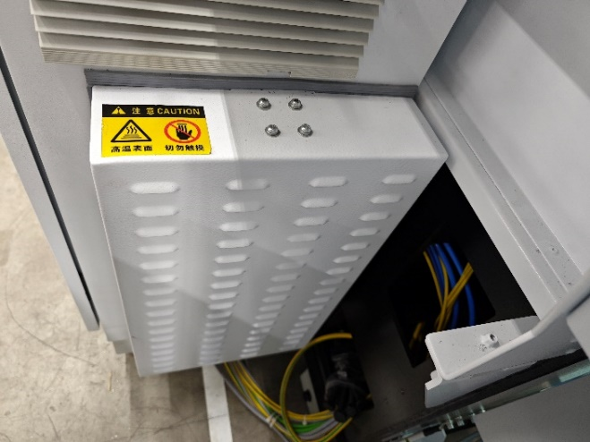
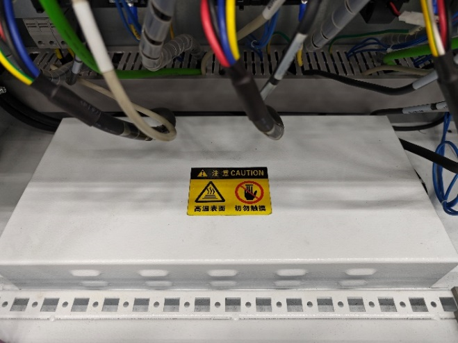

= Additional safety information for service technicians

Many service activities can be dangerous.
Additional warnings and notices for L99 are listed below.
[width="100%",cols="35%,65%",options="header",]
|image:img/image2.png[img/image2,width=192,height=33] a|

*Hot braking resistor.*
*Risk of burns.*
* Do not touch the braking resistor until it is cooled down.
.Fig. 1‑1
[width="100%",cols="53%,47%",options="header",]
| |

|X1&X2 axis braking resistor |Y&Z axis braking resistor
[width="100%",cols="35%,65%",options="header",]
|image:img/image2.png[img/image2,width=192,height=33] a|

*Clamping index is still working after power off.*
*Risk of injury.*
* Manually switch off and release compressed air.
.Compressed air switch Fig. 1‑2
[width="100%",cols="100%",options="header",]
|image:img/image6.png[img/image6,width=240,height=195]

[width="100%",cols="35%,65%",options="header",]
|image:img/image2.png[img/image2,width=192,height=33] a|

*High pressure inside the N~2~/O~2~ gas supply hose after power off.*
*Risk of injury.*
* Use bleed screw to release gas pressure.
.Norgren valve Fig. 1‑3
[width="100%",cols="50%,50%",options="header",]
|image:img/image7.png[img/image7,width=345,height=275] |

|1 Bleed screws upstream of solenoid valve |2 Bleed screws downstream of solenoid valve
|3 Solenoid valves |
[width="100%",cols="35%,65%",options="header",]
|image:img/image2.png[img/image2,width=192,height=33] a|

*Bleed screw blown away by high pressure gas.*
*Risk of serious injury.*
Unscrew the bleed screw within the range of 1 to 2 turn.
Working on pallet changer
[width="100%",cols="35%,65%",options="header",]
|image:img/image2.png[img/image2,width=192,height=33] a|

*Insufficient safety level (light barrier input signal not going into safety relay).*
*Risk of injury.*
* Switch off inverter motor, hydraulic unit motor and compress-ed air supply when working on pallet.
.Fig. 1‑4
[width="100%",cols="51%,,49%",options="header",]
|image:img/image8.png[img/image8,width=294,height=240] |image:img/image9.png[img/image9,width=302,height=240] |

|Switch of motor | |Switch of Hydraulic unit motor
[width="100%",cols="35%,65%",options="header",]
|image:img/image2.png[img/image2,width=192,height=33] a|

*Slippy storage bin!*
*Risk of tripping*
* Do not access the storage bins.
* Pull out the storage bins before entering the work area.
[width="100%",cols="35%,65%",options="header",]
|image:img/image10.png[img/image10,width=192,height=34] a|

*In case of power off, power supply cable is connected to X/Y motor.*
*X/Y side is hard to push by hand.*
* Disconnect the power supply cable either at the drive side or the motor side.
.X1&X2 power supply, drive side Fig. 1‑5
[width="100%",cols="100%",options="header",]
|image:img/image11.png[img/image11,width=403,height=228]

