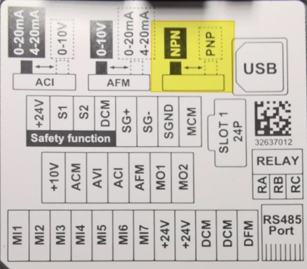

= Delta frequency converter

== Basic information

The terminals used by L99 are shown as bellow.
Control terminal
specifications
Please see the schematics for the wiring.
.Fig. 5‑79
[width="100%",cols="100%",options="header",]
|image:img/image673.png[img/image673,width=403,height=302]

[arabic]
. *Switch between NPN and PNP*: Supplier default is NPN, butwe must set the switch to PNP type due to using the source mode for frequency converter.
.Source mode with external power Fig. 5‑80
[width="100%",cols="100%",options="header",]
|image:img/image674.png[img/image674,width=364,height=325]

[arabic, start=2]
. *MI1-MI7*: Multi-function input.
* MI1: Forward/Stop.
* MI2: Reverse/Stop.
* MI3: Fast.
* MI4: Slow.
* DCM: Digital signal common.
[arabic, start=3]
. *Safety function*: The frequency converter provides a STO (safe torque off) function. Using two channels S1 and S2 signal input to turn off switch, further preventing the drive from outputting.
* S1/S2: Signal input for STO function, connected to the relay inside the switch cabinet.
* DCM: Reference ground for S1 and S2 signal.
* STO response time ≤ 20 ms.
STO action logic and 7-segment display after S1/S2 signal input
.Tab. 5‑37
[width="100%",cols="^20%,^20%,^20%,^20%,^20%",options="header",]
|*Signal* |*Terminal Function* | | |
|S1-DCM |ON |ON |OFF |OFF
|S2-DCM |ON |OFF |ON |OFF
|Drive output |Ready to output |Output off |Output off |Output off
|Error displayed on the panel |No error |STL2 |STL1 |STO
* ON means: S1-DCM/S2-DCM inputs a power supply > 11V~DC~ (Normally 24V~DC~ for L99).
* OFF means: S1-DCM/S2-DCM inputs a power supply < 5V~DC~ (Normally 0V~DC~ for L99).
* STO means channel 1 and 2 open circuit synchronously and enter Safe Torque Off.
* STL1/STL2 means only one channel opens circuit or the two channels are not synchronous.
[arabic, start=4]
. *Relay*: To output the monitoring signals “frequency converterno error”.
* RB: Multi-function relay output (N.C).
* RC: Multi-function relay common.
Keyboard panel
.Fig. 5‑81
[width="100%",cols="100%",options="header",]
|image:img/image675.png[img/image675,width=382,height=267]

* 1 Main Display Area.
.Tab. 5‑38
[width="100%",cols="34%,66%",options="header",]
|*Displayed items* |*Description*
|image:img/image676.png[img/image676,width=115,height=32] |Display the present frequency setting.

|image:img/image677.png[img/image677,width=118,height=32] |Display the actual output frequency.

|image:img/image678.png[img/image678,width=118,height=32] |Display the load current.

|image:img/image679.png[img/image679,width=118,height=32] |Display for approximately 1s if the data is accepted and automatically stored.

|image:img/image680.png[img/image680,width=118,height=32] |Display if the setting data is not accepted or exceeds the allowed range.

* 2 Status display area: Display the operation status of drive (Run, Stop, Forward, Reverse, PLC).
* 3 Up key: Change the setting value and the parameter.
* 4 Run key: Start the drive.
* 5 Stop/Reset key.
* 6 Potentiometer: Adjust the input frequency.
* 7 Mode key: Changes the display screen mode.
* 8 Enter key: Enter the setting page or confirm the setting of parameter.
* 9 Left shift/Down key: Switch between left shift and down by long pressing the mode key.
*Note*
* The above No.4~No.6 key is disable because of the parameter setting.

== Setting parameters for the frequency converter

Setting parameters
[arabic]
. Press “ENTER” button enter parameter setting mode.
. Select “01” by “UP” and “Down” button.
. Press “ENTER”.
. Select “01.02”.
. Press “ENTER”.
. Set “400.0”.
. Press “ENTER”.
. The result is shown on the display：
* “End” means setup work is successful.
* “Err” means error.
.Setting the parameter Fig. 5‑82
[width="100%",cols="100%",options="header",]
|image:img/image681.png[img/image681,width=624,height=133]

* In parameter setup mode, use “MODE” to go back to previous menu level.
[arabic, start=9]
. If the parameter setting fails, please check the parameter “00-02”, it should be 0 by default.
Write protection for
parameters
* You can apply the write protection for parameters by sett-ing “00-02” to 1 in case others modify the parameter.

== Replacing the frequency converter

. Switch off the machine.
Replace Delta frequency
converter
[arabic, start=2]
. Remove the covers of the frequency converter.
.Fig. 5‑83
[width="100%",cols="100%",options="header",]
|image:img/image682.png[img/image682,width=288,height=331]

[arabic, start=3]
. Disconnect all the cables.
* If necessary, take a photo for reference.
.Fig. 5‑84
[width="100%",cols="100%",options="header",]
|image:img/image683.png[img/image683,width=307,height=304]

[arabic, start=4]
. Dismantle the frequency converter from the device panel by screws (4x).
.Fig. 5‑85
[width="100%",cols="100%",options="header",]
|image:img/image684.png[img/image684,width=307,height=334]

[arabic, start=5]
. To install the new frequency converter: perform the removal steps in the reverse order.
. Set the DIP switch to “PNP” according to the instruction on the back of cover.
Setup work on Delta
frequency converter
.Fig. 5‑86
[width="100%",cols="45%,55%",options="header",]
| |image:img/image686.png[img/image686,width=318,height=240]

[arabic, start=7]
. Set the frequency converter parameters one by one (see “link:#setting-parameters-for-the-frequency-converter[Setting parameters for the frequency converter]”, pg. xxx).
* For all the parameter setting value, see the frequency converter page in the circuit diagram *93630-5-E1.*
* The parameter “00-47” differs depending on the infeed motor’s supplier.
