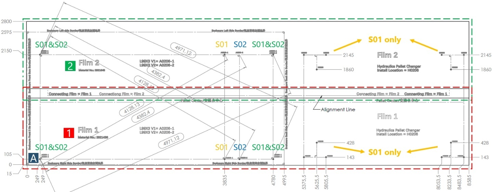
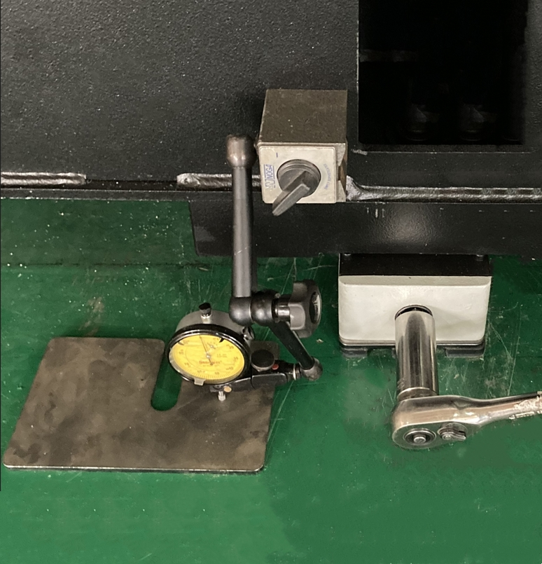

= Installation (L99)

== Transportation (container shipment)

[arabic]
. Lift the container onto the floor with the aid of the crane (specification ≥ 20 t).
Unload the container
.Container layout (two-level pallet changer) Fig. 2‑1
[width="100%",cols="50%,50%",options="header",]
|image:img/image92.png[img/image92,width=624,height=133] |

|1 Machine + sheet metal part 1 (inside) |2 Dust extractor
|3 Chiller |4 Accessories wooden box
|5 Slag carts wooden box |6 Switch cabinet
|7 Pallet changer + device panel |8 Sheet metal part 2
|9 Laser |
[width="100%",cols="50%,50%",options="header",]
|image:img/image93.png[img/image93,width=624,height=146] |

|1 Machine + sheet metal part 1 (inside) |2 Dust extractor
|3 Chiller |4 Accessories wooden box
|5 Slag carts wooden box |6 Switch cabinet
|7 Pallet changer + device panel |8 Sheet metal part 2
|9 Hydraulic unit |10 Cover of pallet changer
|11 Laser |
Container layout (hydraulic pallet changer)
[arabic, start=2]
. Place the pallet for unloading (delivered with machine) on theground.
Unload the machine
* The ground needs to be flat.
* The supporting surface of the wooden pallet should be almost flush with the container floor (height difference < 5mm).
.Fig. 2‑2
[width="100%",cols="48%,52%",options="header",]
|image:img/image94.png[img/image94,width=277,height=201] |image:img/image95.png[img/image95,width=284,height=201]

[arabic, start=3]
. Move the machine out of the container along the wooden pallet with help of the forklift truck (specification ≥ 8 t).
.Fig. 2‑3
[width="100%",cols="100%",options="header",]
|image:img/image96.png[img/image96,width=382,height=260]

[width="100%",cols="35%,65%",options="header",]
|image:img/image10.png[img/image10,width=192,height=34] a|

*Defective machine!*
* Avoid any collision of the machine especially the corners.
[arabic, start=4]
. Use suitable material (e.g., wooden beam) together with the delivered pallet to support the machine.
.Fig. 2‑4
[width="100%",cols="100%",options="header",]
|image:img/image97.png[img/image97,width=382,height=269]

[arabic, start=5]
. Take off the transport belts on the roof beam.
.Fig. 2‑5
[width="100%",cols="100%",options="header",]
|image:img/image98.png[img/image98,width=288,height=313]

[arabic, start=6]
. With the help of crane, lift and lower it onto the floor.
.Fig. 2‑6
[width="100%",cols="100%",options="header",]
|image:img/image99.png[img/image99,width=288,height=374]

[width="100%",cols="35%,65%",options="header",]
|image:img/image10.png[img/image10,width=192,height=34] a|

*Defective machine!*
* Check if the machine is tilted during the lifting work.
* Lower the machine onto the floor slowly.
[arabic, start=7]
. Remove three claddings in the order of 1 to 2.
.Fig. 2‑7
[width="100%",cols="100%",options="header",]
|image:img/image100.png[img/image100,width=382,height=187]

[arabic, start=8]
. Undo the screws at the 6x machine feet.
. Lift and lower the machine onto 4x armored rollers with the aid of crane.
* With the indoor crane, the transportation work would become much easier.
.Fig. 2‑8
[width="100%",cols="100%",options="header",]
|image:img/image101.png[img/image101,width=382,height=220]

[arabic, start=10]
. Transport machine to the installation site with the help of forklift truck.
. Use some suitable material to lay a slope at the exit of the container.
Unload the pallet changer
.Fig. 2‑9
[width="100%",cols="100%",options="header",]
|image:img/image102.png[img/image102,width=382,height=199]

[arabic, start=12]
. The forklift goes inside the container and move the wooden box of pallet changer out of the container.
* The forklift with a permitted transport weight of more than4 ton can be used.
* The height and width of the forklift must be less than the container’s.
.Fig. 2‑10
[width="100%",cols="100%",options="header",]
|image:img/image103.png[img/image103,width=336,height=356]

[arabic, start=13]
. Move the dust extractor out of the container with the forklift.
Unload the dust extractor,
laser &chiller
[width="100%",cols="35%,65%",options="header",]
|image:img/image10.png[img/image10,width=192,height=34] a|

*Defective dust extractor!*
* Be careful of the collision between dust extractor and roof when transporting the dust extractor.
.Unload the dust extractor Fig. 2‑11
[width="100%",cols="100%",options="header",]
|image:img/image104.png[img/image104,width=336,height=336]

[arabic, start=14]
. Move the laser out of the container.
[width="100%",cols="35%,65%",options="header",]
|image:img/image10.png[img/image10,width=192,height=34] a|

*Defective laser device!*
* Avoid any minor collision/vibration of the laser device.
* Set down the laser device at the installation site with utmost care.
[arabic, start=15]
. Move the chiller out of the container with the forklift.
[width="100%",cols="100%",options="header",]
|image:img/image105.png[img/image105,width=336,height=351]

Unload the chiller Fig. 2‑12
[arabic, start=16]
. Remove nails and then unload the wooden boxes above pallet changer with the aid of forklift.
Unload wooden boxes
above the pallet changer
.Remove nails Fig. 2‑13
[width="100%",cols="100%",options="header",]
|image:img/image106.png[img/image106,width=382,height=277]

== Removing, mounting protective plates

Plate order
.Left side of the machine Fig. 2‑14
[width="100%",cols="100%",options="header",]
|image:img/image107.png[img/image107,width=403,height=165]

.Right side of machine Fig. 2‑15
[width="100%",cols="100%",options="header",]
|image:img/image108.png[img/image108,width=403,height=179]

.Fig. 2‑16
[width="100%",cols="^50%,^50%",options="header",]
|image:img/image109.png[img/image109,width=292,height=222] |image:img/image110.png[img/image110,width=294,height=222]

|Front side of machine |Rear side of machine
* The protective plates without number can be removed separately.
[arabic]
. When removing the protective plates, always start with plate number 1.
Dismount and mount the
left side of the machine
[arabic, start=2]
. Remove the other protective plates in the specified order.
. Loosen screws on the respective protective plate.
. lift it up and off.
* No screws on the top.
.Fig. 2‑17
[width="100%",cols="100%",options="header",]
|image:img/image111.png[img/image111,width=624,height=267]

[arabic, start=5]
. When mounting, the protective plates are fitted in the reverseorder.
. Loosen the screws on the top.
Dismount and mount the
right side of machine, top
.Fig. 2‑18
[width="100%",cols="100%",options="header",]
|image:img/image112.jpg[img/image112,width=379,height=267]

[arabic, start=7]
. Loosen the screws on the front-right corner.
.Fig. 2‑19
[width="100%",cols="100%",options="header",]
|image:img/image113.png[img/image113,width=382,height=336]

[arabic, start=8]
. Lift the protective plate, thereby guiding it out of the function bar.
.Function bar Fig. 2‑20
[width="100%",cols="100%",options="header",]
|image:img/image114.png[img/image114,width=624,height=256]

[arabic, start=9]
. When mounting:
* Hang the protective plate on the supporting structure.
* Press the protective plates downwards and lock it into function bar.
[arabic, start=10]
. Remove the screws on the respective protective plates.
Dismount and mount the
right side of machine,
bottom
[arabic, start=11]
. Pull the protective plate downwards and remove it.
.Fig. 2‑21
[width="100%",cols="100%",options="header",]
|image:img/image115.png[img/image115,width=624,height=256]

* Curtain screens can be removed separately, or together with lower protective plates.
* To mount wedge mounts, only three protective lower plates need to be removed.
[arabic, start=12]
. When mounting, fit the protective plates in the reverse order.

== Drilling holes

.L99S02 machine Fig. 2‑22
[width="100%",cols="100%",options="header",]
|image:img/image116.png[img/image116,width=624,height=346]

The most recent released version of the drilling films is always located in the CAD library.
Drilling films in the CAD
library
*Drilling films*:
* X3: 93630-98-A10.
Condition
* The floor requirements at the installation site comply with the installation requirements.
Means, Tools, Materials
* HILTI drill with drill bit:
* Φ 22 mm (machine).
* Φ 24 mm (hydraulic pallet changer).
* Φ 10 mm (two-level pallet changer start post, light barriers).
* Φ 6 mm (cable ducts).
* Press-out device HDM 330 CR/CB (HILTIHit HY200), Mat. no. 1776480.
* HILTI multi-line/combination laser PM 4 with accessories:
* Laser, Mat. no. 1844156.
* Metric target plate, PMA 54, Mat. no. 1659753.
* Tripod PMA 29, Mat. no. 1789394.
* PUSA60 laser protective glasses, Mat no. 1659762.
* Drilling film.
* Do not put down the machine without wedge mounts or wooden beams.
* When using armored rollers, hydraulic hoisting jacks are req-uired to position and align the machine at the installation site.
[arabic]
. Mark the machine origin in accordance with the installation plan.
. Mark the longitudinal and transverse directions of the machine on the floor. Either:
* With the aid of a cross laser.
* Mark the lines on the floor by hand.
.Drilling template for L99X3 with Hydraulics Pallet Changer Fig. 2‑23
[width="100%",cols="34%,33%,33%",options="header",]
| | |

|A Machine zero point |1 Drilling foil 1 |2 Drilling foil 2
* Drill the holes for the hydraulic pallet changer (S02) according to the foundation plan or after the hydraulic pallet changer is positioned.
* The bore holes for two-level pallet changer will be drilled later in “link:#installing-the-two-level-pallet-changer[Installing the two-level pallet changer]”, pg. xxx.
[arabic, start=3]
. Place drilling film 1 at the machine zero point and along the longitudinal and transverse direction.
.Fig. 2‑24
[width="100%",cols="100%",options="header",]
|image:img/image118.png[img/image118,width=382,height=238]

[arabic, start=4]
. Use adhesive tape to secure drilling film 1 to the floor on the front side.
. Carefully smooth out any creases from the front to the rear (e.g. using a brush), while at the same time making sure the foil is positioned correctly.
. Use adhesive tape to secure drilling film 1 to the floor on the lengthways side.
. Use the film markings to position and align drilling film 2.
. Use adhesive tape to secure drilling film 2 to the floor.
. Mark all bore holes which are designated on the floor as follows (see also key on the drilling film):
* Perform control measurements from the zero point to the furthest points (see foundation plan for dimensions).
* Perform diagonal control measurements to prevent trapezoidal displacement (see foundation plan for dimensions, tolerance ±2 mm).
[arabic, start=10]
. Detach the adhesive strips from the drilling templates and carefully roll them back up again.
. Drill all the bore holes for machine and hydraulic pallet changer.
* Φ 22 mm drill bit for machine.
* Φ 24 mm drill bit for hydraulic pallet changer.
* 125 mm drilling depth.
[arabic, start=12]
. Clean the bore holes thoroughly using a vacuum cleaner.
. Glue in the anchor for the machine and the pallet changer, using a L-square to ensure the screw is vertical to the floor in X and Y directions.
.Fig. 2‑25
[width="100%",cols="50%,50%",options="header",]
|image:img/image119.png[img/image119,width=382,height=256] |

|1 Bolt |2 Anchor
[arabic, start=14]
. Remove the excess glue on the floor after it has completely solidified.
. Before positioning the machine, use a crossline laser to levelthe installation points of the anchors.
* Draw all measured points on a piece of paper. The highest position is marked as "0". Use the 2 mm thick shim plates according to the values to align other points to an accuracy of ±1 mm.
[arabic, start=16]
. Adjust each wedge mount to the lowest limit.
. Place a 10 mm thick plate under all wedge mounts.
.Fig. 2‑26
[width="100%",cols="50%,50%",options="header",]
|image:img/image120.png[img/image120,width=382,height=188] |

|1 Shim plates (if necessary) |2 The 10 mm thick plate

== Positioning the machine

Conditions
* Holes have been drilled according to the installation plan (see “link:#drilling-holes[Drilling holes]”, pg. xxx).
* The cover sheets for access to wedge mounts have been disassembled (see “link:#removing-mounting-protective-plates[Removing&#44; mounting protective plates]”, pg. xxx).
Means, Tools, Materials
* Standard tool set, mat. no. 0135600.
[width="100%",cols="35%,65%",options="header",]
|image:img/image2.png[img/image2,width=192,height=33] a|

*Risk of injury due to oscillating machine!*
* Do not step on the machine if it is hanging on the crane.
[arabic]
. Transport the machine to installation site with the aid of forklift or indoor crane.
Position the machine
* For domestic version, the wooden beam of switch cabinetmust be removed before positioning the machine.
[arabic, start=2]
. Position the machine and lower it onto the wedge mounts L1/L3/L4/L6 (L2 and L5 must not touch the machine).
.Installation points for L99S02 machine Fig. 2‑27
[width="100%",cols="100%",options="header",]
|image:img/image116.png[img/image116,width=624,height=346]

.Three disassembled cover sheets Fig. 2‑28
[width="100%",cols="100%",options="header",]
|image:img/image121.png[img/image121,width=382,height=192]

[arabic, start=3]
. Make sure the bolts can be screwed into anchors and there must be a gap between the bolt and the machine feet.
. Screw the bolts along with eccentric disk, three washers and lock nut, but do not yet tighten.
.Fig. 2‑29
[width="100%",cols="100%",options="header",]
|image:img/image122.png[img/image122,width=382,height=255]

[arabic, start=5]
. Align the machine in X and Y directions.
* Zero line is the cladding edge not the machine edge.
* A crowbar is needed to move the machine.
.Fig. 2‑30
[width="100%",cols="100%",options="header",]
|image:img/image123.png[img/image123,width=382,height=264]

[arabic, start=6]
. Label the position of the transport belts.
. Remove the transport belts.
.Fig. 2‑31
[width="100%",cols="100%",options="header",]
|image:img/image124.png[img/image124,width=382,height=227]

[arabic, start=8]
. Remove the eyebolts (2x) on left side.
.Fig. 2‑32
[width="100%",cols="100%",options="header",]
|image:img/image125.png[img/image125,width=382,height=230]

[arabic, start=9]
. Remove transport securing device at the left and right of the X axis.
.X axis transport securing device Fig. 2‑33
[width="100%",cols="100%",options="header",]
|image:img/image126.png[img/image126,width=382,height=235]

[arabic, start=10]
. Remove the transport securing device of the Y axis.
.Y axis transport securing device Fig. 2‑34
[width="100%",cols="100%",options="header",]
|image:img/image127.png[img/image127,width=382,height=276]

[arabic, start=11]
. Tighten the two screws to fix the protective cover.
* Loctite 243 must be used.
.Fig. 2‑35
[width="100%",cols="100%",options="header",]
|image:img/image128.png[img/image128,width=382,height=286]

== Installing left machine frame and X chain (container shipment)

Conditions
* The machine has been positioned correctly.
[width="100%",cols="35%,65%",options="header",]
|image:img/image2.png[img/image2,width=192,height=33] a|

*Risk of the injury due to the heavy machine frame!*
* Do not install the left machine frame by less than two people.
[arabic]
. Fit four supporting brackets and check the leveling of them.
Assemble the left
supporting structure
.Supporting brackets (4x) Fig. 2‑36
[width="100%",cols="100%",options="header",]
|image:img/image129.png[img/image129,width=382,height=179]

[arabic, start=2]
. Assemble the left frame one after another.
* Guide the left frame into the lower screws.
* Fit the left frame to the supporting brackets.
* Screw in the other screws for the frame.
.Disassembled parts for L99X3 Fig. 2‑37
[width="100%",cols="50%,50%",options="header",]
|image:img/image130.png[img/image130,width=382,height=395] |

|1 Machine frame, rear |2 Machine frame, front
.Fit left frame Fig. 2‑38
[width="100%",cols="100%",options="header",]
|image:img/image131.png[img/image131,width=382,height=205]

.Screws for left frame Fig. 2‑39
[width="100%",cols="100%",options="header",]
|image:img/image132.png[img/image132,width=382,height=257]

[arabic, start=3]
. Check the leveling for the left frame.
. Tighten all the screws.
. Remove the shipping supporting device.
Install X chain
[arabic, start=6]
. Remove two securing devices for X chain.
.Securing device Fig. 2‑40
[width="100%",cols="50%,50%",options="header",]
|image:img/image133.png[img/image133,width=382,height=243] |

|1 Shipping bracket |2 Securing device for X chain
[arabic, start=7]
. Shift the X chain outwards.
.Fig. 2‑41
[width="100%",cols="100%",options="header",]
|image:img/image134.png[img/image134,width=382,height=218]

[arabic, start=8]
. Fit the X cable holder to the motion unit.
* Two screws under the cable holder
.Fit the X cable holder Fig. 2‑42
[width="100%",cols="52%,48%",options="header",]
|image:img/image135.png[img/image135,width=319,height=268] |image:img/image136.png[img/image136,width=296,height=268]

[arabic, start=9]
. Using Loctite 243, fit the X chain to left cladding box.
.Fig. 2‑43
[width="100%",cols="100%",options="header",]
|image:img/image137.png[img/image137,width=382,height=199]

[arabic, start=10]
. Fit the instrument panel by screws.
Install the instrument panel
.Fig. 2‑44
[width="100%",cols="100%",options="header",]
|image:img/image138.png[img/image138,width=382,height=229]

[arabic, start=11]
. Fit the duct-holder on right side of the instrument panel.
.Fig. 2‑45
[width="100%",cols="100%",options="header",]
|image:img/image139.png[img/image139,width=382,height=207]

== Rough aligning

* Miniature level NT-11 (1/1000), mat. no. 1827157.
* Standard tool set, mat. no. 0135600.
* Wrench socket, long, 24 mm AF, mat. no. 0356860.
[arabic]
. Push the motion unit to the rear by hand in the middle.
Roughly aligning the
machine
* When the machine has no power supply, the motion unit can be moved manually only if the motor’s power supply cable is disconnected.
* Two people are recommended to manually move the motion unit.
.Power supply for X1&X2 motor Fig. 2‑46
[width="100%",cols="100%",options="header",]
|image:img/image11.png[img/image11,width=382,height=216]

[arabic, start=2]
. Remove the bellows of the guides in X direction and Y direction to ensure access to the measuring points.
* For all of the following values, see the inclination value column in the data sheet in the folder for the TRUMPF service engineer.
.Measuring points for L99X3 Fig. 2‑47
[width="100%",cols="100%",options="header",]
|image:img/image140.png[img/image140,width=566,height=688]

[arabic, start=3]
. Use a miniature level to adjust the machine at measuring points M2 (lengthwise), M7 (crosswise) and M5 (lengthwise) in accordance with the specified values listed in the folder for the TRUMPF service engineer.
* The miniature level must be zeroed first.
.Fig. 2‑48
[width="100%",cols="50%,50%",options="header",]
|image:img/image141.png[img/image141,width=382,height=279] |

|1 Measuring point display |2 Exterior markings for the miniature level
[arabic, start=4]
. Set the measuring point M2 by adjusting wedge mount L3 or L1.
.Miniature level on measuring point M2 Fig. 2‑49
[width="100%",cols="100%",options="header",]
|image:img/image142.png[img/image142,width=382,height=238]

[arabic, start=5]
. Set the measuring point M7 by adjusting wedge mount L4.
.Miniature level on measuring point M7 Fig. 2‑50
[width="100%",cols="100%",options="header",]
|image:img/image143.png[img/image143,width=382,height=259]

[arabic, start=6]
. Set the measuring point M5 by adjusting wedge mount L6.
.Miniature level on measuring point M5 Fig. 2‑51
[width="100%",cols="100%",options="header",]
|image:img/image144.png[img/image144,width=382,height=255]

[arabic, start=7]
. Check if there is a gap between the wedge mount and machine feet.
. If there is a gap, raise the corresponding wedge mount to touch the machine feet without changing the alignment.
* Position the dial gauge with a magnetic support on the machine and zero the dial gauge against the shim plate on the factory floor.
.Fig. 2‑52
[width="100%",cols="100%",options="header",]
|

[arabic, start=9]
. Further work:
* Install switch cabinet.
* Install the dust extractor and the process cooler.
* Establish the gas and electrical connections.
* Install the laser.
* Lay the laser light cable.
* Finely align the machine.

== Installing switch cabinet

* Standard tool set, mat. no. 0135600.
* A magnetic spirit level.
[arabic]
. Remove the wooden pallet of the switch cabinet.
Container shipment
version
[arabic, start=2]
. Lower the switch cabinet onto the floor with the aid of forklift.
.Fig. 2‑53
[width="100%",cols="100%",options="header",]
|image:img/image146.png[img/image146,width=276,height=307]

[arabic, start=3]
. Position the switch cabinet in accordance with the installationlayout.
* Ensure accessibility to the wedge mount L3.
* The switch cabinet is about 10 mm away from the machine.
.Fig. 2‑54
[width="100%",cols="100%",options="header",]
|image:img/image147.png[img/image147,width=628,height=233]

[arabic, start=4]
. Fix the wheels and adjust the feet of switch cabinet (size 22mm) to ensure the wheels not touching the floor.
. Use a spirit level to check the switch cabinet for leveling and readjust four feet if necessary.
. Fit the cable entry to the switch cabinet.
.Fig. 2‑55
[width="100%",cols="100%",options="header",]
|image:img/image148.png[img/image148,width=382,height=267]

* The cables through the cable entry will be connected in chapter “link:#establishing-gas-electrical-connection[Establishing gas & electrical connection]”, pg. xxx.
Condition
Domestic shipment
* The wooden beam for securing switch cabinet has been removed.
[arabic, start=7]
. Adjust four feet of the switch cabinet (size 22 mm) to ensure they touch the floor.
. Remove the securing belts and brackets for the switch cabinet.
.Fig. 2‑56
[width="100%",cols="100%",options="header",]
|image:img/image149.png[img/image149,width=382,height=254]

[arabic, start=9]
. Check the position of the machine:
* Ensure accessibility to the wedge mount L3.
* The switch cabinet is approximately 10 mm away from the machine.
.Fig. 2‑57
[width="100%",cols="100%",options="header",]
|image:img/image150.png[img/image150,width=382,height=229]

[arabic, start=10]
. Use a spirit level to check the switch cabinet for leveling and readjust four feet if necessary.
. Fix the cable holder at the bottom of the switch cabinet and align the cables.
.Cable holder Fig. 2‑58
[width="100%",cols="100%",options="header",]
|image:img/image151.png[img/image151,width=382,height=217]

== Installing the dust extractor and chiller

* Standard tool set, mat. no. 0135600.
Install the dust extractor
[arabic]
. Position dust extractor according to the installation layout.
.Fig. 2‑59
[width="100%",cols="100%",options="header",]
|image:img/image152.png[img/image152,width=624,height=304]

[arabic, start=2]
. Mount and connect the suction tubes, using the bracket to support it.
.Fig. 2‑60
[width="100%",cols="100%",options="header",]
|image:img/image153.png[img/image153,width=382,height=258]

[arabic, start=3]
. Position the cable ducts between dust extractor and process cooler.
. Lay all the cables and compressed air line in the cable ducts.
.Example Fig. 2‑61
[width="100%",cols="100%",options="header",]
|image:img/image154.png[img/image154,width=382,height=162]

[arabic, start=5]
. Connect the ground cable.
.Grounding Fig. 2‑62
[width="100%",cols="100%",options="header",]
|image:img/image155.png[img/image155,width=382,height=195]

[arabic, start=6]
. Connect the compressed air line to compressed air distribution.
.Compressed air distribution Fig. 2‑63
[width="100%",cols="100%",options="header",]
|image:img/image156.png[img/image156,width=382,height=195]

[arabic, start=7]
. Connect the cables of the dust extractor inside the switch cabinet according to marks.
.Terminal for the dust extractor Fig. 2‑64
[width="100%",cols="100%",options="header",]
|image:img/image157.png[img/image157,width=336,height=226]

[arabic, start=8]
. Position the chiller according to the installation layout.
Install the chiller
.Fig. 2‑65
[width="100%",cols="100%",options="header",]
|image:img/image158.png[img/image158,width=288,height=331]

* Due to different device widths of the auxiliary units, this could not be set up flush.
* The intended breakouts in cable ducts only fit if the instal-laion is done in accordance with the installation layout.
[arabic, start=9]
. Position the cable ducts between the machine, laser and chiller.
.Fig. 2‑66
[width="100%",cols="100%",options="header",]
|image:img/image159.png[img/image159,width=382,height=215]

[arabic, start=10]
. Lay the water hoses in the cable ducts.
. Connect the water hoses to the connector of the machine cooling line.
.Fig. 2‑67
[width="100%",cols="100%",options="header",]
|image:img/image160.png[img/image160,width=382,height=277]

.Connector of machine cooling line Fig. 2‑68
[width="100%",cols="100%",options="header",]
|image:img/image161.png[img/image161,width=382,height=213]

* The cooling line between the chiller and the laser is connected in chapter “link:#unloading-and-installing-the-laser-device-fd91[Unloading and installing the laser device (FD90/FD91)]”, pg. xxx.
[arabic, start=12]
. Bring the cables of the chiller into the switch cabinet and connect them according to the marks.
.Fig. 2‑69
[width="100%",cols="50%,50%",options="header",]
|image:img/image162.png[img/image162,width=187,height=249] |image:img/image163.png[img/image163,width=187,height=249]

[arabic, start=13]
. Fill the DI water in the chiller’s tank.
* For the DI water requirement, see the Installation conditions of the machine.
[arabic, start=14]
. Remove the cover of the chiller.
. Bleed the pump with the aid of vent plug.
.Vent plug Fig. 2‑70
[width="100%",cols="100%",options="header",]
|image:img/image164.png[img/image164,width=288,height=255]

[arabic, start=16]
. Put the chiller into operation (see “link:#putting-the-chiller-into-operation[Putting the chiller into ope-ration]”, pg. xxx).

== Establishing gas & electrical connection

* Standard tool set, mat. no. 0135600.
[arabic]
. Connect oxygen, nitrogen, sealing gas and compressed air line from machine to the instrument panel.
Establish gas & lubricationoil connection
(only container shipment)
[arabic, start=2]
. Connect the hoses for lubrication system.
.Fig. 2‑71
[width="100%",cols="50%,50%",options="header",]
|image:img/image165.png[img/image165,width=382,height=241] |

|1 compressed air |2 nitrogen
|3 oxygen |4 sealing gas
|5 lubrication oil hoses |
* No sealing gas for KL59 until 6kw.
* No sealing gas for BM111.
[arabic, start=3]
. Connect the cutting gas line inside the chain holder.
.Fig. 2‑72
[width="100%",cols="100%",options="header",]
|image:img/image166.png[img/image166,width=382,height=232]

[arabic, start=4]
. Connect the cables going through the cable entry:
Establish electrical
connections
(only container shipment)
* Lay the CANBUS (purple) and EtherCAT (green) through the upper cable duct.
* Lay the four signal cables (grey and yellow) through the middle cable duct.
.Fig. 2‑73
[width="100%",cols="100%",options="header",]
|image:img/image167.png[img/image167,width=382,height=318]

* Cross wiring on the terminal is prohibited.
[arabic, start=5]
. Connect the CANBUS (only KL59).
.Connection for CANBUS (only KL59) Fig. 2‑74
[width="100%",cols="100%",options="header",]
|image:img/image168.png[img/image168,width=382,height=234]

[arabic, start=6]
. Connect cables on the terminal according to the label.
* Cross wiring on the terminal is prohibited.
.Fig. 2‑75
[width="100%",cols="100%",options="header",]
|image:img/image169.png[img/image169,width=382,height=189]

[arabic, start=7]
. Connect power cables as well as encoder cables from the cable entry to the four servo drives.
* Don’t disconnect the battery (if equipped) for the encoderwhile connecting the encoder cables.
.Fig. 2‑76
[width="100%",cols="100%",options="header",]
|image:img/image170.png[img/image170,width=382,height=280]

[arabic, start=8]
. Fit the encoder battery to Y and Z servo drive.
.Fig. 2‑77
[width="100%",cols="50%,50%",options="header",]
|image:img/image171.png[img/image171,width=382,height=321] |

|1 Y servo drive |2 Z servo drive
[arabic, start=9]
. Bring the cables in the machine opening into the switch cabinet.
.Fig. 2‑78
[width="100%",cols="50%,50%",options="header",]
|image:img/image172.png[img/image172,width=179,height=220] |image:img/image173.png[img/image173,width=181,height=220]

[arabic, start=10]
. Fix the cables and hoses with cable ties.
.Fig. 2‑79
[width="100%",cols="100%",options="header",]
|image:img/image174.png[img/image174,width=382,height=256]

[arabic, start=11]
. Pull the cables in the machine front-left foot into the switch cabinet.
.Cables in machine front-left foot Fig. 2‑80
[width="100%",cols="100%",options="header",]
|image:img/image175.png[img/image175,width=382,height=262]

[arabic, start=12]
. If necessary, roll up the excess cables respectively in the switch cabinet.
.Fig. 2‑81
[width="100%",cols="100%",options="header",]
|image:img/image176.png[img/image176,width=382,height=191]

[arabic, start=13]
. Connect all the cables inside the switch cabinet including ground cables according to the labels.
. Fit the warning lamp and have its cable connected.
.Fig. 2‑82
[width="100%",cols="100%",options="header",]
|image:img/image177.png[img/image177,width=336,height=321]

[arabic, start=15]
. Pull the oxygen, nitrogen and compressed air supply line to the instrument panel and connect them.
Establish gas supply
* Only connect the qualified gas.
* Purge gas hoses before connection.
.Fig. 2‑83
[width="100%",cols="50%,50%",options="header",]
|image:img/image178.png[img/image178,width=181,height=273] |image:img/image179.png[img/image179,width=183,height=273]

|1 compressed air |2 nitrogen
|3 oxygen |
[arabic, start=16]
. Bring the customer’s main power supply cables into position (specialist company for electrical installation) and have them connected to the main switch.
Establish main power
supply
* See installation condition in operator manual for power supply cable details.
.Fig. 2‑84
[width="100%",cols="100%",options="header",]
|image:img/image180.png[img/image180,width=382,height=312]

[arabic, start=17]
. Fit the power supply cables to the fixture.
.Power supply cable fixture Fig. 2‑85
[width="100%",cols="100%",options="header",]
|image:img/image181.png[img/image181,width=382,height=249]

== Unloading and installing the laser device (FD91)

Means, Tools, Materials
* Standard tool set, mat. no. 0135600.
* A magnetic spirit level.
[width="100%",cols="35%,65%",options="header",]
|image:img/image10.png[img/image10,width=192,height=34] a|

*Defective laser device!*
* Avoid any minor collision/vibration of the laser device.
* Set down the laser device at the installation site with utmost care.
[arabic]
. Unload the laser out of the container.
Unload the laser
(container shipment)
[arabic, start=2]
. Transport the laser to the installation site.
. Unpack the laser.
. Check the shockwatch indicator and tiltwatch label.
* The shock indicator turning red indicates too much vibration during transport.
* The balls in the tiltwatch label should be in the correct position.
.Fig. 2‑86
[width="100%",cols="100%",options="header",]
|image:img/image182.png[img/image182,width=382,height=212]

[arabic, start=5]
. Remove the transport belts and assistant securing wooden bars.
Unload the laser
(domestic shipment)
.Transport device Fig. 2‑87
[width="100%",cols="55%,45%",options="header",]
|image:img/image183.png[img/image183,width=382,height=240] |

|1 Assistant securing wooden bar |2 transport belts (2x)
|3 Assistant securing wooden bar |4 LLK and cables
[arabic, start=6]
. Cut off cable ties for cables and the LLK.
.Fig. 2‑88
[width="100%",cols="45%,55%",options="header",]
|image:img/image184.png[img/image184,width=265,height=249] |image:img/image185.png[img/image185,width=332,height=249]

[arabic, start=7]
. Using a crane or a forklift, lift the laser out of the transport device, meanwhile pay attention to the LLK and cables.
[width="100%",cols="35%,65%",options="header",]
|image:img/image10.png[img/image10,width=192,height=34] a|

*Defective LLK due to tight bend radius or twisting!*
* Do not go under the minimum bend radius of 100 mm.
* Do not twist the LLK.
[arabic, start=8]
. Remove the transport devices.
. Check the shock indicator and tiltwatch label.
* The shock indicator turning red indicates too much vibration during transport.
* The balls in the tiltwatch label should be in the correct position.
.Fig. 2‑89
[width="100%",cols="100%",options="header",]
|image:img/image182.png[img/image182,width=382,height=212]

[arabic, start=10]
. Position the laser according to the installation layout with the aid of forklift.
Position and connect the
laser device
* The wheels of the laser can be used for moving at the installation site.
[arabic, start=11]
. Fix the wheels of the laser.
. Use a spirit level to check the laser for leveling and adjust by shim plate if necessary.
. Lay water hoses between the chiller and laser, and then have them connected.
.Fig. 2‑90
[width="100%",cols="50%,50%",options="header",]
|image:img/image186.png[img/image186,width=288,height=311] |

|1 Cooling water, supply |2 Power supply
|3 Ethernet |4 EtherCAT
|5 Cooling water, return |6 Signal cables
|7 LLK |
* Pay attention to the cooling water supply and return.
* See the cooling water schematic for details.
* Interface (EtherNET, signal cables) depends on configurations.
[arabic, start=14]
. Open the door of the laser.
. Bring the chiller start signal cable into the laser and have it connected.
.Fig. 2‑91
[width="100%",cols="100%",options="header",]
|image:img/image187.png[img/image187,width=288,height=293]

[arabic, start=16]
. Close the door.
. Bring cables of the laser (except LLK) inside the switch cabinet and have them connected:
* Power supply cable and ground cable.
* Ethernet cable.
* EtherCAT cable.
* Signal cables.
.Power supply cable and ground cable Fig. 2‑92
[width="100%",cols="100%",options="header",]
|image:img/image188.png[img/image188,width=288,height=303]

.Fig. 2‑93
[width="100%",cols="^50%,^50%",options="header",]
|image:img/image189.png[img/image189,width=307,height=230] |image:img/image190.png[img/image190,width=307,height=230]

|Ethernet |EtherCAT
.Signal cables Fig. 2‑94
[width="100%",cols="100%",options="header",]
|image:img/image191.png[img/image191,width=382,height=179]

[arabic, start=18]
. Further work: Lay the laser light cable of TruFiber (see “link:#laying-of-trufiber-llk-with-cutting-unit[Laying of TruFiber LLK with cutting unit]”, pg. xxx).

== Laying of TruFiber LLK with cutting unit

Conditions
* Laser device was positioned.
* The left guard plates have been removed.
* The motion unit has been moved to the rear.
Means, Tools, Materials
* Cable ties.
[width="100%",cols="35%,65%",options="header",]
|image:img/image10.png[img/image10,width=192,height=34] a|

*Defective LLK due to tight bend radius or twisting!*
* Do not go under the minimum bend radius of 100mm.
* Position the LLK to be free of torsion.
[width="100%",cols="35%,65%",options="header",]
|image:img/image10.png[img/image10,width=192,height=34] a|

*Defective cutting unit due to opened cutting unit!*
* Do no separate the cutting unit from the LLK.
[arabic]
. Lay the laser light cable of TruFiber.
Lay LLK
(domestic shipment)
Lay the excess LLK in the cable duct, depending on your estimation.
.Fig. 2‑95
[width="100%",cols="100%",options="header",]
|image:img/image192.png[img/image192,width=382,height=209]

* Pay attention to the bending radius of LLK and don’t twistit either.
[arabic, start=2]
. Remove protective covers of the cutting unit.
Lay LLK with cutting unit
(container shipment)
[arabic, start=3]
. Remove the protective covers (black) from the motion unit.
.Fig. 2‑96
[width="100%",cols="100%",options="header",]
|image:img/image193.png[img/image193,width=382,height=225]

[arabic, start=4]
. Unroll the LLK and lay it straight to be free of tension and torsion.
.Fig. 2‑97
[width="100%",cols="100%",options="header",]
|image:img/image194.png[img/image194,width=382,height=400]

[arabic, start=5]
. Lay the excess LLK in the cable duct according to the mark or depending on your estimation.
.Fig. 2‑98
[width="100%",cols="61%,39%",options="header",]
|image:img/image192.png[img/image192,width=377,height=207] |image:img/image195.png[img/image195,width=232,height=207]

[arabic, start=6]
. Take the cutting unit (with LLK) from the protective foam.
. Carefully thread the cutting unit (with LLK) through the supporting structure.
.Fig. 2‑99
[width="100%",cols="100%",options="header",]
|image:img/image196.png[img/image196,width=382,height=284]

[arabic, start=8]
. Fit the cutting unit.
* For BM111, tighten four screws (17 Nm).
* For KL59, insert it to the flange adapter.
.Fig. 2‑100
[width="100%",cols="50%,>1%,>49%",options="header",]
|*BM111* a|
*KL59*
|image:img/image197.png[img/image197,width=268,height=316] |image:img/image198.png[img/image198,width=308,height=316] |

|1 Adapter plate | |3 Flange receptacle
|2 Signal amplifier | |
* If the signal amplifier of BM111 obstructs tightening the screws, dismantle it and reassemble it later.
[arabic, start=9]
. Guide LLK into Z energy chain.
. Place LLK along Y energy chain and secure it with clips.
. Place LLK along X energy chain and secure it with clips.
.Fig. 2‑101
[width="100%",cols="^34%,^33%,^33%",options="header",]
|image:img/image199.png[img/image199,width=195,height=264] |image:img/image200.png[img/image200,width=199,height=264] |image:img/image201.png[img/image201,width=195,height=264]

|Z energy chain |Y energy chain |X energy chain
[arabic, start=12]
. Remove the bellow segment of the LLK inside the Z energy chain.
.Fig. 2‑102
[width="100%",cols="100%",options="header",]
|image:img/image202.png[img/image202,width=255,height=289]

[arabic, start=13]
. Fix the LLK as well as compressed air and water hoses to duct-holder with cable ties.
.Fig. 2‑103
[width="100%",cols="100%",options="header",]
|image:img/image203.png[img/image203,width=382,height=263]

Establish connection for
[arabic, start=14]
. Connect cooling water hoses to the cutting unit.
* Cooling water supply and return can be arranged optionally.
[arabic, start=15]
. Connect the power supply cable, encoder cable and ground cable.
. Connect the compressed air and cutting gas.
.Fig. 2‑104
[width="100%",cols="53%,4%,43%",options="header",]
|image:img/image204.png[img/image204,width=265,height=288] |image:img/image205.png[img/image205,width=260,height=288] |

|1 Cooling water | |2 Power supply cable
|3 Encoder cable | |4 Cutting gas
|5 Compressed air | |6 PE
[arabic, start=17]
. Flush sealing gas line for 1 min with N~2~.
Establish connection for
[arabic, start=18]
. Connect the sealing gas line.
* No sealing gas for KL59 until 6 kw.
[arabic, start=19]
. Connect cooling water hoses to the LLK plug.
. Connect the remaining cables and hoses to the cutting unit：
* CAN bus.
* Compressed air.
* Cutting gas.
* Power supply.
.Fig. 2‑105
[width="100%",cols="55%,45%",options="header",]
|image:img/image206.png[img/image206,width=360,height=407] |

|1 Sealing gas (not equipped until 6 kw) |2 Cutting gas
|3 CoolLine (not equipped) |4 LLK
|5 Compressed air |6 CAN bus for motor of the collimator lens
|7 Cooling water |8 CAN bus for electronics of the cutting head
|9 Compressed air, lateral air blast |10 24V power supply
[arabic, start=21]
. Fix the cables and hoses with cable ties.
The follow-up work
[arabic, start=22]
. Mount the covers (black) of the motion unit.
. Mount the covers of the cutting unit.
. Check the beam tightness (see “link:#checking-the-beam-tightness[Checking the beam tightnes-s]”, pg. xxx).
. Switch on the machine.
. Carry out standard commissioning:
* Create a spot image in accordance with cutting unit (see "link:#creating-a-spot-image[Creating a spot image]", pg. xxx).
* Perform a tapeshot (see "link:#centering-the-beam-to-the-nozzle-tapeshot[Centering the beam to the noz-zle (Tapeshot)]", pg. xxx).
* Determine the focus position (see "link:#determining-the-focal-position[Determining the focal position]", pg. xxx).

== Fine aligning the machine

* The motion unit is already at the rear (X=3000).
* There is no gap between the wedge mount and the machine feet.
Means, Tools, Materials
* Miniature level NT-11 (1/1000), mat. no. 1827157.
− Optionally with BT extension retrofitting, mat. no. 2263603 (enables measurement outside the machine).
* Standard tool set, mat. no. 0135600.
* Standard measurement kit, mat. no. 0116140.
* Wrench socket, long, 24 mm AF, mat. no. 0356860.
* Wrench socket long, 19 mm AF, mat. no. 2090475.
* Longitudinal tolerance values: ±0.01 mm.
* Transverse values tolerance (M7, rear and front at X=400 mm): ±0.01 mm.
* When making corrections in the minus direction, the value to be attained must be exceeded by at least 0.05mm/m so that corrections can be subsequently made in the plus direction. In this case, the fastening nut on the wedge mount must be retightened.
* The nut need not be loosened for upward adjustments of less than 0.01mm/m.
* For all of the following values, see the inclination values column in the data sheet in the folder for TRUMPF service engineer.
* The value for M5 is no longer readjusted during fine alignment. Only M2 and M7 must be corrected.
[arabic]
. Using a miniature level, check measuring points M2, M7 in accordance with the specified values in the folder for TRUM-PF service engineers and readjust them as necessary.
Fine aligning the machine
.Fig. 2‑106
[width="100%",cols="100%",options="header",]
|image:img/image207.png[img/image207,width=382,height=216]

.Fig. 2‑107
[width="100%",cols="100%",options="header",]
|image:img/image208.png[img/image208,width=382,height=312]

[arabic, start=2]
. Check M2 and if required, set it via wedge mount L3 or wedge mount L1.
. Check M7 and if required, set it via wedge mount L4.
. Push the motion unit to the front (X=400) by hand in the middle.
* When the machine has no power supply, the motion unit can be moved manually only if the motor’s power supply cable is disconnected.
* Two people are recommended to manually move the motion unit.
.Power supply for X1&X2 motor Fig. 2‑108
[width="100%",cols="100%",options="header",]
|image:img/image11.png[img/image11,width=382,height=216]

[arabic, start=5]
. Check M7.
Maximum deviation from rear value M7: 0.01 mm/m.
[arabic, start=6]
. If the deviation is larger, set it via wedge mount L6.
. Position the dial gauge with a magnetic support on the machine and zero the dial gauge against the shim plate on the factory floor.
.Fig. 2‑109
[width="100%",cols="100%",options="header",]
|image:img/image209.png[img/image209,width=382,height=348]

* Readjust the changes that result from tightening directly on the respective wedge mounts.
* Corrections up to 0.02 mm/m may be readjusted without loosening nuts again.
[arabic, start=8]
. Tighten the anchor bolts at four main wedge mounts in the following order one after the other to 40 Nm without changingthe alignment.
Meanwhile check with the dial gauge, the dial gauge must still show ”0” when the anchor bolt is tightened.
[arabic, start=9]
. Tighten anchor bolts at two assistant wedge mounts one after the other.
Meanwhile check with the dial gauge, the dial gauge must still show “0” when the anchor bolt is tightened.
[arabic, start=10]
. Use a miniature level, check the rear, front measuring point M7 again.

== Mount metal sheets

Condition
* The machine is finely aligned.
[arabic]
. Mount the sheet metal at the rear side (only domestic shipment).
.Fig. 2‑110
[width="100%",cols="100%",options="header",]
|image:img/image210.png[img/image210,width=382,height=251]

[arabic, start=2]
. Mount the cover at the front-left corner of machine.
.Fig. 2‑111
[width="100%",cols="100%",options="header",]
|image:img/image211.png[img/image211,width=382,height=293]

[arabic, start=3]
. Mount the cover on the front bulkhead plate.
.Fig. 2‑112
[width="100%",cols="100%",options="header",]
|image:img/image212.png[img/image212,width=382,height=277]

[arabic, start=4]
. Mount covers of the lifting hole.
.Fig. 2‑113
[width="100%",cols="100%",options="header",]
|image:img/image213.png[img/image213,width=382,height=266]

[arabic, start=5]
. Mount the cover above the end of X chain.
.Fig. 2‑114
[width="100%",cols="100%",options="header",]
|image:img/image214.png[img/image214,width=382,height=400]

[arabic, start=6]
. Mount protective plates(3x) on the right side covers in the order of 1 to 2 (see “link:#removing-mounting-protective-plates[Removing&#44; mounting protective plates]“, pg. xxx for details).
.Mount protective plates on the right side Fig. 2‑115
[width="100%",cols="100%",options="header",]
|image:img/image215.png[img/image215,width=382,height=175]

[arabic, start=7]
. Mount protective plates on the left side in the order of 1 to 7(see “link:#removing-mounting-protective-plates[Removing&#44; mounting protective plates]”, pg. xxx).
.Mount protective plates on the left side Fig. 2‑116
[width="100%",cols="100%",options="header",]
|image:img/image216.png[img/image216,width=382,height=302]

== Installing slag carts

[arabic]
. Mount the curtain screens if they are separated from the protective plates.
Install slag carts
[arabic, start=2]
. Mount a handle for each slag cart.
. Push the slag carts into the guide rails under the machine.
.Fig. 2‑117
[width="100%",cols="100%",options="header",]
|image:img/image217.png[img/image217,width=382,height=244]

== Assembling and checking the roof

|image:img/image3.png[img/image3,width=192,height=33] a|

*Danger due to laser radiation emission!*
*Injury to eyes and skin.*
* Carefully mount the cover sheets and then perform a beam seal test.
* For the transport of the machine, the roof segment was released and shifted onto a front segment.
[arabic]
. Remove the wooden frame on the roof.
.Fig. 2‑118
[width="100%",cols="100%",options="header",]
|image:img/image218.png[img/image218,width=382,height=263]

[arabic, start=2]
. Remove the screws and extension nuts of the overlapping roof segments.
.Fig. 2‑119
[width="100%",cols="100%",options="header",]
|image:img/image219.png[img/image219,width=382,height=284]

[arabic, start=3]
. Move the additional roof segment to the position where it overlaps the adjacent roof segments on both sides.
. Stick screws through the recess in the angle profile and havethey connected with extension nuts.
.Fig. 2‑120
[width="100%",cols="100%",options="header",]
|image:img/image220.png[img/image220,width=382,height=176]

[arabic, start=5]
. Press the extension nuts onto the roof segment while tightening.
There must be no light gap.
[arabic, start=6]
. Check the safety cabin and the roof for laser safety (see “link:#checking-the-beam-tightness[Ch-ecking the beam tightness]”, pg. xxx).

== Installing the hydraulic pallet changer

Conditions
* The holes have been drilled according to the installation plan and the anchor have been glued inside them. (see “link:#drilling-holes[Drilling holes]”, pg. xxx)
* The pallet changer has been transported to the installation site.
Means, Tools, Materials
* Indoor crane or forklift truck with extension fork.
* Cord with clamping device or cross line laser.
* Set of prism angles.
* Ruler.
* Chains or belts.
* Pallet changer alignment aid, mat. no. 2523365.
[arabic]
. Using the belts to keep the rear door open.
Position the pallet changer
.Fig. 2‑121
[width="100%",cols="100%",options="header",]
|image:img/image221.png[img/image221,width=382,height=286]

[arabic, start=2]
. Release the brake of the pallet infeed and hold on, manually push the chain in such a way that the roller driver is at 6 o’clock position.
.Release the brake Fig. 2‑122
[width="100%",cols="100%",options="header",]
|image:img/image222.png[img/image222,width=382,height=243]

.Rollers’ position for pallet moving in (S02) Fig. 2‑123
[width="100%",cols="50%,50%",options="header",]
|image:img/image223.png[img/image223,width=624,height=153] |

|1 Roller guide |2 Front chain wheel
|3 Chain |4 Rear chain wheel
|5 Roller driver |
* For safety reasons, the rear transport securing devices ofthe pallets should *only be removed* if the pallet changer is at its final place.
* The transport securing device of the four pallet legs must *only be removed* after the legs have been fastened to the floor. Otherwise the vertical alignment of the lifting cylinder would be misadjusted.
.Fig. 2‑124
[width="100%",cols="100%",options="header",]
|image:img/image224.png[img/image224,width=382,height=218]

|1 Transport securing devices, pallet changer legs (4x)
|2 Transport securing device, pallet
|3 Wooden beam
[width="100%",cols="35%,65%",options="header",]
|image:img/image2.png[img/image2,width=192,height=33] a|

*Pallets rolling off the pallet changer!*
*Risk of injury!*
* Only remove the transport securing devices of both pallets after moving/lifting the pallet changer.
[arabic, start=3]
. Remove the wooden beam.
. Attach and raise the lifting gear on the pallet changer.
. The support screws used for rough alignment on the pallet changer legs (1x per leg) must be unscrewed by about 15 mm or depending on the unevenness of the floor.
* Unscrew the middle support screws on all pallet changer legs (unscrew only 1x support screw per leg).
.Unscrewed support screw Fig. 2‑125
[width="100%",cols="100%",options="header",]
|image:img/image225.png[img/image225,width=382,height=270]

[arabic, start=6]
. Lay out the base plates for the pallet changer legs.
. Lower the pallet changer on the base plates carefully, mean-while insert the drive dog of pallet B into the guide.
.Fig. 2‑126
[width="100%",cols="50%,50%",options="header",]
|image:img/image226.png[img/image226,width=382,height=276] |

|1 Guide |2 Drive dog
[arabic, start=8]
. After putting the pallet changer down, adjust the base plates if they are slipped.
. Check the proximity switch positions for pallet A and pallet B (e.g., +WP.01+PC-B1, distance 2^+1^ mm).
.Fig. 2‑127
[width="100%",cols="50%,50%",options="header",]
|image:img/image227.png[img/image227,width=382,height=269] |

|1 Induction block |2 Proximity switch
[arabic, start=10]
. Screw in all hexagon-head screws, along with lock nuts and eccentric disks, but do not tighten yet.
.Fig. 2‑128
[width="100%",cols="100%",options="header",]
|image:img/image228.png[img/image228,width=382,height=254]

[arabic, start=11]
. Remove the transport securing devices for the pallets.
. If possible, take pallet A down off the pallet changer, since this will make the rest of the alignment work much easier.
Align the pallet changer
.Example Fig. 2‑129
[width="100%",cols="100%",options="header",]
|image:img/image229.png[img/image229,width=382,height=210]

[arabic, start=13]
. If the down lifting of pallet A is not possible, push it as far as possible into the machine.
* When doing this, pay attention to collision with the chain wheel.
[arabic, start=14]
. Place a cross line laser in front of the pallet changer.
* The cross line laser should be higher than pallet changer.
.Example: cross line laser with measuring tape Fig. 2‑130
[width="100%",cols="50%,50%",options="header",]
|image:img/image230.png[img/image230,width=374,height=243] |

|1 Measuring tape |2 Cross line laser
[arabic, start=15]
. Align the pallet change’s right frame horizontally, using the height of machine right guide as the reference height.
* Hold the ruler on the pallet changer’s right frame close to each leg respectively and align using the support screws on the pallet changer legs.
.Fig. 2‑131
[width="100%",cols="100%",options="header",]
|image:img/image231.png[img/image231,width=336,height=284]

[arabic, start=16]
. Align the pallet changer left guide rail horizontally with prism angles and a ruler.
* Put a prism angle on the machine guide rail as reference,others on the pallet left guide rail close to each leg.
* Hold the ruler on the prism angle respectively and align using the support screws on the pallet changer legs.
.Fig. 2‑132
[width="100%",cols="100%",options="header",]
|image:img/image232.png[img/image232,width=382,height=240]

|1 Prism angle
[arabic, start=17]
. Angle the 4 supplied prism angles 90° (in accessory box):
* Two pieces fork angled 90° upwards.
* Two pieces fork angled downwards.
.Fig. 2‑133
[width="100%",cols="50%,50%",options="header",]
|image:img/image233.png[img/image233,width=259,height=249] |

|1 Prism angle |2 Fork angled downwards
|3 Fork angled upwards |
[arabic, start=18]
. Place prism angles on the guide rail of machine and the guide rail of pallet changer.
* Prism angle 1&2 at X=0, X=max in the machine.
* Prism angle 3&4 at X=0, X=max in the pallet changer.
.Fig. 2‑134
[width="100%",cols="50%,50%",options="header",]
|image:img/image234.png[img/image234,width=624,height=225] |

|1&4 Prism angle, fork angled 90° upwards |2&3 Prism angle, fork angled downwards
|5 Guide rail of machine |6 Guide rail of pallet changer
[arabic, start=19]
. Align the pallet changer guide rail longitudinally with the help of cord or the cross-line laser.
*Cord*:
* Screw a M8 long screw and fix the cord on it.
* Tension the cord over prism angle 1 and prism angle 4.
.Fig. 2‑135
[width="100%",cols="100%",options="header",]
|image:img/image235.png[img/image235,width=382,height=261]

*Cross-line laser*:
* Place the cross-line laser on the rail of the machine as close as possible to the X=0 position.
* Adjust the cross-line laser until the beam runs through the center of the gap of prism angle 1 and prism angle 2.
.Fig. 2‑136
[width="100%",cols="100%",options="header",]
|image:img/image236.png[img/image236,width=382,height=247]

[arabic, start=20]
. Use the pallet changer alignment aid (cut by yourself) to alignthe pallet changer in X and Y directions (alignment aid can be used on both sides).
* Place hooks of the alignment aid on the hexagon-head screws of the pallet changer.
* Insert the mounting iron or large screwdriver into the recess of the alignment aid.
* Lever against the pallet changer leg and shift the pallet changer.
.Pallet changer alignment aid positions Fig. 2‑137
[width="100%",cols="50%,50%",options="header",]
|image:img/image237.png[img/image237,width=624,height=217] |

|1 Hexagon-head screw positions |2 Position, alignment aid for shifting in Y direction
|3 Recess |4 Front pallet changer leg
|5 Hook |6 Position, alignment aid for shifting in X direction
[arabic, start=21]
. Shift the pallet changer’s legs until the cord or the beam runsthrough the center of the gap of all the prism angles.
.Fig. 2‑138
[width="100%",cols="100%",options="header",]
|image:img/image238.png[img/image238,width=382,height=231]

[arabic, start=22]
. Check the horizontal and longitudinal alignment to the machine again.
. Following the bellow steps 24 to 29, tighten the lock nuts on the hexagon head screws one by one in the following order:
Fix the pallet changer
* At front-left side.
* At rear-left side.
* At rear-right side.
* At front-right side.
[arabic, start=24]
. *Example*: Fastening front-left pallet changer leg.
Attach a magnetic spirit level to the transport securing deviceof the pallet changer leg.
.Magnetic spirit level at pallet changer leg Fig. 2‑139
[width="100%",cols="100%",options="header",]
|image:img/image239.png[img/image239,width=382,height=270]

* The important thing is not the spirit level is exactly in the center but rather that the position of the *water bubble does not change* during tightening.
* Likewise, *the height of pallet changer must not change*; concerning this, check the transition of the guides between the machine and pallet changer.
[arabic, start=25]
. Screw in the remaining support screws by hand on the pallet changer leg.
.Fig. 2‑140
[width="100%",cols="100%",options="header",]
image:img/image240.png[img/image240,width=382,height=219]

1 support screws
[arabic, start=26]
. Tighten the lock nuts on the hexagon-head screws to about 20 Nm.
.Fig. 2‑141
[width="100%",cols="100%",options="header",]
|image:img/image228.png[img/image228,width=382,height=254]

[arabic, start=27]
. With the help of a spirit level, use the support screws to align the pallet changer leg vertically in the Y direction (max. tolerance 0.5 mm/m).
. Tighten the lock nuts on the hexagon-head screws to 80 Nm.The location and position of the pallet changer leg should notbe allowed to change.
. Correct any change which may occur with the support screw(check using spirit level).
. All pallet changer legs are fastened.
. Tighten all jam nuts of the support screws on the entire palletchanger.
.Fig. 2‑142
[width="100%",cols="100%",options="header",]
|image:img/image240.png[img/image240,width=374,height=215]

|1 jam nut of support screw
[arabic, start=32]
. Check at all four corners of the pallet changer if the lifting frame is resting on the four adjustment screws.
.Fig. 2‑143
[width="100%",cols="100%",options="header",]
|image:img/image241.png[img/image241,width=374,height=252]

* If a leg has to be releveled, then the machine’s alignmentmust be rechecked.
[arabic, start=33]
. Remove the 4 transport securing devices for pallet changer legs.
.Transport securing device Fig. 2‑144
[width="100%",cols="100%",options="header",]
|image:img/image242.png[img/image242,width=382,height=225]

[arabic, start=34]
. Put pallet A onto the pallet changer.
. Check that pallet A is easy to move over it’s entire range of movement.
. Check the clearance for the four proximity switches.
Check the proximity switch
Nominal value: 2^+1^ mm.
* Manually push pallet A inside the machine to check forward deceleration and stop switch.
* Release the brake and push the chain to check reverse deceleration and stop switch.
.Fig. 2‑145
[width="100%",cols="50%,50%",options="header",]
|image:img/image243.png[img/image243,width=382,height=225] |

|1 Forward deceleration switch |2 Forward stop switch
|3 Reverse stop switch |4 Reverse deceleration switch
.Fig. 2‑146
[width="100%",cols="51%,49%",options="header",]
|image:img/image244.png[img/image244,width=307,height=216] |image:img/image245.png[img/image245,width=305,height=216]

|Forward deceleration/stop switch |Reverse deceleration/stop switch
[arabic, start=37]
. Remove the drive dog of pallet A.
Guide the roller driver
into pallet A
.Fig. 2‑147
[width="100%",cols="100%",options="header",]
|image:img/image246.png[img/image246,width=382,height=259]

[arabic, start=38]
. Keep the brake of pallet infeed released and manually turn the chain so that the roller driver is at 3 o’clock position.
.Fig. 2‑148
[width="100%",cols="100%",options="header",]
|image:img/image247.png[img/image247,width=382,height=301]

[arabic, start=39]
. Install the drive dog of pallet A.
. Adjust the position of two drive dogs in the Y direction:
* Gap between drive dog and guide: 4±1 mm.
* The gap between drive dog and chain: > 6 mm.
.Fig. 2‑149
[width="100%",cols="50%,50%",options="header",]
|image:img/image248.png[img/image248,width=382,height=303] |

|1 Drive dog |2 Chain
|3 Guide of drive dog |
[arabic, start=41]
. Remove the securing belts of the rear door.
Establish cable and hose
connection
* Excessively long cables can be winded up inside the machine.
* Observe the designations at the connection points and on the supply lines.
[arabic, start=42]
. From the pallet changer to machine side: lay signal cable and PE.
* Loosely lay the cables, so that they are able to run the upward and downward movements of the pallet changer.
.Fig. 2‑150
[width="100%",cols="50%,50%",options="header",]
|image:img/image249.png[img/image249,width=382,height=218] |

|1 Lubricating oil hose (3x) |2 Signal cable
|3 PE |
[arabic, start=43]
. From the pallet changer to the hydraulic unit: lay oil hoses.
* Loosely lay the hoses, so that they are able to run the upward and downward movements of the pallet changer.
[arabic, start=44]
. Route the PE, signal cables (sensor and solenoid valves) and power line to the hydraulic unit.
* No use of ASi port on hydraulic unit.
.Fig. 2‑151
[width="100%",cols="49%,51%",options="header",]
|image:img/image250.png[img/image250,width=382,height=259] |

|1 Power supply |2 Cables, solenoid valves (2x)
|3 Sensor cable |4 Hydraulic connections (3x)
|5 PE |
[arabic, start=45]
. Using cable ties, bind the lines next to one another and without crossovers.
. Put the pallet changer into service (see “link:#putting-the-hydraulic-pallet-changer-into-service[Putting the hydraulic pallet changer into service]”, pg. xxx).
Further work

== Installing the two-level pallet changer

.Tab. 2‑33
[width="100%",cols="72%,28%",options="header",]
|Service level |1
|Number of service engineers needed |1
Estimated task time (hh:mm)
(Without referenced procedures)
Modification log
.Tab. 2‑34
[width="100%",cols="27%,47%,26%",options="header",]
|Date (yyyy-mm-dd) |Reason for change |Version
|2024-04 |Procedure created. |00
Conditions
* The pallet changer has been transported to the installation site.
Means, Tools, Materials
* Indoor crane or forklift truck with extension fork.
* HILTI drill with drill bit Φ 10 mm.
* Spanner 46mm, mat. no. 987576 or 1951497 or 1226019.
* Standard tool set, mat. no. 0135600.
* Set of prism angles, mat. no. 2905331.
* Cross line laser.
* Ruler.
* Chains or belts.
* Crowbar.
[width="100%",cols="35%,65%",options="header",]
|image:img/image2.png[img/image2,width=192,height=33] a|

*Pallets rolling off the pallet changer!*
*Risk of injury!*
* Only remove the transport securing devices of both pallets after moving/lifting the pallet changer.
[arabic]
. Lay the base plates on the ground in accordance with the foundation plan.
Position the pallet changer
[arabic, start=2]
. Drill all the bore holes for the base plate without any displacement of base plates (see foundation plan for the up-to-date information).
* Φ 10 mm drill bit.
* Depth: 57 mm.
.Fig. 2‑152
[width="100%",cols="100%",options="header",]
|image:img/image251.png[img/image251,width=382,height=266]

[arabic, start=3]
. Clean the bore holes thoroughly using a vacuum cleaner.
. Knock the expansion screw into the foundation.
.Fig. 2‑153
[width="100%",cols="100%",options="header",]
|image:img/image252.png[img/image252,width=382,height=272]

[arabic, start=5]
. Tighten the nut on the expansion screw.
. Use the belts to keep the machine rear door open.
.Fig. 2‑154
[width="100%",cols="100%",options="header",]
|image:img/image221.png[img/image221,width=382,height=286]

[arabic, start=7]
. Carefully lift the pallet changer with a forklift with extension fork or using the indoor crane.
. Fit the mount to the pallet changer’s leg by support screw, threaded rod and nut.
.Fig. 2‑155
[width="100%",cols="50%,50%",options="header",]
|image:img/image253.png[img/image253,width=382,height=289] |

|1 Threaded rod |2 Support screw
|3 Mount |
* Use a spanner (size 46 mm) to screw in the support screw.
[arabic, start=9]
. The support screws used for alignment on each pallet chang-er leg are unscrewed by about 70 mm or depending on the height of machine supporting point.
.Fig. 2‑156
[width="100%",cols="100%",options="header",]
|image:img/image254.png[img/image254,width=382,height=258]

[arabic, start=10]
. Carefully lower the pallet changer down onto the base plates.
* When lower it down, roughly align the pallet changer according to the guide rails.
.Fig. 2‑157
[width="100%",cols="100%",options="header",]
|image:img/image255.png[img/image255,width=382,height=245]

[arabic, start=11]
. Remove the securing device for the pallet changer.
* For safety reasons, the transport securing devices of the pallets should only be removed if the pallet changer is at its final position.
.Fig. 2‑158
[width="100%",cols="100%",options="header",]
|image:img/image256.png[img/image256,width=382,height=261]

[arabic, start=12]
. If possible, take pallet A down off the pallet changer, since this will make the rest of the alignment work much easier.
Align the pallet changer
[arabic, start=13]
. If the down lifting of pallet A is impossible.
* Release the brake of motor and hold on.
* Push the chain to make the upper drive dog to the front most position.
* Push pallet A as far as possible into the machine.
.Fig. 2‑159
[width="100%",cols="50%,50%",options="header",]
|image:img/image257.png[img/image257,width=302,height=201] |image:img/image258.png[img/image258,width=302,height=201]

|Release the brake of motor |1 Drive dog
[arabic, start=14]
. Align the pallet changer’s left guide rail horizontally by adjust-ing the support screws on the pallet changer leg.
* Use a ruler or a spirit level to align the pallet changer guide rail to machine guide rail.
* Use a spirit level to do the leveling for the pallet changer guide rail.
.Fig. 2‑160
[width="100%",cols="59%,41%",options="header",]
|image:img/image259.png[img/image259,width=362,height=249] |image:img/image260.jpg[img/image260,width=249,height=249]

.Leveling for pallet changer left guide rail Fig. 2‑161
[width="100%",cols="100%",options="header",]
|image:img/image261.png[img/image261,width=382,height=240]

[arabic, start=15]
. Align the pallet changer right frame horizontally by adjusting the support screws on the pallet changer leg.
* Use a spirit level to check the transition of right guides.
* Use a spirit level to do the leveling for pallet changer rightframe.
.Fig. 2‑162
[width="100%",cols="51%,49%",options="header",]
|image:img/image262.png[img/image262,width=307,height=213] |image:img/image263.png[img/image263,width=301,height=213]

|Check the transition of right guides |Leveling for pallet changer right frame
[arabic, start=16]
. Screw in the screws for pallet changer guide rail, but not yet tighten.
.Fig. 2‑163
[width="100%",cols="100%",options="header",]
|image:img/image264.png[img/image264,width=382,height=235]

[arabic, start=17]
. Angle 4 supplied prism angles 90° (in accessory box).
* In total, 8 supplied prism angles are delivered, only the 4 of them fit the two-level pallet changer guide rail.
[arabic, start=18]
. Place 4 supplied prism angles respectively:
* On the begin (if possible) and the end of machine guide rail.
* On the begin and the end of pallet changer guide rail.
.Fig. 2‑164
[width="100%",cols="50%,50%",options="header",]
|image:img/image265.png[img/image265,width=624,height=224] |

|1 Prism angle (4x) |2 Guide rail of machine
|3 Guide rail of pallet changer |
[arabic, start=19]
. Place the cross line laser on the front prism angle.
. Adjust the cross line laser so that the beam runs through the center of the gap of two prism angles on machine guide rail.
.Fig. 2‑165
[width="100%",cols="100%",options="header",]
|image:img/image266.png[img/image266,width=289,height=384]

[arabic, start=21]
. Shift the pallet changer legs until the beam runs through the center of the gap of all the prism angles.
.Fig. 2‑166
[width="100%",cols="100%",options="header",]
|image:img/image267.png[img/image267,width=336,height=315]

[arabic, start=22]
. Check the horizontal alignment to the machine again.
. Tighten the screws for pallet change guide rail.
Fix the pallet changer
.Fig. 2‑167
[width="100%",cols="100%",options="header",]
|image:img/image264.png[img/image264,width=382,height=235]

[arabic, start=24]
. Tighten all the lock nuts and the threaded rods on the pallet changer feet.
. Check that pallet A and pallet B move smoothly over the entire range.
. Weld the pallet changer feet on the base plates (done by specialist company).
* Three welds per pallet changer foot.
* See the foundation plan for dimension about the welds.
.Fig. 2‑168
[width="100%",cols="100%",options="header",]
|image:img/image268.png[img/image268,width=336,height=271]

[arabic, start=27]
. Check the clearance for the four proximity switches.
Check the proximity switch
Nominal value: 2^+1^ mm.
.Fig. 2‑169
[width="100%",cols="53%,47%",options="header",]
|image:img/image269.png[img/image269,width=323,height=222] |image:img/image270.png[img/image270,width=289,height=222]

[arabic, start=28]
. Connect pallet A and pallet B with drive dogs.
Connect drive dog to
the pallet
.Fig. 2‑170
[width="100%",cols="51%,49%",options="header",]
|image:img/image271.png[img/image271,width=185,height=243] |image:img/image272.png[img/image272,width=182,height=243]

[arabic, start=29]
. Remove the securing belt.
Further work
[arabic, start=30]
. Put the pallet changer into service (see “link:#putting-the-two-level-pallet-changer-into-service[Putting the two-levelpallet changer into service]”, pg. xxx).

== Installing the light barrier

* HILTI drill with drill bit:
* Φ 22 mm (machine).
* Φ 24 mm (hydraulic pallet changer).
* Φ 10 mm (start post, safety light barriers).
* Φ 6 mm (cable ducts).
* Standard tool set, mat. no. 0135600.
[arabic]
. Mark the following position in accordance with the installationlayout on the floor:
* From transmitter and receiver posts.
* Deflection post.
* Pallet changer start post.
[arabic, start=2]
. Lay templates on the marked positions.
.Template for light barrier post Fig. 2‑171
[width="100%",cols="100%",options="header",]
|image:img/image273.png[img/image273,width=382,height=241]

[arabic, start=3]
. Mark and drill holes (10mm) according to the templates.
. Insert the heavy-duty anchors into the drilled holes.
. Thread the cable into the post.
. Anchor the transmitter, deflection and receiver posts in the floor.
* Templates remain below the post.
[arabic, start=7]
. Use three set screws and the alignment aid to align the post vertically.
.Aligning the safety light barrier post Fig. 2‑172
[width="100%",cols="47%,53%",options="header",]
|image:img/image274.png[img/image274,width=382,height=268] |

|1 Heavy-duty anchors with hexagonal nuts |
|2 Alignment aid |3 Set screw
[arabic, start=8]
. Connect the cables for the transmitter and receiver.
. Lay the cables in the cable duct and bring them into the switch cabinet.
. Connect the cables inside the switch cabinet.
.Fig. 2‑173
[width="100%",cols="100%",options="header",]
|image:img/image275.png[img/image275,width=382,height=281]

[arabic, start=11]
. Fix the external alignment laser and switch on.
.Alignment laser Fig. 2‑174
[width="100%",cols="100%",options="header",]
|image:img/image276.png[img/image276,width=382,height=287]

[arabic, start=12]
. Align the light barriers and deflection posts to one another with the aid of alignment laser and the alignment template.
.Fig. 2‑175
[width="100%",cols="100%",options="header",]
|image:img/image277.png[img/image277,width=382,height=263]

* Safety light barriers can also be aligned using a paper rather than the alignment template.
[arabic, start=13]
. Roughly align the transmitter, deflection and receiver posts:
* Undo hexagonal nuts.
* Turn the post.
[arabic, start=14]
. Align light barrier precisely by adjusting the mirror screws.
.Fig. 2‑176
[width="100%",cols="100%",options="header",]
|image:img/image278.png[img/image278,width=382,height=273]

[arabic, start=15]
. Tighten the hexagonal nuts without changing the alignment.
. Check the function of the light barriers.

== Safety inspection

* Inspection instructions for safety equipment acceptance drawing no. 93630-7-120.
* The safety equipment acceptance includes both test points which must be carried out *before the machine is connect- ed to the mains voltage* and test points which must only be carried out after the second start-up!
Perform safety relevant acceptance in accordance with the inspection instructions.

== Switching on the machine for the first time

Check the machine before
switching on
[arabic, start=2]
. Make sure all cables including ground cables are connected correctly.
. Check all gas connections for correct attachment of hoses and correct pressure.
. Check the check list in the folder for TRUMPF service engineers for machine acceptance.
Switch on the machine
for the first time
[arabic, start=5]
. Carry out safety checks in accordance with the specification in the folder for TRUMPF service engineers.
. Switch on the main switch of the machine.
. Check the phase sequence (direction of rotation) of individualmotors by external rotary field gauge or actuating the corres-ponding switch element.
* Once the first direction of rotation (e.g., the chiller) is correct, the other directions of rotation are generally also correct.
[arabic, start=8]
. Turn on the switch of the laser.
. Check all water hoses to the process cooler, to the laser and to the machine for leaks.
. Check all safety functions:
* All the EMERGENCY STOP push-buttons.
* FEED HOLD image:img/image279.png[img/image279,width=24,height=12].

* Safety key switch.
* Safety door locker button.
* Light barriers.
