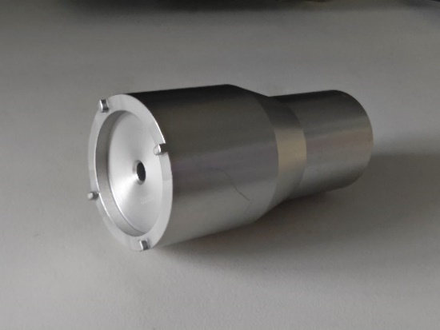
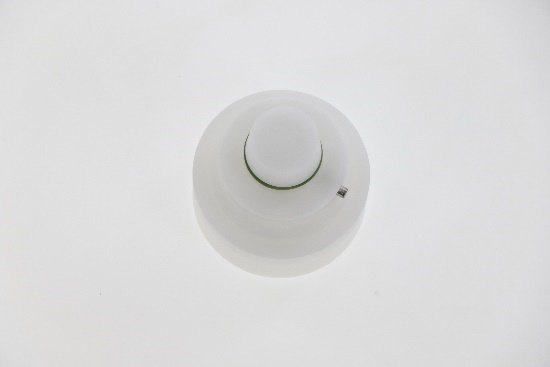
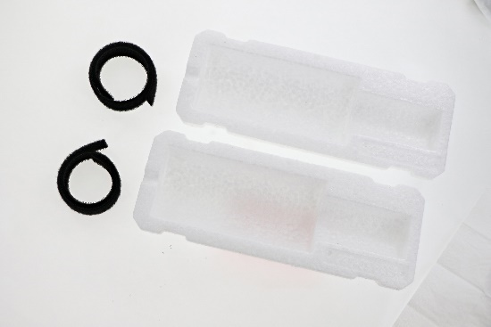
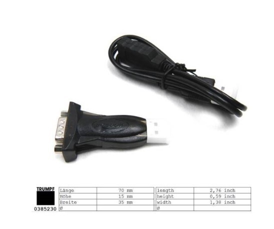

= Service fixtures and additional equipment

[width="100%",cols="41%,20%,39%",options="header",]
|*For installation and maintenance* | |
|*Service tools and accessories* |*Material number* |*Figure*
HILTI drill with drill bit:
* Φ 22 mm (machine)
* Φ 24 mm (hydraulic pallet changer)
* Φ 10 mm (two level pallet changer start post, light barriers)
* Φ 6 mm (cable ducts)
|Press-out device HDM 330 CR/CB (HILTI Hit HY200) |1776480 |-
|HILTI multi-line/combination laser PM 4 with accessories a|
1844156 (laser)
1659753 (target
plate, metric, PMA 54)
1789394 (tripod,
PMA 29)
1659762 (PUSA
60 laser protective
glasses)
|image:img/image12.png[img/image12,width=240,height=224]

|Miniature level NT-11 (1/1000) |2263409 |image:img/image13.png[img/image13,width=240,height=206]

|Standard tool set |0135600 |-
|Standard measurement case |0116140 |image:img/image14.png[img/image14,width=240,height=204]

|Wrench socket, long, 24 mm AF |0356860 |image:img/image15.png[img/image15,width=240,height=250]

|Wrench socket, long, 19 mm AF |2090475 |image:img/image16.png[img/image16,width=240,height=168]

|SICK light barrier alignment tool |129755 |image:img/image17.png[img/image17,width=240,height=178]

Spanner, 46 mm
(used for two-level pallet changer)
987576
or 1951497
or 1226019
|image:img/image18.png[img/image18,width=240,height=169]

|Grease gun for central lubrication unit |2827885 |image:img/image19.png[img/image19,width=240,height=166]

[width="100%",cols="41%,20%,39%",options="header",]
|*Pressure and volume* | |
|*Service tools and accessories* |*Material number* |*Figure*
|Pressure measuring device set |0356870 |image:img/image20.png[img/image20,width=240,height=214]

|Adapter, pressure test |1359450 |image:img/image21.png[img/image21,width=240,height=138]

Flow measuring instrument
Battery
0369590
0363073
|image:img/image22.png[img/image22,width=240,height=141]

|Flowmeter accessories, complete |1558947 |image:img/image23.png[img/image23,width=240,height=158]

[width="100%",cols="41%,20%,39%",options="header",]
|*Laser power measurement* | |
|*Service tools and accessories* |*Material number* |*Figure*
|Mobile laser protective wall |1944142 |image:img/image24.png[img/image24,width=240,height=241]

|TruDisk and TruFiber laser safety glasses |1784411 |image:img/image25.png[img/image25,width=240,height=173]

|TruDisk and TruFiber laser safety glasses, goggle version (for persons with glasses) |1784412 |image:img/image26.png[img/image26,width=240,height=180]

|PRIMES 10 kW case, complete |1434082 |image:img/image27.png[img/image27,width=240,height=148]

|Hose set for power measuring device |1656953 |-
|Adapter set for shutter measurement, from 6 kW and higher, including service news |1983852 |-
PRIMES CPM F-20 power measuring
device
|1646622 |image:img/image28.png[img/image28,width=240,height=166]

Actuator/sensor cable, unshielded
(*Picture only for reference,* *material number different!*)
|2904804 |image:img/image29.png[img/image29,width=240,height=199]

|Measuring adapter, beam telescope |2028292 |image:img/image30.png[img/image30,width=157,height=355]

Adapter plate for PRIMES fixture
(need use the combination of 2x adapter plates together with platform machine fixture 2535014)
S01: 2770998
S02: 2906355
S01/S02 shared: 2771000
image:img/image31.png[img/image31,width=240,height=193]

image:img/image32.png[img/image32,width=240,height=188]

|Mount device for power sensor head |2535014 |image:img/image33.png[img/image33,width=188,height=268]

[width="100%",cols="41%,20%,39%",options="header",]
|*Cutting unit* | |
|*Service tools and accessories* |*Material number* |*Figure*
Holding plate with for photo paper
(Delivered with machine)
|2826297 |image:img/image34.png[img/image34,width=240,height=165]

Cutting unit replacement fixture
(Delivered with machine)
|2770993 |image:img/image35.png[img/image35,width=240,height=175]

|Flow box |1635336 |image:img/image36.png[img/image36,width=240,height=214]

Flow box adapter plate
(Used instead of based plate of FD27 flow box)
|2771259 a|
image:img/image37.png[img/image37,width=240,height=124]

image:img/image38.png[img/image38,width=240,height=278]

|Base plate for flow box set up on laser device |1627708 |-
|BM111 focusing/collimating lens kit adapter tool |2795973 |

|Ballbar nozzle adapter (only for BM111 cutting unit) |2774471 |image:img/image40.png[img/image40,width=240,height=193]

|Photographic paper |1335798 |image:img/image41.png[img/image41,width=240,height=150]

|Optical adhesive tape, green |1317829 |image:img/image42.png[img/image42,width=240,height=187]

|Plastering tape, white |1420313 |image:img/image43.png[img/image43,width=240,height=185]

|TRUMPF seal |1660501 |image:img/image44.png[img/image44,width=240,height=129]

|Set of hoses, extension for barrier/ purging gas |1952620 |image:img/image45.png[img/image45,width=240,height=151]

|Protective glass D34x5 S26 T1030 T1080 Q for cutting head |2602937 |image:img/image46.png[img/image46,width=240,height=234]

BM111 protective glass,
D24.9x1.5 – 4K, 1064nm
BM111 protective glass,
D27.9x4.1 – 4K, 1064
2796010
2796111
|image:img/image47.png[img/image47,width=240,height=254]

|Adjustment aid |2277653 |image:img/image48.png[img/image48,width=240,height=148]

|Allen key 3 mm 1/4 |2745523 |image:img/image49.png[img/image49,width=240,height=73]

[width="100%",cols="41%,20%,39%",options="header",]
|*Cleaning the optics* | |
|*Service tools and accessories* |*Material number* |*Figure*
|Cleaning kit |1675885 |image:img/image50.png[img/image50,width=240,height=245]

|Swab |1222024 |image:img/image51.png[img/image51,width=240,height=144]

|Swab |0989843 |image:img/image52.png[img/image52,width=240,height=178]

|Clean room wipes |0359506 |image:img/image53.png[img/image53,width=240,height=159]

[width="100%",cols="41%,20%,39%",options="header",]
|*Laser light cable (LLK)* | |
|*Service tools and accessories* |*Material number* |*Figure*
|Plug guard LLK-D cpl. |1310309 |image:img/image54.png[img/image54,width=240,height=138]

|EK D plug cpl. |1301765 |

|Plug guard LLK-D (2x) |1634404 |

|UV lamp with holder a|
1873420
1875039
|image:img/image57.png[img/image57,width=240,height=178]

|LLK-D magnifier for checking the protective glass |1995032 |image:img/image58.png[img/image58,width=240,height=90]

|LLK-X magnifier for checking the protective glass |2638593 |image:img/image59.png[img/image59,width=240,height=210]

|Repair kit for protective hose, LLK |1976863 |image:img/image60.png[img/image60,width=240,height=208]

|LLK service kit and cutting unit |2082194 |image:img/image61.png[img/image61,width=240,height=185]

|Fixture for LLK installation |1730417 |image:img/image62.png[img/image62,width=240,height=159]

|Film with adhesive tape |1629149 |image:img/image63.png[img/image63,width=240,height=260]

|*Inovance drive and motor* | |
|*Service tools and accessories* |*Material number* |*Figure*
|USB – RS232 – RJ45 Serial communication cable a|
385230
359401

image:img/image65.png[img/image65,width=240,height=149]

Adjustable hook wrench 35-60 mm pin 4
Hook wrench
2014343
1655965
|image:img/image66.png[img/image66,width=240,height=159]*or*image:img/image67.png[img/image67,width=240,height=177]

.Tab. 1‑3
[width="100%",cols="41%,20%,39%",options="header",]
|*For mechanical setting work* | |
|*Service tools and accessories* |*Material number* |*Figure*
Force gauge 0-250 N
(used for S01 machine)
|2390287 |image:img/image68.png[img/image68,width=240,height=171]

|Hook wrench 22-26 mm |- |image:img/image69.png[img/image69,width=240,height=179]

Racks clamping device for both X&Y axes
*(Different from platform machine’s! Rack is different!)*
|2790932 |image:img/image70.png[img/image70,width=240,height=179]

Bluetooth dial gauge (recommended)
Dial gauge 1/1000 with magnetic support, analog
2369502
0002419
image:img/image71.png[img/image71,width=149,height=254]

image:img/image72.png[img/image72,width=240,height=227]

|Pallet changer alignment aid |2523365 |image:img/image73.png[img/image73,width=240,height=73]

