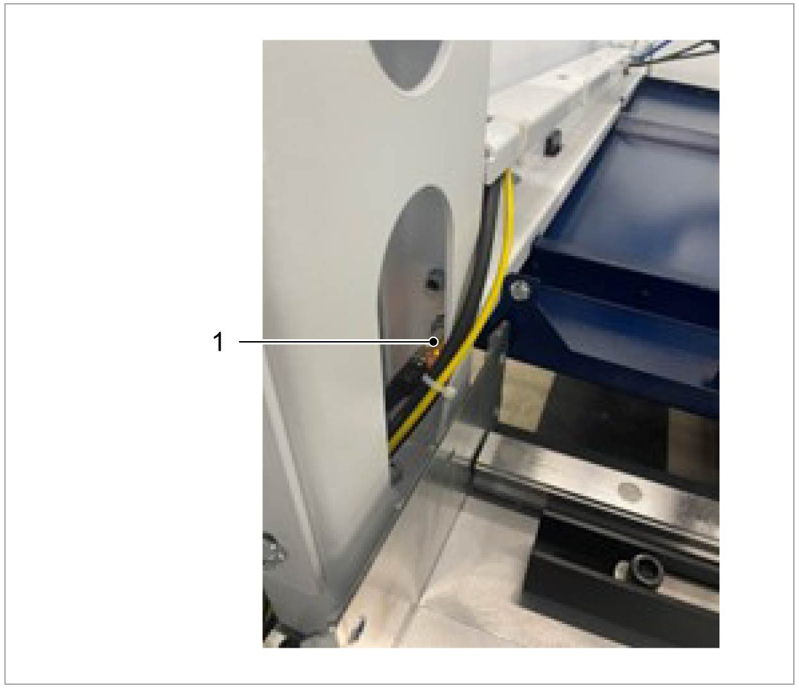

= L99 Operation Manual

== 6 Maintenance

=== Maintenance points

==== 

===== 

[#_Toc160546867 .anchor]####Lubrication[#_Ref138772764 .anchor]##[#_Toc160546868 .anchor]####Check the lubricant levelimage:extracted-media/media/image165.png[extracted-media/media/image165,width=49,height=34] Maintenance interval: as needed or when the system sends alarm

The centralized lubrication system provides lubricants for the following components:

* Guide rails and racks on the X and Y axes.
* Ball screws on the Z axis (guide rails and racks on the Z axis need manual lubrication, lubricant GB00)

*Means, Tools, Materials:*

* Lubricant KLÜBER Microlube GB00 (mat. no. 0111780).

Replace the lubricant

[arabic]
. {blank}
. {blank}

____
Open the rubber cover of the lubricant container.Grease the grease nipples with a grease gun.Grease gun materials: 2827885.
____

[arabic, start=3]
. {blank}

===== 

Fasten the rubber cover back on.[#_Ref138772805 .anchor]##[#_Toc160546869 .anchor]####Lubricating the Z axis guide carriageimage:extracted-media/media/image167.png[extracted-media/media/image167,width=48,height=36] Maintenance interval: As needed

*Means, Tools, Materials*

* Lubricant KLÜBER Microlube GB00 (mat. no. 0111780).

[arabic]
. {blank}
. {blank}

____
Switch off the MAIN SWITCH, lock it and pull out the key。Check the status on the Z axes guide and guide carriage, if the guide and guide carriage are not well lubricated, grease the grease nipples with a grease gun.If necessary, contact TRUMPF Technical Service.
____

[#_Ref159934446 .anchor]#[#_Toc160546870 .anchor]###image:extracted-media/media/image166.png[extracted-media/media/image166,width=48,height=34]Lubricating the fixing device on pallet changerMaintenance interval: 2000 operating hours

*Means, Tools, Materials*

* {blank}

Lubricant Dry Lube 400ml (0367578)

[arabic]
. {blank}
. {blank}

____
Switch off the MAIN SWITCH, lock it and pull out the key.Check and lubricate the fixing device. If necessary, contact TRUMPF Technical Service.
____

==== 

===== 

[#_Toc160546871 .anchor]####3.2 Exhaust device[#_Ref124511079 .anchor]##[#_Toc160546872 .anchor]####Check or clean disposable containerimage:extracted-media/media/image165.png[extracted-media/media/image165,width=49,height=34] Maintenance interval: 8 operating hours

*Means, Tools, Materials*

* {blank}
* {blank}

Breathing mask safety class FFP3 (or equivalent).Protective clothing and gloves.*Notes*

* {blank}

____
This involves extremely fine metal dust particles which must not be brought into contact with burning objects due to the risk of combustion.When working on the compact dust extractor, always wear a tightly fitting dust mask (e.g. breathing mask of the safety class FFP3 (or comparable)) as personal protective equipment.
____

* {blank}

____
Disposal as hazardous waste is not necessary. However, it is vital to find out the relevant national, regional, and local regulations and follow them closely.If the machine is used as intended, the filtered dust can be supplied for metal recycling.
____

[arabic]
. {blank}
. {blank}
. {blank}

Before changing the container, switch off the compact dust extractor.Turn the handle (1) under the dust container clockwise and rotate the dust container (2) down to check the dust condition of the dust container.If a smoldering fire occurs, immediately empty coarse dust container.*Or*

* {blank}

[arabic, start=4]
. {blank}
. {blank}
. {blank}

===== 

Empty coarse dust container when it is 75% full.Reset the dust container.After cleaning the dust, install the dust container in place.Turn the handle (1) counterclockwise to close the dust container. Ensure that it is sealed so as not to affect the air volume.[#_Ref124511322 .anchor]##[#_Toc160546873 .anchor]####Check the dust collection boximage:extracted-media/media/image165.png[extracted-media/media/image165,width=49,height=34] Maintenance interval: 40 operating hours

*Means, Tools Materials*

* {blank}
* {blank}

[arabic]
. {blank}

Respiratory mask with protection level of FFP3 (or similar level).Protective clothing and glovesThe dust collection box is located at the lower left corner of the dust collector. Open the lock and pull out the dust collection box.

[arabic, start=2]
. {blank}
. {blank}

===== 

Check the dust in the dust collection box and clean it up.After cleaning, put the dust box back and lock.[#_Ref124511391 .anchor]##[#_Toc160546874 .anchor]####Check the pressure reducer and compressed air supplyimage:extracted-media/media/image165.png[extracted-media/media/image165,width=49,height=34] Maintenance interval: 2,000 operating hours

[arabic]
. {blank}
. {blank}

===== 

Check whether the values on the two pressure gauges are 5 + 0.5 bar. If there is a problem with the pressure value, please switch off the machine, and check whether there is a problem with the air supply or whether there is a leak or blockage in the pipe.[#_Ref124512383 .anchor]##[#_Toc160546875 .anchor]####Clean the tube bend and suction tubesimage:extracted-media/media/image4.GIF[extracted-media/media/image4,width=181,height=37]image:extracted-media/media/image165.png[extracted-media/media/image165,width=49,height=34] Maintenance interval: 500 operating hours

[width="100%",cols="100%",options="header",]
|===
a|
*Fire hazard due to dust deposits in the suction tube and filter.*

*Dust deposits in the tube bend and suction tube can cause a smoldering fire. Loose burning parts will get into the filter and lead to a filter fire.*

* {blank}

|===

[arabic]
. {blank}

Regularly clean the tube bend and suction tube.Press the emergency stop button.

[arabic, start=2]
. {blank}
. {blank}
. {blank}

===== 

Remove the tube bend, suction tube and suction pipe.Clean tube bend, suction tube and suction tube as required with a damp, disposable cloth and remove any deposits.Pack disposable cloth dust-tight and dispose of it correctly.[#_Ref124512419 .anchor]##[#_Toc160546876 .anchor]####Check the clean gas chamberimage:extracted-media/media/image165.png[extracted-media/media/image165,width=49,height=34] Maintenance interval: 500 operating hours

*Precondition*

* {blank}

[arabic]
. {blank}

[width="100%",cols="100%",options="header",]
|===
a|
The dust collector has been turned off, and the measures have been taken to prevent it from being accidentally switched on.Switch off the system and safeguard it against restarting.*Increased noise pollution due to compressed air blast!*

*Damage to hearing (deafness) or other physiological impairments.*

* {blank}

|===

[arabic, start=2]
. {blank}

[width="100%",cols="100%",options="header",]
|===
a|
Do not open the clean gas chamber until the compressed air tank has been emptied.Wait until the operating pressure.*Danger from dust that is stirred up.*

*Injury to the respiratory system, the mucous membranes, the eyes and the skin due to circulating dust.*

* {blank}

|===

For all work during which personnel come into contact with dust, wear a breathing mask of safety classFFP3 (or comparable).*Note*

The used filter cartridge shall not be reused!

[arabic]
. {blank}
. {blank}
. {blank}

===== 

Remove the bolt plug (1) on the door of the clean gas chamber and unscrew the bolts.Open the door of the clean gas chamber to check whether there is dust deposition in the clean gas chamber.If necessary, check whether the filter cartridge in the dirty area is damaged, clean the clean gas chamber and replace the filter cartridge.[#_Ref124512458 .anchor]##[#_Toc160546877 .anchor]####Replace the filter cartridgeimage:extracted-media/media/image165.png[extracted-media/media/image165,width=49,height=34] Maintenance interval: 7,000 operating hours

Material number of filter cartridge: 2575176

*Means, Tools, Materials*

* {blank}

[arabic]
. {blank}

Breathing mask of the safety class FFP3Switch off the system and cut off the power.

[arabic, start=2]
. {blank}
. {blank}
. {blank}

===== 

Loosen the lock nut of the access door and gently open the access door to prevent the dust from raising. Loosen the hook nut of the filter cartridge and remove the filter cartridge along the position where the hook is mounted.Blow the filter cartridge from inside to outside with the compressed air, and check for damage. Do not soak or flush the filter cartridge with water during cleaning.Install the filter cartridge along the hook installation position, tighten the hook nut of the filter cartridge, and close the access door.[#_Ref124512490 .anchor]##[#_Toc160546878 .anchor]####Check the purging valveimage:extracted-media/media/image165.png[extracted-media/media/image165,width=49,height=34] Maintenance interval: 500 operating hours

* {blank}
* {blank}

Check the blowback valve for noise and clean it if necessary.If necessary, contact TRUMPF Technical Service.

===== 

[#_Ref124512613 .anchor]##[#_Toc160546879 .anchor]####Check the dust collector pressure tankimage:extracted-media/media/image167.png[extracted-media/media/image167,width=49,height=36] Maintenance interval: every 5 years

The pressure tanks must be inspected regularly for damage, leakage and corrosion in accordance with the regulations of the host country.

===== 

[#_Ref138773326 .anchor]##[#_Toc160546880 .anchor]####Check differential pressure indicatorimage:extracted-media/media/image165.png[extracted-media/media/image165,width=48,height=34] Maintenance interval:40 operating hours

[arabic]
. {blank}

Read the differential pressure.

[arabic, start=2]
. {blank}

===== 

If the indicated value is too high, the filter cartridge need to be changed, proceed as described above in the manual and in the manufacturer’s documentation.[#_Ref124512530 .anchor]##[#_Toc160546881 .anchor]####Cleaning the internal exhaust moduleimage:extracted-media/media/image165.png[extracted-media/media/image165,width=49,height=34] Maintenance interval: 40 operating hours

[arabic]
. {blank}
. {blank}

____
Move the pallets into the pallet changer.Shut down the power supply of the machine properly, turn off the main switch and lock it with a padlock.Switch off the dust collector.

Turn off the compressed air supply.
____

[arabic, start=3]
. {blank}
. {blank}

[width="100%",cols="100%",options="header",]
|===
a|
Remove the residual slag remnant from the side walls.Clean and check whether the protective plates (1) (material number 2745253), bulkhead (2) (material number 2766877), drid sheet (3) (material number 2746229), collecting tank (4) (material number 2745644) are dirty and whether they are working properly. Clean if necessary.*Damage to the machine due to reflections!*

* {blank}

|===

Use S235 (mild steel) as material for the protective plates.

[width="100%",cols="100%",options="header",]
|===
a|
*When inserting the rear bulkhead, there is a risk of shearing hands with the machine push plate.*

*Skin abrasions on hands.*

* {blank}
* {blank}

|===

[arabic, start=5]
. {blank}

____
Hold the bulkhead at the gripping points and insert carefully.Wear protective gloves.Clean the protective plates, grids and bulkheads and replace them if they are badly deformed.*Note*
____

* The surface treatment for the protective plates is to be complied with.
* The vacuum flaps can get stuck in the case of deposit build-up on the front side. Then the vacuum flaps cannot be opened anymore, even if the cutting unit is above the respective suction chamber.

[arabic, start=6]
. {blank}

==== 

===== 

Move the motion unit back in jog mode.[#_Toc160546882 .anchor]####Control panel[#_Ref127444703 .anchor]##[#_Toc160546883 .anchor]####Cleaning the screen, keyboard and mouseimage:extracted-media/media/image165.png[extracted-media/media/image165,width=49,height=34] Maintenance interval: as needed

*Means, Tools, Materials*

* Lint-free cloth (e.g. microfiber cloth, moist screen cleaning tissues).

* {blank}

===== 

Clean the screen, keyboard and mouse using a lint-free cloth.[#_Ref127444413 .anchor]##[#_Toc160546884 .anchor]####Check remote service for proper functionimage:extracted-media/media/image167.png[extracted-media/media/image167,width=49,height=36] Maintenance interval: Annually

* {blank}

==== 

===== 

Request TRUMPF Technical Service.[#_Toc160546885 .anchor]####3.4 Motion unit[#_Ref127440227 .anchor]##[#_Toc160546886 .anchor]####Testing and cleaning the cable carriers on the X, Y and Z axesimage:extracted-media/media/image166.png[extracted-media/media/image166,width=49,height=34] Maintenance interval: 1000 operating hours

*Means, Tools, Materials*

* Industrial vacuum cleaner "Dust class M" or "Dust class H" in accordance with IEC/EN 60335-2-69 or similar.

[arabic]
. {blank}
. {blank}

===== 

Check the connector, cable and hose for damage or wear. The damaged universal joint, cable and hose shall be replaced by TRUMPF’s maintenance department.Remove the dust on drag chain with an industrial vacuum cleaner.[#_Ref127440356 .anchor]##[#_Toc160546887 .anchor]####Clean the guideway, front seal and strippers of the X, Y and Z axesimage:extracted-media/media/image165.png[extracted-media/media/image165,width=49,height=34] Maintenance interval: 2,000 operating hours

The motors on the X, Y and Z axes, the guide rail cover, the cover and the scraper on the Y axis must be inspected and cleaned.

*Condition*

Switch off the machine in the correct way, switch off the MAIN SWITCH, lock it, and remove the key.

*Means, Tools, Materials*

* Slightly oiled cloth for the guideways.

[width="100%",cols="100%",options="header",]
|===
a|
*Risk of injury caused by axes moving at uncontrolled speed!*

*In the event of an error, the linear axes may move at uncontrolled speeds against the fixed stops.*

* {blank}

|===

Switch off the machine during the cleaning work.

[arabic]
. {blank}
. {blank}
. {blank}

Move the Y/Z slider to the right.Detach the bellows on the right Y axis.Push the bellows to the left to expose the Y guide(1).

[arabic, start=4]
. {blank}
. {blank}
. {blank}
. {blank}
. {blank}
. {blank}
. {blank}

____
Thoroughly clean the Y guide in the open area of the bellows by gently wiping with an oil-soaked cloth.Check the front seal for damaged sealing lip and replace, if necessary.Reinstall the bellows.Move the Y /Z slider to the left.Detach the bellows of the left Y guiding element.Push the bellows to the right to expose the Y guide.Thoroughly clean the Y guide in the open area of the bellows with an oil-soaked cloth.The cleaning ends when the whole length of Y-axis has been cleaned.
____

[arabic, start=11]
. {blank}
. {blank}
. {blank}

===== 

Check the front seal for damaged sealing lip and replace it if necessary.Reinstall the bellows.The same method applies to the X and Z axes.[#_Ref127440366 .anchor]##[#_Toc160546888 .anchor]####Cleaning the racks on the X and Y axesimage:extracted-media/media/image165.png[extracted-media/media/image165,width=49,height=34] Maintenance interval: 2,000 operating hours

The X and Y axis rack has to be cleaned and freed of chippings, slag, and dust at regular intervals.

*Condition*

Switch off the machine in the correct way, switch off the MAIN SWITCH, lock it, and remove the key.

*Means, tools and materials*

* Clean cloth towel.

Cleaning the front rack

[arabic]
. {blank}
. {blank}

Loosen the bellows on both sides and push them to the right and the left respectively.Push the Y/Z axis to the left.

[arabic, start=3]
. {blank}
. {blank}
. {blank}
. {blank}

Spray or coat the rack (1) with kerosene or low-viscosity spindle oil.Slide the Y/Z axis to the right.Clean any part of the racks that hasn't yet been cleaned.Press the bellows onto the Y/Z axis on both sides.*Note*

The lubrication of X and Y axes is carried out by the central lubrication system.

===== 

[#_Ref138773882 .anchor]##[#_Toc160546889 .anchor]####Testing the collision protection of the cutting unit image:extracted-media/media/image167.png[extracted-media/media/image167,width=49,height=36] Maintenance interval: 1000 operating hours

* {blank}

===== 

Request TRUMPF’s Technical Service to provide technical support.[#_Ref138773923 .anchor]##[#_Toc160546890 .anchor]####Checking the shaft and bearing of the Z axis ball screw image:extracted-media/media/image167.png[extracted-media/media/image167,width=49,height=36] Maintenance interval: 2000 operating hours

* {blank}

===== 

Request TRUMPF’s Technical Service to provide technical support.[#_Ref138773956 .anchor]##[#_Toc160546891 .anchor]####Check and clean the bellows on the X and Y axesimage:extracted-media/media/image165.png[extracted-media/media/image165,width=49,height=34] Maintenance interval: 2000 operating hours

*Means, Tools, Materials*

* Industrial vacuum cleaner "Dust class M" or "Dust class H" in accordance with IEC/EN 60335-2-69 or similar.

[arabic]
. {blank}

Check the bellows for damage such as cracks or holes, and for stability.

[arabic, start=2]
. {blank}
. {blank}

Remove the dust from the bellows with an industrial vacuum cleaner.If the protective cover is seriously damaged, please inform TRUMPF’s maintenance service department.

===== 

[#_Ref138773997 .anchor]##[#_Toc160546892 .anchor]####Clean the grease collecting tray image:extracted-media/media/image166.png[extracted-media/media/image166,width=49,height=34] Maintenance interval: 2,000 operating hours

*Means, Tools, Materials*

* Cleaning cloth

[arabic]
. {blank}
. {blank}
. {blank}

Shut down the machine properly, secure the MAIN SWITCH and secure with a padlock.Remove the left and right bellows of the Y guide.Open the cover of the cutting unit.

[arabic, start=4]
. {blank}
. {blank}
. {blank}

===== 

Undo the screws on the grease collecting trays to the left and right of the cutting unit.Scrape the grease to the outer edges of the tanks.Clean the grease collecting tray with a cloth.[#_Ref127443708 .anchor]##[#_Toc160546893 .anchor]####Clean the splash plateimage:extracted-media/media/image166.png[extracted-media/media/image166,width=49,height=34] Maintenance interval: 2000 operating hours

*Means, Tools, Materials*

* Cleaning cloth

[arabic]
. {blank}
. {blank}
. {blank}

Shut down the machine properly, secure the MAIN SWITCH and secure with a padlock.Detach the bellows of the left and right Y-axis guide.Open the cover of the cutting device.

[arabic, start=4]
. {blank}

===== 

Clean the splash plate (1) with a cloth.[#_Ref138774077 .anchor]##[#_Toc160546894 .anchor]####Checking and setting positioning laser diode offsetimage:extracted-media/media/image167.png[extracted-media/media/image167,width=49,height=36] Maintenance interval: 2,000 operating hours

* {blank}

Request TRUMPF’s Technical Service to provide technical support.

===== 

[#_Ref127443727 .anchor]##[#_Toc160546895 .anchor]####Checking the lubrication line for air pockets, and exhaust if necessaryimage:extracted-media/media/image165.png[extracted-media/media/image165,width=49,height=34] Maintenance interval: 2,000 operating hours

[arabic]
. {blank}
. {blank}

Check the lubrication line for air pockets.If air pocket is blocked, bleed the lubrication lines.*Note*

A cleaning cloth should be placed under the lubrication pipe when venting.

===== 

[#_Ref127443744 .anchor]##[#_Toc160546896 .anchor]####Checking the rack backlash (X axis and Y axis)image:extracted-media/media/image167.png[extracted-media/media/image167,width=49,height=36] Maintenance interval: 2,000 operating hours

* {blank}

===== 

Request TRUMPF’s Technical Service to provide technical support.[#_Ref127443776 .anchor]##[#_Toc160546897 .anchor]####Testing the reference switches on the X, Y and Z axesimage:extracted-media/media/image167.png[extracted-media/media/image167,width=49,height=36] Maintenance interval: 2000 operating hours

* {blank}

==== 

===== 

Request TRUMPF’s Technical Service to provide technical support.[#_Toc160546898 .anchor]####3.5 Instrument panel[#_Ref138837383 .anchor]##[#_Toc160546899 .anchor]####Testing the input controller for operating pressureimage:extracted-media/media/image165.png[extracted-media/media/image165,width=49,height=34] Maintenance interval: 2,000 operating hours

[arabic]
. {blank}
. {blank}

===== 

Check whether the value of the regulator (1) has been set to 5 bar+0.5 and adjust the pressure if the value is incorrect.Check the condensate status.[#_Ref127443877 .anchor]##[#_Toc160546900 .anchor]####Replace the filter of the compressed air deviceimage:extracted-media/media/image166.png[extracted-media/media/image166,width=49,height=34] Maintenance interval: 2,000 operating hours

[arabic]
. {blank}
. {blank}
. {blank}
. {blank}
. {blank}

===== 

Shut down the machine properly, switch off the MAIN SWITCH, lock it and remove the key.Shut off the compressed air supply to the machine at the 3/2-directional valve.Screw out the filter housing.Replace the 40μm filter (material number: 0364032).Assemble the filter housing.[#_Ref138837473 .anchor]##[#_Toc160546901 .anchor]####Compressed air cutting: replace the filter elementimage:extracted-media/media/image166.png[extracted-media/media/image166,width=49,height=34] Maintenance interval: 2,000 operating hours

[arabic]
. {blank}
. {blank}
. {blank}
. {blank}
. {blank}

===== 

Shut down the machine properly, switch off the MAIN SWITCH, lock it and remove the key.Close the compressed air delivery on the reversing valve (1).Unscrew the housings of filter CK70 (2) (material number: 0369322) and filter CK50 (3) (material number: 0369323).Replace the filter element.Assemble the filter housing.[#_Ref127440118 .anchor]##[#_Toc160546902 .anchor]####Compressed air cutting: replace the activated carbon filterimage:extracted-media/media/image166.png[extracted-media/media/image166,width=49,height=34] Maintenance interval: 500 operating hours

[arabic]
. {blank}
. {blank}
. {blank}
. {blank}

____
Shut down the machine properly, switch off the MAIN SWITCH, lock it and remove the key.Close the compressed air delivery on the reversing valve (1).Unscrew the housings of the filters (2) and (3).Install new filter elements (material number of filter elements (2) and (3): 0369323) into the activated carbon filter.Attention

The filter elements of filters 2 and 3 can be used interchangeably.
____

[arabic, start=5]
. {blank}

Install the filter housing.

===== 

[#_Ref127440186 .anchor]##[#_Toc160546903 .anchor]####Check the pre-filter element and replace it if necessaryimage:extracted-media/media/image165.png[extracted-media/media/image165,width=49,height=34] Maintenance interval: every 3 months (500 operating hours)

[arabic]
. {blank}

____
Shut down the machine properly, switch off the MAIN SWITCH, lock it and remove the key.Close the customer-provided stop valves at the tapping point.

Bleed the line section with the drain valve at the machine input and close it again.
____

image:extracted-media/media/image192.png[extracted-media/media/image192,width=233,height=213]

{empty}2. Screw out the filter housing.

{empty}3. Check the filter element when it is installed and replace if strongly contaminated.

{empty}4. Assemble the filter housing.

____
Open the stop valves at the tapping point.
____

===== 

[#_Ref127444711 .anchor]##[#_Toc160546904 .anchor]####Emptying the condensed water containerimage:extracted-media/media/image165.png[extracted-media/media/image165,width=49,height=34] Maintenance interval: as needed

*Note*

For machines with extended ambient conditions, the condensation water container must be checked and emptied at shorter intervals.

{empty}1. Regularly check the condensed water container (1) at the instrument plate and empty if need be.

{empty}2. Reinstall the empty container.

==== 

===== 

[#_Toc160546905 .anchor]####Hydraulic unit (Pallet changer) (option)[#_Ref127444642 .anchor]##[#_Toc160546906 .anchor]####Change the oil and oil filterimage:extracted-media/media/image166.png[extracted-media/media/image166,width=49,height=34] Maintenance interval: every 5 years

*Means, Tools, Materials*

* Hydraulic oil Avilub Fluid HVD 46, required oil volume: 2x20 l (10.6gal).
* Screw-on cartridge.

*Note*

Only use the same type of oil as before for topping up.

Hydraulic unit

[arabic]
. {blank}
. {blank}
. {blank}
. {blank}
. {blank}
. {blank}
. {blank}
. {blank}
. {blank}
. {blank}
. {blank}
. {blank}
. {blank}
. {blank}

===== 

Switch off the MAIN SWITCH, lock it and pull out the key.Remove the protective cover (1) of the hydraulic unit.Stake all hose couplings on the hydraulic unit.Lift hydraulic unit.Open the cover (4) on the hydraulic unit and remove any contamination on the edge of the filler neck with a lint-free cloth.Open oil drain plug (3) and drain off the waste oil.Replace seal on the oil drain plug and close oil drain plug.Fill the new hydraulic oil filtered (filter unit: 25 μm), check cover seal and, if necessary, replace.Observe the oil filling height at the level indicator (2).Replace the oil filter (5).Close the cover (4).Assemble all hose couplings.Fasten the protective cover (1) of the hydraulic unit.Initiate a start of the hydraulic unit at the operating panel to check it for proper working order (to do this, raise and lower the pallet changer using the control).[#_Ref127444939 .anchor]##[#_Toc160546907 .anchor]####Refilling oilimage:extracted-media/media/image167.png[extracted-media/media/image167,width=49,height=36] Maintenance interval: When indicated by the control system.

The hydraulic unit has an automatic level check. A message is issued if the oil level drops below a certain level.

* {blank}

===== 

Request TRUMPF Technical Service to provide technical support.[#_Ref127444489 .anchor]##[#_Toc160546908 .anchor]####Check the hydraulic hoseimage:extracted-media/media/image167.png[extracted-media/media/image167,width=49,height=36] Maintenance interval: annually

In order to avoid possible risks, all clearly laid hydraulic hose lines must be inspected regularly for defects.

*Note*

* The damaged hydraulic hose lines must be replaced by TRUMPF’s maintenance service department.
* TRUMPF recommends replacing the hydraulic hose line every 10 years. If national regulations provide for shorter intervals, these regulations must be observed.
* The hydraulic hoses can be identified by hydraulic schematics.

[arabic]
. {blank}

____
Turn off the machine tool through the main switch and make sure it is not switched on again.The hydraulic system has no pressure.
____

[arabic, start=2]
. {blank}

* {blank}
* {blank}
* {blank}
* {blank}
* {blank}
* {blank}

[arabic, start=3]
. {blank}

===== 

Check the hydraulic hose line for firmness and for any of the following damage:Damage to the outer layer of the lining (scratches, cuts, cracks).Brittle outer layer (hose crack).Deformation inconsistent with the natural shape of the hydraulic hose line (delamination, bubble formation, extrusion point, kink).Leakage.Remove the hydraulic system hose line from the hose valve fitting.Damage, distortion, or corrosion of valves that reduce function and strength.If the damaged hydraulic hose pipe is to be replaced, request TRUMPF Technical Service department to provide technical support.[#_Ref127444659 .anchor]##[#_Toc160546909 .anchor]####Replace the hydraulic hoseimage:extracted-media/media/image167.png[extracted-media/media/image167,width=49,height=36] Maintenance interval: every 10 years

Note

TRUMPF recommends replacing the hydraulic hose pipe every 10 years. If national regulations provide for shorter intervals, these regulations must be observed.

* {blank}

==== 

===== 

Request TRUMPF Technical Service department to provide technical support.[#_Toc160546910 .anchor]####Process cooler[#_Ref138838242 .anchor]##[#_Toc160546911 .anchor]####Check the filter mat and cleaning/replacing if necessaryimage:extracted-media/media/image165.png[extracted-media/media/image165,width=49,height=34] Maintenance interval: 100 operating hours

*Note*

The filter screen protects the condenser from dirt.

The filth of the filter screen depends on the production conditions.

[arabic]
. {blank}
. {blank}
. {blank}
. {blank}

===== 

Switch off the MAIN SWITCH of the machine.Check the filter mat for contamination and damage.Vacuum dirty filter mats with an industrial vacuum cleaner.Replace damaged or very dirty filter mats.[#_Ref127444947 .anchor]##[#_Toc160546912 .anchor]####Check the liquid levelimage:extracted-media/media/image165.png[extracted-media/media/image165,width=49,height=34] Maintenance interval: when the level is too low or too high

*Means, Tools, Materials*

* Protective gloves
* Eye protection

[width="100%",cols="100%",options="header",]
|===
a|
*Aggressive anticorrosive agent!*

*Chemical burns on eyes, skin, mucous membranes and digestive tract.*

* {blank}
* {blank}
* {blank}

|===

[arabic]
. {blank}
. {blank}

____
Wear protective gloves and safety glasses.Avoid direct contact with the eyes and skin.Do not inhale or swallow anticorrosive agent.Switch off the machine and process coolers and lock them with a padlock.Check the liquid level of the cooling water, if necessary, refill the cooling water.**Or**After reaching the maintenance period, completely replace the cooling water. For details, see "Change Cooling Water".
____

===== 

[#_Ref123732293 .anchor]##[#_Toc160546913 .anchor]####Change the cooling waterimage:extracted-media/media/image166.png[extracted-media/media/image166,width=49,height=34] Maintenance interval: Annually

*Condition*

The cooling circulation system should be washed repeatedly 2 hours before the replacement of the cooling water, and then the cooling water should be injected.

*Means, tools and materials*

* Clean wiping cloth
* Safety glasses
* Protective gloves
* Conductivity measuring instrument
* Industrial vacuum cleaners with "dust level M" or "dust level H" conforming to IEC/EN 60335-2-69 or equivalent standard.
* Water collecting container

[width="100%",cols="28%,21%,18%,33%",options="header",]
|===
|*Laser* |*Capacity of cooling cycle, unit: l (gal)* |*Required water consumption, unit: l (gal)* |*Cooling water requirements*
|TruFiber 3001/6001 (FD91) |110(29) |220(58) a|
DI water < 100μm

Pure ethylene glycol with volume ratio of 5%-10% is used as microbial inhibitor and antifreeze

TRUMPF recommends a concentration of 25 % by volume to protect against freezing to -10 °C with a minimal drop in thermal performance while also providing corrosion protection and serving as a bactericide

|===

Start the cleaning cycle

[arabic]
. {blank}
. {blank}
. {blank}

* {blank}
* {blank}

[arabic, start=4]
. {blank}

[width="100%",cols="100%",options="header",]
|===
a|
Switch off the MAIN SWITCH of the machine.Put on personal protective equipment before contact withcooling water additives and cooling water:Wear safety glasses.Put on short protective gloves.Open the process cooler on a longitudinal side.*Aggressive cooling water additives in cooling water!*

*Chemical burns on eyes, skin, mucous membranes and digestive tract.*

* {blank}
* {blank}
* {blank}

|===

[arabic, start=5]
. {blank}

Wear safety glasses and protective gloves.Avoid direct contact with eyes and skin.Do not swallow cooling water and microbial cleaner.Open the cooling water tank, add anti-microbial additives to the water, and close the water tank and process cooler again.

____
*Note*

The circulation flow must be cooled during the cleaning cycle.
____

[arabic, start=6]
. {blank}
. {blank}

[width="100%",cols="100%",options="header",]
|===
a|
Reconnect the machine tool and drive device. Continue production in the cleaning cycle.The cleaning cycle ends two hours later.*Aggressive cooling water additives in cooling water!*

*Chemical burns on eyes, skin, mucous membranes and digestive tract.*

* {blank}
* {blank}
* {blank}

|===

[arabic, start=8]
. {blank}
. {blank}

____
Wear safety glasses and protective gloves.Avoid direct contact with eyes and skin.Do not swallow cooling water and microbial cleaner.Drain the water completely.Fill the water tank with 100% cooling water according to the above table.Measure the conductivity
____

[arabic, start=10]
. {blank}

____
The cooling water must be measured for conductivity every time it is replaced! See below for the procedure. __[.underline]#Measure the conductivity of the cooling water#__Adding anticorrosive agent and cleaning biocide
____

[arabic, start=11]
. {blank}
. {blank}
. {blank}

===== 

Add microbial inhibitors (antifreeze if needed) and wait 10 minutes before running the machine (pump must be in running status).After the replacement of cooling water, tighten the water inlet.Restart the process cooler and record the replacement of cooling water.[#_Ref123819842 .anchor]##[#_Toc160546914 .anchor]####Measure the conductivity of the cooling waterimage:extracted-media/media/image167.png[extracted-media/media/image167,width=49,height=36] Maintenance interval: Annually (after replacement of cooling water)

[width="100%",cols="48%,52%",options="header",]
|===
|*Laser* |*Conductivity of cooling water*
|TruFiber G 3001/ 6001 (FD91) |<45 μScm^-1^ (25℃)
|===

* {blank}
* {blank}

[arabic]
. {blank}

* {blank}

[arabic, start=2]
. {blank}

Check the conductivity of the cooling water in the tank regularly annually.The cooling water must be measured for conductivity every time it is replaced.Measure the conductivity of cooling water. If the conductivity meets the requirements, the water is clear and there is no suspended matter, then the measurement is finished.If the conductivity of the water is not within the required range, or the water is not clear and contains suspended matter, rinse the cooling circulation loop again.Cover the process cooler. Restart the process cooler.[#_Toc160546915 .anchor]####Check the fanimage:extracted-media/media/image167.png[extracted-media/media/image167,width=49,height=36] Maintenance interval: annually

* {blank}

==== 

===== 

Request TRUMPF’s maintenance service department to provide technical support. [#_Toc160546916 .anchor]####Laser TruLaser (FD91)[#_Toc160546917 .anchor]####Carrying out cleaning cycle and cooling water replacementFor details, see "Section 6 Maintenance - 3. Maintenance Parts - 3.6 Process cooler -_[.underline]#Change the cooling water#_ " in this manual

===== 

[#_Toc160546918 .anchor]####Refill the cooling waterFor details, see "Section 6 Maintenance - 3. Maintenance Parts - 3.6 Process cooler - _[.underline]#Replace the cooling water#_" in this manual

===== 

[#_Ref138838860 .anchor]##[#_Toc160546919 .anchor]####Carry out a leak test of cooling deviceimage:extracted-media/media/image2.GIF[extracted-media/media/image2,width=181,height=37]image:extracted-media/media/image166.png[extracted-media/media/image166,width=49,height=34] Maintenance interval: annually

[width="100%",cols="100%",options="header",]
|===
a|
*Water leakage in the laser device will lead to danger!*

If water comes into contact with live parts, the person may get an electric shock, which can be fatal in extreme cases.

|===

* {blank}
* {blank}
* {blank}

===== 

Check the tightness of water pipes within the scope of maintenance.Check the protection line.The leakage sensor in the laser is connected to the refrigerator, and the refrigerator can be shut off immediately when there is leakage in the electric cabinet.[#_Ref138838963 .anchor]##[#_Toc160546920 .anchor]####Check and clean the laser filter matimage:extracted-media/media/image166.png[extracted-media/media/image166,width=49,height=34] Maintenance interval: 100 operating hours

In order to ensure the normal operation of the laser, the filter must be cleaned regularly.

==== 

===== 

[#_Toc160546921 .anchor]####Machine[#_Ref138840606 .anchor]##[#_Toc160546922 .anchor]####Check safety cabin and laser protection windowimage:extracted-media/media/image165.png[extracted-media/media/image165,width=49,height=34] Maintenance interval: 8 operating hours

A visual inspection is carried out.

Testing the safety cabin

[arabic]
. {blank}
. {blank}

Check the safety cabin for damage.Do not run the machine if the body is damaged (deep scorch marks, holes, cracks, etc.). Replace the damaged parts immediately.Check the laser protection window

[arabic, start=3]
. {blank}

[width="100%",cols="100%",options="header",]
|===
a|
Check the laser protection window for scorching, holes or other damage.*Invisible, high-energy laser radiation!*

*Risk of severe skin burns and damage to the eyes.*

*Impairment or even loss of eyesight possible!*

* {blank}
* {blank}

|===

[arabic, start=4]
. {blank}
. {blank}

===== 

Have the laser protection window replaced if 1 mm deep scorching or holes are discovered during inspection.Do not put the machine back into operation until the defective laser protection window has been replaced.To replace the laser protection window, make a request to TRUMPF Technical Service.Check slats and pallets. Remove punching slugs and small parts to avoid damage to the safety cabin from reflected laser radiation.[#_Ref138840652 .anchor]##[#_Toc160546923 .anchor]####Cleaning the laser protection windowimage:extracted-media/media/image165.png[extracted-media/media/image165,width=49,height=34] Maintenance interval: As needed

The following cleaning agents are recommended for cleaning

the laser protection windows:

* Anti-static synthetic material cleaner and care agent (material number 1672922).
* Strong cleaner for synthetic materials (material number 1672919).

*Means, Tools, Materials*

* Clean, lint-free cloth.
* Suitable cleaning agent.

[width="100%",cols="100%",options="header",]
|===
a|
*Destruction of the laser protection window caused by cleaning with unsuitable cleaning agents.*

* {blank}
* {blank}
* {blank}

|===

* {blank}

===== 

Laser protection window Do *not* clean the viewing window with glass cleaner.Use only cleaning agents which are suitable for polycarbonate.When cleaning the laser protection window, do not use any abrasive or highly alkaline cleaning agents or solvents such as acetone, gasoline, benzene, or carbon tetrachloride.Clean the laser protection window with a soft cloth and suitable cleaning agent.[#_Ref138840818 .anchor]##[#_Toc160546924 .anchor]####Clean the machine and working areaimage:extracted-media/media/image165.png[extracted-media/media/image165,width=48,height=34] Maintenance interval: Weekly

The work area inside and outside the machine must be cleaned regularly.

*Means, Tools, Materials*

* Breathing mask safety class FFP3 (or equivalent).
* Industrial vacuum cleaner "Dust class M" or "Dust class H" in accordance with IEC/EN 60335-2-69 or similar.

*Note*

Do not use any solvents or compressed air for cleaning.

[width="100%",cols="100%",options="header",]
|===
a|
*Health hazard due to inhaling dust!*

* {blank}
* {blank}

|===

[arabic]
. {blank}

[arabic, start=2]
. {blank}
. {blank}
. {blank}

===== 

Breathing mask of safety class FFP3 (or similar) must be worn.To vacuum dust: use industrial vacuum cleaner "Dust class M" or "Dust class H" in accordance with IEC/ EN 60335-2-69 or similar.Turn the SAFETY-MODE key switch to position *1*, remove the key and stow it away safely.Remove coarse soiling and waste parts from the work area.Remove the slag.Vacuum the machine and the work area with an industrial vacuum cleaner.[#_Ref138840950 .anchor]##[#_Toc160546925 .anchor]####Testing the safety cabin for light tightnessimage:extracted-media/media/image167.png[extracted-media/media/image167,width=49,height=36] Maintenance interval: 2000 operating hours

* {blank}

===== 

Request TRUMPF Technical Service to provide technical support.[#_Ref138840995 .anchor]##[#_Toc160546926 .anchor]####Check the safety door lock of the protective doorimage:extracted-media/media/image165.png[extracted-media/media/image165,width=49,height=34] Maintenance interval: 1000 operating hours

[arabic]
. {blank}

Open the protective door and check to make sure that the machine tool can be operated.

[arabic, start=2]
. {blank}

===== 

If the safety door lock is damaged, please replace it in time (material number: 2758231 (1), 0061425 (2)) to avoid safety accidents.[#_Ref138841041 .anchor]##[#_Toc160546927 .anchor]####Check the indicator light of the machineimage:extracted-media/media/image165.png[extracted-media/media/image165,width=49,height=34] Maintenance interval: 2000 operating hours

* {blank}

===== 

Visual inspection. Check whether the indicator light of the machine tool shows different colors during operation and shutdown. [#_Ref138841167 .anchor]##[#_Toc160546928 .anchor]####Check the rubber finsimage:extracted-media/media/image165.png[extracted-media/media/image165,width=49,height=34] Maintenance interval: as required

* {blank}

===== 

Check whether the curtain is missing, damaged or brittle. Replace it in time if necessary.[#_Ref138841115 .anchor]##[#_Toc160546929 .anchor]####Check the proximity switch at pallet gateimage:extracted-media/media/image165.png[extracted-media/media/image165,width=49,height=34] Maintenance interval: 8 operating hours

[arabic]
. {blank}

Before the machine tool starts to normally work every day, open the back door and check whether the signal on the operation panel is normal.

[arabic, start=2]
. {blank}

===== 

If the signal is found abnormal, clean the proximity switch or adjust the position.[#_Ref138841207 .anchor]##[#_Toc160546930 .anchor]####Check the sealing strip at the front doorimage:extracted-media/media/image166.png[extracted-media/media/image166,width=49,height=34] Maintenance interval: 2,000 operating hours

* {blank}

===== 

Visually check whether the sealing strip at the front door is missing, damaged or catalyzed. Please replace it in time if necessary (material number: 0061425).[#_Ref138841249 .anchor]##[#_Toc160546931 .anchor]####Check the cylinder valve at the back doorimage:extracted-media/media/image167.png[extracted-media/media/image167,width=49,height=36] Maintenance interval: 2,000 operating hours

* {blank}

==== 

===== 

Please contact TRUMPF’s maintenance technology service department for this maintenance. [#_Toc160546932 .anchor]####Pallet changer[#_Ref138841460 .anchor]##[#_Toc160546933 .anchor]####Clean the calibration plate and nozzle cleaning brushesimage:extracted-media/media/image165.png[extracted-media/media/image165,width=49,height=34] Maintenance interval: 500 operating hours

[arabic]
. {blank}
. {blank}

===== 

Clean the calibration plate (1) and nozzle cleaning brush (2) on both workbenches.Check the nozzle cleaning brush for wear and replace it if necessary.[#_Ref138841518 .anchor]##[#_Toc160546934 .anchor]####Cleaning the slats and slat support, and replacing them if necessaryimage:extracted-media/media/image165.png[extracted-media/media/image165,width=49,height=34] Maintenance interval: 40 operating hours

*Means, Tools, Materials*

* Slat cleaner TruTool TSC 100.

*Notes*

* {blank}
* {blank}

____
A set of slats for a pallet contains special slats which have a special shape. These special slats must be inserted at a specific point in the pallet and they have a special function (e.g. sheet stop, smoke chamber separation).Check and clean the dirt on the pallets before every processing.Cleaning slats
____

{empty}1. Shut down the machine properly, secure MAIN SWITCH with padlock and remove the key.

{empty}2. Release and remove slag.

{empty}3. If there is a lot of contamination or damage, clean slats (e.g. with TruTool TSC 100) or replace them. During replacement, make sure that the slats inserted between the slat supports have rounded comers.

Example: 3x1.5m slats on the workbench

____
Replace the slats
____

[arabic, start=4]
. {blank}
. {blank}

* {blank}
* {blank}

Remove the old slatsInserting special slats at the marked positions:Slat with sheet stop at the position with two countersinks on the pallet frame.Slat with recesses at the position with one countersink on the pallet frame.6. Insert the remaining slats.

===== 

[#_Ref138841550 .anchor]##[#_Toc160546935 .anchor]####Check the pallet for damageimage:extracted-media/media/image165.png[extracted-media/media/image165,width=49,height=34] Maintenance interval: 8 operating hours

Condition

* The pallet is located in the pallet changer.

[width="100%",cols="100%",options="header",]
|===
a|
*Falling pallet parts when transporting damaged auxiliary pallets.*

*Risk of fatal injury due to falling parts!*

* {blank}
* {blank}
* {blank}

|===

Do not stand or walk under suspended loads.Prior to transport: perform the required maintenance work regularly.Do not transport damaged auxiliary pallets with the crane or forklift truck.1. Shut down the machine properly, secure MAIN SWITCH with padlock and remove the key.

{empty}2. Monitor slats, cross struts and pallet installation of the auxiliary

pallet for damage and cuts.

{empty}3. With cuts > 50 % of the initial thickness of the slats, cross struts and/or pallet installation, the auxiliary pallet must be replaced.

===== 

[#_Ref138841591 .anchor]##[#_Toc160546936 .anchor]####Cleaning and lubricating the chain, cam and guide rail of the pallet transport unitimage:extracted-media/media/image166.png[extracted-media/media/image166,width=49,height=34] Maintenance interval: 2000 operating hours

*Means, Tools, Materials*

* Lubricant KLÜBER Microlube GB00 (mat. no. 0111780).

*Note*

For lubrication, the lubricant listed is recommended or a proven equivalent lubricant from other mineral oil companies. Pay attention to the expiration date of the respective lubricant.

[arabic]
. {blank}

Turn the SAFETY-MODE key switch to position *1*, remove the key and stow it away safely.

[arabic, start=2]
. {blank}

===== 

Clean the chain (1), the guide rail (2) and the drive pin (3) with a brush and lubricate them.[#_Ref138841633 .anchor]##[#_Toc160546937 .anchor]####Clamping the pallet transport chainimage:extracted-media/media/image167.png[extracted-media/media/image167,width=49,height=36] Maintenance interval: 2000 operating hours

* {blank}

===== 

Request TRUMPF Technical Service to provide technical support.[#_Ref138841671 .anchor]##[#_Toc160546938 .anchor]####Check the traction chain and drive pinimage:extracted-media/media/image165.png[extracted-media/media/image165,width=49,height=34] Maintenance interval: 500 operating hours

[arabic]
. {blank}

Turn the key switch to I in safe mode, remove the key and keep it properly.

[arabic, start=2]
. {blank}
. {blank}

===== 

Check the chain (1) and the drive pin (2) on the transport chain for wear and damage.Request TRUMPF Technical Service to replace the chain and drive pin that are badly worn or damaged.[#_Ref138841764 .anchor]##[#_Toc160546939 .anchor]####Check the plate positioning clamp (optional)image:extracted-media/media/image165.png[extracted-media/media/image165,width=49,height=34] Maintenance interval: 500 operating hours

[arabic]
. {blank}
. {blank}

Check the plate positioning clamp (1) on the workbench for damage.Check the plate positioning clamp (1) on the workbench for obvious deformation.

*Suggestion*

It is also possible to check the plate positioning pin for deformation according to the plate position. The rating is X=0.

===== 

[#_Ref138842164 .anchor]##[#_Toc160546940 .anchor]####Check the track rollers and brushes at the palletimage:extracted-media/media/image165.png[extracted-media/media/image165,width=49,height=34] Maintenance interval: 2000 operating hours

{empty}1. Shut down the machine properly, secure MAIN SWITCH with padlock and remove the key.

{empty}2. Check the track rollers (1) and brass brushes (2) for damage and replace them if necessary.

{empty}3. Loosen slag residue in the guideway area (3).

{empty}4. Clean the pallet guideways with a broom.

===== 

[#_Ref138842216 .anchor]##[#_Toc160546941 .anchor]####Check the chain guide of the palletimage:extracted-media/media/image167.png[extracted-media/media/image167,width=49,height=36] Maintenance interval: 5000 operating hours

* {blank}

===== 

Request TRUMPF’s maintenance service department to provide technical support.[#_Ref138842254 .anchor]##[#_Toc160546942 .anchor]####Check the blind strips of the palletsimage:extracted-media/media/image165.png[extracted-media/media/image165,width=49,height=34] Maintenance interval: 8 operating hours

The blinde strip (1) on the pallet shall not be damaged or bent. The damaged or bent blind strip may block the workbench.

==== 

===== 

[#_Toc160546943 .anchor]####Electrical cabinet[#_Ref138842304 .anchor]##[#_Toc160546944 .anchor]####Cleaning the electrical cabinetimage:extracted-media/media/image166.png[extracted-media/media/image166,width=49,height=34] Maintenance interval: annually

*Condition*

* The machine's main switch is switched off and secured against being switched on again.

*Means, Tools, Materials*

* I Industrial vacuum cleaner "Dust class M" or "Dust class H" in accordance with IEC/EN 60335-2-69 or similar.

[width="100%",cols="100%",options="header",]
|===
a|
*Electrical voltage!*

*Risk of fatal injury due to electric shock!*

* {blank}

* {blank}

|===

Work in the electrical cabinet may only be carried out by electricians or persons instructed in carrying out electrical work.Unless otherwise indicated, maintenance work should only be carried out once the machine is powered down and is no longer live.1. Open the electrical cabinet door and check for contamination.

{empty}2. If the electrical cabinet is dirty: carefully vacuum out the dust from the inside of the electrical cabinet using an industrial vacuum cleaner.

{empty}3. Check the cable entry system and the seal around the door lock for wear.

===== 

[#_Ref138842352 .anchor]##[#_Toc160546945 .anchor]####Testing EMERGENCY STOP push-buttonimage:extracted-media/media/image165.png[extracted-media/media/image165,width=49,height=34] Maintenance interval: Annually

[arabic]
. {blank}
. {blank}

____
Press the EMERGENCY STOP push-button.Check whether the control panel meets the following requirements.− MACHINE ON/OFF button is flashing.

− RESET (STOP) button is flashing.

− The FEED HOLD (PAUSE) button is illuminated.
____

[arabic, start=3]
. {blank}

===== 

If the EMERGENCY STOP push-button is not working properly, contact TRUMPF Technical Service.[#_Ref138842393 .anchor]##[#_Toc160546946 .anchor]####Checking the door monitoringimage:extracted-media/media/image167.png[extracted-media/media/image167,width=49,height=36] Maintenance interval: annually

* {blank}

===== 

Request TRUMPF Technical Service to provide technical support.[#_Ref138842432 .anchor]##[#_Toc160546947 .anchor]####Checking the function of the inlet/outlet fan on the electrical cabinetimage:extracted-media/media/image166.png[extracted-media/media/image166,width=49,height=34] Maintenance interval: Annually

Condition

The machine's main switch is switched off and secured against being switched on again.

[width="100%",cols="100%",options="header",]
|===
a|
*Electrical voltage!*

*Risk of fatal injury due to electric shock!*

* {blank}
* {blank}

|===

* {blank}

[arabic]
. {blank}

____
Work in the electrical cabinet may only be carried out by electricians or persons instructed in carrying out electrical work.Unless otherwise indicated, maintenance work should only be carried out once the machine is powered down and is no longer live.Request TRUMPF Technical Service to provide technical support.Check the fan slow-down time (left and right side enclosure).*or*
____

* {blank}

[arabic, start=2]
. {blank}

===== 

When the fan is idle: press the door lock switch. The fan should start up after a brief delay.Request Technical Service for fan defects.[#_Ref138842564 .anchor]##[#_Toc160546948 .anchor]####Replacing the air filter of the electrical cabinet fanimage:extracted-media/media/image166.png[extracted-media/media/image166,width=49,height=34] Maintenance interval: Monthly

*Condition*

* {blank}

[width="100%",cols="100%",options="header",]
|===
a|
The machine's main switch is switched off and secured against being switched on again.*Electrical voltage!*

*Risk of fatal injury due to electric shock!*

* {blank}
* {blank}

|===

[arabic]
. {blank}
. {blank}
. {blank}

Work in the electrical cabinet may only be carried out by electricians or persons instructed in carrying out electrical work.Unless otherwise indicated, maintenance work should only be carried out once the machine is powered down and is no longer live.To remove the ventilation grille on the left and right sides of the electric control cabinet, press down on the retaining clip.Remove the used air filter.Put in a new air filter. 

[arabic, start=4]
. {blank}

===== 

Install and fasten the ventilation grille.[#_Ref138842623 .anchor]##[#_Toc160546949 .anchor]####Replacing the button battery CR2459image:extracted-media/media/image167.png[extracted-media/media/image167,width=49,height=36] Maintenance interval: 6 years

Material number: 1942667

Note that the battery must be replaced under live conditions.

[width="100%",cols="100%",options="header",]
|===
a|
*Electrical voltage!*

*Risk of fatal injury due to electric shock!*

* {blank}
* {blank}

|===

===== 

Work in the electrical cabinet may only be carried out by electricians or persons instructed in carrying out electrical work.Unless otherwise indicated, maintenance work should only be carried out once the machine is powered down and is no longer live.[#_Ref138842679 .anchor]##[#_Toc160546950 .anchor]####Replacing the battery CR2032 on the rear of the control panelimage:extracted-media/media/image167.png[extracted-media/media/image167,width=49,height=36] Maintenance interval: 4 years

If the replacement time exceeds 5 seconds, the time and date must be set. This setting work can only be performed by the technical service department.

*Condition*

* The MAIN SWITCH of the machine tool has been turned off, and the measures have been taken to prevent it from being turned on again.

*Note*

* {blank}

[width="100%",cols="100%",options="header",]
|===
a|
The 5 year replacement cycle is calculated from the factory date. If not replaced beyond the maintenance period, there is a risk of data loss.*Electrical voltage!*

*Risk of fatal injury due to electric shock!*

* {blank}
* {blank}

|===

[arabic]
. {blank}
. {blank}

===== 

Work in the electrical cabinet may only be carried out by electricians or persons instructed in carrying out electrical work.Unless otherwise indicated, maintenance work should only be carried out once the machine is powered down and is no longer live.Check the manufacturing date of the battery.Request TRUMPF’s maintenance service department to provide technical support. Material number of CR2032 battery: 143727.[#_Ref138842727 .anchor]##[#_Toc160546951 .anchor]####Replace the button battery S660N of the driveimage:extracted-media/media/image167.png[extracted-media/media/image167,width=49,height=36] Maintenance interval: 3 years

*Note*

This battery must be replaced under live conditions.

[width="100%",cols="100%",options="header",]
|===
a|
*Electrical voltage!*

*Risk of fatal injury due to electric shock!*

* {blank}
* {blank}

|===

Work in the electrical cabinet may only be carried out by electricians or persons instructed in carrying out electrical work.Unless otherwise indicated, maintenance work should only be carried out once the machine is powered down and is no longer live.*Note*

The 3-year replacement cycle is calculated from the factory date.

[arabic]
. {blank}
. {blank}

Check the manufacturing date of the battery.Request TRUMPF’s maintenance service department to provide technical support. Material number of S660N battery: 2779660.

==== 

===== 

[#_Toc160546952 .anchor]####Cutting unit ()[#_Toc160546953 .anchor]####Cleaning the ceramic partimage:extracted-media/media/image165.png[extracted-media/media/image165,width=49,height=34] Maintenance interval: 8 operation hours

*Means, Tools, Materials*

* Hook wrench

[arabic]
. {blank}
. {blank}

===== 

Check the ceramic part (2) and clean it when it is contaminated.Do not put the machine into operation if the ceramic part is defective. Immediately replace damaged parts.[#_Ref138843073 .anchor]##[#_Toc160546954 .anchor]####Cleaning and, if necessary, replacing the cutting nozzle and lateral air blast nozzleimage:extracted-media/media/image165.png[extracted-media/media/image165,width=49,height=34] Maintenance interval: 8 operating hours

The nozzles must be regularly cleaned to remove smoke residue and slag.

*Means, Tools, Materials*

* Protective gloves.
* Clean, lint-free cloth.
* Soft brush.

*Note*

Cutting nozzles must be cleaned and replaced more frequently if required.

[width="100%",cols="100%",options="header",]
|===
a|
*Hot nozzle and ceramic part during replacement immediately after machine operation*

*Risk of burns.*

* {blank}

|===

[arabic]
. {blank}

____
Only touch hot components with protective gloves.Press Process, Laser, Equipment Position.Drive the shaft of the machine tool to a position where it is easy to reach the cutting unit.
____

[arabic, start=2]
. {blank}
. {blank}
. {blank}
[loweralpha]
.. {blank}
.. {blank}
. {blank}

===== 

Unscrew cutting nozzle (3) and lateral air blast nozzle (1).Check the nozzles for deformations, scratches near the mouth of the nozzle and for tight fit.Carefully clean the nozzle with a brush.Remove slag and smoke residue with a cloth.Remove slag with a soft brush.Replace damaged nozzles.[#_Ref138843117 .anchor]##[#_Toc160546955 .anchor]####Test the resistance between the pallet and the housing of the cutting unitimage:extracted-media/media/image167.png[extracted-media/media/image167,width=49,height=36] Maintenance interval: 2,000 operating hours

* {blank}

===== 

Request TRUMPF Technical Service to provide technical support.[#_Ref138843175 .anchor]##[#_Toc160546956 .anchor]####Testing optical laser cables and cooling hosesimage:extracted-media/media/image165.png[extracted-media/media/image165,width=49,height=34] Maintenance interval: Annually

* {blank}

===== 

Request TRUMPF Technical Service to provide technical support.[#_Toc160546957 .anchor]####Cleaning the protective glassimage:extracted-media/media/image165.png[extracted-media/media/image165,width=49,height=34] Maintenance interval: When indicated by the control system

*Means, Tools, Materials*

* Optics cleaning set, compl.
* Protective glass D34.
* Protective glass support.
* LED lamp.
* Rubber bellows.
* Optical adhesive tape.
* Methanol, bottle.
* Swabs.
* Finger caps
* Hook wrench..

*Note*

* {blank}
* {blank}
* {blank}

[width="100%",cols="100%",options="header",]
|===
a|
As far as possible, cleaning of protective glass should be performed in clean rooms and not in the direct vicinity of the machine.Only clean protective glass with clean hands and finger cots on a soft and lint-free surface.The main switch on the electrical cabinet can remain switched on.*Danger of poisoning due to methanol!*

* {blank}
* {blank}
* {blank}
* {blank}

|===

[width="100%",cols="100%",options="header",]
|===
a|
Do not breathe in methanol fumes.Do not ingest methanol.Make sure there is plenty of fresh air.Wash your hands after the cleaning process.*Fire hazard due to methanol!*

* {blank}
* {blank}

|===

[width="100%",cols="100%",options="header",]
|===
a|
Keep methanol away from ignition sources.Do not smoke.*Disassembly of the cutting unit or laser light cable is not permitted!*

*Damage to the optical components.*

* {blank}
* {blank}

|===

[arabic]
. {blank}
. {blank}

Cutting unit may *only* be disassembled by the Technical Service.The laser light cable plug may *only* be undone by the Technical Service.For a description of this check, see "Checking the protective glass state".Depending on the result, clean or replace the protective glass.Clean the protective glass

[arabic, start=3]
. {blank}

Undo the knurled nut using the hook wrench and unscrew itcompletely.

*Note*

The protective glass lies loosely in the cartridge in the cutting unit.

Check the protective glass

[arabic, start=4]
. {blank}

* {blank}

Switch on the LED light (2) and place it on the glass protector bracket.Only grasp the edge of the glass protector (3) and place it on the glass protector bracket.*Notes*

* Use the swab only once.
* Scorched spots or baked-on deposits cannot be removed with the swabs. In this case, the protective glass must be replaced.
* Do not look into the intensive, white light emitted by the lamp.

[arabic, start=5]
. {blank}
. {blank}
. {blank}
. {blank}

Moisten swab (1) with methanol and remove dirt on the protective glass.Turn the protective glass over and repeat the cleaning step with a fresh swab.Clean the sealing surfaces, the inside of the cartridge and the thread with the swab while it is still wet.Insert the protective glass into the cartridge. Make sure that the O-ring the protective glass rest on is present and not damaged.

===== 

[#_Toc160546958 .anchor]####Cutting unit (BM111)[#_Ref138842830 .anchor]##[#_Toc160546959 .anchor]####Cleaning the ceramic partimage:extracted-media/media/image165.png[extracted-media/media/image165,width=48,height=34] Maintenance interval: 8 operating hours

[arabic]
. {blank}

Switch off the machine and wait till ceramic and nozzle are cold.image:extracted-media/media/image220.png[extracted-media/media/image220,width=306,height=227]

[arabic, start=2]
. {blank}
. {blank}
. {blank}
. {blank}

===== 

Unscrew the nozzle.Hand pressing the ceramic structure so that it is not skewed, and then unscrew the pressure sleeve Align the pinhole of the new ceramic structure with the 2 locating pins and press the ceramic structure by hand, then screw the pressure sleeve Screw the nozzle and tighten it properly. [#_Ref138842865 .anchor]##[#_Toc160546960 .anchor]####Clean the nozzle, and replace if necessaryimage:extracted-media/media/image165.png[extracted-media/media/image165,width=48,height=34] Maintenance interval: 8 operating hours

The nozzles must be regularly cleaned to remove smoke residue

and slag.

*Means, Tools, Materials*

* Protective gloves.
* Clean, lint-free cloth.
* Soft brush.

*Note*

Cutting nozzles must be cleaned and replaced more frequently if required.

[width="100%",cols="100%",options="header",]
|===
a|
*Hot nozzle during replacement immediately after machine operation.*

*Risk of burns.*

* {blank}
* {blank}

|===

[arabic]
. {blank}

Only touch hot components with protective gloves.Only manually replacement is allowed. Screw the nozzle.image:extracted-media/media/image221.png[extracted-media/media/image221,width=269,height=211]

[arabic, start=2]
. {blank}
. {blank}

===== 

Replace the new nozzle and re-tighten it properly.Once the nozzle or ceramic structure has to be replaced,it must be re-capacitance calibration.[#_Ref138843609 .anchor]##[#_Toc160546961 .anchor]####Cleaning the protective lensimage:extracted-media/media/image165.png[extracted-media/media/image165,width=48,height=34] Maintenance interval: 40 operating hours

*Means, Tools, Materials*

* Dust-proof gloves or finger sleeves.
* polyester fibers cotton stick.
* ethanol.
* rubber gas blowing.

[arabic]
. {blank}
. {blank}

The left thumb and forefinger wear the finger sleeves.Spray ethanol onto the polyester fibers cotton stick.image:extracted-media/media/image222.png[extracted-media/media/image222,width=369,height=196]

[arabic, start=3]
. {blank}
. {blank}

===== 

Hold the slide edge of the lens with left thumb and forefinger gently. (note: avoid the fingertip touching the surface of the lens)Put the lens in front of eyes, hold the polyester fibers cotton stick with the right hand. Wipe the lens gently in single direction, from bottom to top or from left to right, ( Should not be able to wipe back and forth, to avoid secondary lens pollution)and use rubber gas blowing to sway the surface of the lens. Both sides should be cleaned. After cleaning, make sure that there are no residues: detergent, absorbent cotton, foreign matter and impurities[#_Ref138843646 .anchor]##[#_Toc160546962 .anchor]####Repair and installation of the Protective Lensimage:extracted-media/media/image165.png[extracted-media/media/image165,width=48,height=34] Maintenance interval: 40 operating hours

[arabic]
. {blank}
. {blank}

Open the buckle, open the cover of protective lens, pinch the two sides of the drawer-type lens holder and pull out the base of protective lens Remove the pressure washer of the protective lens, remove the lens after wearing fingertips.image:extracted-media/media/image223.png[extracted-media/media/image223,width=285,height=251]

[arabic, start=3]
. {blank}
. {blank}
. {blank}
. {blank}

[width="100%",cols="100%",options="header",]
|===
|Clean the lens, lens holder and seal ring. The elastic seal ring should be replaced if damaged.Install the new cleaned lens (Regardless of the positive or negative side) into the drawer type lens holder.Put the pressure washer of the protective lens back Insert the protective lens holder back to the laser processing head, cover the lid of the protective lens and fasten the buckle. Do not directly pull the edge of the elastic sealing ring out so that it is easy to damage!
|===

===== 

[#_Ref138843716 .anchor]##[#_Toc160546963 .anchor]####Check the laser cable, cooling hoses, the fastening of the laser head, protective lens and lens mount, and nozzleimage:extracted-media/media/image167.png[extracted-media/media/image167,width=48,height=36] Maintenance interval: annually

* {blank}

Request TRUMPF Technical Service.

==== 

[#_Toc160546964 .anchor]####3.14 Waste collector[#_Ref138843327 .anchor]##[#_Toc160546965 .anchor]####Empty the storage bin and clean the loading areaimage:extracted-media/media/image165.png[extracted-media/media/image165,width=49,height=34] Maintenance interval: 8 operating hours

* Industrial vacuum cleaner "Dust class M" or "Dust class H" in accordance with IEC/EN 60335-2-69 or similar.

[width="100%",cols="100%",options="header",]
|===
a|
*Risk of injury from fire!*

* {blank}
* {blank}
* {blank}

|===

Empty the storage bin before changing the material from aluminum/aluminum alloys to ferrous materials or vice versa.Regardless of the materials processed: empty the storage bin on a daily basis.Clean the storage bin insertion area below the machine extensively on a weekly basis.During maintenance and repair work on the machine installation, the storage bins may be set into motion on entering.

[width="100%",cols="100%",options="header",]
|===
a|
*Danger of tripping when accessing the storage bin.*

*Do not enter the storage bins.*

*Before entering the work area, pull out the storage bins.*

|===

*Notes*

* Before changing the material from aluminum/aluminum alloys to ferrous materials or vice versa, the storage bins and the loading area below the machine should always be cleaned.
* The machine control detects whether a critical material change occurs based on the specified material. A message requesting the emptying of the storage bins must be confirmed.
* The cutting operation must not be resumed until *all* the storage bins have been inserted into the machine. Operation of the system is only permitted with the storage bins inserted.

[arabic]
. {blank}
. {blank}
. {blank}

Pull out the storage bins (2) completely in the Y direction or pull out segments one by one.Empty all containers or use an industrial vacuum cleaner for suction.Check the wear plate and rubber blade (1) on the collector and replace them if necessary.Cleaning the push-in area

[arabic, start=4]
. {blank}

Clean the storage bin loading area below the machine carefully.Pushing in the storage bin

[arabic, start=5]
. {blank}

==== 

===== 

Push the collector into the stop position under the machine tool. The collector cannot protrude outward.[#_Toc160546966 .anchor]####3.15 Safety light barrier[#_Ref138843363 .anchor]##[#_Toc160546967 .anchor]####Checking the safety light barrierimage:extracted-media/media/image165.png[extracted-media/media/image165,width=49,height=34] Maintenance interval: 8 operating hours

Check the integrity and functionality of the safety light barrier once per shift and after a collision.

Condition

* The machine is switched on.

Check the integrity of the

safety light barrier

[arabic]
. {blank}
. {blank}

* {blank}
* {blank}

Check all components of the safety light barrier (mirror post, transmitter and receiver) for damage.If there is damage:Do not use the machine.Inform Technical Service.Check the functionality of

the safety light barrier

[arabic, start=3]
. {blank}

[arabic, start=4]
. {blank}

* {blank}
* {blank}

[arabic, start=4]
. {blank}

* {blank}
* {blank}

===== 

Before the check, ensure that the safety light barrier has been acknowledged.Interrupt the safety light barrier.SAFETY LIGHT BARRIER INTERRUPTED flashes on the operating panel and start post.Feed hold is triggered.If the safety light barrier cannot be acknowledged or if no reaction occurs on interruption:Do not use machine.Inform Technical Service.[#_Ref138843436 .anchor]##[#_Toc160546968 .anchor]####Clean the safety light barrierimage:extracted-media/media/image166.png[extracted-media/media/image166,width=49,height=34] Maintenance interval: as needed

*Means, Tools, Materials*

* {blank}
* {blank}

* {blank}

Soft rag or cotton pad.Alcohol (30%)Clean the mirror surfaces.

Chapter

== 7 Noise measurement report

link:#_Toc160546970[1 Test report link:#_Toc160546970[269]]

link:#_Toc160546971[2 Measurement result link:#_Toc160546971[271]]

link:#_Toc160546972[3. Position of the measuring points link:#_Toc160546972[273]]

=== 

[#_Toc160546970 .anchor]####Test reportThe noise measurement report contains the measurements results for the component with the maximum noise level – the basic machine. The maximum values determined also apply for all variants of automated machines. On average, the contribution of the automation parts to the noise level for the loudest and the typical operating mode can be neglected.

*Note*

The testing was done on a technically comparable machine that is representative of the planned manufacturing process.

[width="100%",cols="34%,66%",options="header",]
|===
a|
*Noise measurement in accordance with standard EN ISO 11553-3; also applicable: DIN EN ISO 3744.*

*Measurement in accuracy class 2*

|
|*Machine* |
|Type |TruLaser 1000
|Type |TruLaser 1030 (L99) with TruFiber 6001(FD91)
|Manufacturer |TRUMPF (China) Co,.Ltd
|Serial number and year of manufacture |A0206J0007/: year of manufacture 2017
|Process cooler / Compact dust extractor |TFLW-8000WDR-05Z3-3385 / KTQC-4.0K-C01
|*Measurement conditions* |
|Operating states a|
[arabic]
. {blank}

Loudest operating mode: high-pressure cuttingMaterial machined：1.4301， thickness：6 mm

Nozzle EAU100， N~2~ cutting gas pressure 8 bar

[arabic, start=2]
. {blank}

Typical operating mode: nitrogen cuttingMaterial machined：1.4301， thickness：8 mm

Nozzle EAA12， N~2~ cutting gas pressure 23 bar

[arabic, start=3]
. {blank}

Typical operating mode: oxygen cuttingMaterial machined：1.0038， thickness：2.5 mm

Nozzle EAA12， cutting gas pressure 4 bar

|Installation |According to standard installation plan（Layout 93783-5-10 A1）
|Installation site |Taicang, TCN Testing room
|Sound sources active during measurement |Machine with machine cooler, compact dust extractor
|*Acoustic environment* |
|Description of the measuring environment |The machine is in a machine hall, one side with wall, the other sides are with machines or other subjects. The shortest distance to the neighboring machine or subjects is 1.0m.
|Acoustic suitability of the measuring environment |The ambience correction K~2A~ is 1.5 dB. K~2A~ was determined by reverberation method. (K2A < 2db of accuracy level 2). Measure the maximum sound pressure level on the path, specified with a correction
|Atmospheric pressure |Temperature：20°C， relative humidity：45 %，air pressure：1029 hPa
|*Measuring device* |
|Sound level meter a|
TES-52A; Serial no.：200501740

Date of calibration: 05/ 2020

|Microphone |-
|Calibrator |-
|*Acoustic dara* |
|Basic a|
Reference cube:8.5 m x 5 m

Measuring cube:10.5 x 7 m

Measuring distance:d=1 m

|Number and position of measuring points at a height of 1.55 m. |Measuring path with 16 positions;
|Extraneous noise adjustment K~1A~ |0 dB
|Ambience correction K2A |1.5 dB
|Sound pressure level L'pi |See test table
a|
Maximum sound pressure level

from L'pi

|84.3 dB(A)
a|
Workplace-related sound pressure

level at control panel/pallet changer

|83.1/79.6 dB(A)
|Extended measuring unit U |3.2 bB
|Extension factor K |2
|Coverage probability |95%
|Person, location, date of measurement |Nian Yanyan, Taicang，2023-04-23
|===

Oxygen cutting

Q235B， 2.5mm

=== 

[width="100%",cols="50%,50%",options="header",]
|===
|[#_Toc160546971 .anchor]####Measurement result**Measuring point** a|
*Sound pressure level（dB）*

*ST 2.5mm, O~2~*

|1 |73.8
|2 |75.3
|3 |72.3
|4 |70.9
|5 |70.1
|6 |71.9
|7 |72.6
|8 |72.5
|9 |69.8
|10 |71.9
|11 |70.3
|12 |71.0
|13 |69.5
|14 |70.5
|15 |72.4
|16 |71.7
|Max. LpA |75.3
|Max. LpA-K~2A~=1.5 |73.8
|===

Nitrogen cutting

1.4301， 8mm

[width="100%",cols="50%,50%",options="header",]
|===
|*Measuring point* a|
*Sound pressure level（dB）*

*SS 8mm,N~2~*

|1 |80.4
|2 |81.1
|3 |81.7
|4 |81.8
|5 |82.4
|6 |83.5
|7 |84.1
|8 |83.1
|9 |83.0
|10 |84.3
|11 |81.2
|12 |80.8
|13 |80.8
|14 |79.6
|15 |78.7
|16 |79.7
|Max.LpA |84.3
|Max.LpA-K~2A~=1.5 |82.8
|===

High pressure cutting

1.4301， 6mm

[width="100%",cols="50%,50%",options="header",]
|===
|*Measuring point* a|
*Sound pressure level（dB）*

*SS 6mm, N~2~*

|1 |80.4
|2 |81.1
|3 |81.7
|4 |81.8
|5 |82.4
|6 |83.5
|7 |84.1
|8 |83.1
|9 |83.0
|10 |84.3
|11 |81.2
|12 |80.8
|13 |80.8
|14 |79.6
|15 |78.7
|16 |79.7
|Max.LpA |84.3
|Max.LpA-K~2A~=1.5 |82.8
|===

Note

[arabic]
. {blank}
. {blank}
. {blank}

=== 

When the dust collector is purging , the measurement value of all measuring points will be 10-20dB higher than the normal measurement.At the end of the cutting, if the cutting gas passes through the cutting hole (whistle effect), the measured result will be about 7dB higher than the normal value.When cutting SS060MD0-N2H0-30-2 with EAU100 nozzle and 8bar pressure, the measurement result is approximately 5dB higher than normal. +
[#_Toc160546972 .anchor]####Position of the measuring pointsimage:extracted-media/media/image225.png[extracted-media/media/image225,width=587,height=368]
