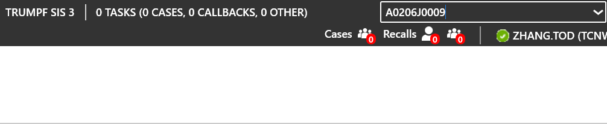
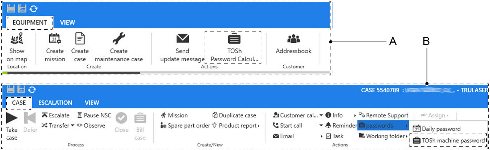
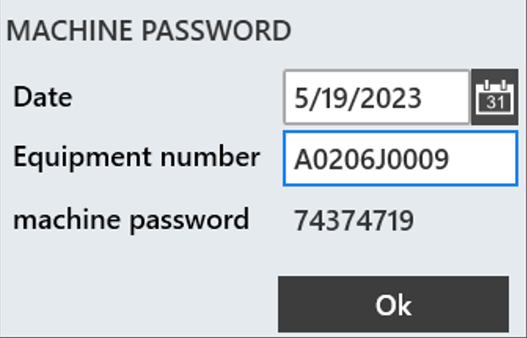
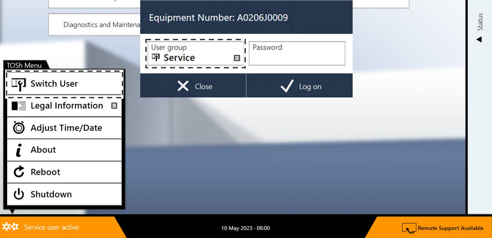
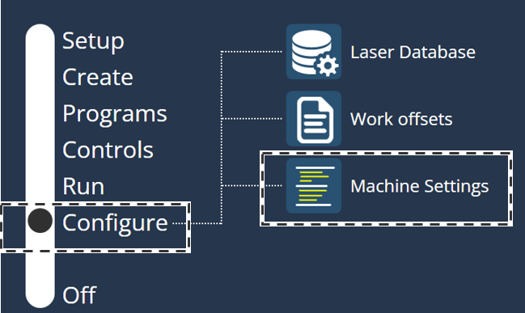
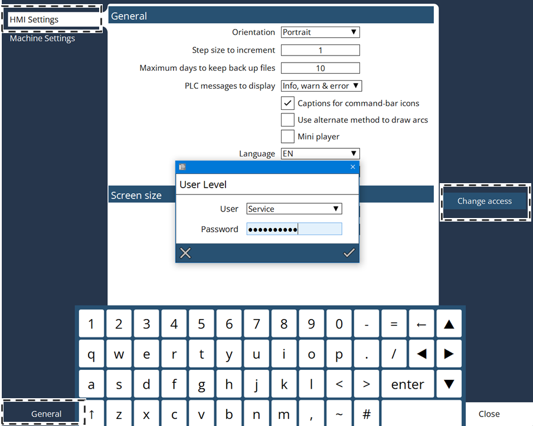

= General work

== Activating the Service user level in TOSh

* Access to SIS3 or SIS Field Client is available.
[arabic]
. Retrieving the machine password:
Using machine number or equipment number.
* Using the machine number, display the equipment in SIS3 or SIS Field Client.
* Select > Equipment > TOSh Password Calculator.
With an SIS case:
* Open the SIS case.
* Select > Case > Actions > Passwords > TOSh Password Calculator.
* Use uppercase letters in the entry of the equipment number.
.Enter the equipment number Fig. 5‑1
[width="100%",cols="100%",options="header",]
|

.Retrieving the password in SIS Fig. 5‑2
[width="100%",cols="50%,50%",options="header",]
| |

|A Retrieving the machine password using the equipment |B Retrieving the machine password using an SIS case
[arabic, start=2]
. The machine password is shown.
.Fig. 5‑3
[width="100%",cols="100%",options="header",]
|

[arabic, start=3]
. Open the system menu in TOSh.
. Select “Switch User”.
. Select user group “Service”.
.Fig. 5‑4
[width="100%",cols="100%",options="header",]
|

[arabic, start=6]
. Enter “Password” and confirm with “Log on”.
The Service user level in TOSh is active.

== Activating the Service user level in Vulcan system

* The HMI has been started.
[arabic]
. Select “Configure” > “Machine Settings” on HMI.
Activate the Service
user level
.Fig. 5‑5
[width="100%",cols="100%",options="header",]
|

[arabic, start=2]
. Select “General” > “HMI Settings”.
. Click the “Change access” icon.
.Fig. 5‑6
[width="100%",cols="100%",options="header",]
|

[arabic, start=4]
. Select user “Service”.
. Enter the fixed password 
* Pay attention to case sensitivity.
[arabic, start=6]
. Click the check mark.
The service user level is active.
