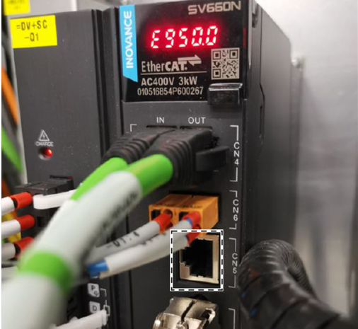
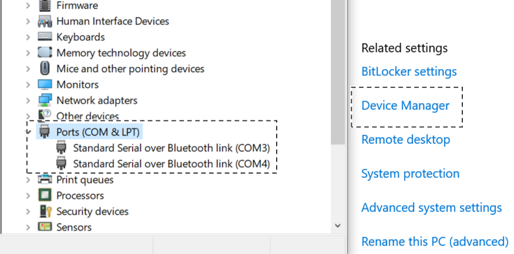
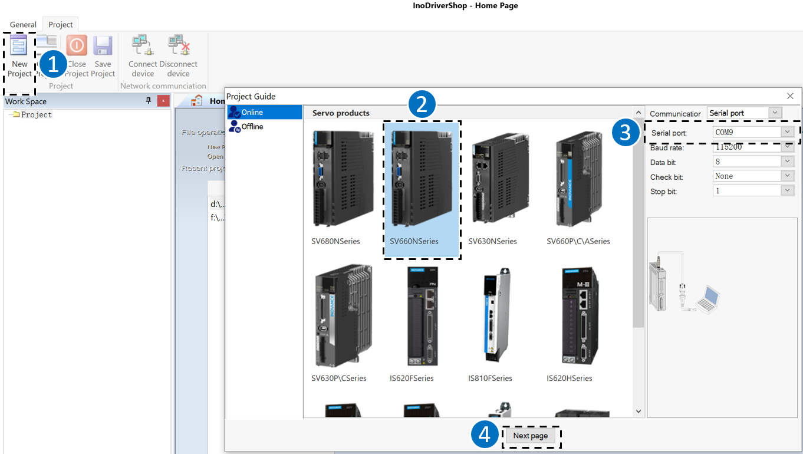
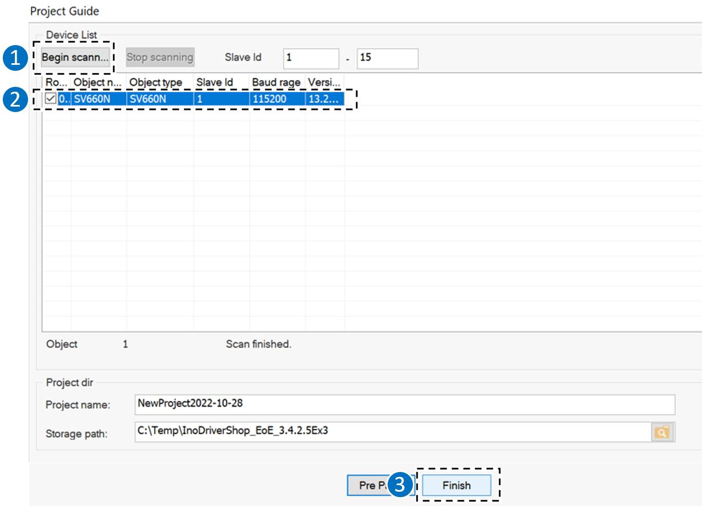
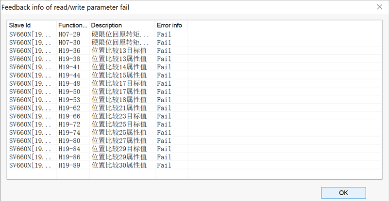
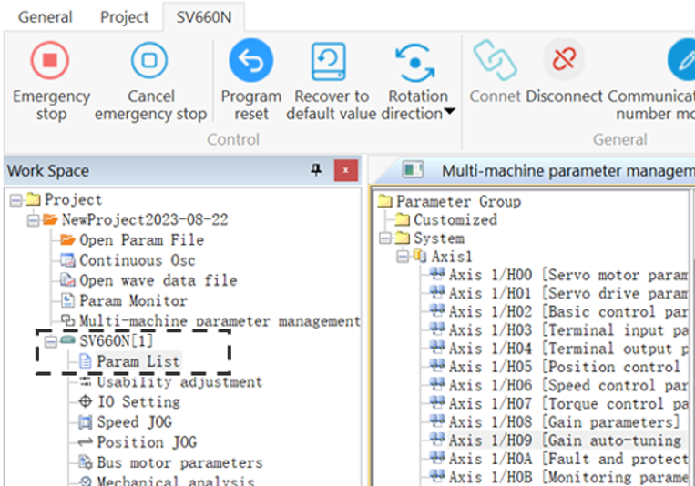
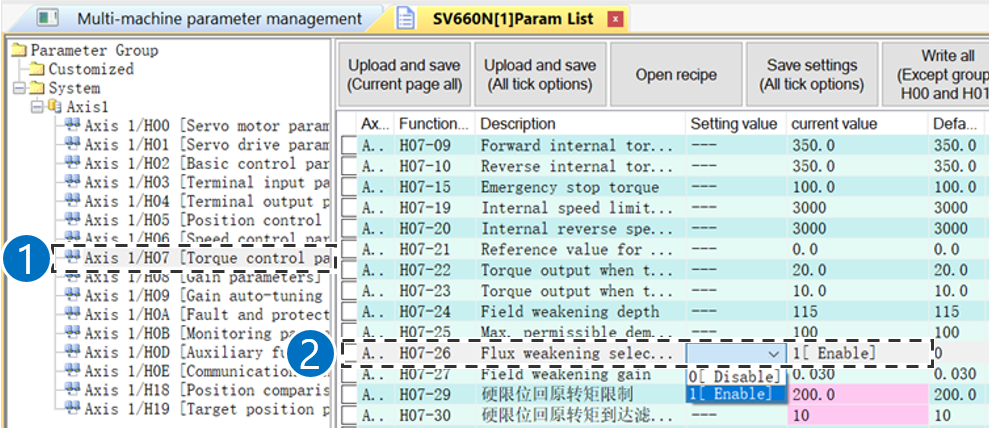

= Inovance Drive

== Basic information

Obtain the user manual
*Or* scan QR code on the product.
Terminals of servo drive
.Fig. 5‑53
[width="100%",cols="100%",options="header",]
|image:img/image663.png[img/image663,width=336,height=339]

.Tab. 5‑25
[width="100%",cols="7%,25%,68%",options="header",]
|*No.* |*Name* |*Description*
|1 |LED display |Used to display servo drive operation states and parameter settings.
|2 |Buttons a|
MODE: Used to switch the parameter in sequence.
: Used to increase the set value of the blinking digt.
: Used to decrease the set value of the blinking digt.
: Used to shift the blinking digit leftwards.
(hold on: Used to turn to the next page when the display value is comprised of more than five digits.)
SET: Used to save modifications and enter the next level of menu.
Charge
(bus voltage indicator)
Used to indicate that the bus capacitor carries electric charge.
When this indicator lights up, electric charge may be still present in the internal capacitor of the servo drive even if the main circuit power supply if cut off.
Do not touch the power terminals when this indicator lights up.
|4 |L1C, L2C |Control circuit power input terminals.
|5 |R, S, T |Main circuit power input terminals.
P, D, C
(terminals for connecting external brake resistor)
|Before Connecting the brake resistor between P and C as needed, remove the jumper between terminals P and D.
| |P, N (DC bus terminals) |Used as the common DC bus for multiple servo drives.
|7 |U, V, W |Terminals for connecting the servo motor.
|8 |PE |Connected to the motor grounding terminal.
|9 |Battery location |/
|10 a|
CN3, CN4
(EtherCAT terminal)
CN3 (IN): Connected to the master or the last slave.
CN4 (OUT): Connected to the next slave.
|11 |CN6 (STO terminal) |Connected to the external safety signal.
|12 |CN5 |Software tool communication terminal.
|13 |CN1 |I/O interface.
|14 |CN2 |Encoder interface.
|15 |PE |Connected to the power supply grounding terminal.
Parameter settings can be performed through the keypad. For details on parameters, please see the “SV660N Series Servo User Manual_EN”. The following figure shows how to change from position control mode after the power supply is switched on.
Parameter settings
.Procedure for parameter setting Fig. 5‑54
[width="100%",cols="100%",options="header",]
|image:img/image664.png[img/image664,width=403,height=217]

 Click to install the commissioning software “InoDriverShop”.

Commissioning software
“InoDriverShop” can be used to do the commissioning and operation for the servo drive (e.g., parameter setting).
It records only the single-turn position.
Descriptions for the
Incremental Encoder
System (X)
* No battery needed, no battery fault or multi-turn fault.
It records not only the single-turn position, but also the number of revolutions.
Descriptions for the
Absolute Encoder System
* Battery needed, indications of battery fault E730.0, multi-turncounting error and overflow fault available.
* When the servo drive is powered off, the encoder performs data backup using the power supplied by the battery. The servo drive therefore can calculate the absolute mechanical position through the encoder after power-on.

== Back up/Restore Inovance drive data

Means, Tools, Materials
* USB to RS232 converter cable, mat. no. 385230.
* RS232 to RJ45 converter cable, mat. no. 359401.
[arabic]
. Connect your laptop to the respective X1/X2/Y/Z axis drive with communication cable by the port “CN5”.
Connect InoDriveShop to
Inovance drive
.Fig. 5‑55
[width="100%",cols="100%",options="header",]
|

[arabic, start=2]
. Check the COM port of the communication cable in device manager on your laptop.
.Fig. 5‑56
[width="100%",cols="100%",options="header",]
|

[arabic, start=3]
. Run software “InoDriveShop” on your laptop.
. Select “New project”.
. Choose “SV660N Series” and select the corresponding COMport as checked in device manager.
. Click “Next page”.
.Fig. 5‑57
[width="100%",cols="100%",options="header",]
|

[arabic, start=7]
. Click “Begin Scan” and wait unit the connected drive module being found.
. Put a check mark on the target drive module and click “Finish”.
.Fig. 5‑58
[width="100%",cols="100%",options="header",]
|

[arabic, start=9]
. Double click on “Multi-machine parameter management”.
Back up Inovance drive
[arabic, start=10]
. Select “Export to recipe” and confirm query with “Yes”.
.Export to recipe Fig. 5‑59
[width="100%",cols="100%",options="header",]
|image:img/image625.png[img/image625,width=624,height=320]

[arabic, start=11]
. Wait unit the transmission is done.
. Acknowledge the error message by clicking “OK”.
.Fig. 5‑60
[width="100%",cols="100%",options="header",]
|

[arabic, start=13]
. Name the backup data and save it on your laptop.
. Go to “InoDriverShop” home page.
Restore Inovance drive
[arabic, start=15]
. Double click “Multi-machine parameter management”.
. Select “Import recipe file”.
.Fig. 5‑61
[width="100%",cols="100%",options="header",]
|image:img/image627.png[img/image627,width=382,height=153]

[arabic, start=17]
. Select the corresponding Inovance drive data.
.Fig. 5‑62
[width="100%",cols="100%",options="header",]
|image:img/image628.png[img/image628,width=382,height=215]

[arabic, start=18]
. Confirm with “Yes”.
. Acknowledge the pop-up window about restoring parameter by clicking “OK”.
* It’s normal that some system parameters or specific parameters fail to be written.
.Fig. 5‑63
[width="100%",cols="100%",options="header",]
|

[arabic, start=20]
. Import parameters successfully.
* In case that some parameters are unexpectedly lost, please double check the following parameters.
[arabic, start=21]
. In “Work Space”, select “SV660N” and double click on “Param List”.
.Fig. 5‑64
[width="100%",cols="100%",options="header",]
|

[arabic, start=22]
. Check “H08” > “H08-19” (Speed feedforward gain).
Check parameter H08-19
Setting value: 100.
.Fig. 5‑65
[width="100%",cols="100%",options="header",]
|image:img/image630.png[img/image630,width=382,height=212]

* If the value is 100, the following step 23 to 28 can be skipped.
[arabic, start=23]
. Find the parameter “H9-00”, change the setting value to1 (enabled).
.Fig. 5‑66
[width="100%",cols="100%",options="header",]
|image:img/image631.png[img/image631,width=624,height=270]

[arabic, start=24]
. Right click on the item just modified and choose “Download the selected items” to save the parameters.
.Fig. 5‑67
[width="100%",cols="100%",options="header",]
|image:img/image632.png[img/image632,width=382,height=155]

[arabic, start=25]
. Set “H08-19” (Speed feedforward gain) to 100.
. Right click on it to download the selected items.
. Set “H09-00” back to “0” (Disabled).
. Right click on it to download the selected items.
. Check “H08” > “H08-00” (Speed loop gain).
Check parameter H08-00
* X1/X2 drive: 140.
* Y/Z drive: 170.
[arabic, start=30]
. If not, set the “H08-00” and right click on it to download the selected items.
. Check “H07” > “H07-26” (Flux weakening selection).
Check parameter H07-26
Setting value: 1.
.Fig. 5‑68
[width="100%",cols="100%",options="header",]
|

[arabic, start=32]
. If not, change it to 1.
. Right click on the parameter to choose “Download the selected items”.
. Switch the main switch off and then switch the machine on again.

== Replacing Inovance drive

Means, Tools, Materials
* USB to RS232 converter cable, mat. no. 385230.
* RS232 to RJ45 converter cable, mat. no. 359401.
[arabic]
. Switch off the machine and secure it being switched on again.
. Disconnect all the cables for the target Inovance drive.
.Fig. 5‑69
[width="100%",cols="100%",options="header",]
|image:img/image666.png[img/image666,width=192,height=327]

[arabic, start=3]
. Remove the servo drive from the switch cabinet.
. Install the new servo drive by screws.
.Example Fig. 5‑70
[width="100%",cols="100%",options="header",]
|image:img/image667.png[img/image667,width=240,height=346]

.Tab. 5‑30
[width="100%",cols="100%",options="header",]
| *CAUTION*

* Do not run a damaged or defective device. Failure to comply may result in device faults or damage.
* Do not install the device in an environment exposed to water or corrosive objects. Failure to comply will result in device faults.
* Do not install the device near flammable gases or combustible materials. Failure to comply will result in a fire or electric shock.
* Install the device inside a fire-proof cabinet with electrical protections. Failure to comply will result in a fire.
* Ensure the specified clearances are reserved among the servo drive, the interior surface of the electric cabinet, and other machines. Failure to comply will result in a fire or device faults.
* Do not put heavy objects on the device. Failure to comply may result in physical injuries or device manage.
* Do not exert large impact force on the device. Failure to comply may result in device damage.
* Do not block the air inlet/outlet port of the servo drive or allow unwanted matters to fall into the device. Failure to comply may result in a fire or device faults.
[arabic, start=5]
. Connect cables to the new servo drive according to the label.
. Check cable connections, especially the grounding cable.
. Connect the new servo drive to the laptop.
. Restore the Inovance drive data (see “link:#back-uprestore-inovance-drive-data-1[Back up/Restore Inov-ance drive data]”, pg. xxx).

== Replacing the battery of Inovance drive

Condition
* The machine is switched on.
[width="100%",cols="35%,65%",options="header",]
|image:img/image2.png[img/image2,width=192,height=33] a|

*Switch without the finger protection cover.*
*Risk of electric shock!*
* Don’t touch the power supply cable connector.
[width="100%",cols="35%,65%",options="header",]
|image:img/image2.png[img/image2,width=192,height=33] a|

*Battery mistreated.*
*Risk of explosion!*
* Do not recharge, disassemble, or dispose of battery in fire.
[arabic]
. Open the safety door.
Replace the battery
[arabic, start=2]
. Remove the battery box at the bottom of the drive.
.Fig. 5‑71
[width="100%",cols="100%",options="header",]
|image:img/image669.png[img/image669,width=382,height=269]

[arabic, start=3]
. Replace the battery (3.6 V/2600 mAh).
* It is recommended to replace the battery every two years.The battery may have leakage liquids after a long-time use.
* Dispose of the retired battery according to the local regulations.
.Fig. 5‑72
[width="100%",cols="100%",options="header",]
|image:img/image670.png[img/image670,width=382,height=261]

[arabic, start=4]
. Install the battery box back to the drive.
. The warning E730.0 will be cleared automatically.
. {blank}

== Reset error message E731.0 of Inovance drive

Once the encoder cable is connected and the machine is switch- ed on, error E731.0 would be reported and we need to reset the error message.
Means, Tools, Materials
* USB to RS232 converter cable, mat. no. 385230.
* RS232 to RJ45 converter cable, mat. no. 359401.
[arabic]
. Connect your laptop to the respective Y/Z axis drive with communication cable by the port “CN5”.
Connect InoDriveShop to
Y/Z axis drive
.Fig. 5‑73
[width="100%",cols="100%",options="header",]
|

[arabic, start=2]
. Check the COM port of the communication cable in device manager on your laptop.
.Fig. 5‑74
[width="100%",cols="100%",options="header",]
|

[arabic, start=3]
. Run software “InoDriveShop” on your laptop.
. Select “New project”.
. Choose “SV660N Series” and select the corresponding COMport as checked in device manager.
. Click “Next page”.
.Fig. 5‑75
[width="100%",cols="100%",options="header",]
|

[arabic, start=7]
. Click “Begin Scan” and wait unit the connected drive module being found.
. Put a check mark on the target drive module and click “Finish”.
.Fig. 5‑76
[width="100%",cols="100%",options="header",]
|

[arabic, start=9]
. In Work Space column, select “SV660N” and double click on “Param List”.
Reset Y&Z axis encoder
faults
[arabic, start=10]
. Select “H0D [Auxiliary function parameters]”.
. Find “H0D-20 [Absolute encoder reset selection]”, set the value to 1 [Reset encoder faults].
.Fig. 5‑77
[width="100%",cols="100%",options="header",]
|image:img/image671.png[img/image671,width=624,height=233]

[arabic, start=12]
. Right click on the item just modified and choose “Download the selected items”.
.Fig. 5‑78
[width="100%",cols="100%",options="header",]
|image:img/image672.png[img/image672,width=624,height=220]

[arabic, start=13]
. Switch the main switch off and then switch the machine back on again.
