= Commissioning (L99)

== Checking the beam tightness

* During installation of the machine.
* After completion of service activities during which components have been removed or replaced.
Condition
* All covers are mounted.
* The machine’s main switch is switched off and secured against being switched on again.
Means, Tools, Materials
* Cover foil.
* Acceptance document of the machine (93630-7-140).
[arabic]
. Open the current edition of the acceptance document via the CADLibrary.
. Check the beam tightness according to the specifications in the acceptance document.

== Putting the chiller into operation

Conditions
* DI water is filled (conductivity < 10 µS/cm).
* Pump is bled using the bleed screw.
* All lines and cables must have been connected.
* Currently the water additive is not provided.
* If necessary, the customer can order the additive Easy Kit Al themselves.
[arabic]
. Remove required protective plates.
. Check the direction of rotation of the chiller:
* Determine the direction of rotation on the pump motor using the arrow.
[arabic, start=3]
. Run a 10-minute cleaning cycle.
Without water additive
[arabic, start=4]
. Drain the tank.
. Fill the new DI water.
* Bleed the pump after filling the new DI water.
[arabic, start=6]
. Mount the tank cap and all protective plates.
. Check the set nominal temperatures on the display of the chiller.
Cooling circuit for Laser (low temperature): 25 latexmath:[℃].
Cooling circuit for machine (high temperature): 29 latexmath:[℃].
* When switching on the chiller, the parameter “L xx.x” blinks after 2s. It means the low temperature value can be modified by pressing “up” and “down” button.
[arabic, start=8]
. Add bottle with Stabrex (red) to the water and run a two-hour cleaning cycle.
With water additive
.Easy Kit Al Fig. 2‑177
[width="100%",cols="100%",options="header",]
|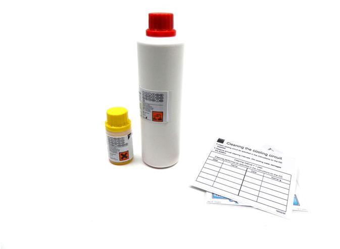

[arabic, start=9]
. Drain the tank and refill.
. Keep draining the tank and filling new water until the conductivity is < 10 µS/cm.
* Always bleed the pump after filling the tank.
* Once new water has been filled: allow each pump to run for approx. 5 min.
[arabic, start=11]
. Add bottle with cooling water additives (yellow).
. Mount the tank cap and all protective plates.
. Check the set nominal temperatures on the display of the chiller.
Cooling circuit for Laser (low temperature): 25 latexmath:[℃].
Cooling circuit for machine (high temperature): 29 latexmath:[℃].
* When switching on the chiller, the parameter “L xx.x” blinks after 2s. It means the low temperature value can be modified by pressing “up” and “down” button.

== Putting dust extractor into operation

Condition
* All lines and cables must have been connected.
[arabic]
. Check the dust extractor and suction tubes for damage.
. Check the direction of rotation of the dust extractor.
. Check the oil-water separator. Nominal value: 5 + 0.5 bar.
.Fig. 2‑178
[width="100%",cols="100%",options="header",]
|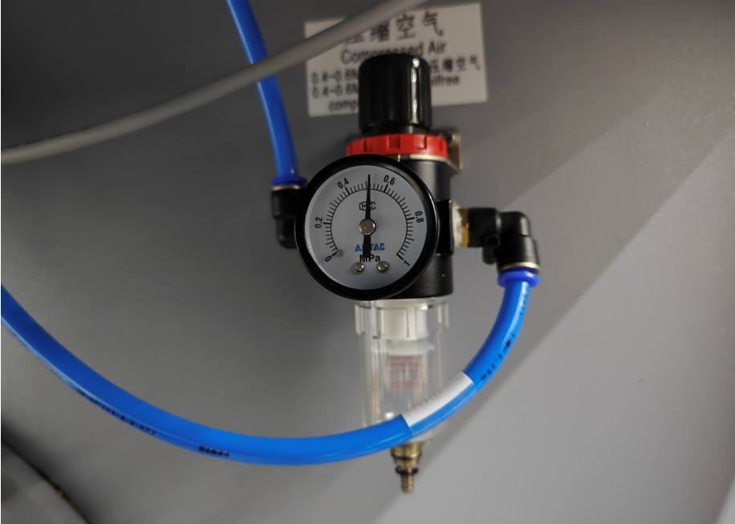

[arabic, start=4]
. Select “Controls” in HMI, then click “Exhaust ON” button to switch on the dust extractor.
.Fig. 2‑179
[width="100%",cols="100%",options="header",]
|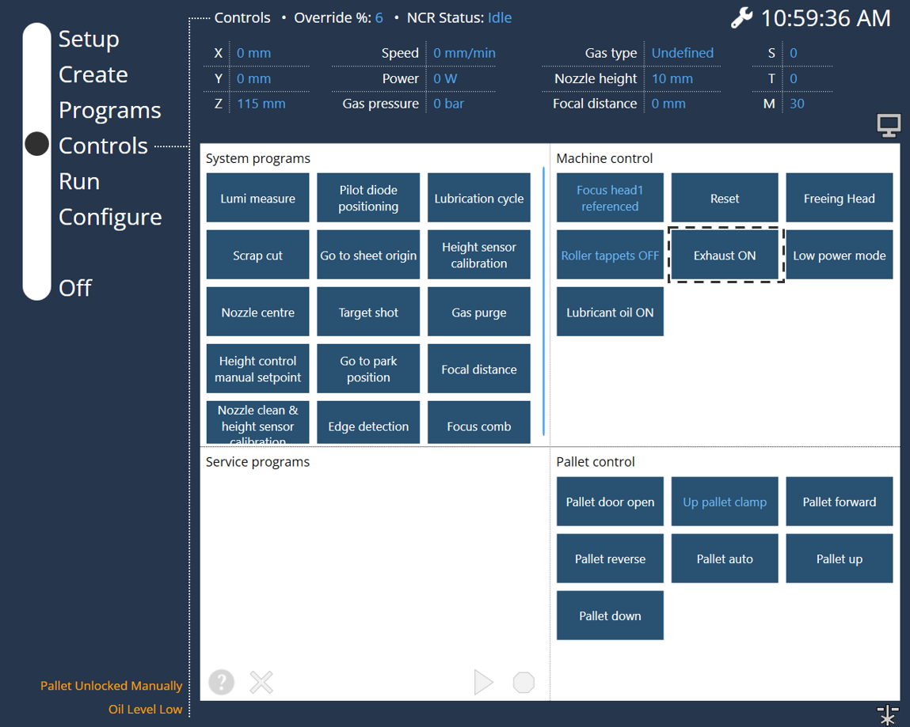

[arabic, start=5]
. Check the differential pressure gauge.
Nominal value: 0.3~1.5 kPa.
.Fig. 2‑180
[width="100%",cols="100%",options="header",]
|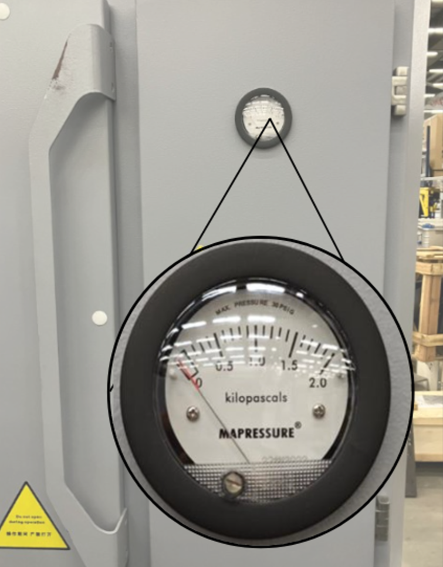

[arabic, start=6]
. Check all solenoid valves operate normally and that the filters are cleaned.
.Solenoid valves inside the dust extractor Fig. 2‑181
[width="100%",cols="100%",options="header",]
|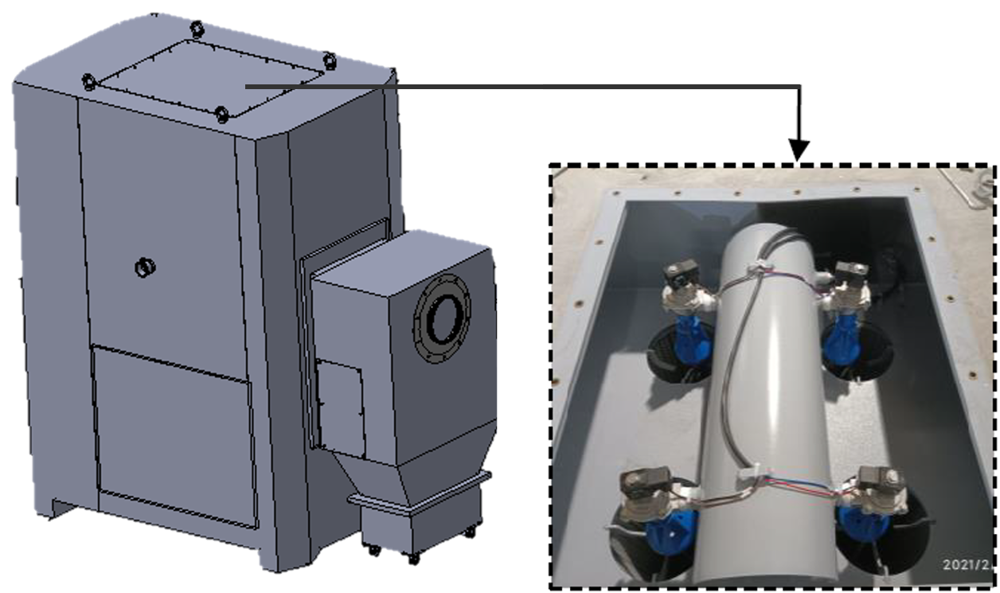

[arabic, start=7]
. Check the tightness of the dust container as well as the suction tubes.

== Putting TruFiber into operation

* The switch of chiller is off.
[arabic]
. Perform the following operation in accordance with the TruFiber service manual.
* Unpacking.
* Check the displays of the shock and tiltwatch indicator.
* Transporting.
* Install.
[arabic, start=2]
. Turn main switch to the “ON” position.
. Turn key switch to the “ON” position.
. Check if there is any alarm or warning on laser control interface.
* Usually in areas with high humidity, there is the alarm with environment. It needs the laser to keep running for a few minutes until the dew point is below cooling water temperature so that the alarm can be reset successfully.
.Fig. 2‑182
[width="100%",cols="100%",options="header",]
|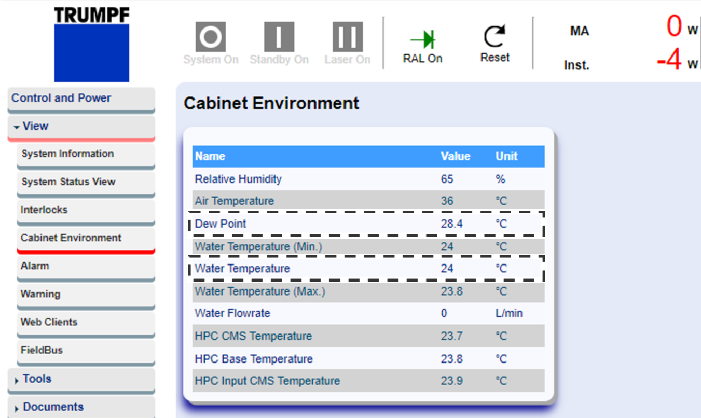

[arabic, start=5]
. Switch on the chiller.
. Check the cooling components for leakage.
. Check the LLK alignment to KL59 (see “link:#checking-and-setting-alignment-of-the-laser-light-cable-to-kl59-llk-adjustment[Checking and settingalignment of the laser light cable to KL59 (LLK adjustment)]”, pg. xxx).
. Create spot image (see “link:#creating-a-spot-image[Creating a spot image]”, pg. xxx).
. Carry out tapeshot and adjust the nozzle centering (see “ link:#centering-the-beam-to-the-nozzle-tapeshot[Centering the beam to the nozzle (Tapeshot)]”, pg. xxx).
. Determining the focal position (see “link:#determining-the-focal-position[Determining the focal position]”, pg. xxx).

== Putting the hydraulic pallet changer into service

Condition
* The pallet changer is installed (see “link:#installing-the-hydraulic-pallet-changer[Installing the hydraulic pallet changer (S02)]”, pg. xxx).
* The safety light barrier is installed (see “link:#installing-the-two-level-pallet-changer[Installing the light barrier]”, pg. xxx).
* The machine is switched on.
*Means, Tools, Materials*
* Column spirit level
[width="100%",cols="35%,65%",options="header",]
| a|

*Insufficient safety level (light barrier signal not outputting to the safety relay)*
*Risk of injury*
* Switch off inverter motor, hydraulic unit motor and compress-ed air supply when working on pallet.
[arabic]
. Select “Configure” > “Machine Settings”.
Setting the pallet changer
[arabic, start=2]
. Activate the service user level.
. Double check the pallet changer configuration:
* Find “PLC Options” > “Function Parameters” > “Pallet Changer Configuration”.
* Check that parameters are same as the following figure.
* Press “Close” to save and reload.
.Fig. 2‑183
[width="100%",cols="100%",options="header",]
|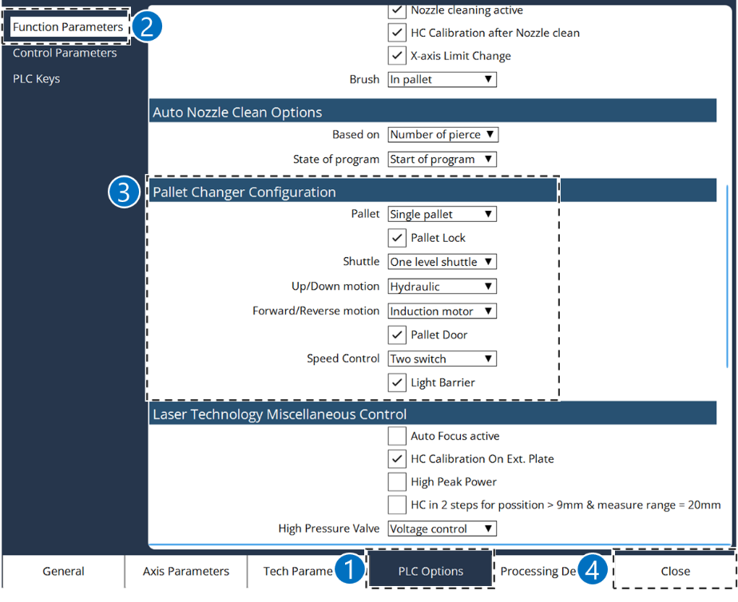

[arabic, start=4]
. Check the hydraulic oil level at the level indicator.
. Raise and lower the pallet changer several times to remove air from the hydraulic system.
. Lift the pallet changer (upper position).
. Check the oil hoses for leakage.
. Check the vertical position of the guide column at the front left with upward stroke using the column spirit level.
Maximum deviation in Y direction ± 0.2 mm/m.
.Column spirit level position Fig. 2‑184
[width="100%",cols="100%",options="header",]
|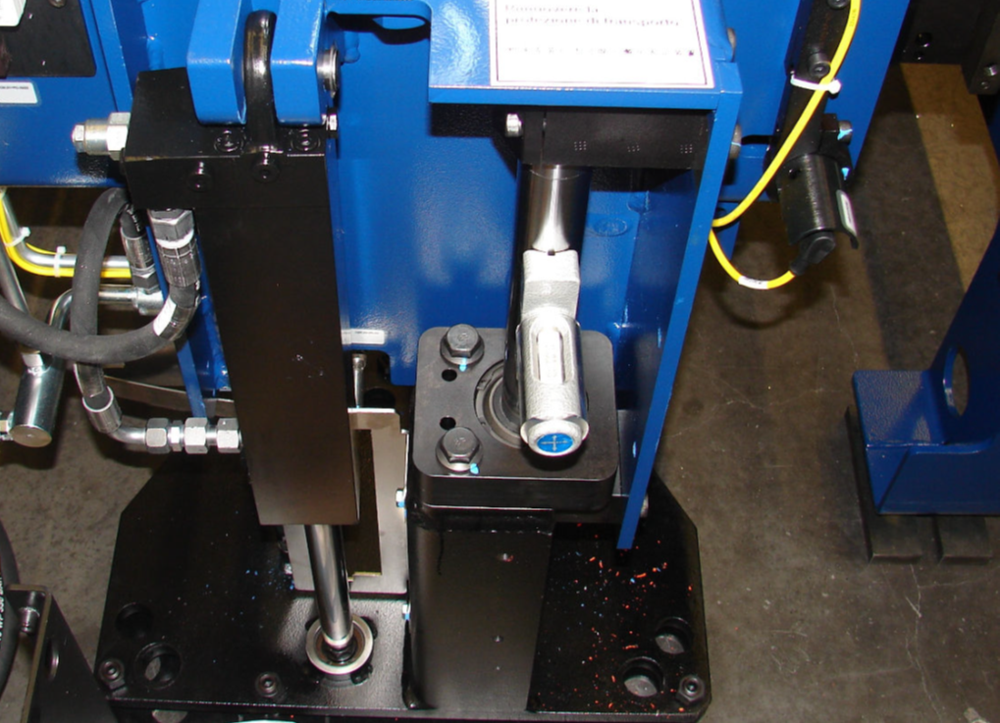

[arabic, start=9]
. If necessary, use the support screws to readjust the position.
. At the two right legs, check the distance between the Teflon block and the column.
Clearance: >1 mm.
* The Teflon blocks are only visible in their upper end position.
.Teflon block (1x on each right legs) Fig. 2‑185
[width="100%",cols="100%",options="header",]
|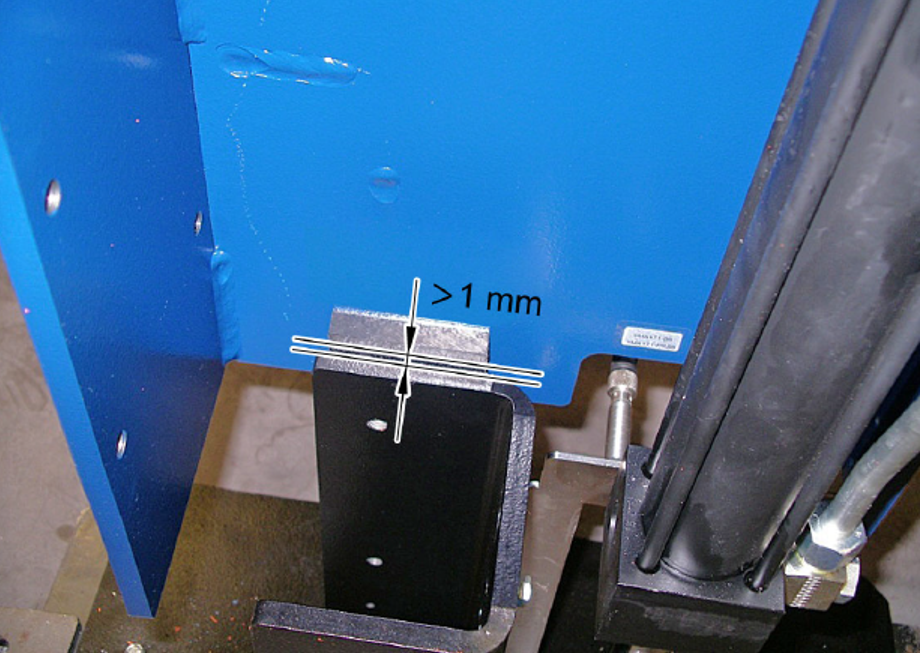

[arabic, start=11]
. If necessary, undo the fixing screws on the leg post, move the leg and then fix again.
. Check the transition from the pallet changer to the machine with pallet B in the vertical and horizontal directions.
.Example Fig. 2‑186
[width="100%",cols="100%",options="header",]
|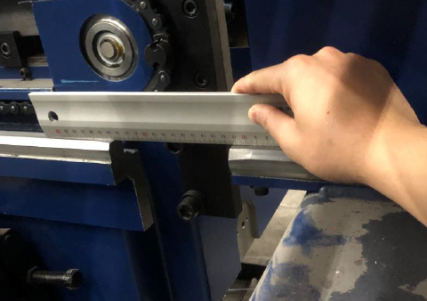

[arabic, start=13]
. Use adjusting screw on the piston to make corrections, if required.
.Fig. 2‑187
[width="100%",cols="100%",options="header",]
|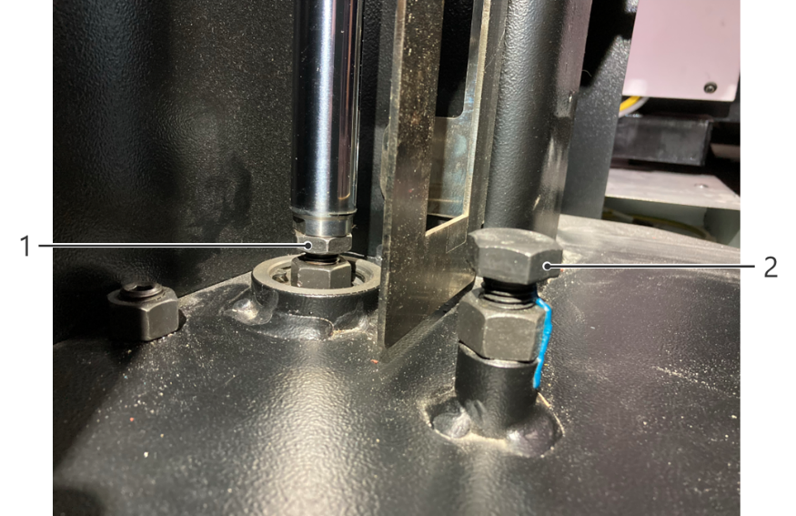

|1 Adjusting screw on piston rod for upward stroke (B pallet)
|2 Stop screw for downward stroke (A pallet)
* If the adjusting screw has been loosened, the lock nut must be glued in place with Loctite 243.
[arabic, start=14]
. Lower the pallet changer and check the transition from the pallet changer to the machine with pallet A in vertical and horizontal directions.
Use Stop screw (see the above figure) to correct the transition, if required.
Check and adjust
proximity switch
* Since the pallet changer is not generally made at the assem-bly plant with machine, the proximity switch for pallet stop/ deceleration must be checked during the second start-up and adjusted if necessary.
[width="100%",cols="35%,65%",options="header",]
| a|

*Risk of squeezing and crushing!*
*Hand injuries.*
* Pay attention to the safety precautions and procedures.
[arabic, start=15]
. In the user interface, select “Controls” > “Go to park position”and press START button.
.Fig. 2‑188
[width="100%",cols="100%",options="header",]
|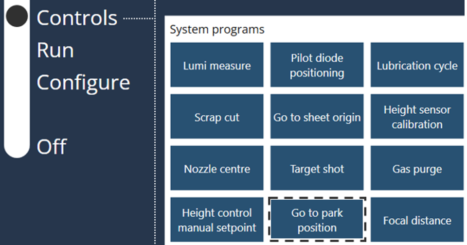

[arabic, start=16]
. Press “Pallet forward” and hold on to move the pallet A into the machine.
* “Pallet auto” is *not allowed* to use until the setup work of proximity switches is finished.
.Fig. 2‑189
[width="100%",cols="100%",options="header",]
|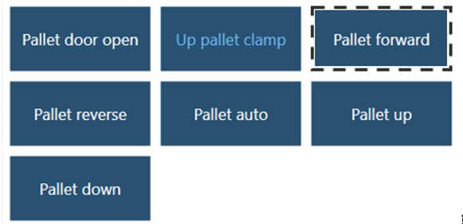

[arabic, start=17]
. Check that the roller guide stops at the 3 o’clock position.
* Check if the ruler against the roller is parallel to the guide block.
.Fig. 2‑190
[width="100%",cols="100%",options="header",]
|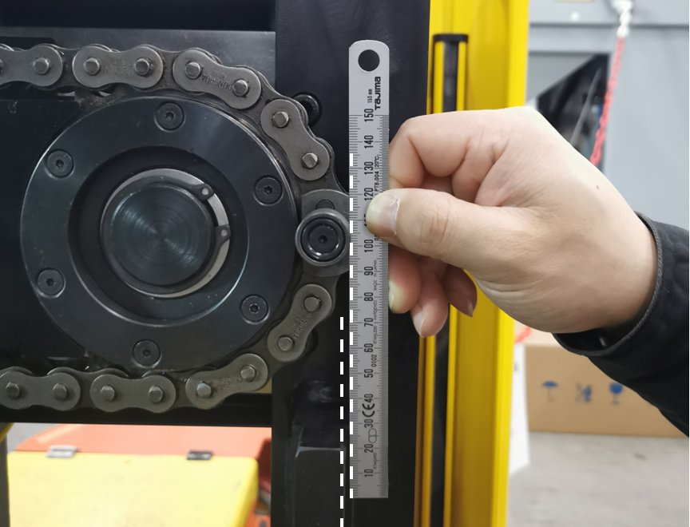

[arabic, start=18]
. If not:
* Adjust the forward stop switch in X direction.
* Check again if the roller guide stops at 3 o’clock position while pallet A moves into the machine.
.Fig. 2‑191
[width="100%",cols="59%,41%",options="header",]
|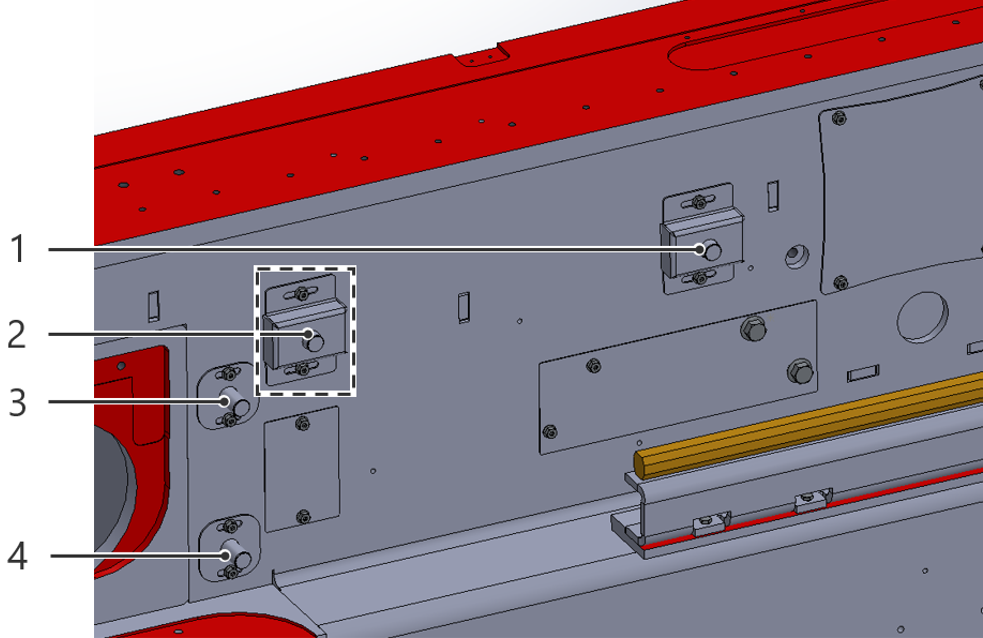 |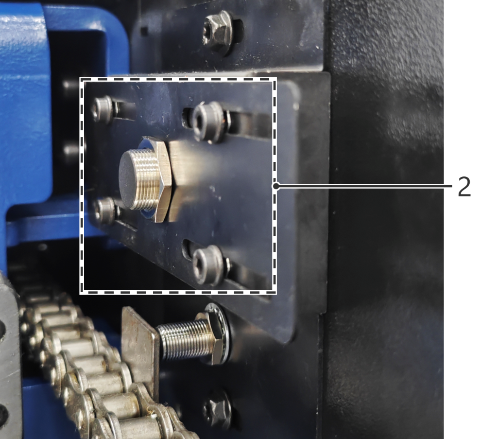

|1 Forward deceleration switch |2 Forward stop switch
|3 Reverse stop switch |4 Reverse deceleration switch
[arabic, start=19]
. Press “Pallet reverse” and hold on to move pallet A out of the machine.
. Check the drive dog stops at such a position that the guide iswithin the range of the groove of drive dog with the help of a right angle or ruler.
.Fig. 2‑192
[width="100%",cols="50%,50%",options="header",]
|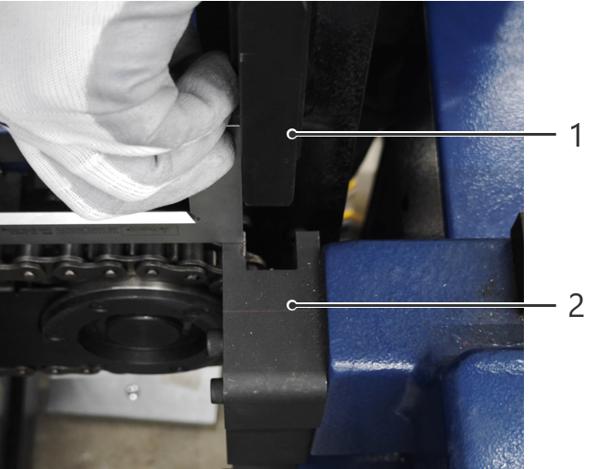 |

|1 Guide |2 Drive dog
[arabic, start=21]
. If not:
* Adjust the reverse stop switch in X direction, meanwhile ensure that the position of forward stop switch doesn’t change.
* Check the drive dog stop position again while pallet A moves onto the pallet changer.
.Fig. 2‑193
[width="100%",cols="100%",options="header",]
|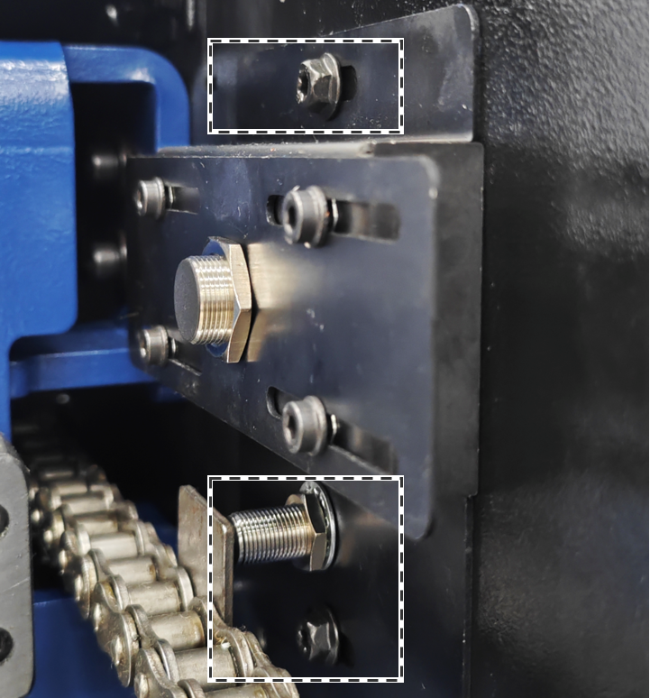

[arabic, start=22]
. Using the “Mode” button to make the display of frequency show “H 0.00” (actual output frequency).
.Fig. 2‑194
[width="100%",cols="100%",options="header",]
|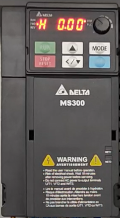

[arabic, start=23]
. Check the X position of two deceleration switches by:
* Exchange the pallet.
* See if the output frequency can be slowed down to 4.00 Hz before the pallet reaches the stop switch.
.Fig. 2‑195
[width="100%",cols="100%",options="header",]
|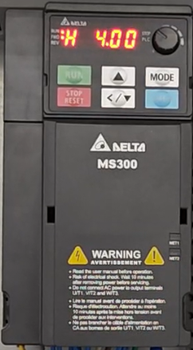

[arabic, start=24]
. If not, adjust the corresponding deceleration switch towards X+ direction.
* If the two deceleration switches’ position changed, the two stop switches position must be rechecked.
.Fig. 2‑196
[width="100%",cols="100%",options="header",]
|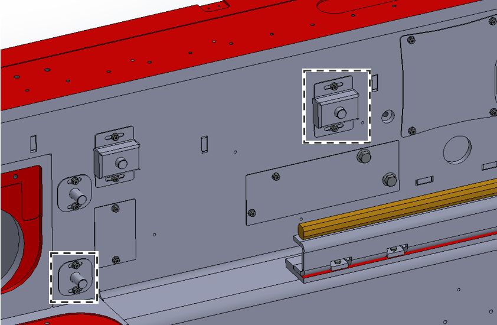

[arabic, start=25]
. Insert slats, if necessary, and make sure that they are correctly allocated.
Perform a final pallet
changer test
[arabic, start=26]
. Position the shim plate on the two right pallet changer legs.
.Fig. 2‑197
[width="100%",cols="100%",options="header",]
|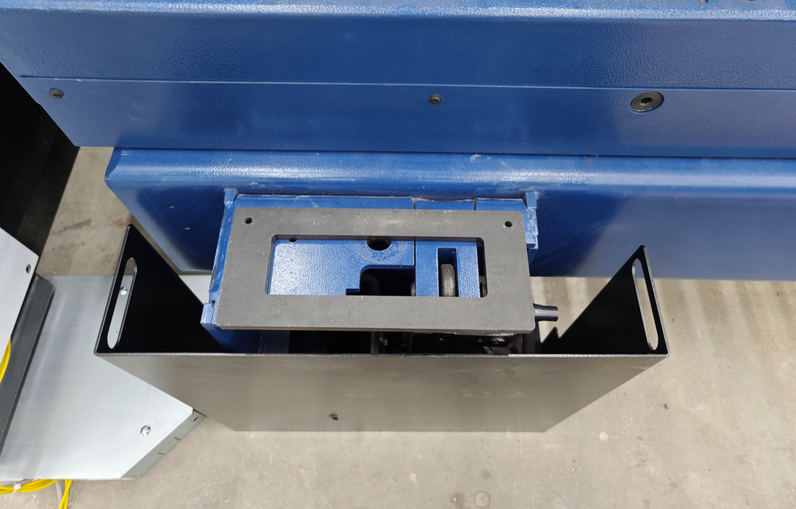

[arabic, start=27]
. Mount the pallet changer enclosure.
.Fig. 2‑198
[width="100%",cols="100%",options="header",]
|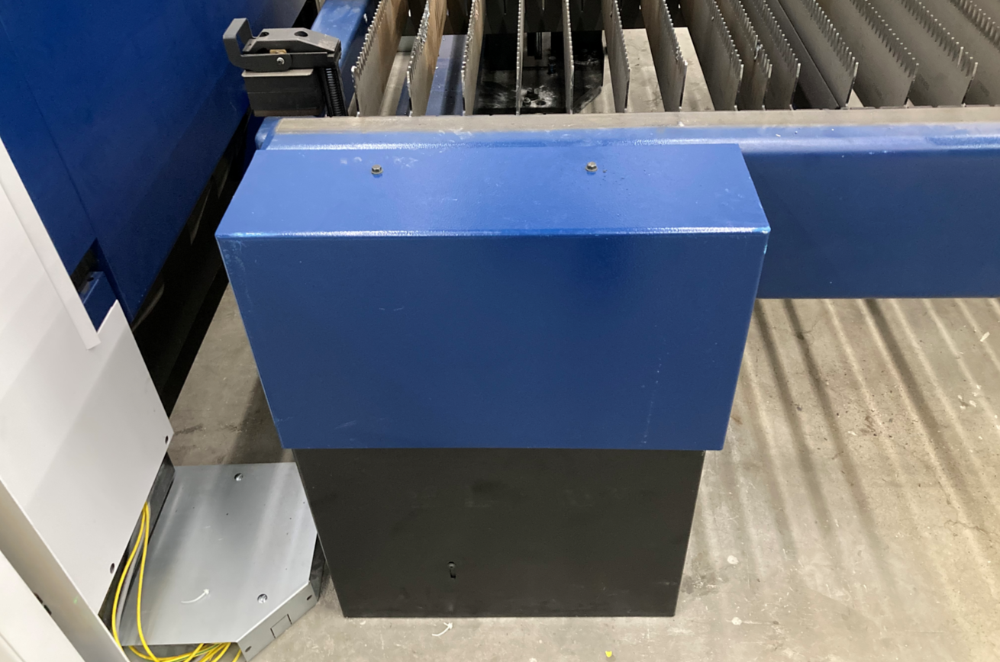

[arabic, start=28]
. Use the “Pallet auto” button to exchange the pallet.
The pallet changer must function at a low noise level.
[arabic, start=29]
. Perform pallet changer function check. (see “link:#performing-pallet-changer-function-test[Performing pallet changer function test]”, pg. xxx)
. Check the pallet clamp. (see “link:#_Checking_the_pallet[Checking the pallet clamp]”, pg. xxx)

== Putting the two-level pallet changer into service

* The pallet changer is installed (see “link:#installing-the-two-level-pallet-changer[Installing the two-level pallet changer]”, pg. xxx).
* The safety light barrier is installed (see “link:#installing-the-light-barrier[Installing the light b-arrier]”, pg. xxx).
* The machine is switched on.
[width="100%",cols="35%,65%",options="header",]
| a|

*Insufficient safety level (light barrier signal not outputting to the safety relay)*
*Risk of injury*
* Switch off inverter motor, hydraulic unit motor and compress-ed air supply when working on pallet.
[arabic]
. Select “Configure” > “Machine Settings”.
Double check two-level
pallet changer
configuration
[arabic, start=2]
. Activate the service user level.
. Check the pallet changer configuration:
* Select “PLC Options” > “Function Parameters” and find “Pallet Changer Configuration”.
* The parameters must be same as the following figure.
.Fig. 2‑199
[width="100%",cols="100%",options="header",]
|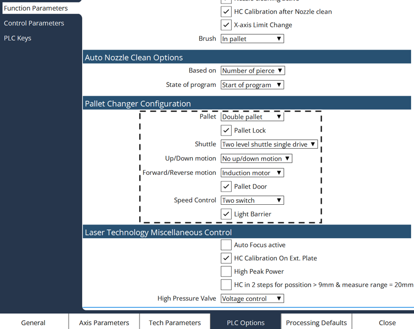

Check and adjust the
proximity switch
* Since the pallet changer is not generally made at the assem-bly plant with machine, the proximity switch for pallet stop/ deceleration must be checked during the second start-up and adjusted if necessary.
[width="100%",cols="35%,65%",options="header",]
| a|

*Risk of squeezing and crushing!*
*Hand injuries.*
* Pay attention to the safety precautions and procedures.
[arabic, start=4]
. In the user interface, select “Controls” > “Go to park position”and press START button.
.Fig. 2‑200
[width="100%",cols="100%",options="header",]
|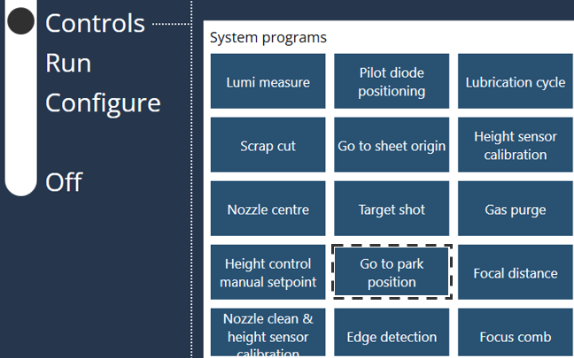

[arabic, start=5]
. Exchange the pallet to make pallet A inside the machine.
. Make sure pallet A doesn’t collide with the stop and it has a distance of 2±1 mm away from the stop.
.Fig. 2‑201
[width="100%",cols="100%",options="header",]
|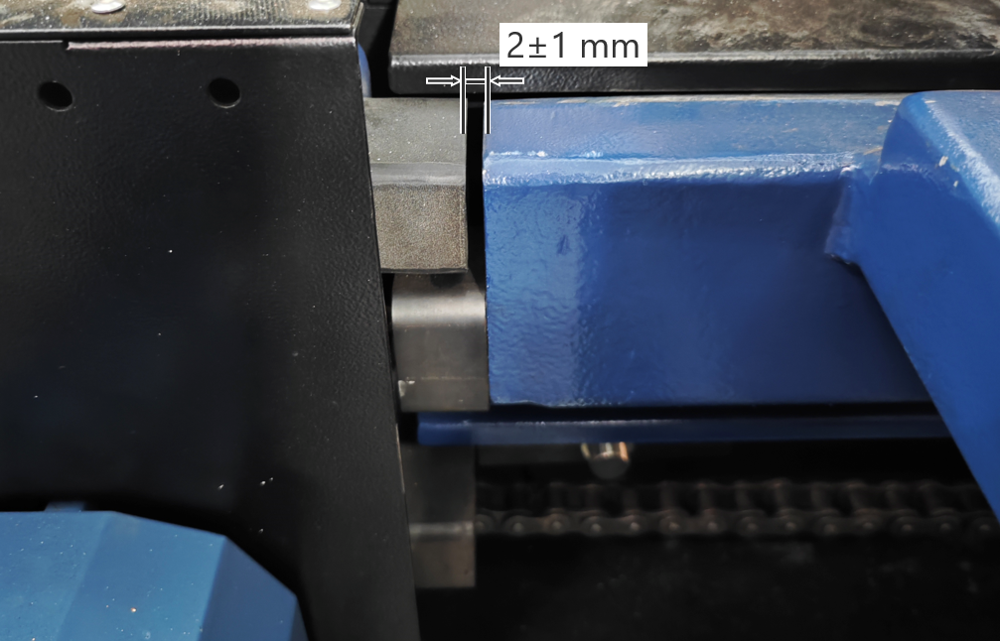

[arabic, start=7]
. If not, adjust the pallet A stop switch in X direction.
.Fig. 2‑202
[width="100%",cols="52%,48%",options="header",]
|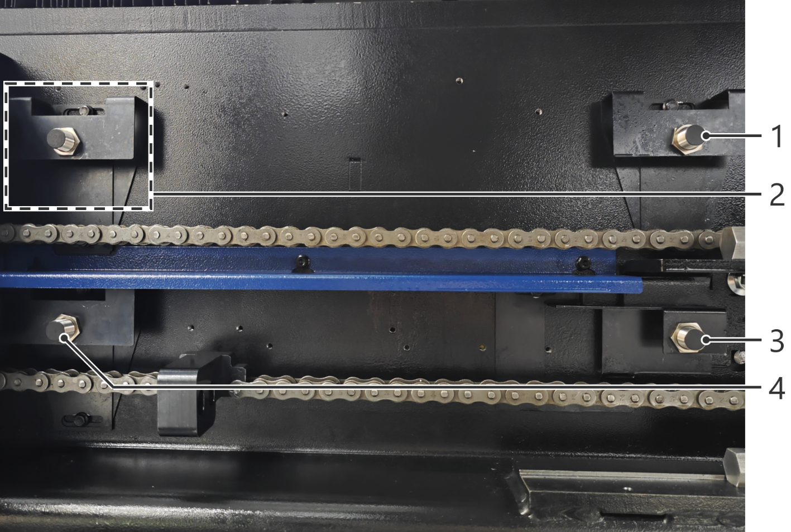 |

|1 Deceleration switch, pallet A |2 Stop switch, pallet A
|3 Deceleration switch, pallet B |4 Stop switch, pallet B
[arabic, start=8]
. Recheck the clearance for pallet A after pallet exchange.
. Exchange the pallet to make pallet B inside the machine.
. Make sure pallet B doesn’t collide with the stop and it has a distance of 2±1 mm away from the stop.
.Fig. 2‑203
[width="100%",cols="100%",options="header",]
|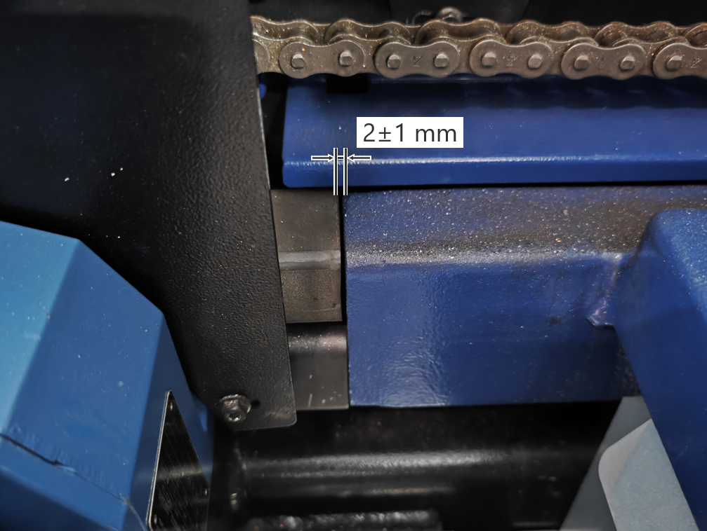

[arabic, start=11]
. If not, adjust pallet B stop switch in X direction.
.Fig. 2‑204
[width="100%",cols="100%",options="header",]
|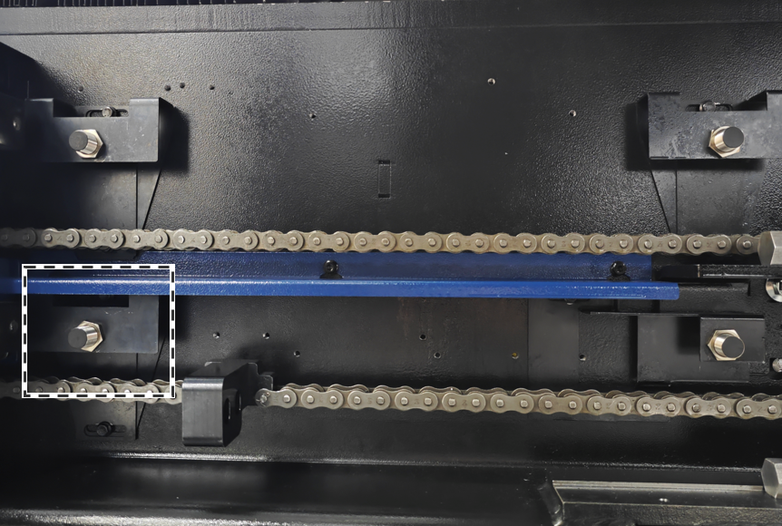

[arabic, start=12]
. Recheck the clearance for pallet B after pallet exchange.
. Using the “Mode” button to make the display of frequency show “H 0.00” (actual output frequency).
.Fig. 2‑205
[width="100%",cols="100%",options="header",]
|

[arabic, start=14]
. Check the X position of two deceleration switches by:
* Exchange the pallet.
* See if the output frequency can be slowed down to 4.00 Hz before the pallet reaches the stop switch.
[arabic, start=15]
. If not, adjust the corresponding deceleration switch towards X+ direction.
* If the two deceleration switches’ position changed, the two stop switches position must be rechecked.
.Fig. 2‑206
[width="100%",cols="100%",options="header",]
|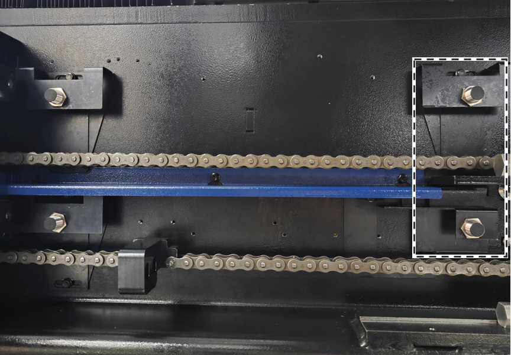

[arabic, start=16]
. Insert slats, if necessary, and make sure that they are correctly allocated.
Perform a final pallet
changer test
[arabic, start=17]
. Mount the pallet changer enclosure.
. Use the “Pallet auto” button to exchange the pallet.
The pallet changer must function at a low noise level.
[arabic, start=19]
. Perform pallet changer function check. (see “link:#performing-pallet-changer-function-test[Performing pallet changer function test]”, pg. xxx)
. Check the pallet clamp. (see “link:#_Checking_the_pallet[Checking the pallet clamp]”, pg. xxx)

== Checking the pallet clamp

[arabic]
. Move pallet A inside the machine.
. Press “Up pallet clamp” on HMI several times to check the status of the indexing unit:
* The message “Pallet Unlocked Manually” reported at the front-left corner of the screen.
.Fig. 2‑207
[width="100%",cols="100%",options="header",]
|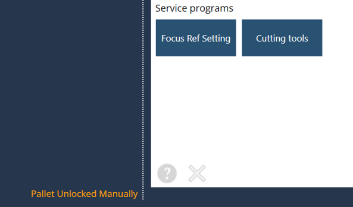

[arabic, start=3]
. If not, the proximity switch at the cylinder must be checked and adjusted if necessary (see “link:#replacing-indexing-cylinder[Replacing indexing cylinder]”, pg. xxx).
. Move pallet B into the machine.
Additional work for
two-level pallet changer
[arabic, start=5]
. Press “Down pallet clamp” several times to check the status of the indexing unit:
* The message “Pallet Unlocked Manually” reported at the front-left corner of the screen.
[arabic, start=6]
. If not, the proximity switch at the cylinder must be checked and adjusted if necessary (see “link:#replacing-indexing-cylinder[Replacing indexing cylinder]”, pg. xxx).

== Changing park position

* the CU must go to park position before moving the pallet andthe default park position (X=0,Y=0) may be inconvenient for service work (e.g., working on chain, proximity switch).
Condition
* Service user level is activated.
[arabic]
. In the user interface, select “Configure” > “Machine Settings”.
. Select “Tech Parameters” > “Laser Technology”.
. Find “X/Y axis park position” and type new value in the field.
* X position must be between 0 and 3000.
* Y position is recommended to remain 0 to reduce the possibility of collision.
[arabic, start=4]
. Click “Close” and choose “Save and reload parameters”.
.Fig. 2‑208
[width="100%",cols="100%",options="header",]
|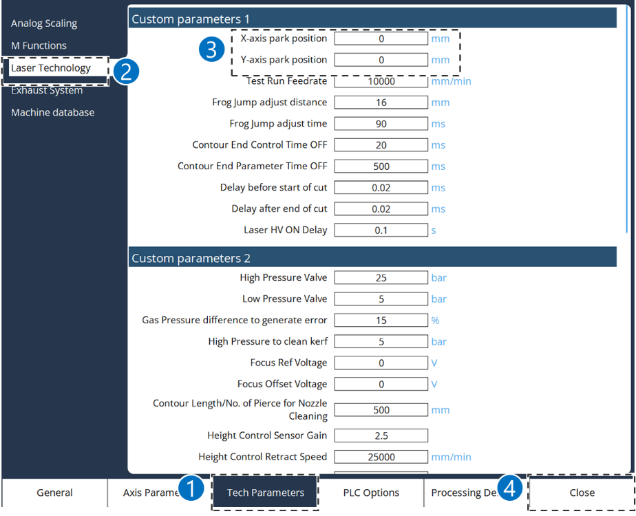

== Nozzle clean and height sensor calibration

* Service user level is activated.
[arabic]
. In HMI, select “Controls” > “Nozzle clean & height sensor calibration” and press the START button.
Run nozzle clean and
height sensor calibration
.Fig. 2‑209
[width="100%",cols="100%",options="header",]
|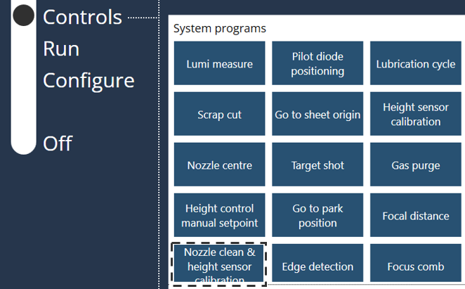

[arabic, start=2]
. If the position for “nozzle clean and height sensor calibration” is wrong, adjust the height sensor calibration offset value.
* Select “PLC options” > “Control Parameters”.
* Find “Nozzle cleaning & height sensor calibration offsets”catalog and modify the values.
* Close and save.
.Fig. 2‑210
[width="100%",cols="100%",options="header",]
|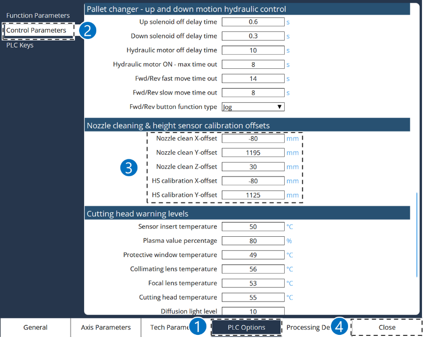

Check the machine setting
* If running “nozzle clean and height sensor calibration” *failed*,please check the machine settings as follow.
[arabic, start=3]
. In the user interface, select “Configure” > “Machine Settings”.
. Select “PLC options” > “Function Parameters”.
. Find “Nozzle Cleaning Options” catalog and check the setting as the following figure.
.Fig. 2‑211
[width="100%",cols="100%",options="header",]
|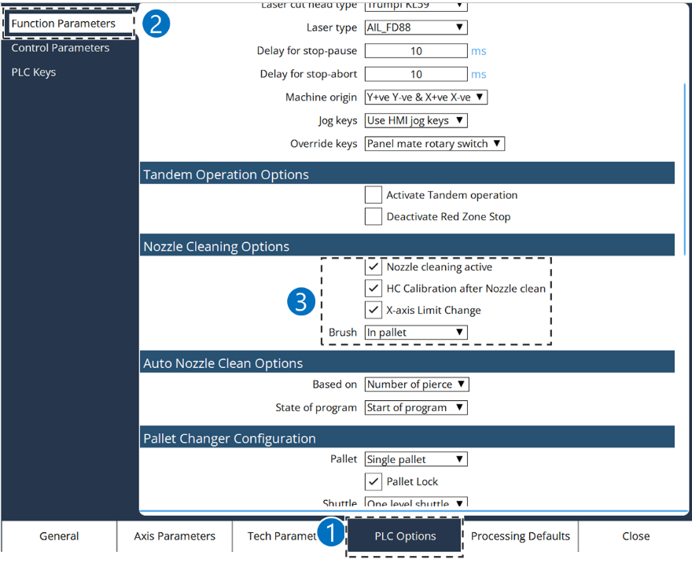

[arabic, start=6]
. Scroll down and find “HC Calibration On Ext. Plate”. Put a check mark on it.
. Click “Close” and choose “Save and reload parameters”.
.Fig. 2‑212
[width="100%",cols="100%",options="header",]
|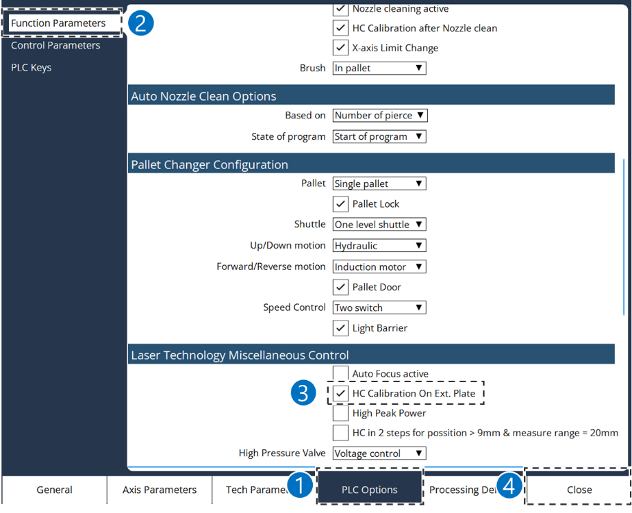

== Safety inspection

* Inspection instructions for safety equipment acceptance drawing no. 93630-7-120.
* The safety equipment acceptance includes both test points which must be carried out *before the machine is connect- ed to the mains voltage* and test points which must only be carried out after the second start-up!
Perform safety relevant acceptance in accordance with the inspection instructions.
Chapter 3
