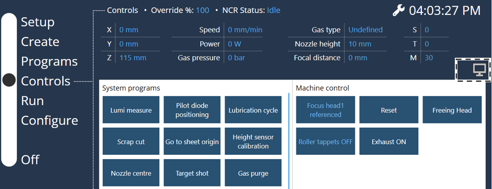
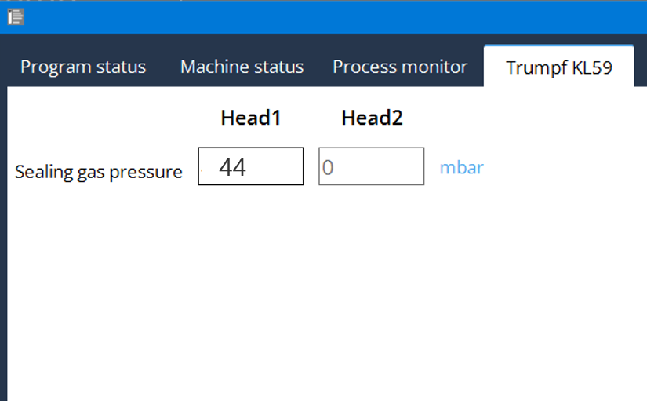
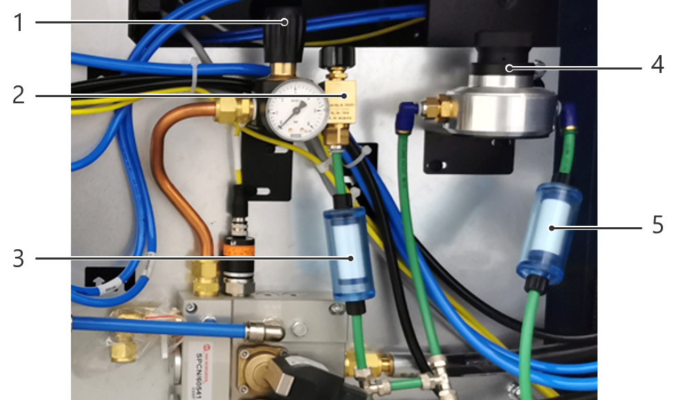

= Nitrogen ventilation monitoring

== Check the sealing gas pressure at the cutting unit KL59

For L99, sealing gas is only available from a laser power of 6 kW with KL59.
[arabic]
. In the HMI, select “Controls”.
. Press the monitoring button.
.Fig. 3‑101
[width="100%",cols="100%",options="header",]
|

[arabic, start=3]
. Select “Trumpf KL59”.
. Read off the sealing gas pressure.
Nominal value: 40 ± 5 mbar.
.Fig. 3‑102
[width="100%",cols="100%",options="header",]
|

== Bleeding the nitrogen pressure shut-off valve

* Error message that sealing gas at the cutting unit is too low is displayed.
Nitrogen flooding build-up
.Nitrogen flooding at the instrument panel Fig. 3‑103
[width="100%",cols="50%,50%",options="header",]
| |

|1 Pressure control valve (4.5 bar) |2 Pressure shut-off valve with bleed screw
|3 Polyglass filter (0.3 µm) |4 Pressure controller with pressure-limiting valve
|5 Polyglass filter (0.3 µm) |
* The valve locks the nitrogen flow automatically if the pressur-e rises to > 5.5 bar.
* For L99, sealing gas is only available from a laser power of 6kW.
* Do not adjust the sealing gas pressure controller.
[arabic]
. Turn left-hand pressure valve to 0 bar (see the figure above).
. Open the bleed screw on the pressure shut-off valve.
* The pressure is bled from the system…
* The pressure shut-off valve opens automatically if the pressure drops to below 4 bar.
[arabic, start=3]
. Set the left-hand pressure control valve to 4.5 bar.
Chapter 4
