= Working on X axis

== Replacing the X axis motor and gearbox

* Standard tool set, mat. no. 0135600.
* 2x mobile fixed stops, mat. no. 2790932.
* Measuring tape or a ruler.
* Torque wrench, 20-120 Nm.
* Torque wrench, 2.5-22.5 Nm.
* Adjustable hook wrench 35-60 mm, mat. no. 2014343.
Or hook wrench, mat. no.1655965.
[arabic]
. Switch off the machine and secure it being switched on again.
Remove the X axis motor
and gearbox
[arabic, start=2]
. Dismount the side enclosure. (see “link:#removing-mounting-protective-plates[Removing&#44; mounting pro-tective plates]”, pg. xxx).
.Fig. 4‑98
[width="100%",cols="100%",options="header",]
|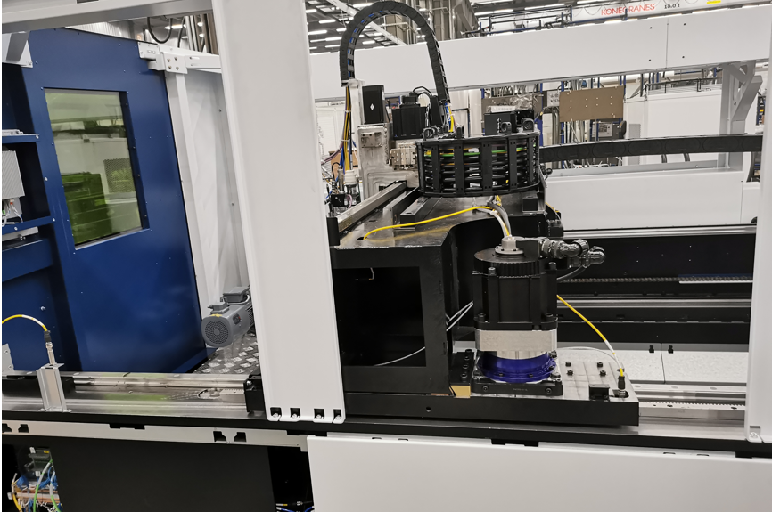

[arabic, start=3]
. Remove the X bellows front and rear.
. Find the marking for the highest point on X rack.
. Starting from this marking, measure 252 mm in the direction of X+ and make another marking there on the X rack using a permanent marker.
.Fig. 4‑99
[width="100%",cols="100%",options="header",]
|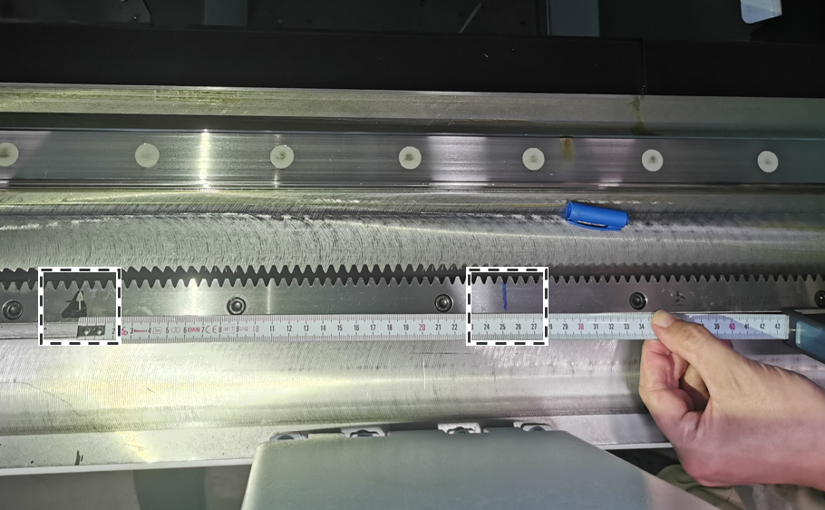

[arabic, start=6]
. Switch on the machine.
[width="100%",cols="35%,65%",options="header",]
|image:img/image2.png[img/image2,width=192,height=33] a|

*No side enclosure when moving the motion unit.*
*Risk of injury.*
* Don’t put hands or head inside the machine area.
[arabic, start=7]
. Move the motion unit until the X slide rear cover is flush with the new marking.
.Fig. 4‑100
[width="100%",cols="100%",options="header",]
|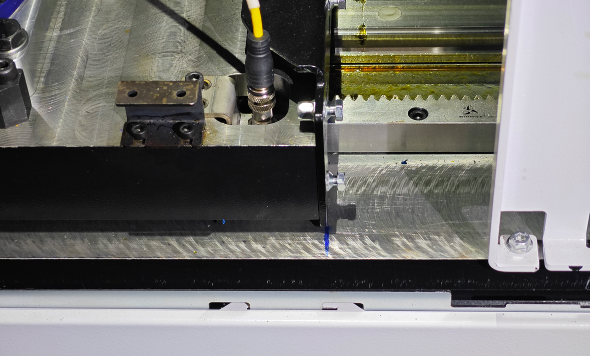

[arabic, start=8]
. Switch off the machine and secure it being switched on again.
. Disconnect the power cable and encoder cable from the motor.
.Fig. 4‑101
[width="100%",cols="100%",options="header",]
|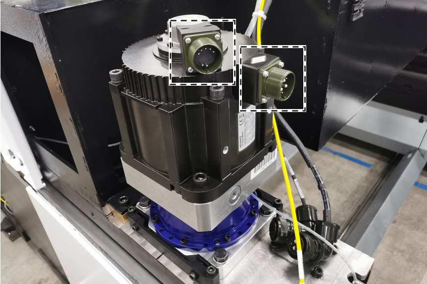

[arabic, start=10]
. Additional work for X1 axis:
* Remove the cover of the Y cable holder.
* Loosen the screws of Y cable holder.
* Move the Y cable holder to ensure access to X1 axis motor.
.Fig. 4‑102
[width="100%",cols="100%",options="header",]
|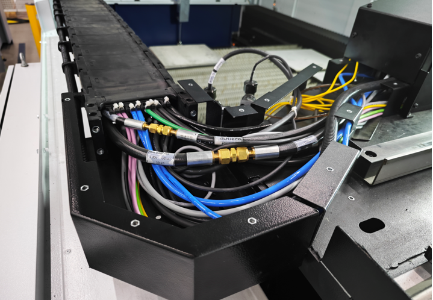

[arabic, start=11]
. Remove the gearbox screw plug.
. Manually push the motion unit so that the clamping screws of the coupling is accessible via the service opening.
.Fig. 4‑103
[width="100%",cols="100%",options="header",]
|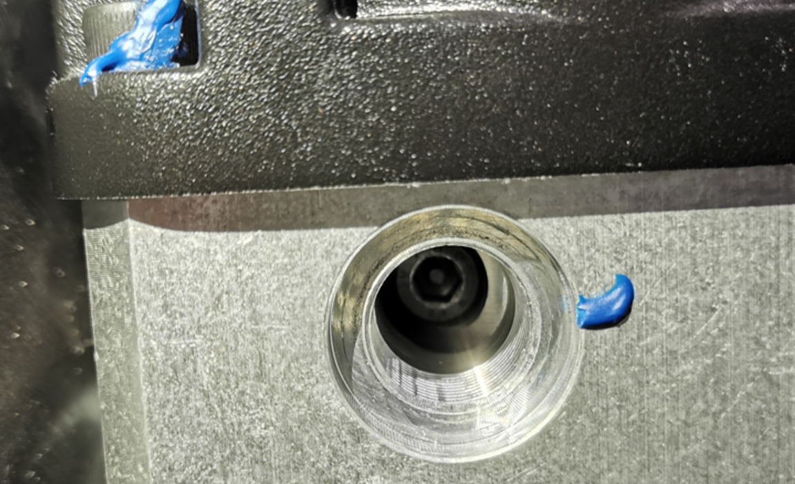

* Both X1 axis and X2 axis drives’ power cables must be disconnected before manually moving the motion unit.
* The drive’s power cable can be disconnected either at motor side or drive side.
* It is recommended two people manually move the motion unit.
.X1&X2 power supply, drive side Fig. 4‑104
[width="100%",cols="100%",options="header",]
|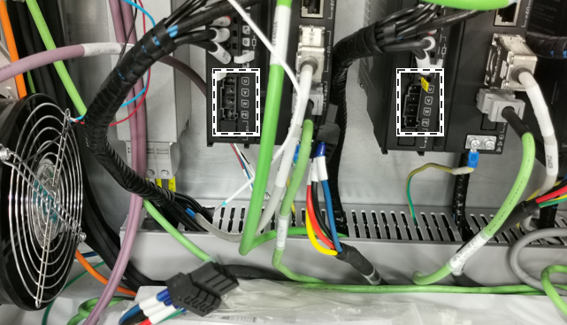

[arabic, start=13]
. Loosen the clamping screws from the coupling using an Allenkey.
. Remove 4x motor screws.
. Lift the motor off from the gearbox.
.Fig. 4‑105
[width="100%",cols="100%",options="header",]
|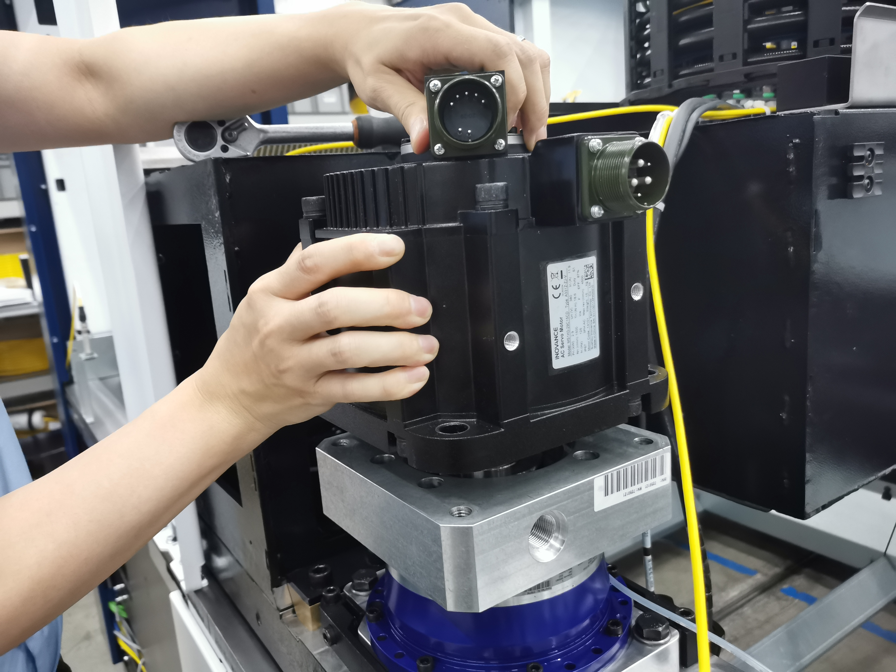

[arabic, start=16]
. Undo the lock screw.
* S02 machine: 1x.
* S01 machine: 4x.
.Fig. 4‑106
[width="100%",cols="^50%,^50%",options="header",]
| |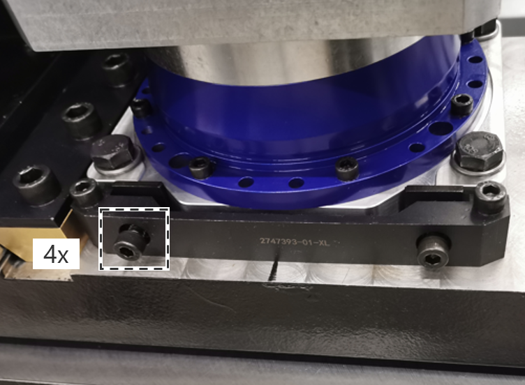

|S02 machine |S01 machine
[arabic, start=17]
. Remove the 4x screws on the flange mount.
.Fig. 4‑107
[width="100%",cols="100%",options="header",]
|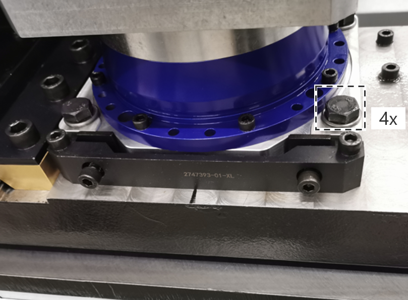

[arabic, start=18]
. Lift the gearbox off the X slide with the flange mount.
.Fig. 4‑108
[width="100%",cols="100%",options="header",]
|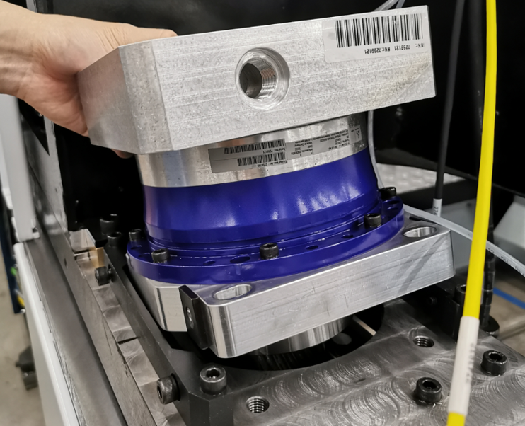

[arabic, start=19]
. Remove the gearbox from the flange mount.
. Clean the support areas on the X slide, gearbox and motor.
Install the X2 axis gearbox
and motor
[arabic, start=21]
. Install the new gearbox to the flange mount:
* Insert 8x screws (17 Nm), using Loctite 243.
.Fig. 4‑109
[width="100%",cols="100%",options="header",]
|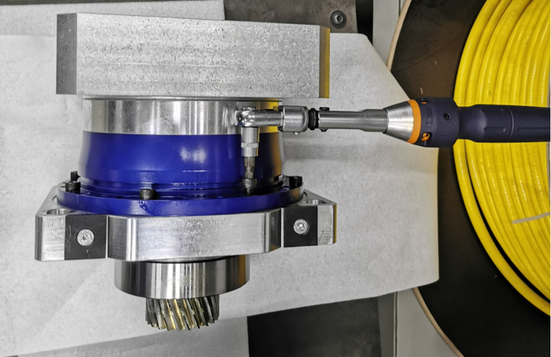

[arabic, start=22]
. Turn the pinion so that the marking faces upward and the opening for clamping screw on the right.
.Fig. 4‑110
[width="100%",cols="100%",options="header",]
|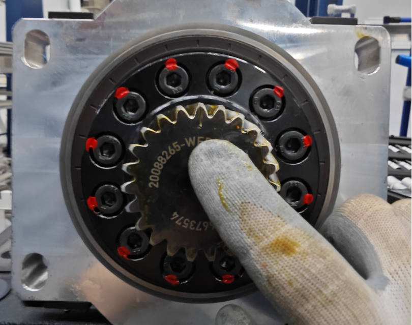

[arabic, start=23]
. Insert the gearbox into the X slide without turning the pinion:
* The opening for clamping screw must point to the pallet changer.
.Fig. 4‑111
[width="100%",cols="100%",options="header",]
|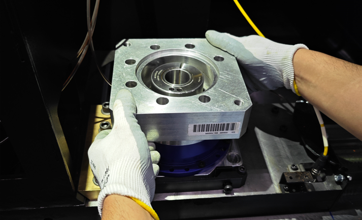

[arabic, start=24]
. Screw in 4x flange mount screws (not yet tighten).
. Lightly press the gearbox against the rack and tighten the screws to 80 Nm.
. Manually tighten the lock screw.
* The lock screw of S02 machine must not be used to adjust the backlash.
.Fig. 4‑112
[width="100%",cols="^50%,^50%",options="header",]
|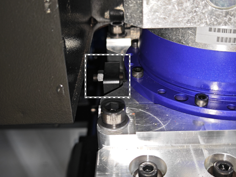 |

|S02 machine |S01 machine
[arabic, start=27]
. Check the clamping screw of the coupling for access. If not, manually push the motion unit.
. Remove the flat key on the shaft of new motor with the help of M3 screw.
. Insert the new motor:
* Align the keyway to the groove of coupling.
* Motor cable interface must point to the pallet changer.
.Fig. 4‑113
[width="100%",cols="100%",options="header",]
|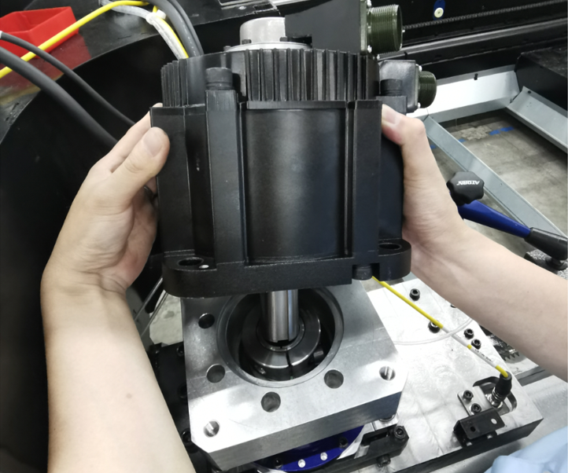

[arabic, start=30]
. Insert 4x motor screws and tighten to 80 Nm.
. Tighten the coupling clamping screw to 79 Nm.
. Screw in and tighten the screw plug for the opening.
. Plug the power cable and encoder cable into the motor and tighten them with the hook wrench.
.Fig. 4‑114
[width="100%",cols="100%",options="header",]
|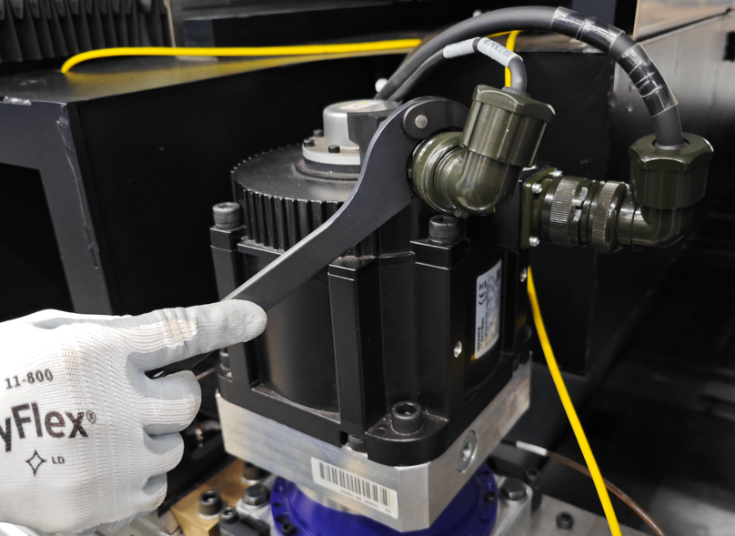

[arabic, start=34]
. Check and set the X axis backlash. (see “link:#setting-the-x-axis-backlash[Setting the X axis backlash]”, pg. xxx).
Further work
[arabic, start=35]
. Check the angularity of the motion unit. (see “link:#setting-the-fine-angularity-of-the-motion-unit[Setting the fine angularity of the motion unit]”, pg. xxx).
. Check and set the X axis reference point offset value. (see “link:#checking-and-setting-the-x-axis-reference-point-offset-value[Checking and setting the X axis reference point offset value]”, pg. xxx).
. Check and set the X axis limit switch. (see “link:#setting-x-axis-limit-switch[Setting X axis limit switch]”, pg. xxx).
. Check and set the X axis fixed stop. (see “link:#setting-x-axis-fixed-stop[Setting X axis fixed stop]”, pg. xxx).

== Setting the X axis backlash

|2023-07 |Procedure created. |00
The X axis backlash is set.
* After the gearbox has been exchanged.
* After replacing the guide carriage.
* If there is a loud noise during the radius test.
* If there is overshoot when changing direction.
* For an untidy contour transition.
* If there is too much play in the X axis (e.g. found during maintenance).
Condition
* Racks are cleaned and lubricated.
Means, Tools, Materials
* Dial gauge 1/1000 with magnetic support, mat. no. 0002419.
* 2x mobile fixed stop, mat. no. 2790932.
* Bluetooth dial gauge, mat. no. 2369502.
* Torque wrench.
* Permanent marker.
* Ruler or measuring tape.
[arabic]
. Switch off the drives.
. Remove the side enclosure.
* These jobs are done from outside of the machine.
[arabic, start=3]
. Remove the X axis bellows.
. Find the marking for the highest point on X rack.
.Fig. 4‑115
[width="100%",cols="100%",options="header",]
|

[arabic, start=5]
. Starting from this marking, measure 252 mm in the direction of X+ and make another marking there on the X rack using a permanent marker.
. Switch on the drives.
[width="100%",cols="35%,65%",options="header",]
|image:img/image2.png[img/image2,width=192,height=33] a|

*No side enclosure when moving the motion unit.*
*Risk of injury.*
* Don’t put hands or head inside the machine area.
[arabic, start=7]
. Move the motion unit until the X slide’s rear cover is flush with the new marking.
.Fig. 4‑116
[width="100%",cols="100%",options="header",]
|

Check the X axis backlash
[width="100%",cols="35%,65%",options="header",]
|image:img/image2.png[img/image2,width=192,height=33] a|

*Risk of injury due to active drive when door is open.*
* Position the two mobile fixed stops before and after the X slide.
* Set the MOTOR CURRENT LIMIT key switch to right (ON).
[arabic, start=8]
. Position 2 mobile fixed stops before and behind the X slide.
* L99’s mobile fixed stop is different from PLL’s.
[arabic, start=9]
. Set the key switch for the motor current limit to right (ON).
.Fig. 4‑117
[width="100%",cols="100%",options="header",]
|image:img/image492.png[img/image492,width=382,height=268]

[arabic, start=10]
. Switch on drives and open the safety door.
. Acknowledge the service mode is active at the bottom-left of HMI.
.Fig. 4‑118
[width="100%",cols="100%",options="header",]
|

[arabic, start=12]
. Acknowledge the feedrate changed to 0 by PLC controller.
. Position the dial gauge on the right of X slide and zero.
.Fig. 4‑119
[width="100%",cols="100%",options="header",]
|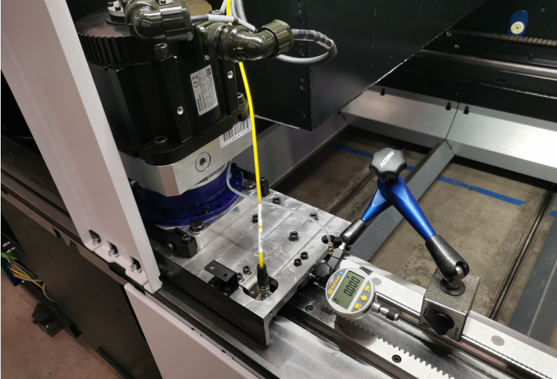

[arabic, start=14]
. Slide the X motor in the + and – directions with a force of about 10 kg and read off the backlash from dial gauge.
Permissible value: 0.01±0.005 mm.
[arabic, start=15]
. Undo the lock screw.
Set the X axis backlash
(S02 machine)
.Fig. 4‑120
[width="100%",cols="100%",options="header",]
|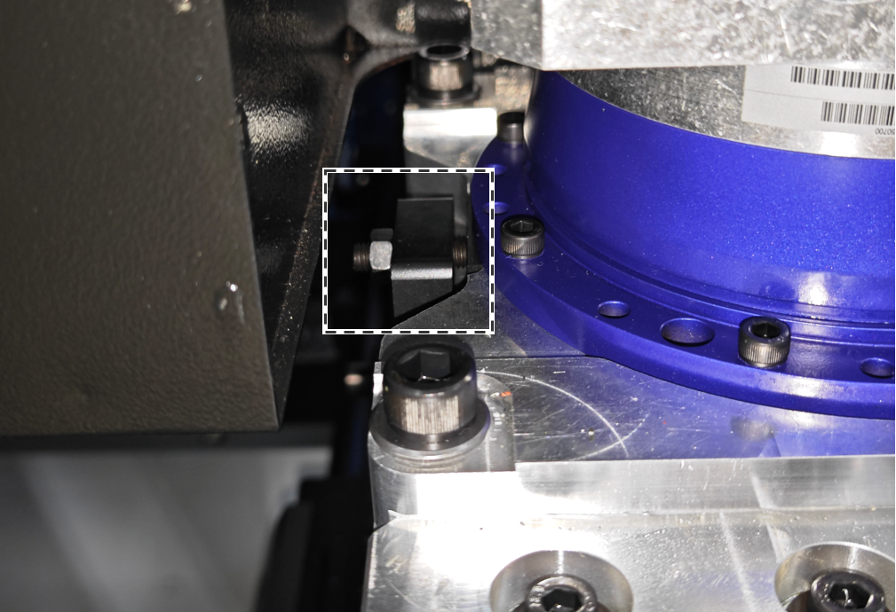

[arabic, start=16]
. Loosen the screws on the flange mount.
.Fig. 4‑121
[width="100%",cols="100%",options="header",]
|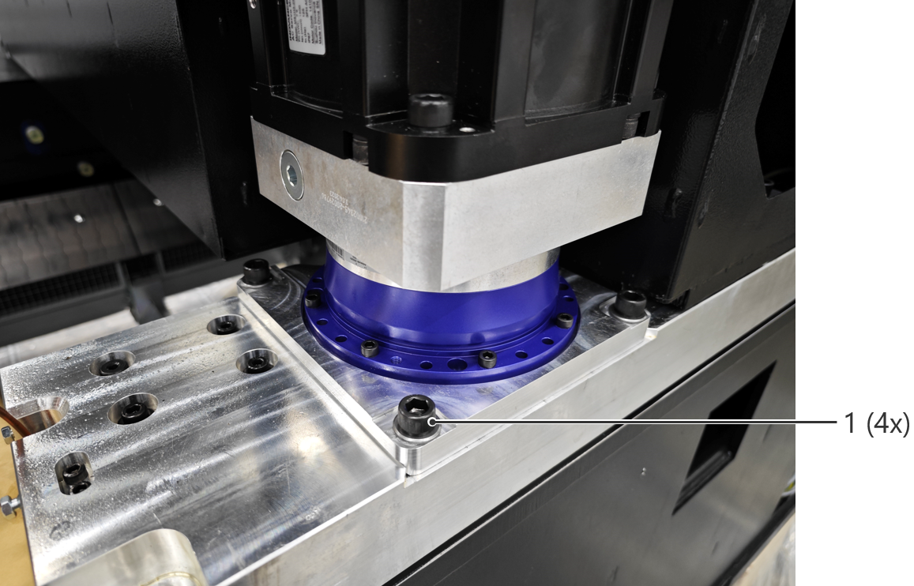

|1 Screws, on flange mount
[arabic, start=17]
. Adjust the backlash by hand and tighten the screws on the flange mount to 80 Nm.
. Manually tighten the lock screw.
* The lock screw of S02 machine must not be used to adjust the backlash.
[arabic, start=19]
. Recheck the backlash.
. Loosen the 4x screws on the flange mount.
Set the X axis backlash
(S01 machine)
* Don’t loosen the 4x screws completely. Since a little preload will make the backlash adjustment work easier.
.Fig. 4‑122
[width="100%",cols="50%,50%",options="header",]
|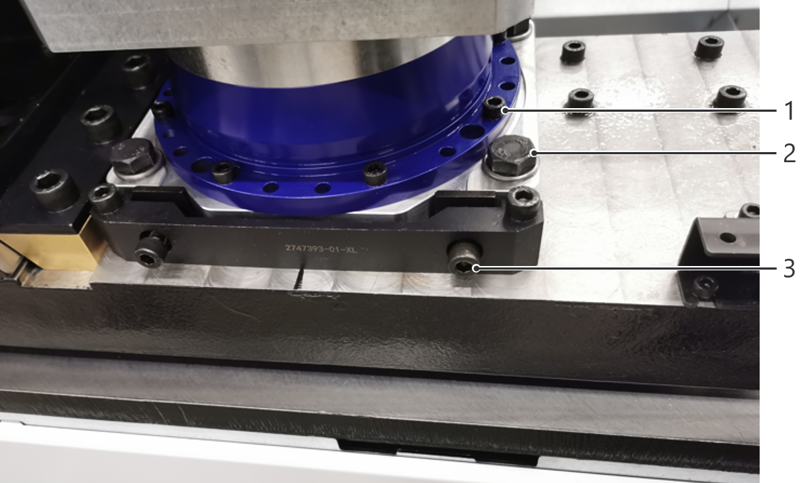 |

|1 Screws (8x) on the gearbox |2 Screws (4x) on flange mount
|3 Jackscrews (4x) |
[arabic, start=21]
. Adjust the backlash with the help of 4x jackscrews.
* Loosen the 2x jackscrews on the opposite side first and then tighten the target 2x jackscrews.
* Jackscrews on the same side must be adjusted with the same number of turns.
[arabic, start=22]
. Tighten 4x screws on the flange mount to 80 Nm.
. Recheck the backlash.
. Remove the dial gauge.
Additional work
[arabic, start=25]
. Further work:
* Set the angularity of the motion unit (see “link:#setting-the-fine-angularity-of-the-motion-unit[Setting the fineangularity of the motion unit]”, pg. xxx).
* Check and set the X axis reference point offset value ( see “link:#checking-and-setting-the-x-axis-reference-point-offset-value[Checking and setting the X axis reference point offs-et value]”, pg. xxx).
* Check and set the X axis limit switch (see “link:#setting-x-axis-limit-switch[Setting X axis limit switch]”, pg. xxx).
* Check and set the X axis fixed stop (see “link:#setting-x-axis-fixed-stop[Setting X axis fixed stop]”, pg. xxx).
[arabic, start=26]
. Install the bellows.
. Install the side enclosure.

== Roughly setting the X axis angle

The machine’s main switch is switched off and secured against being switched on again.
[arabic]
. Remove the side enclosure.
. Remove the X bellows front and rear.
. Release all the spring assemblies on both X1 and X2 axes.
. Undo both fixed stops (left and right) and push as far as possible in the X- direction.
. Pull motion unit by hand onto the two fixed stops.
. Tighten all the spring assemblies to torque:
* Left: 40 Nm.
* Right: 15 Nm.
[arabic, start=7]
. Do this additional work:
* Set the fine angularity of the motion unit (see “link:#setting-the-fine-angularity-of-the-motion-unit[Setting thefine angularity of the motion unit]”, pg. xxx).
* Determine the X axis reference point offset value (see “ link:#checking-and-setting-the-x-axis-reference-point-offset-value[Checking and setting the X axis reference point offset va-lue]”, pg. xxx).
* Set X axis limit switch (see “link:#setting-x-axis-limit-switch[Setting X axis limit switch]”, pg. xxx).
* Set X axis fixed stop (see “link:#setting-x-axis-fixed-stop[Setting X axis fixed stop]”, pg. xxx).

== Setting the fine angularity of the motion unit

The angle of the motion unit with respect to the guide rails should be checked in case of:
* After a collision.
* Unsatisfactory contouring accuracy.
* After replacing the motion unit, X gearbox or guide carriage.
Condition
* X axis angle has been roughly adjusted (see “link:#roughly-setting-the-x-axis-angle[Roughly settin-g the X axis angle]”, pg. xxx).
* The home position has been established.
Means, Tools, Materials
* 2x mobile fixed stop, mat. no. 2790932.
* Utility program “Angulary”.
* Steel sheet (thickness ≤ 3 mm, the sheet dimensions should ensure the sheet cannot easily slip).
* Radius test device.
* H853 service manual, “Circular measurements”:
* https://tip.trumpf.com/internalpreview/w/de_DE/show/00000000000000000000000000008fd6_19000101_de_DE[German].
* https://tip.trumpf.com/internalpreview/w/en_US/show/00000000000000000000000000008fd6_19000101_en_US[English].
[arabic]
. Attach the cutting head with nozzle holder.
Run a radius test
.Fig. 4‑123
[width="100%",cols="100%",options="header",]
|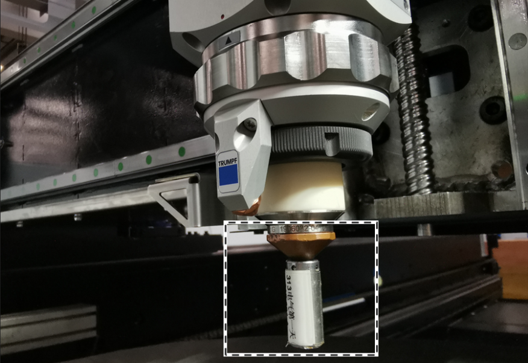

[arabic, start=2]
. Check the bottom of the nozzle holder for dirt, clean it with cleaner clay.
. Select “Programs” > “Programs” > “Service programs”.
.Fig. 4‑124
[width="100%",cols="100%",options="header",]
|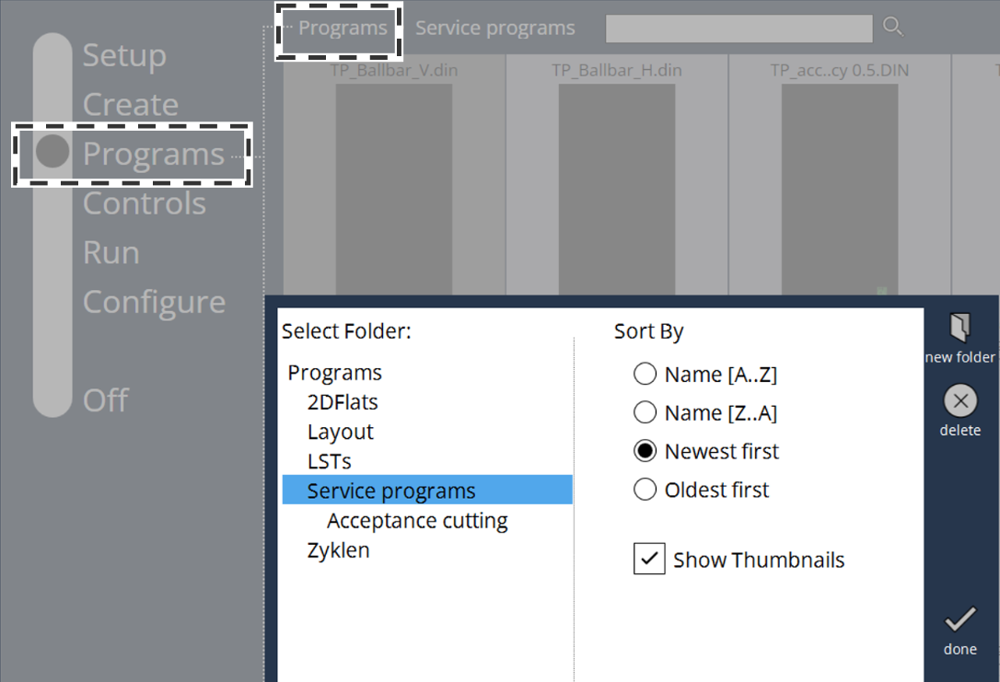

[arabic, start=4]
. Run the radius test at front side by program “TP_Ballbar_V”.
.Fig. 4‑125
[width="100%",cols="100%",options="header",]
|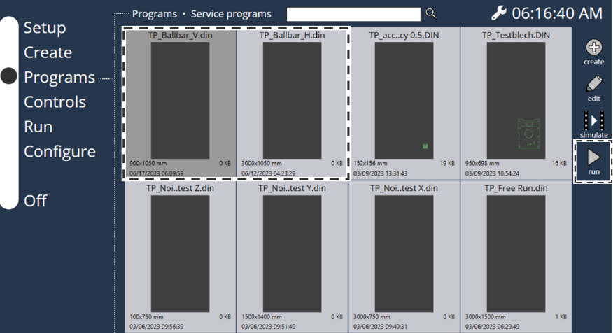

[arabic, start=5]
. Press the START button, the cutting head now travels to the input value.
. Place a steel sheet on the pallet under the cutting head.
* Make sure the sheet cannot easily slip.
* The thickness of plate should less than 3 mm due to the limit of Z axis height.
[arabic, start=7]
. Check the ball and the bottom of the centering mount for dirt.Clean them with cleaner clay if necessary.
. Check whether the centering mount can be affixed to the sheet.
. Check if the ball is resting on the nozzle holder.
.Fig. 4‑126
[width="100%",cols="100%",options="header",]
|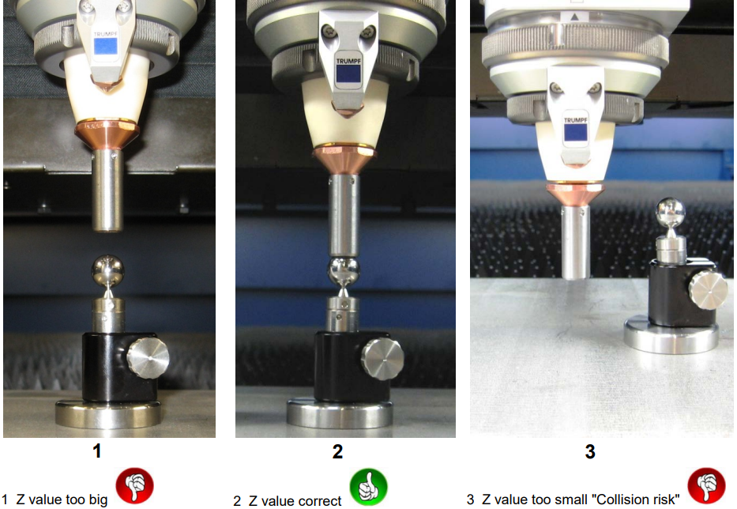

[width="100%",cols="35%,65%",options="header",]
|image:img/image10.png[img/image10,width=192,height=34] a|

*Collision risk*.
* Do not place the centering mount on the metal sheet until the Z height has been assumed.
[arabic, start=10]
. If not possible, stop the program and start over again in orderto modify Z value in “Edit” menu.
.Modify Z value Fig. 4‑127
[width="100%",cols="100%",options="header",]
|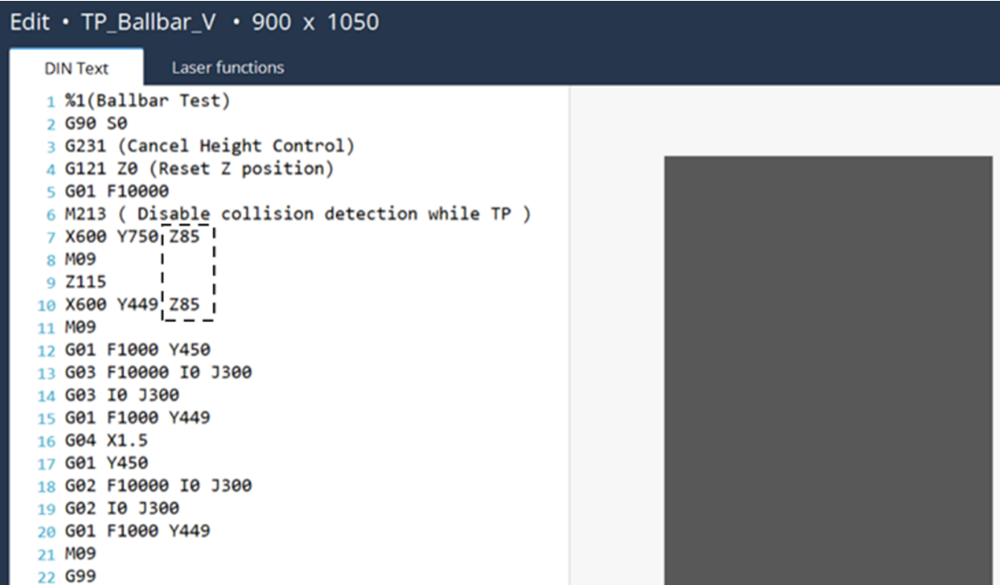

[arabic, start=11]
. Recheck if the centering mount is affixed on the sheet and the ball is resting on the nozzle holder.
. Make sure the centering mount is centered to the nozzle holder and lined up with it.
* Take care not to move the sheet and pallet anymore.
.Fig. 4‑128
[width="100%",cols="100%",options="header",]
|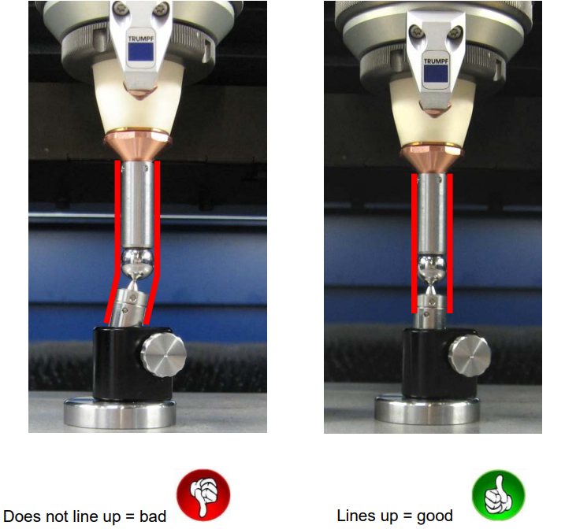

[arabic, start=13]
. Secure the ball now by turning the locking rod.
. Connect the ballbar to the laptop.
. Activate the test at PC by pressing the green “Start” button.
.Fig. 4‑129
[width="100%",cols="100%",options="header",]
|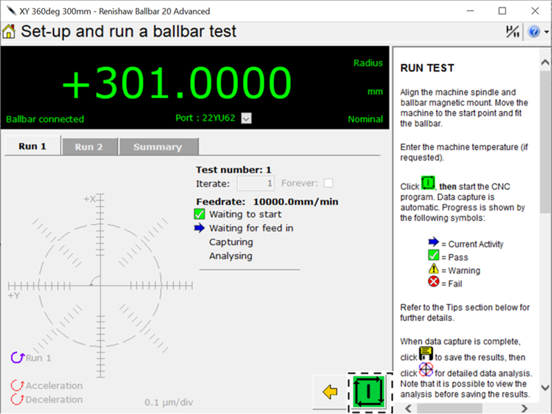

[arabic, start=16]
. Press FEED START button on machine panel.
. Mount the probe and clean if necessary.
.Fig. 4‑130
[width="100%",cols="100%",options="header",]
|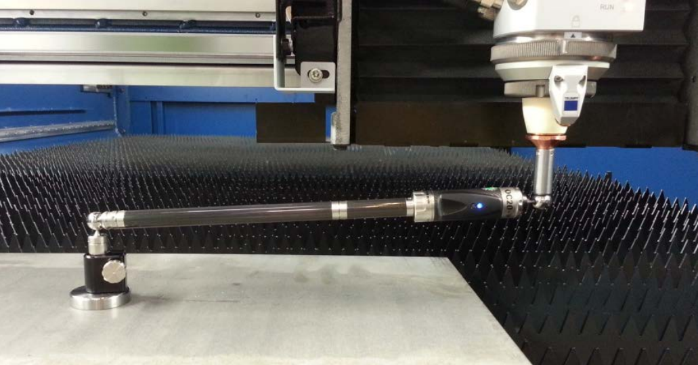

[arabic, start=18]
. Set the feedrate potentiometer to 100% for the test.
. Continue by pressing FEED START button.
* Wait a few seconds to FEED START after drives on, otherwise the warning “2.5.503” may appear.
.Fig. 4‑131
[width="100%",cols="100%",options="header",]
|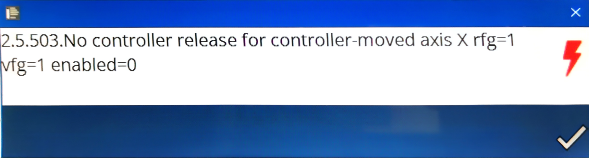

[arabic, start=20]
. If the warning is triggered:
* Reset it and remove the probe and centering mount.
* Run the program again.
[arabic, start=21]
. Acknowledge the radius test is completed successfully by the 2 green checkmarks in front of Run1 and 2.
. Continue to evaluation by pressing the “Geometry” button.
.Fig. 4‑132
[width="100%",cols="100%",options="header",]
|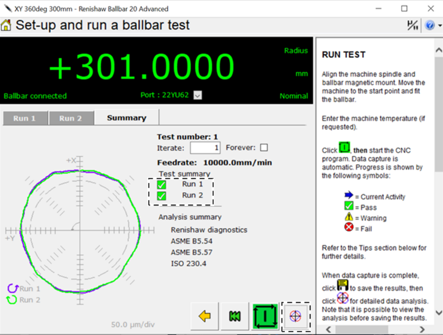

[width="100%",cols="35%,65%",options="header",]
|image:img/image10.png[img/image10,width=192,height=34] a|

*2 yellow exclamation marks will appear instead of 2 green checkmarks if the center point deviation from the center mount to the nozzle holder is excessive.*
* 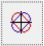Check the center point deviation in “[.underline]#3# Table” by pressing the Geometry button (deviation < 50 µm).

* Make sure you align the center mount to the nozzle holder on the sheet as accurately as possible and repeat ballbar test.
* If the sheet is too light, use a heavier sheet.
[arabic, start=23]
. Read off the angularity under menu “[.underline]#2# Values” and save the report files.
.Fig. 4‑133
[width="100%",cols="100%",options="header",]
|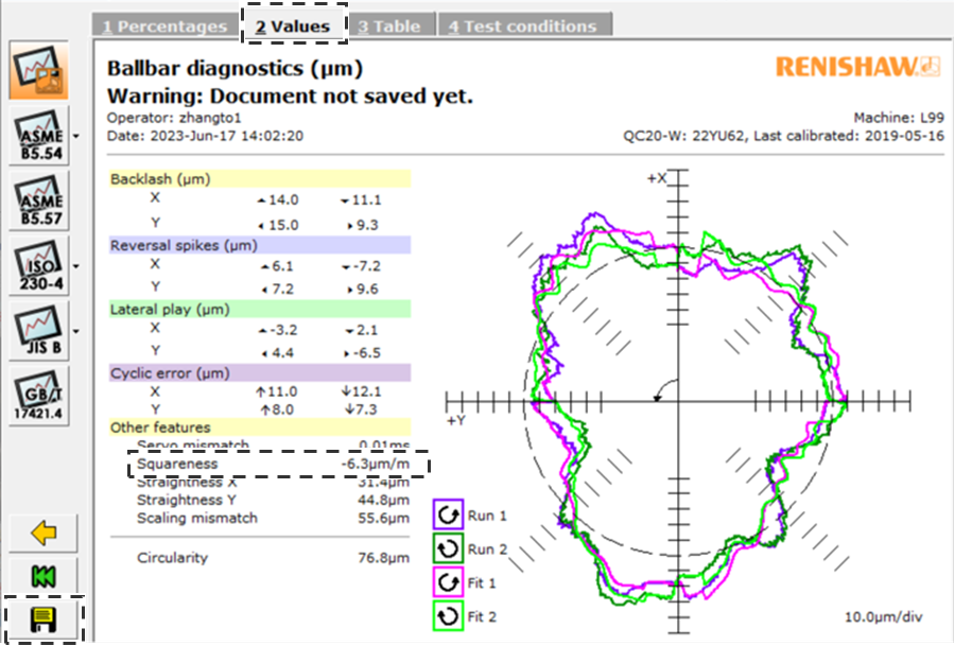

[arabic, start=24]
. Repeat the above steps to run the radius test at the rear side by program “TP_Ballbar_H”.
. Evaluate the values you noted down for the tests at the front side and rear side.
Evaluate the test
* The squareness must < 50 µm/m
* The max difference in angularity front to rear is 60 µm/m.
*Example*
.Tab. 4‑31
[width="100%",cols="31%,^20%,^17%,^18%,^14%",options="header",]
*Circularity test*
*EN ISO 10360-2*
|*Tolerance* |*Actual* | |*Result*
| | |*Front* |*Rear* |
|Angularity angle error a|
|

Max difference
front to rear
|12.4 µm/m | |image:img/image337.png[img/image337,width=32,height=28]

[arabic, start=26]
. Remove the side enclosure.
Set the angularity of the
motion unit
[width="100%",cols="35%,65%",options="header",]
|image:img/image2.png[img/image2,width=192,height=33] a|

*Active drive when door is open.*
*Risk of injury.*
* Position the two mobile fixed stops before and after the X slide.
* Set the feedrate to 0%.
* Service-related work done from outside of the machine.
[arabic, start=27]
. Open the safety door.
. Position 2 mobile fixed stops before and behind the X slide.
* L99’s mobile fixed stop is different from PLL’s.
.Fig. 4‑134
[width="100%",cols="^50%,^50%",options="header",]
|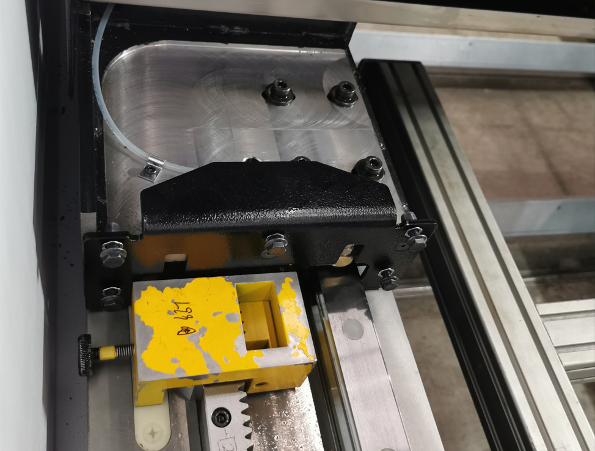 |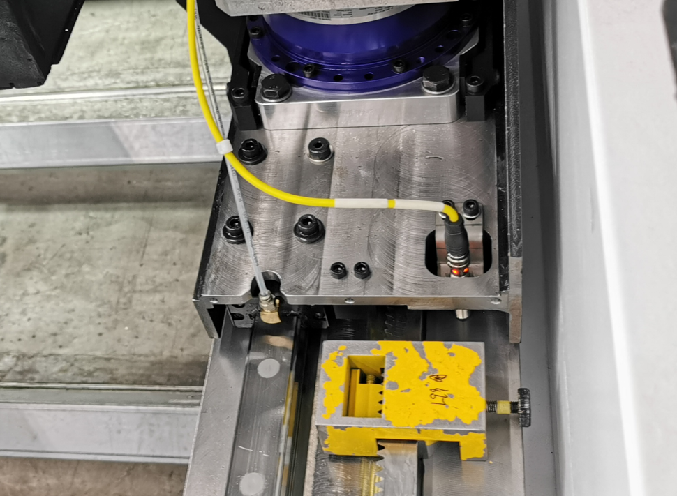

|Front |Rear
[arabic, start=29]
. Set the feedrate to 0%.
. Close the safety door and drives on.
. *S02 machine*: release the three spring assemblies of X1 axis with the active drive.
.Only S02 machine Fig. 4‑135
[width="100%",cols="100%",options="header",]
|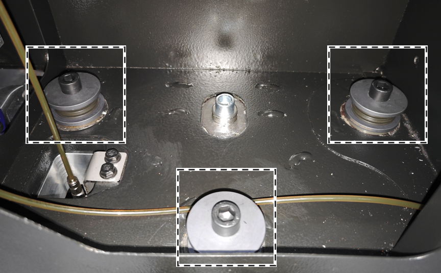

*S01 machine*: loosen the 7x screws of the X1 axis slide fromthe outside of the machine.
.Only S01 machine Fig. 4‑136
[width="100%",cols="50%,,50%",options="header",]
|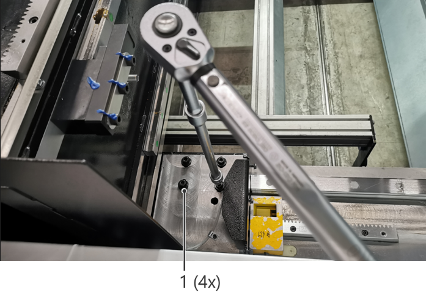 | |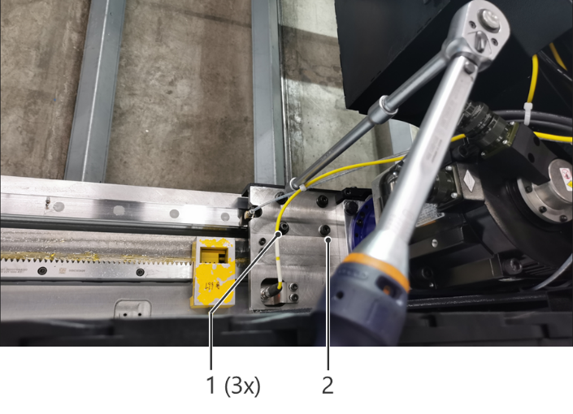

|1 Screws (7x) |2 Shoulder screw |
[arabic, start=32]
. Select “Controls” > “Machine setting” > “Axis Parameters” > “X” “Synchronous offset”.
.Fig. 4‑137
[width="100%",cols="100%",options="header",]
|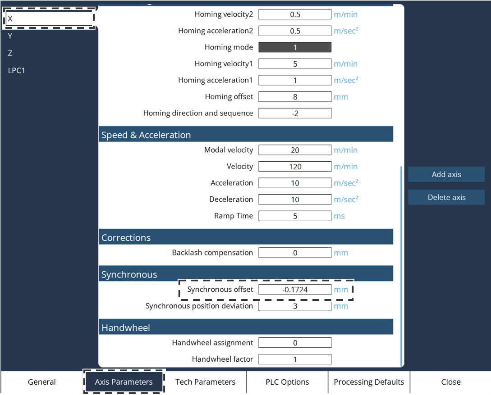

[arabic, start=33]
. Record the synchronous offset value.
. Run the angularity program “angulary.exe”.
* Operate the program using the keyboard.
* All values need to be input in [mm].
[arabic, start=35]
. Enter the number of the desired language.
.Fig. 4‑138
[width="100%",cols="100%",options="header",]
|

[arabic, start=36]
. Enter 36 to choose L99_1.5.
.Fig. 4‑139
[width="100%",cols="100%",options="header",]
|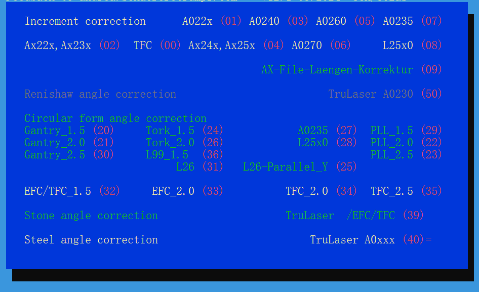

[arabic, start=37]
. Enter the recorded synchronous offset value.
e.g., -0.1724 mm.
[arabic, start=38]
. Enter the average of two angle deviation of circular form test.e.g., -0.0765 mm/m.
.Fig. 4‑140
[width="100%",cols="100%",options="header",]
|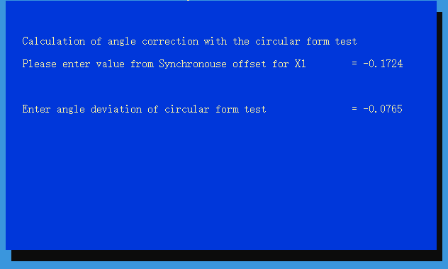

[arabic, start=39]
. Get and record the synchronous offset.
.Fig. 4‑141
[width="100%",cols="100%",options="header",]
|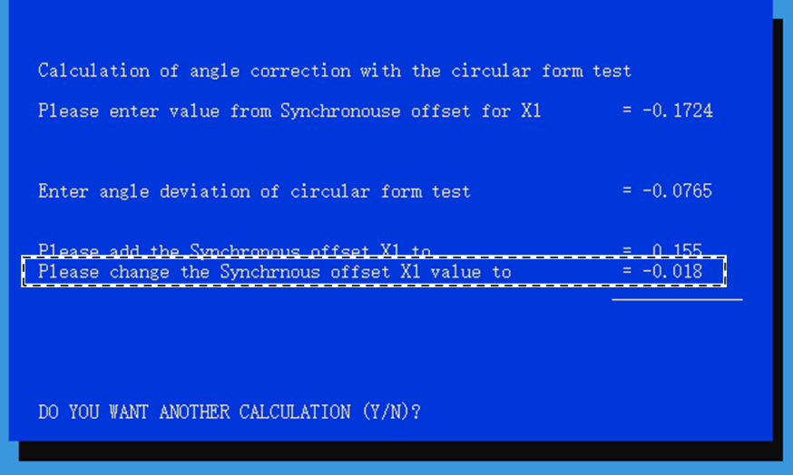

[arabic, start=40]
. Without the program, you can calculate the synchronous offset by yourself.
.Tab. 4‑32
[width="100%",cols="16%,20%,19%,21%,24%",options="header",]
|*Old value* |*Squareness, front* |*Squareness, rear* |*Compensation* |*Synchronous offset*
|A [mm] |B [mm/m] |C [mm/m] |(B+C)/2*2.019 [mm] |A – compensation [mm]
[arabic, start=41]
. Go back to “Axis Parameter” > “X” and enter the new value in“Synchronous offset”.
. Press “Close” to save and reload the parameters.
. Wait a few moments for the machine drives on automatically.
. With the active drives:
* S02 machine: tighten the three X1 spring assemblies to 40 Nm.
* S01 machine: tighten the 7x screws of X1 slide to 40 Nm from the outside of the machine.
* When installing the X1 spring assemblies is needed, takecare to maintain their alternating arrangement.
.Fig. 4‑142
[width="100%",cols="100%",options="header",]
|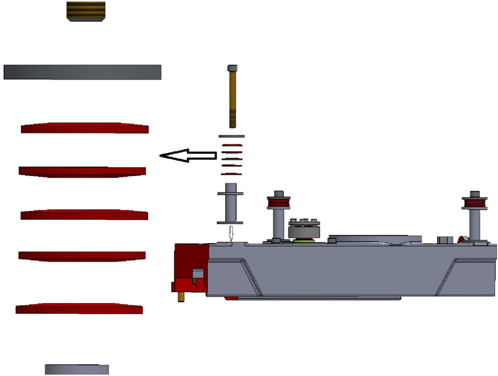

[arabic, start=45]
. Open the safety door.
. Remove the mobile fixed stop.
. Recheck and set the backlash of X1 axis and X2 axis (see “ link:#setting-the-x-axis-backlash[Setting the X axis backlash]”, pg. xxx).
* For S01 machine, two much compensation for the gantry will change the X axis backlash.
[arabic, start=48]
. Run a radius test again to check the angularity.
* There must be *a relatively low noise* during running the radius test.
[arabic, start=49]
. Evaluate the values you noted down for the tests at the front side and rear side.
* Each squareness must < 50 µm/m
* The max difference in angularity front to rear is 60 µm/m.
[arabic, start=50]
. Further work:
* Check and set the X axis reference point offset value. (see “link:#checking-and-setting-the-x-axis-reference-point-offset-value[Checking and setting the X axis reference point off-set value]”, pg. xxx).
* Check and set the X axis limit switch. (see “link:#setting-x-axis-limit-switch[Setting X axis limit switch]”, pg. xxx).
* Check and set the X axis fixed stop. (see “link:#setting-x-axis-fixed-stop[Setting X axis fixed stop]”, pg. xxx).

== Checking and setting the X axis reference point offset value

* The machine is switched off.
Means, Tools, Materials
* Measuring tape or a ruler.
[arabic]
. Remove the X bellows.
. Undo the fixed stop at the front and slide as far as possible in the X- direction.
. Switch on the machine.
. Select ”Homing” > “Automatic” to perform a reference run.
. Measure the gap “D” between the fixed stop and the stop edge of the X slide.
Nonimal value: 145 ± 0.5 mm.
* Measure from the stop of the X slide, not the spray shield of the X slide.
.Fig. 4‑143
[width="100%",cols="53%,47%",options="header",]
|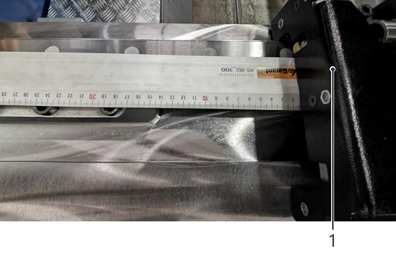 |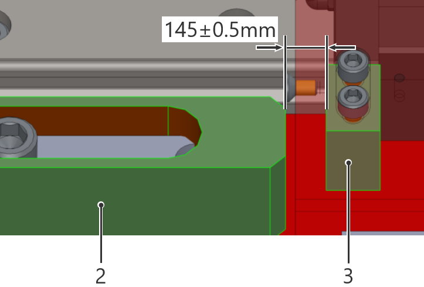

|1 Spray shield |2 X axis fixed stop
| |3 Stop of the X slide
[arabic, start=6]
. If the value is incorrect, switch to HMI, select “Configure” > “Machine setting”.
. Activate the service user level (see “link:#activating-the-service-user-level-in-vulcan-system-1[Activating the Service u-ser level in Vulcan system]”, pg. xxx).
. Select “Axis Parameters” and then choose “X” axis.
. Calculate and enter new value in “Homing offset”.
*Example*: Old homing offset C mm, measured gap D mm.
Homing offset = C+D-145 mm.
.Fig. 4‑144
[width="100%",cols="100%",options="header",]
|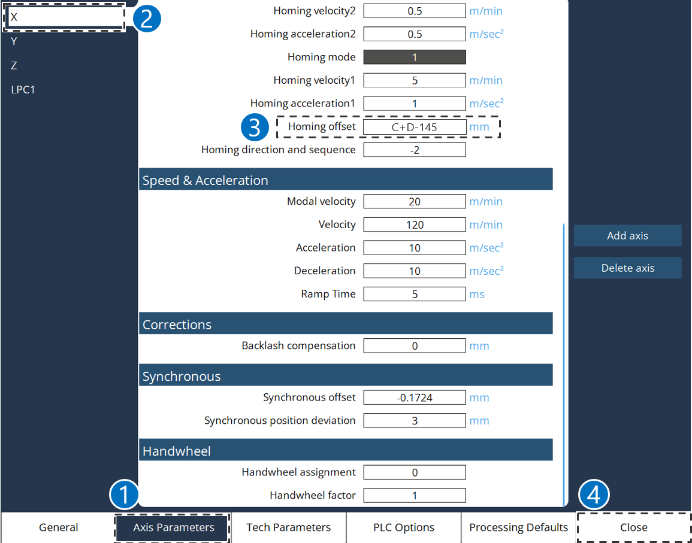

[arabic, start=10]
. Click “Close” and choose “Save and reload parameters” for the pop-up window.
. Restart the Vulcan system.
. Select ”Homing” > “Automatic” to perform a reference run.
. Recheck the gap between the X fixed stop and stop of the X slide.
Nominal value: 145 ± 0.5 mm.
[arabic, start=14]
. Further work:
* Set X axis limit switch. (see “link:#setting-x-axis-limit-switch[Setting X axis limit switch]”, pg. xxx)
* Set X axis fixed stop. (see “link:#setting-x-axis-fixed-stop[Setting X axis fixed stop]”, pg. xxx)

== Setting X axis limit switch

Condition
* Service user level in Vulcan system is activated.
[arabic]
. Open the safety door.
Check X axis limit switch
* Don’t forget to open the safety door when carrying service-related work in danger zone.
[arabic, start=2]
. Dismount the side enclosure. (see “link:#removing-mounting-protective-plates[Removing&#44; mounting pro-tective plates]”, pg. xxx).
. Undo the screws of both X axis fixed stops.
. Slide the front fixed stop as far as possible in X- direction.
The rear fixed stop as far as possible in X+ direction.
[arabic, start=5]
. Select “Configure” > “Machine Setting” in HMI.
. Select “Axis Parameters” > “X” axis.
. Scroll down and find “Monitoring” catalog.
. Enter “-107” in “Software limit negative”.
. Enter “3107” in “Software limit positive”.
* Don’t forget to reset “Software limit negative” and “Software limit positive” in the end.
.Fig. 4‑145
[width="100%",cols="100%",options="header",]
|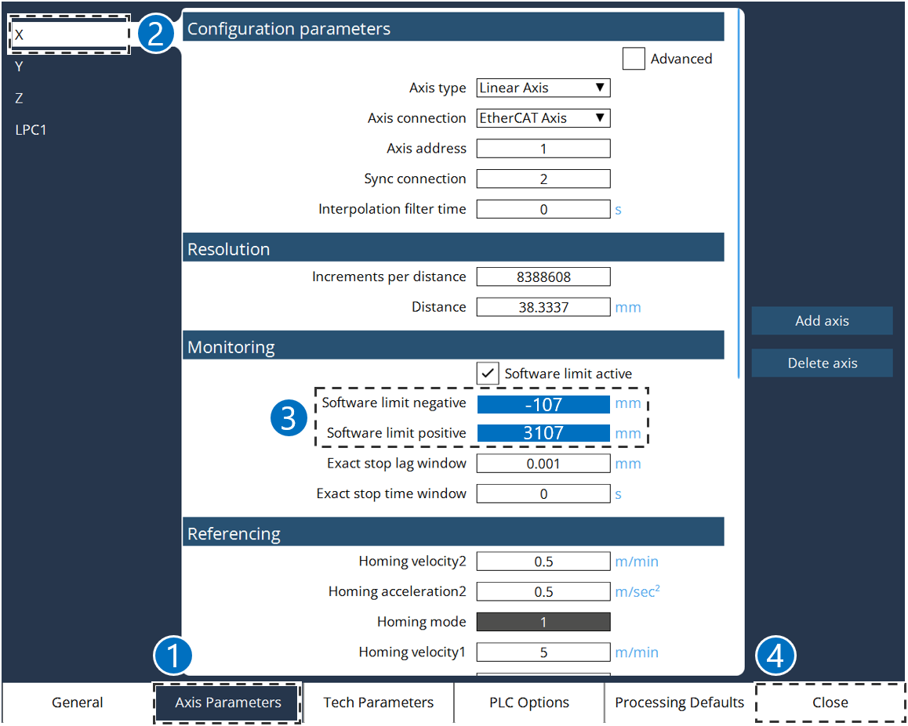

[arabic, start=10]
. Click “Close” and choose “Save and reload parameters” for the pop-up window.
. Check the clearance between X axis limit switch and the switching block of the limit switch.
Nominal value: 2^+1^ mm.
.Fig. 4‑146
[width="100%",cols="100%",options="header",]
|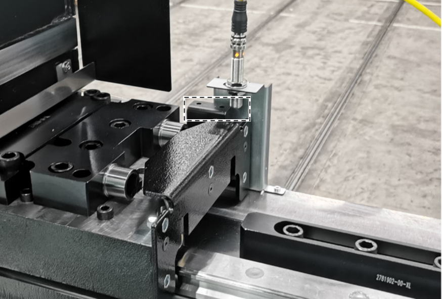

* The gauge block can be used to adjust the clearance.
[arabic, start=12]
. Move motion unit to position where the sensor just works, checking by:
* LED status of limit switch: from on to off.
* the warning “2.1.5”/ “2.1.6” appearing on HMI.
.Fig. 4‑147
[width="100%",cols="100%",options="header",]
|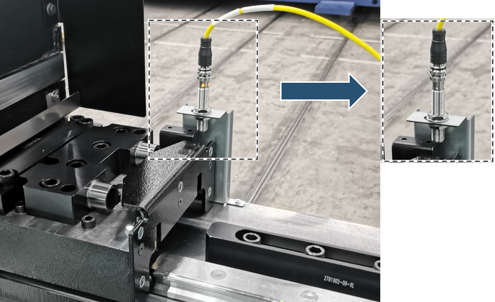

.Fig. 4‑148
[width="100%",cols="100%",options="header",]
|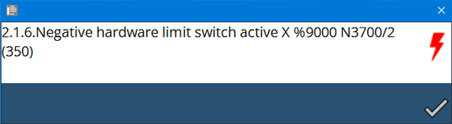

[arabic, start=13]
. Check the display value in HMI.
* Front limit switch: -105 ± 0.5 mm.
* Rear limit switch: 3105 ± 0.5 mm.
[arabic, start=14]
. Should the value not be correct, move the motion unit to X= -105 position.
Set X axis limit switch
* X= 3105 for rear limit switch.
[arabic, start=15]
. Open the safety door.
. Loosen the screw of X axis limit switch.
. Adjust the X limit switch position in X direction to ensure X= -105/3105 is position where the sensor works, checking by:
* The status of LED: from on to off.
.Fig. 4‑149
[width="100%",cols="100%",options="header",]
|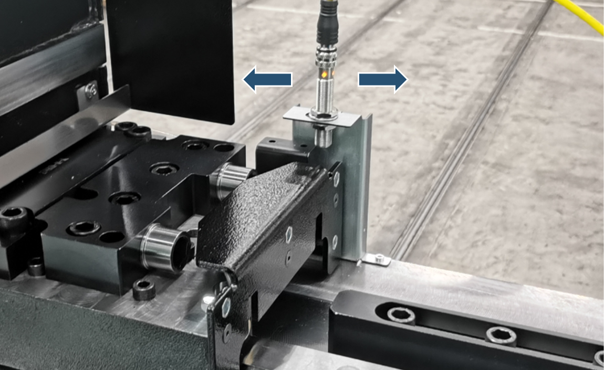

[arabic, start=18]
. Tighten the screw of X axis limit switch.
. Recheck the clearance for X axis limit switch.
Nominal value: 2^+1^ mm.
[arabic, start=20]
. Recheck the X limit switch position.
* Front limit switch: -105 ± 0.5 mm.
* Rear limit switch: 3105 ± 0.5 mm.
[arabic, start=21]
. Change the software limit back.
.Fig. 4‑150
[width="100%",cols="100%",options="header",]
|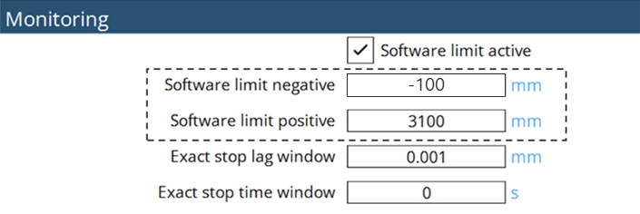

[arabic, start=22]
. Further work:
* Set X axis fixed stop. (see “link:#setting-x-axis-fixed-stop[Setting X axis fixed stop]”, pg. xxx)

== Setting X axis fixed stop

* Torque wrench, 80 Nm.
* Measuring tape or a ruler.
* Gauge block.
* The following steps must be performed on both X1 and X2 axes.
[arabic]
. Open the safety door.
Set the front fixed stop
* Don’t forget to open the safety door when carrying service-related work in danger zone.
[arabic, start=2]
. Dismount the side enclosure. (see “link:#removing-mounting-protective-plates[Removing&#44; mounting pro-tective plates]”, pg. xxx).
. Completely remove the X axis bellows.
. Close the safety door.
. Move the motion unit to reference position X=0 mm.
. Open the safety door.
. Undo the screws on the front fixed stop.
. Move the front fixed stop to a distance of 110 mm from the stop of the X slide.
.Fig. 4‑151
[width="100%",cols="49%,51%",options="header",]
|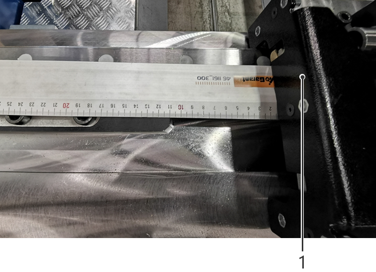 |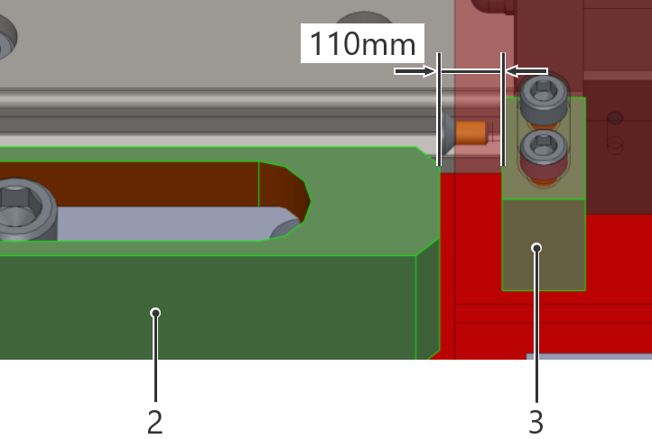

|1 Spray shield |2 X axis fixed stop
| |3 Stop of the X slide
[arabic, start=9]
. Tighten the screws on the fixed stop to 80 Nm with Loctite 243.
. Close the safety door.
Set the rear fixed stop
[arabic, start=11]
. Move the motion unit to X=3000 position.
. Open the safety door.
. Undo the screws on the rear fixed stop.
. Move the rear fixed stop to a distance of 110 mm from the stop of the X slide.
. Tighten the screws on the fixed stop to 80 Nm with Loctite 243.
. Install the bellows.
. Install the side enclosure.

== Replacing X guide carriage

* The machine’s main switch is switched off and secured against being switched on again.
Means, Tools, Materials
* A wooden crowbar.
* Standard tool set, mat. no. 0135600.
* The two guide carriages may only be replaced one after the other.
[arabic]
. Remove the side enclosure.
Preparations for replacing
the X guide carriages
[arabic, start=2]
. Remove the X bellows front and rear.
. Remove the sealing cap of the rear guide rail segment.
.Sealing cap Fig. 4‑152
[width="100%",cols="100%",options="header",]
|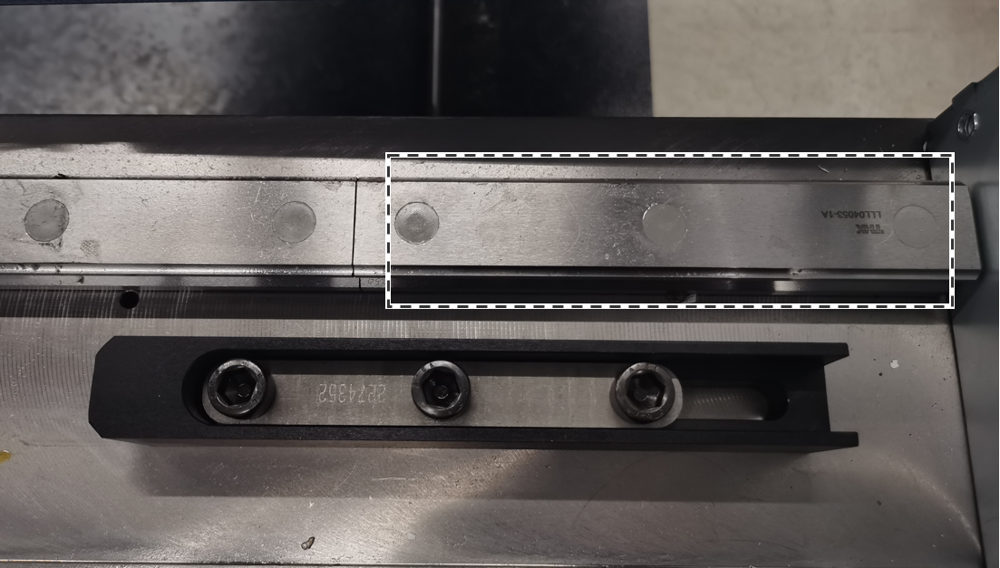

[arabic, start=4]
. Remove the rear guide rail segment.
. Disassemble the sheet metal parts in the order of 1 to 2
.Fig. 4‑153
[width="100%",cols="50%,50%",options="header",]
|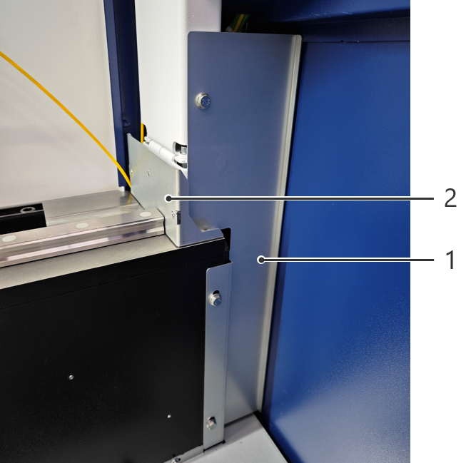 |

|1 Sheet metal part |2 Sheet metal part
[arabic, start=6]
. Remove only four screws on the support at the corner.
.Fig. 4‑154
[width="100%",cols="100%",options="header",]
|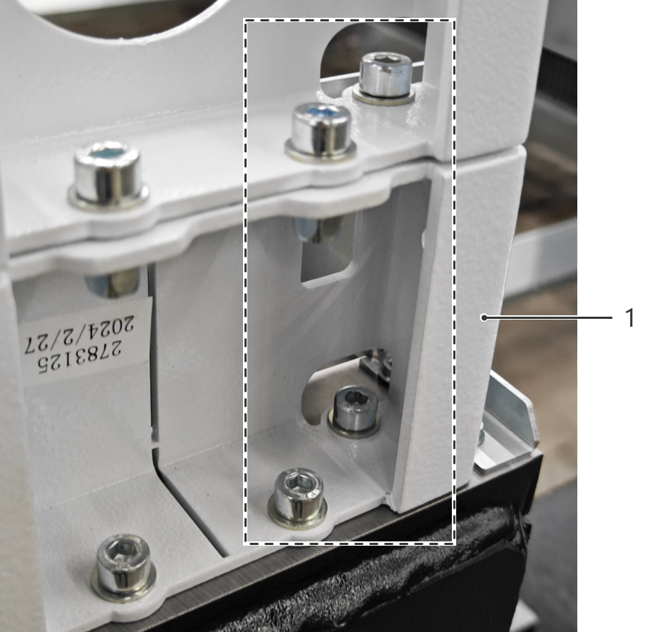

|1 Support at the front-left corner
[arabic, start=7]
. Use a suitable way to break the micro-joints of the support.
. Remove the half segment of the support.
.Fig. 4‑155
[width="100%",cols="100%",options="header",]
|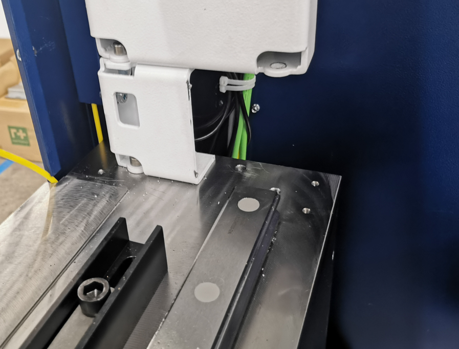

* In order to replace the X1 axis carriage, these two coversat the front-left corner must be removed.
.Fig. 4‑156
[width="100%",cols="50%,50%",options="header",]
|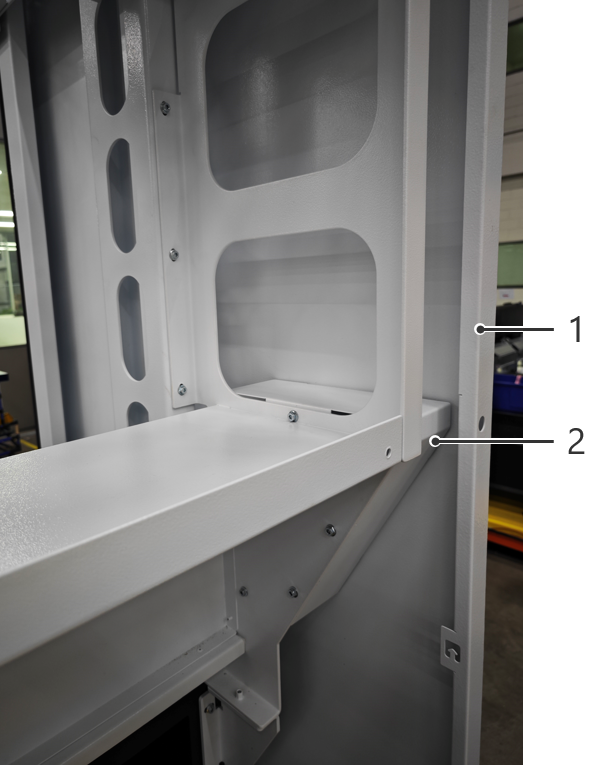 |

|1 Protective cover |2 Cover
[arabic, start=9]
. Loosen the screws on X1 and X2 flange mounts.
Replace the X guide
carriages (S02)
.Fig. 4‑157
[width="100%",cols="100%",options="header",]
|

|1 Screws, on flange mount
[arabic, start=10]
. Loosen the lock screw for X1 and X2 axes.
.Fig. 4‑158
[width="100%",cols="100%",options="header",]
|

[arabic, start=11]
. Remove the four screws on each X guide carriage.
.Fig. 4‑159
[width="100%",cols="100%",options="header",]
|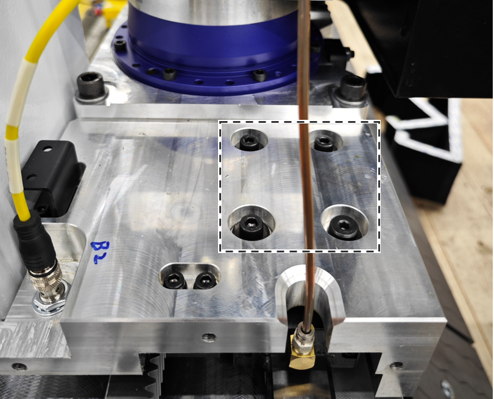

[arabic, start=12]
. Undo the lubrication line for the guide carriage at its connecting point.
. With a wooden bar under the X slide, lift the X slide millimet-er by millimeter until the guide carriage can be freely moved.
* During the up movement, be careful of the sensor collision.
.Fig. 4‑160
[width="100%",cols="100%",options="header",]
|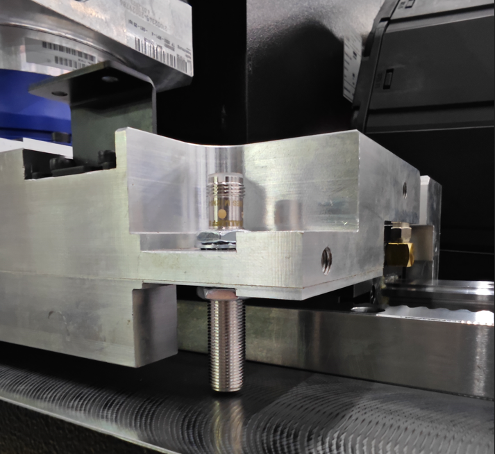

[arabic, start=14]
. Slide out the guide carriage to the front and rear.
. Slowly slide the guide carriage onto the guide rail.
While doing this take care that the ball guard rail is evenly pushed off and that the guide carriage does not jam.
.Ball guide rail Fig. 4‑161
[width="100%",cols="100%",options="header",]
|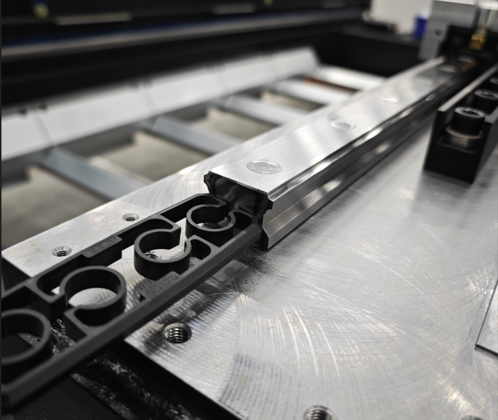

[arabic, start=16]
. Fit the old grease connector to the new guide carriage.
. Exactly position the guide carriage and lower the lifting equi-pment millimeter by millimeter (not yet completely).
. Screw in the fitting screw (1x per guide carriage).
.Fig. 4‑162
[width="100%",cols="50%,50%",options="header",]
|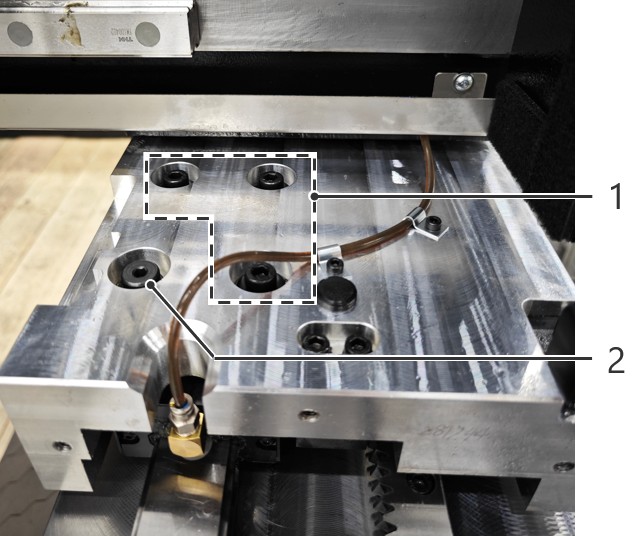 |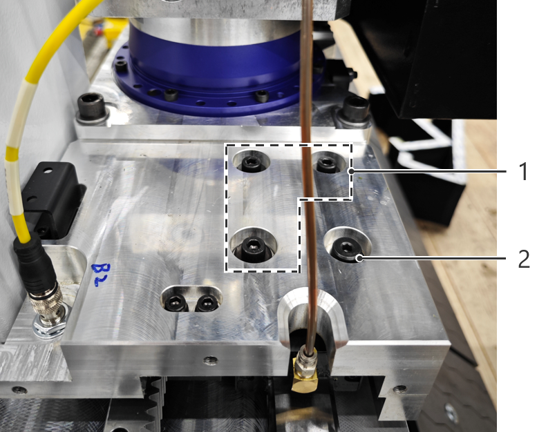

|1 Screws, 3x per guide carriage |2 Fitting screw, 1x per guide carriage
[arabic, start=19]
. Introduce the three screws to the guide carriage and gently screw them in (not yet tighten).
. Completely lower the lifting equipment.
. Manually tighten the fitting screws.
. Tighten the screws in the guide carriages to 40 Nm.
. Remove the lifting and additional equipment.
. Insert the lubrication line into the guide carriage.
. Fit the sensor.
Clearance: 2^+1^ mm.
[arabic, start=26]
. Gently press the gearbox against the rack by hand and tighten the screws on flange mount to 80 Nm.
.Fig. 4‑163
[width="100%",cols="100%",options="header",]
|

|1 Screws, on flange mount
[arabic, start=27]
. Manually tighten the lock screw.
* The lock screw of S02 machine must not be used to adjust the backlash.
.Fig. 4‑164
[width="100%",cols="100%",options="header",]
|

[arabic, start=28]
. Perform the removal steps in the reverse order.
* Torque requirement to fit the guide rail: 40 Nm.
* Install the bellows and side enclosure after everything is completed.
[arabic, start=29]
. Do this additional work:
* Setting the X axis backlash (see “link:#setting-the-x-axis-backlash[Setting the X axis back-lash]”, pg. xxx).
* Check the angularity of the motion unit (see “link:#setting-the-fine-angularity-of-the-motion-unit[Setting the fine angularity of the motion unit]”).
* Check and set the X axis reference point offset value ( see “link:#checking-and-setting-the-x-axis-reference-point-offset-value[Checking and setting the X axis reference point offs-et value]”, pg. xxx).
* Set the X axis limit switch (see “link:#setting-x-axis-limit-switch[Setting X axis limit switch]”, pg. xxx).
* Set the X axis fixed stop (see “link:#setting-x-axis-fixed-stop[Setting the X axis fixed stop]”, pg. xxx).

== Checking the gantry offset of X axis

* Motion unit can’t move with an error message with respect to the gantry offset on HMI.
* After a collision.
Means, Tools, Materials
* Torque wrench 15 Nm and 40 Nm.
* 2x mobile fixed stop, mat. no. 2790932.
[arabic]
. Press the wrench icon on HMI.
Check the gantry offset of
X axis (S02)
[arabic, start=2]
. Select “PField Parameter”.
.Fig. 4‑165
[width="100%",cols="100%",options="header",]
|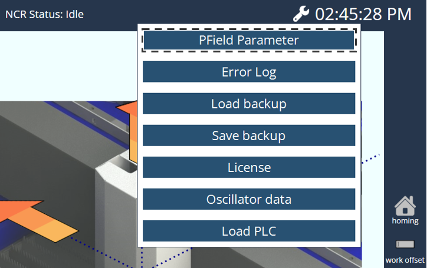

[arabic, start=3]
. Enter 426 under the “PField index” column.
.Fig. 4‑166
[width="100%",cols="100%",options="header",]
|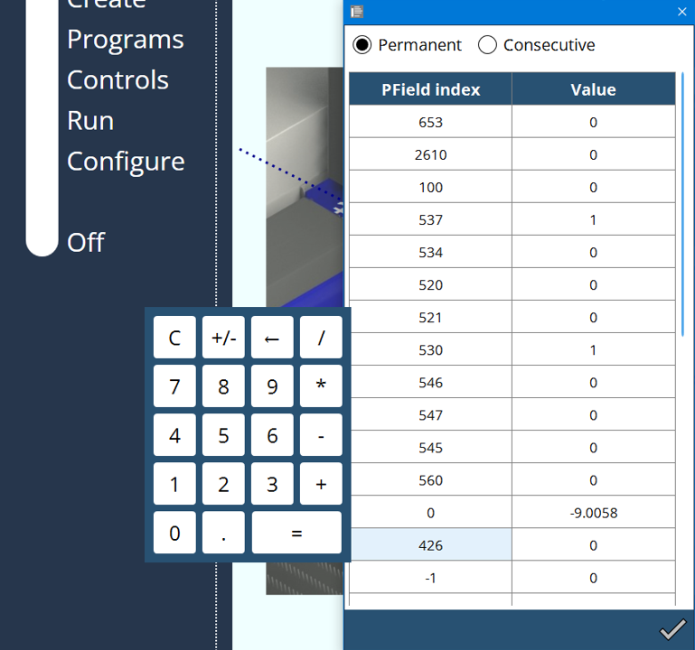

[arabic, start=4]
. Switch off the drives and then read off the value of “P426” from the screen.
P426 = X1-X2 mm.
[arabic, start=5]
. Release the three spring assemblies of the X1 axis and the three coil springs of the X2 axis.
.Fig. 4‑167
[width="100%",cols="51%,49%",options="header",]
|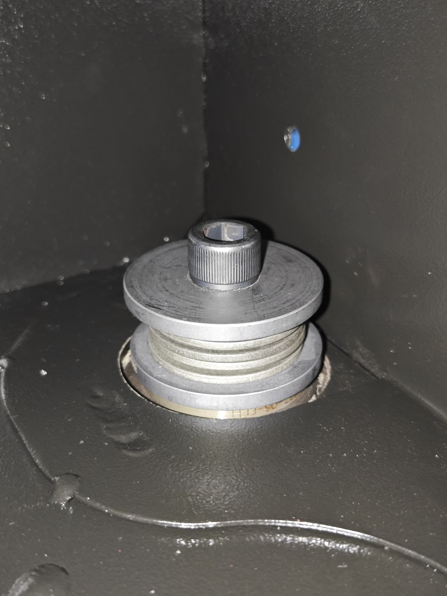 |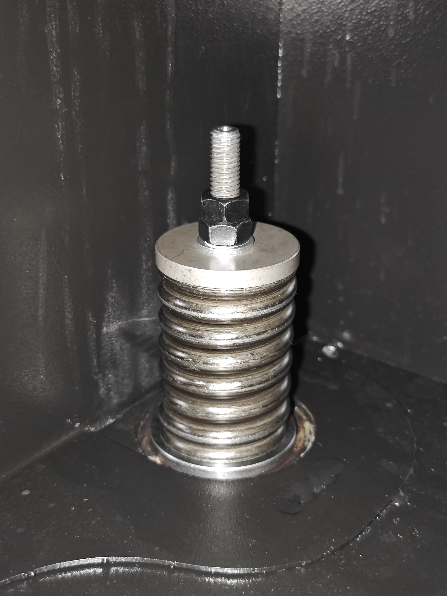

|Spring assemblies of X1 axis |Coil spring of X2 axis
[arabic, start=6]
. Hold one axis side firmly and slide the other in the required direction until the value of “P426” within the range (± 0.4mm).
. Switch on the drives.
. Move the X axis multiple times in the plus and minus directions in jog mode.
The motion unit is relieved of tension in the process.
[width="100%",cols="35%,65%",options="header",]
|image:img/image2.png[img/image2,width=192,height=33] a|

*Risk of injury due to active drive when door is open.*
* Position the two mobile fixed stops before and after the X slide.
* Set the MOTOR CURRENT LIMIT key switch to right (ON).
[arabic, start=9]
. Position 2 mobile fixed stops in front of and behind the X slide.
. Set the key switch for the motor current limit to right (ON).
.Fig. 4‑168
[width="100%",cols="100%",options="header",]
|image:img/image492.png[img/image492,width=382,height=268]

[arabic, start=11]
. Switch on drives and open the safety door.
. Acknowledge the service mode is active at the bottom-left of HMI.
.Fig. 4‑169
[width="100%",cols="100%",options="header",]
|

[arabic, start=13]
. Acknowledge the feedrate changed to 0 by PLC controller.
. With the active drives, tighten all three spring assemblies at X1 (left) to 40 Nm.
. With the active drives, tighten all three coil springs at X2 (right) to 15 Nm.
. Turn the <Motor current limit> key switch in the electrical cabinet to left.
. Remove the mobile fixed stops and clean up.
