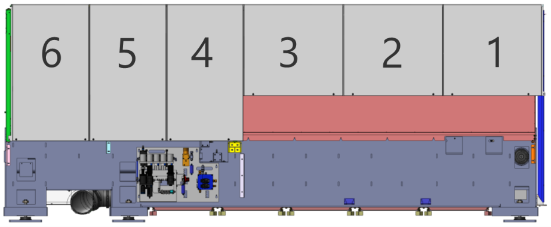
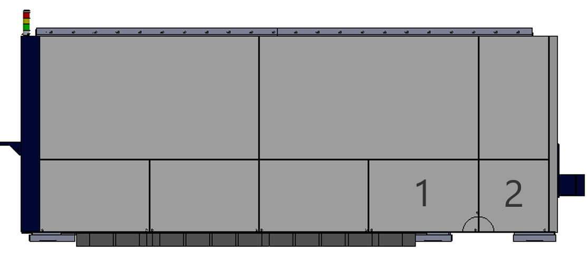
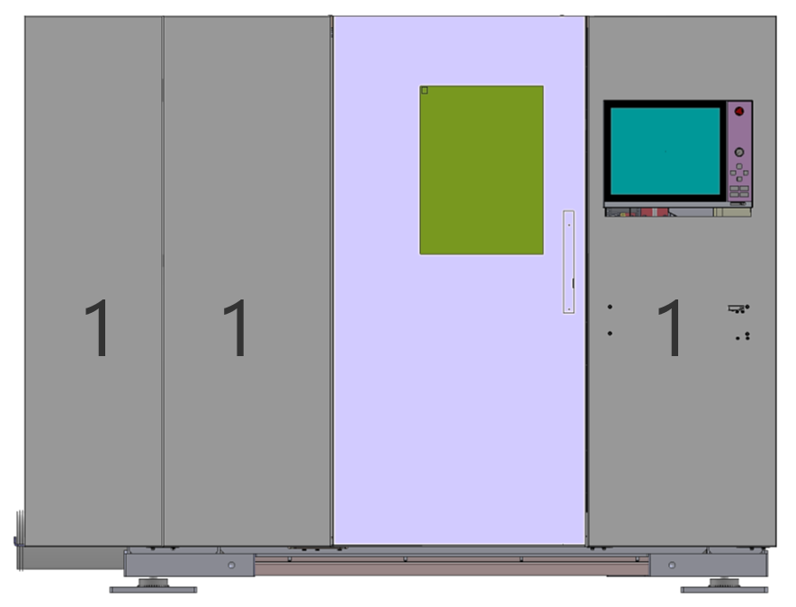
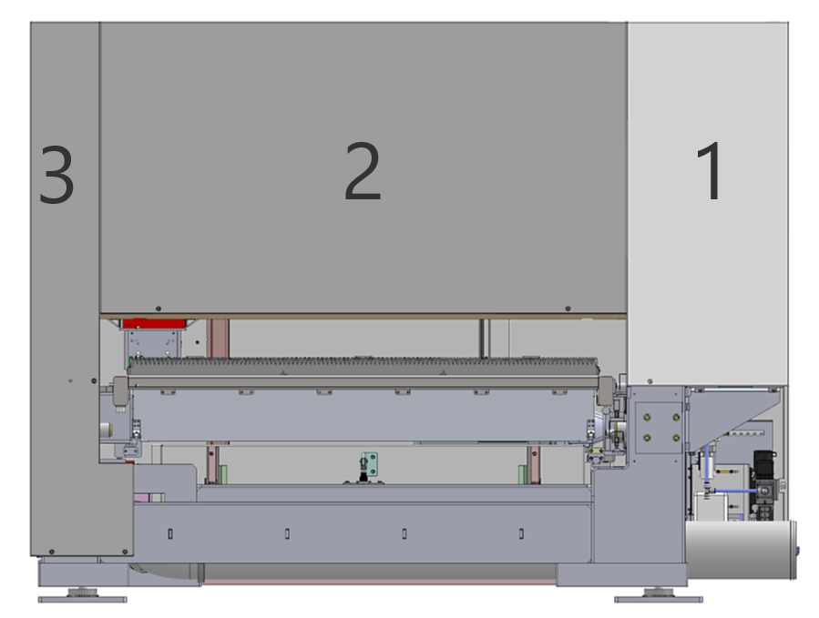
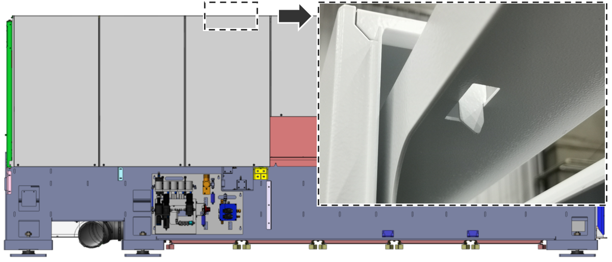
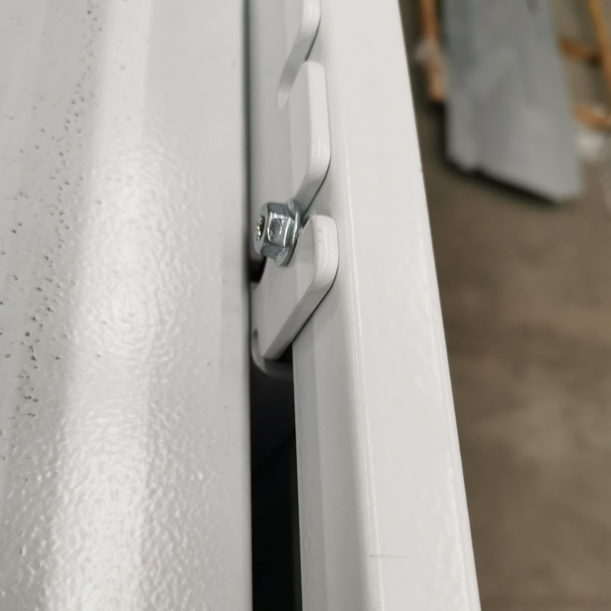
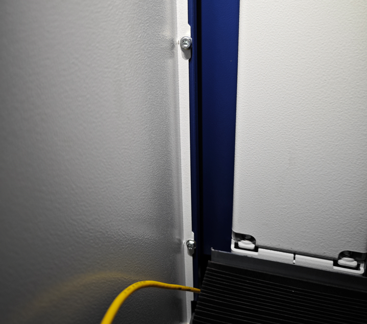
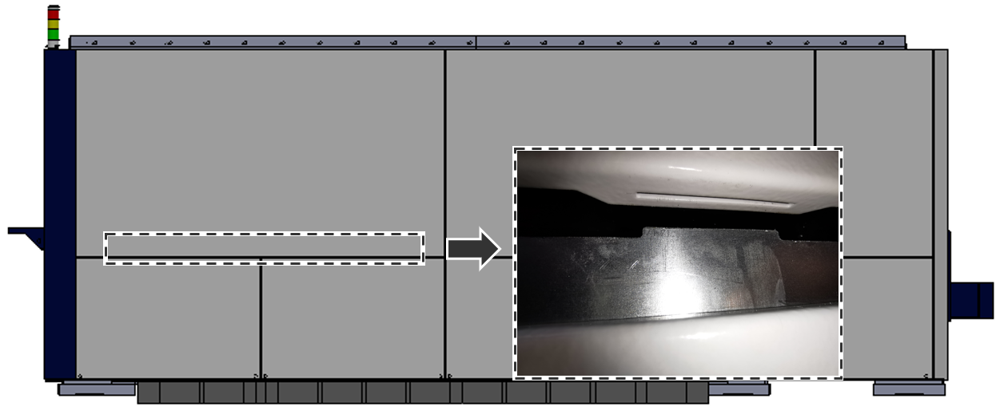
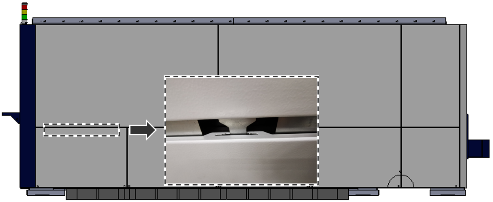

= Working on the cover

== Replacing the mechanical parts of the rear door

== Replacing the electric switch of the rear door

== Replacing the front safety door

== Removing, mounting protective plates

Plate order
.Left side of the machine Fig. 4‑192
[width="100%",cols="100%",options="header",]
|

.Right side of machine Fig. 4‑193
[width="100%",cols="100%",options="header",]
|

.Fig. 4‑194
[width="100%",cols="^50%,^50%",options="header",]
| |

|Front side of machine |Rear side of machine
* The protective plates without number can be removed separately.
[arabic]
. When removing the protective plates, always start with plate number 1.
Dismount and mount the
left side of the machine
[arabic, start=2]
. Remove the other protective plates in the specified order.
. Loosen screws on the respective protective plate.
. lift it up and off.
* No screws on the top.
.Fig. 4‑195
[width="100%",cols="100%",options="header",]
|

[arabic, start=5]
. When mounting, the protective plates are fitted in the reverseorder.
. Loosen the screws on the top.
Dismount and mount the
right side of machine, top
.Fig. 4‑196
[width="100%",cols="100%",options="header",]
|

[arabic, start=7]
. Loosen the screws on the front-right corner.
.Fig. 4‑197
[width="100%",cols="100%",options="header",]
|

[arabic, start=8]
. Lift the protective plate, thereby guiding it out of the function bar.
.Function bar Fig. 4‑198
[width="100%",cols="100%",options="header",]
|

[arabic, start=9]
. When mounting:
* Hang the protective plate on the supporting structure.
* Press the protective plates downwards and lock it into function bar.
[arabic, start=10]
. Remove the screws on the respective protective plates.
Dismount and mount the
right side of machine,
bottom
[arabic, start=11]
. Pull the protective plate downwards and remove it.
.Fig. 4‑199
[width="100%",cols="100%",options="header",]
|

* Curtain screens can be removed separately, or together with lower protective plates.
* To mount wedge mounts, only three protective lower plates need to be removed.
[arabic, start=12]
. When mounting, fit the protective plates in the reverse order.
