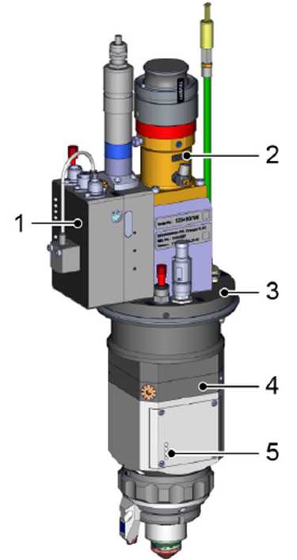
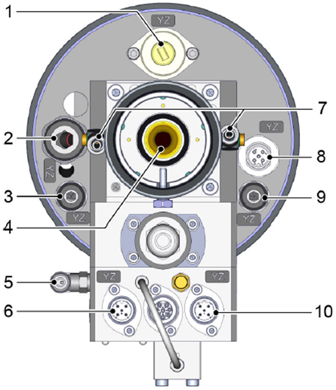
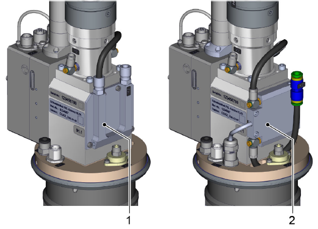
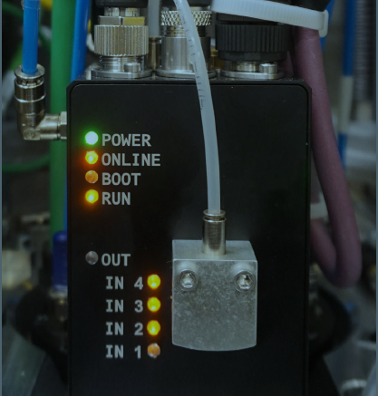
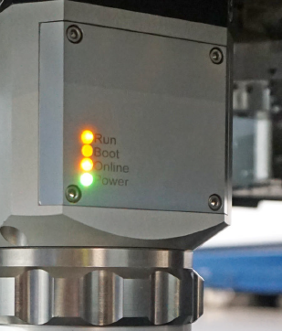
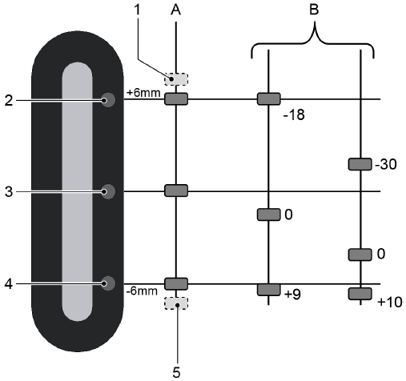

= KL59 cutting unit

== KL59 main assemblies

.Structure of the KL59 cutting unit Fig. 1‑8
[width="100%",cols="50%,50%",options="header",]
| |

|1 Adjustment unit, lens change |2 Plug receptacle
|3 Base plate with media connections |4 Adjustment mechanism for beam alignment
|5 Cutting unit |
* Two types of firmware for cutting head:
* CAN OPEN (new version).
* CAN ONLY (old version).
* Incompatible cutting heads with different firmware.
Media connections
.KL59 media connections Fig. 1‑9
[width="100%",cols="50%,50%",options="header",]
| |

|1 Sealing gas (only available from a laser power of 6 kW) |2 Cutting gas
|3 CoolLine |4 Optical laser cable
|5 Compressed air |6 CAN bus for motor of the collimation lens
|7 Water cooler |8 CAN bus for electronics of the cutting head
|9 Lateral air blast |10 24V power supply
Additional cooling with
high laser power
.KL59 cutting unit for high laser power Fig. 1‑10
[width="100%",cols="50%,50%",options="header",]
| |

|1 Cooling for 8 and 10 kW |2 Cooling for 12kW with cable connection
With the KL59 cutting unit for 12kW an additional scattered light sensor and temperature sensor are integrated.

== Luminous displays on the KL59 cutting unit

After switching on the machine or drives, the cutting unit is supplied with voltage. The drive in the cutting unit moves into the reference position.
LEDs on the adjustment
unit for the lens change
The LEDs on the housing show the status of the cutting unit.
The LEDs on the adjustment unit indicate the status of the cutting unit drive.
.LEDs of the adjustment unit for the lens change Fig. 1‑11
[width="100%",cols="100%",options="header",]
|

.Status of LEDs on the adjustment unit for the lens change Tab. 1‑4
[width="100%",cols="28%,72%",options="header",]
|*LED status* |*Status*
|*POWER (green)* |Power supply ON.
*ONLINE*
*(orange)*
CAN OPEN status:
* Continuous light – Working mode.
* Slowly flashing – Bus communication possible.
* Quickly flashing – No bus communication possible.
|*BOOT (red)* a|
Status of the bootloader. Bootloader is a separateprogram which starts the controller and updates the main program.
* Continuous light – Bootloader active.
* Off – Bootloader inactive.
|*RUN (yellow)* a|
Status of the main program.
* Continuous light – Main program active.
* Flashing – Main program is being updated.
* Off – Main program inactive.
|*OUT (yellow)* |Output for valve index pin. Illuminated if the outputis active
|*IN 4 (yellow)* |Display the contact of the swivel lever with fixed stops. Illuminates when the lever is in contact.
|*IN 3 (yellow)* |Query of the state of the index pin. Illuminated if the index pin is retracted.
|*IN 2 (yellow)* |Query which collimation lens is swiveled in. Illuminated if the lens with focal diameter of 210μm is swiveled in (f = 71.4).
|*IN 1 (yellow)* |Query which collimation lens is swiveled in. Illuminated if the lens with focal diameter of 150μm is swiveled in (f = 100).
LEDs on the cutting head
The LEDs on the cutting head indicate the status of the cutting head/CAN bus connection.
.Luminous displays for the sensor system electronics Fig. 1‑12
[width="100%",cols="100%",options="header",]
|

on the lower cutting unit
.Status display of the electronics and sensor system Tab. 1‑5
[width="100%",cols="28%,72%",options="header",]
|*LED status* |*Status*
|*RUN (yellow)* a|
Status of the main program.
* Continuous light - Main program active.
* Flashing - Main program is being updated.
* Off - Main program inactive.
|*BOOT (red)* a|
Status of the bootloader. Bootloader is a separateprogram which starts the controller and updates the main program.
* Continuous light - Bootloader active.
* Off - Bootloader inactive.
*ONLINE*
*(orange)*
|Receiving CAN telegram.
|*POWER (green)* |Power supply ON.
in the cutting head

== Lens holder status display

The position of the lens holder can be read off from the display window of the cutting unit. The focal point range is derived from this.
.Position of the lens and focal point range Fig. 1‑13
[width="100%",cols="50%,50%",options="header",]
| |

|A Lens swiveling |B Focal point range
|1 Upper fixed stop |2 Upper change position
|3 Neutral position |4 Lower change position
|5 Lower fixed stop |
