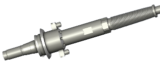
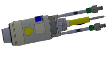
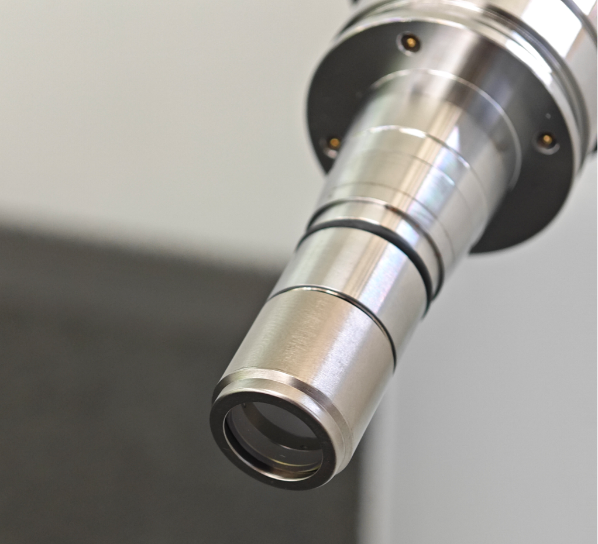
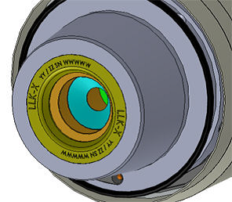

= LLK types and plug-and-socket devices

For L99 machine (FD90/91), the new LLK plug type is QD.
QD is plugged without a plug-and-socket device.
QD has no protective glass.
.L99 LLK types and plug-and-socket devices Tab. 1‑6
[width="100%",cols="30%,35%,35%",options="header",]
| |*QD* |*LLK-X*
|LLK plug | |

End cap
/Protective glass

*Inseparable protective glass*
|

|Plug-and-socket device usable |No |No
|Laser type |FD90, FD91 |FD90, FD91
|Inserting LLK |(See “link:#plugging-qd-connector-into-the-cutting-unit[Plugging QD co-nnector into the cutting unit]”, pg. xxx) |/
Chapter *2*
