*Error No:*

2.10.202

*Description*

Emergency Stop Pressed

*Causes*

Emergency Stop button pressed in Operator panel or in Pallet Operator Box or in Laser Source

MCB- F3 may have tripped

*Actions*

Check both Emergency stop button and release it.

Check connection as per Page no.15,16 in the Electrical scheme if error is not cleared

Check MCB- F3 for Trip condition.

Check Emergency contactor is in On Condition.

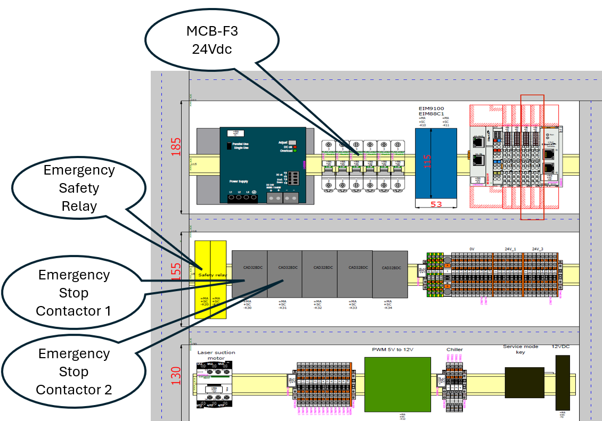

*Error No:*

2.10.454

*Description*

HMI PLC Communication Lost

*Causes*

This error occurs when there is no communication between Vulcan HMI and the controller.

MCB-F2 may have tripped

*Actions*

Check PLC controller is in Run mode.

Check ethernet cable is connected properly.

Restart Vulcan controller from the HMI.

Check MCB-F2 for Trip condition.

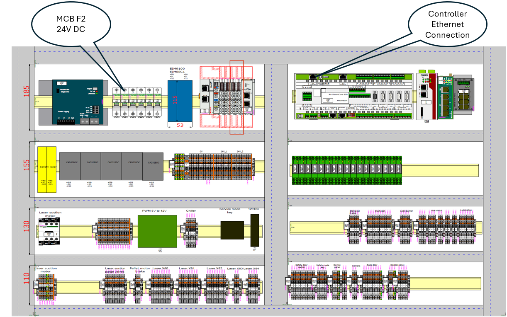

*Error No:*

2.10.605

*Description*

System Parameter Out of Range Exhaustion:PF:782

*Causes*

The Exhaust Lag time to stop parameter is set out of range.

*Actions*

The allowed range is (15secs to 7200secs).

The Parameter is available in the Configuration--Tech parameters--laser Technology - Custom Parameter3--Exhaust Lag Time to stop

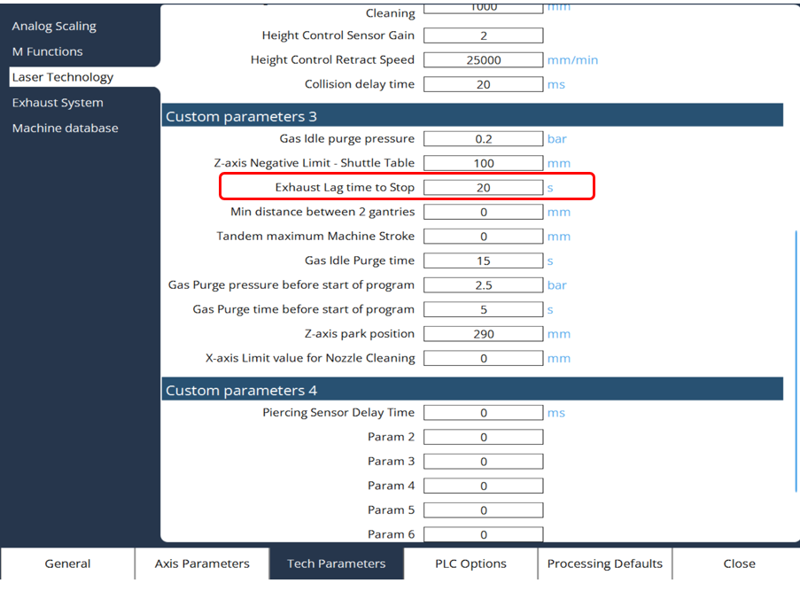

*Error No:*

2.10.806

*Description*

Safety Door Opened - Program Paused

*Causes*

Front Safety door is not closed.

Front door is opened during running.

*Actions*

Close the safety door and press Safety lock button in the operator panel.

Check connection as per Page.18 in the Electrical scheme

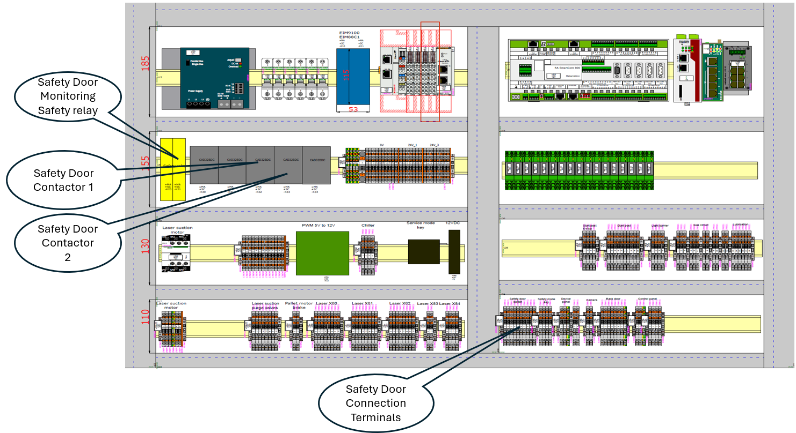

*Error No:*

2.26.5117

*Description*

Ether CAT: State polling No response from slave. Check wiring and reload machine constants/plc sa1006(Slave Address) stun known err5113

*Causes*

Ether CAT Connection may be loose or disconnected.

MCB-F6 may have tripped

*Actions*

Check Ether-cat Connection cable.

Check MCB-F6 for trip Condition.

The term sa1006 in the description indicates the slave address.

Check for the minimum slave address in the message and check the Connection.

(If suppose Slave Address sa1005 connection is loose or disconnected, then the Error message will appear for all the slave devices that is connected after the slave device with the address 1005. So, need to check first the connection of the slave device (1005). Slave device details as follows)

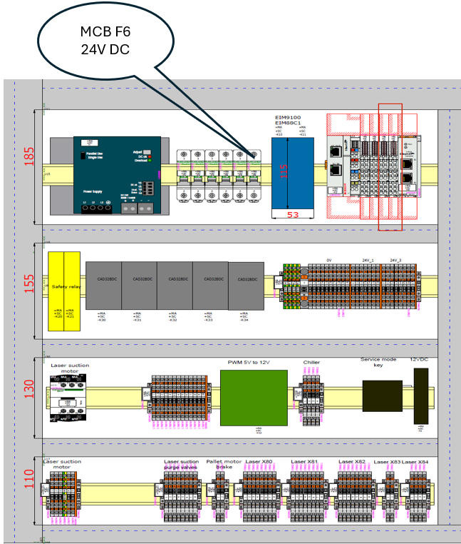

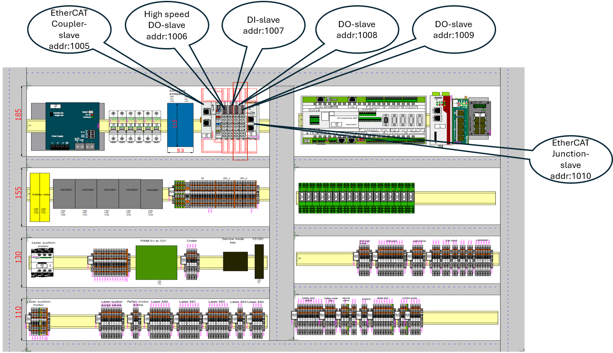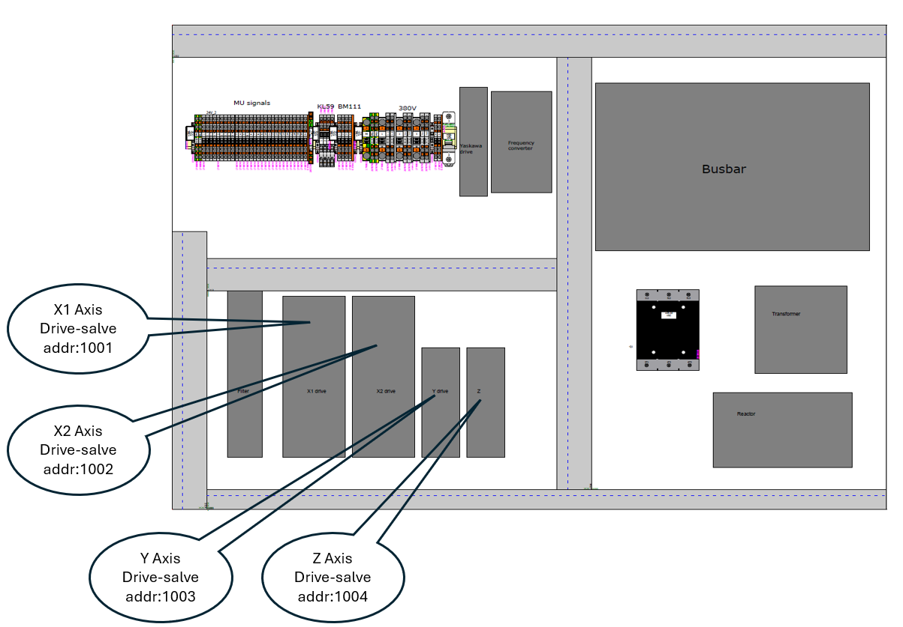

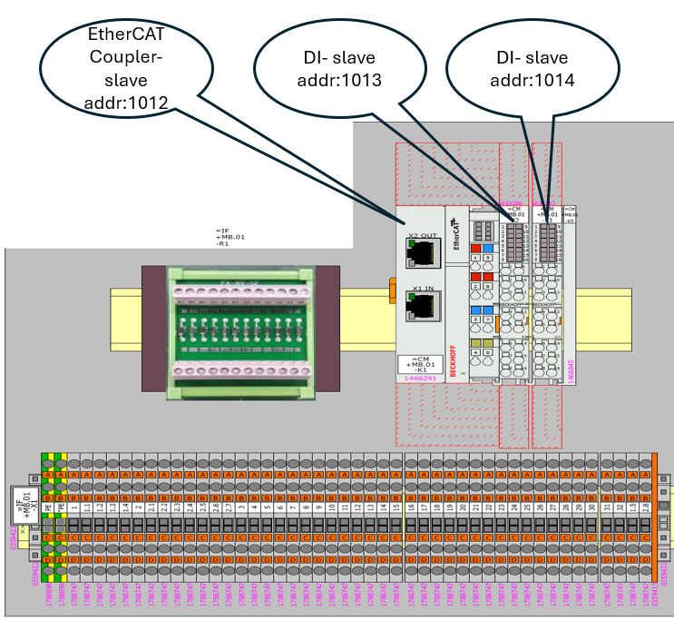

After checking the connection, go to controls page in the Vulcan and select Ether cat Master restart for restarting the communication

*Error No:*

2.1.132

*Description*

Drive isn't in the Operational state or no Process data communication! (Axis Name – X or Y or Z)

*Causes*

Ether CAT Connection for specific drive may be loose or disconnected.

*Actions*

Check Ether-cat Connection cable connection for the specific drive.

The term Axis Name in the description indicates the axis Name (X or Y or Z).

After checking the connection, go to controls page in the Vulcan and select Ether cat Master restart for restarting the communication

*Error No:*

2.26.5134

*Description*

state change not possible sa 1004 st=safeop- op

*Causes*

Ether CAT Connection for specific drive slave address may be loose or disconnected.

*Actions*

Check Ether-cat Connection cable connection for the specific drive.

The term sa1004 in the description indicates the slave address.

After checking the connection, go to controls page in the Vulcan and select Ether cat Master restart for restarting the communication

*Error No:*

2.26.5121

*Description*

Ether CAT: No or Incomplete processing data received wkc error Packet 2

*Causes*

Ether CAT Connection may be loose or disconnected.

MCB- F6 may have Tripped

*Actions*

Check Ether-cat Connection cable.

Check MCB-F6 for Trip Condition.

Check Remedy Section of Error No.2.26.5117

Go to controls page and select Ether cat Master restart for restarting the communication

*Error No:*

2.10.808

*Description*

Air Pressure Low - Program Paused

*Causes*

Compressed Air input pressure is low.

MCB -F3 may have tripped

*Actions*

Check Air compressor is On.

Check the valves are open.

Check connection as per page No.58 and 43. Device Tag =IF.01+DP-B1

Check MCB-F3 for trip Condition.

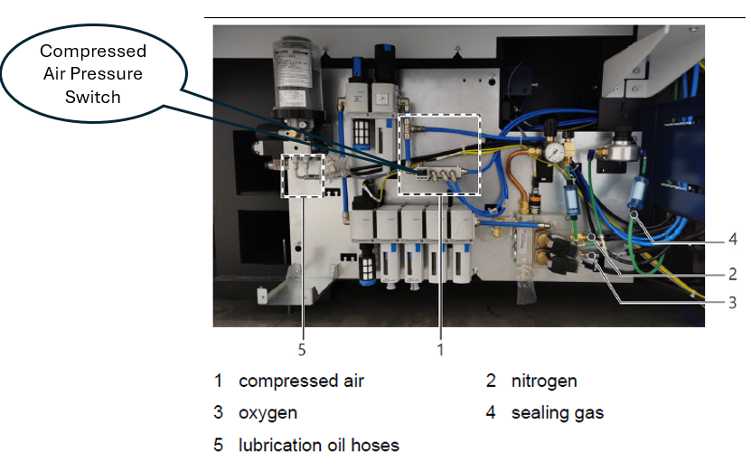

*Error No:*

2.10.819

*Description*

Light Barrier Interrupted Pallet Motion Aborted

*Causes*

Light barrier at the rear side of the machine interrupted due to someone enter inside the safe zone.

Light barrier sensor may be malfunctioning.

*Actions*

Check for any person inside the safe zone.

Reset the alarm by pressing the Ack button available in the pallet operator box.

Check the light barrier sensor feedback.

Check connection as per Page.19 in the Electrical scheme

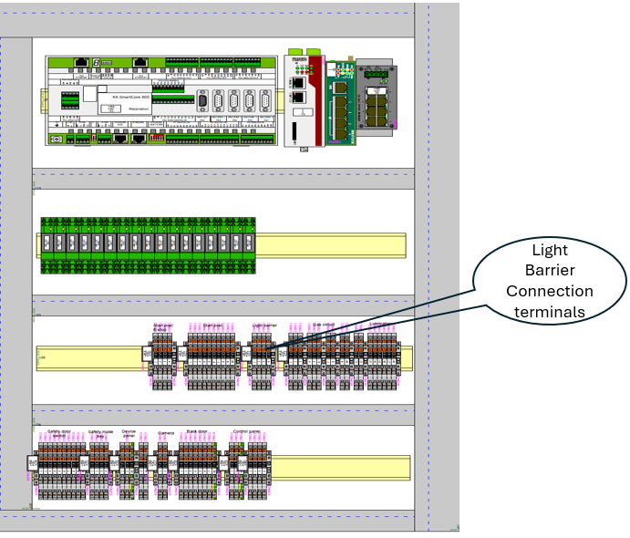

*Error No:*

2.11.1022

*Description*

Can-bus: Error-interrupt CAN1: Error Status=0x00212

Or

Can-bus: Error-interrupt CAN2: Error Status=0x00212

*Causes*

CAN Bus communication interrupted for Cutting head KL59 Height sensing unit or Focus Drive.

CAN Bus Connection may be loose or disconnected from the Cutting head KL59 Height sensing unit or Focus drive

*Actions*

Check CAN-Bus Connection cable Cutting Head KL59 Height sensing unit and Focus Drive

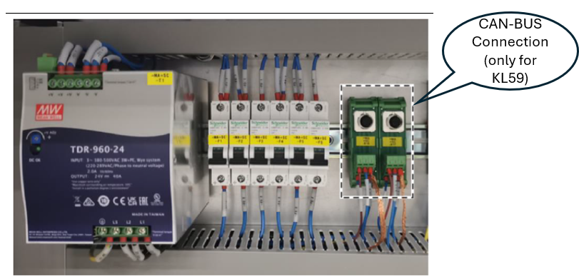

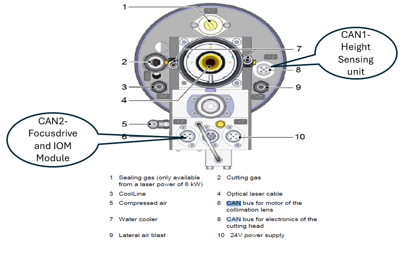

*Error No:*

2.11.1100

*Description*

Module Monitoring error CAN1: NodeID = 16

Or

Module Monitoring error CAN2: NodeID = 25

Or

Module Monitoring error CAN2: NodeID = 30

*Causes*

CAN1:NodeID=16

CAN Bus communication interrupted for Cutting head KL59 Height sensing unit.

CAN Bus Connection may be loose or disconnected from the Cutting head KL59 Height sensing unit

CAN2:NodeID=25

CAN Bus communication interrupted for Cutting head KL59 Focus drive.

CAN Bus Connection may be loose or disconnected from the Cutting head KL59 Focus drive

CAN2:NodeID=30

CAN Bus communication interrupted for Cutting head KL59 IOM module.

CAN Bus Connection may be loose or disconnected from the Cutting head KL59 IOM module

MCB-F5 may have tripped

*Actions*

Check CAN-Bus Connection cable Cutting Head KL59 Height sensing unit, Focus drive and IOM Module

Check MCB-F5 for trip condition.

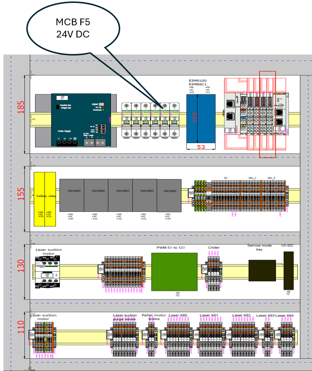

*Error No:*

2.10.2000

*Description*

CAN_OPEN Device not Found KL59 HS device not found in CAN1 NODE_ID=16

Or

CAN_OPEN Device not Found KL59 Focus not found in CAN2 NODE_ID=25

Or

CAN_OPEN Device not Found KL59 Focus not found in CAN2 NODE_ID=30

*Causes*

CAN1:NodeID=16

CAN Bus communication interrupted for Cutting head KL59 Height sensing unit.

CAN Bus Connection may be loose or disconnected from the Cutting head KL59 Height sensing unit

CAN2:NodeID=25

CAN Bus communication interrupted for Cutting head KL59 Focus drive.

CAN Bus Connection may be loose or disconnected from the Cutting head KL59 Focus drive

CAN2:NodeID=30

CAN Bus communication interrupted for Cutting head KL59 IOM module.

CAN Bus Connection may be loose or disconnected from the Cutting head KL59 IOM module

MCB-F5 may have tripped

*Actions*

Check CAN-Bus Connection cable Cutting Head KL59 Height sensing unit, Focus Drive and IOM Module

Check MCB-F5 for trip condition.

*Error No:*

2.11.10812

*Description*

CAN open: Emergency Message: CAN in error passive mode CAN2: NodeID:25

*Causes*

CAN Bus communication interrupted for Cutting head KL59 Focus Drive.

CAN Bus Connection may be loose or disconnected from the Cutting head KL59 Focus Drive

*Actions*

Check CAN-Bus Connection cable Cutting Head KL59 Focus Drive

*Error No:*

2.10.824

*Description*

Lanny Valve Under Voltage Actuator. check 24v PS

*Causes*

MCB F2 may have tripped.

Lanny Valve Supply cable may be disconnected.

*Actions*

Check whether MCB F2 is tripped. If Yes, Check for any short circuit in the 24V.

Switch On the MCB F2.

Check Lanny Valve Supply voltage Cable for any loose connection or disconnected.

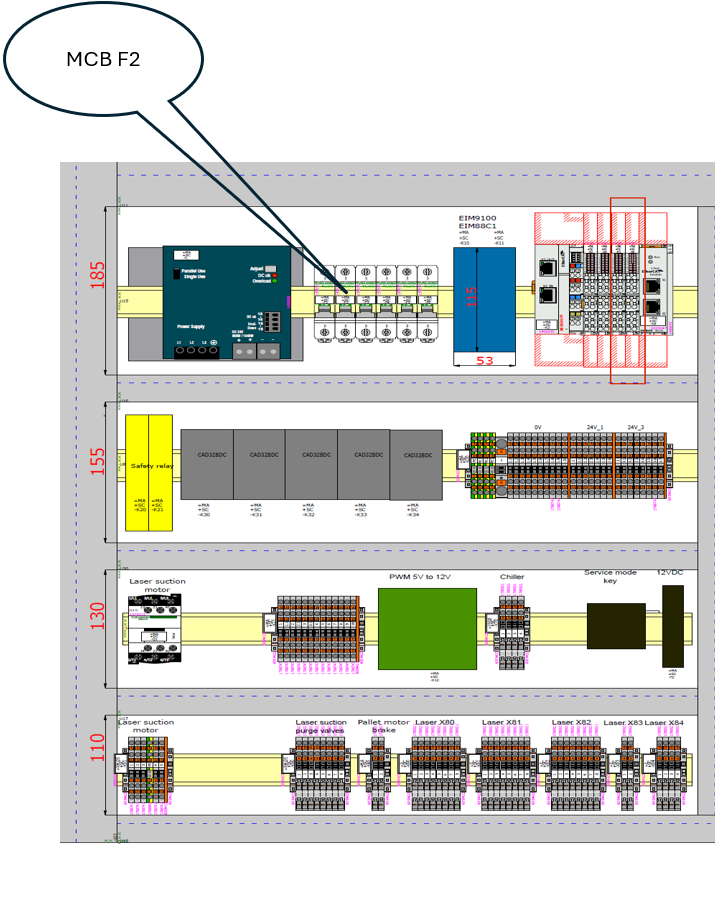

*Error No:*

2.10.7693

*Description*

KL59 - Error External 24V not present- IO module CAN 2 NODE_ID=30

*Causes*

MCB F5 may have tripped.

KL59 Supply cable may be disconnected.

*Actions*

Check whether MCB F5 is tripped. If Yes, Check for any short circuit in the 24V.

Switch On the MCB F5.

Check KL59 Supply voltage Cable for any loose connection or disconnected.

*Error No:*

2.10.826

*Description*

Pallet Door is Opened. Close and continue the program

*Causes*

Pallet Door is not closed.

Pallet close sensor may be malfunctioning

*Actions*

Check pallet door for close condition.

Check pallet door close Sensor connection as per Page.57 in the Electrical scheme

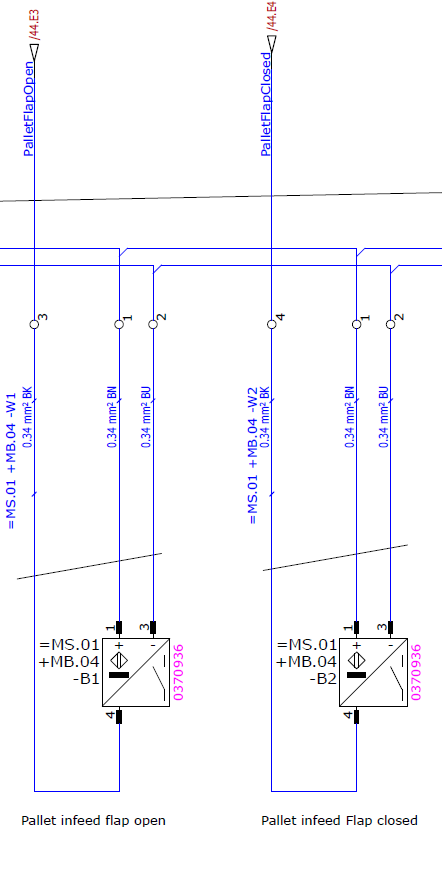

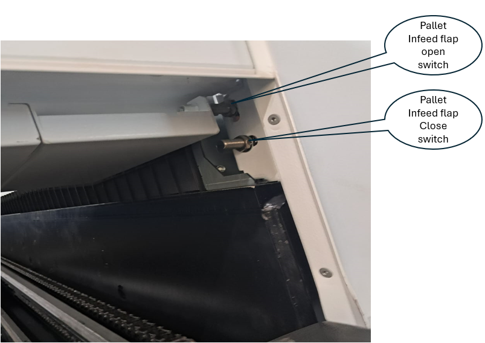

*Error No:*

2.10.827

*Description*

Pallet Door is Closed. Close and continue the program

*Causes*

Pallet Door close feedback is on during Pallet movement.

Pallet close sensor may be malfunctioning

*Actions*

Check pallet door for close condition.

Check pallet door close Sensor connection as per Page.57 in the Electrical scheme

*Error No:*

2.10.828

*Description*

Service key activated

*Causes*

Service Key is enabled.

*Actions*

Disable service key before running the program

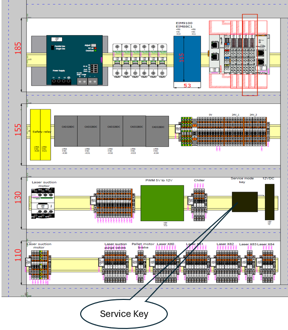

*Error No:*

2.10.814

*Description*

Program Start aborted due to Pallet position

*Causes*

Pallet not in Position for Program start.

*Actions*

Check for the pallet position physically. If not in position, move the pallet with manual operation.

Check the Pallet In position sensor as per connection diagram page62.

Any one Upper pallet forward stop switch or Lower Pallet Forward Stop switch to enabled.

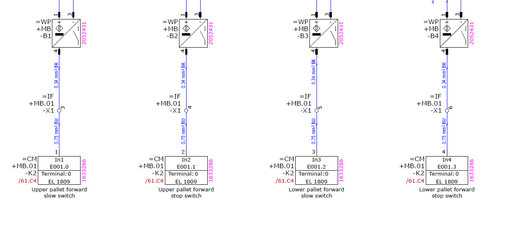

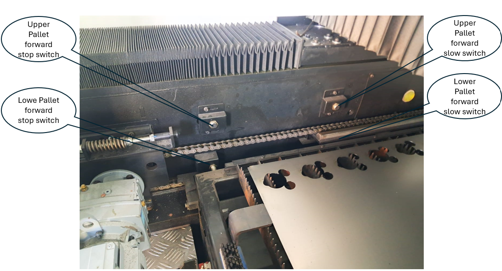

*Error No:*

2.10.815

*Description*

Axes Jog aborted due to Pallet position

*Causes*

Pallet not in Position for jog operation.

*Actions*

Check for the pallet position physically. If not in position, move the pallet with manual operation.

Check the Pallet In position sensor as per connection diagram page62.

Any one Upper pallet forward stop switch or Lower Pallet Forward Stop switch to enabled.

*Error No:*

2.10.864

*Description*

Laser - Status Error

*Causes*

Chiller May be in Error state.

Chiller Emergency stop may have pressed.

Laser source may be in error state

*Actions*

Check chiller for On Condition and there is no error in the Chiller Display.

Check Laser source is in ready condition.

Check for any alarm present in the laser Application.

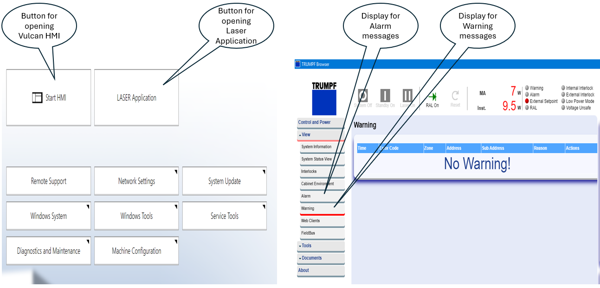

*Error No:*

2.10.865

*Description*

Laser - Emission failed

*Causes*

Emission (Laser) On feedback from Laser source not received even after 15secs of Emission On output

Emission (Laser) On Output cable may be loose or disconnected.

*Actions*

Check Laser source of any error. Check Emission (Laser) On Output cable.

Check Emission on Feedback signal

*Output Signal*

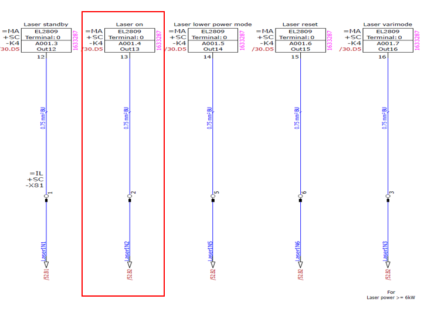

*Input Signal*

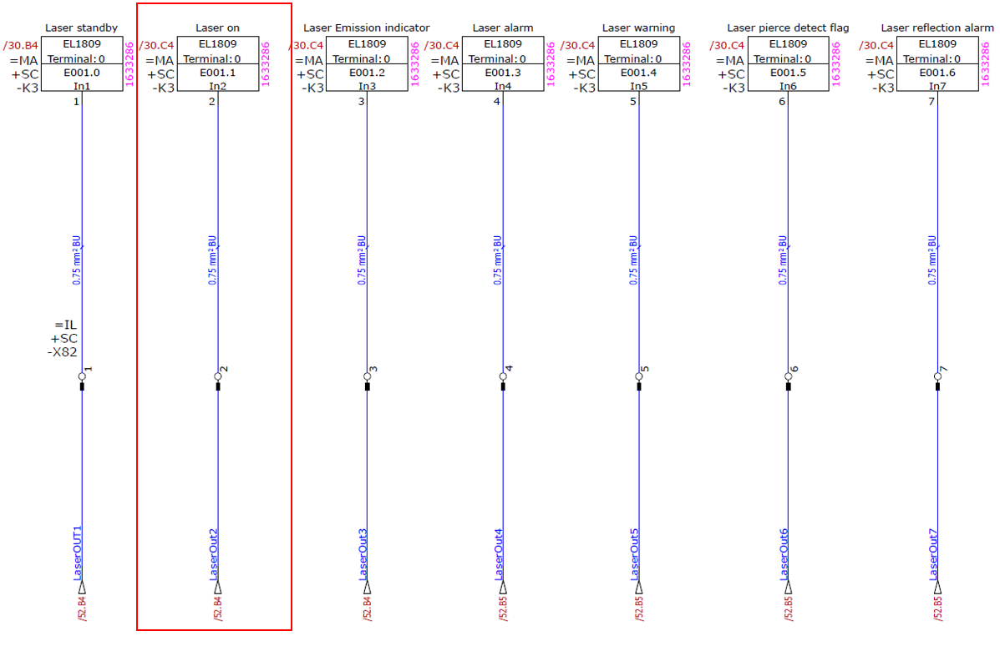

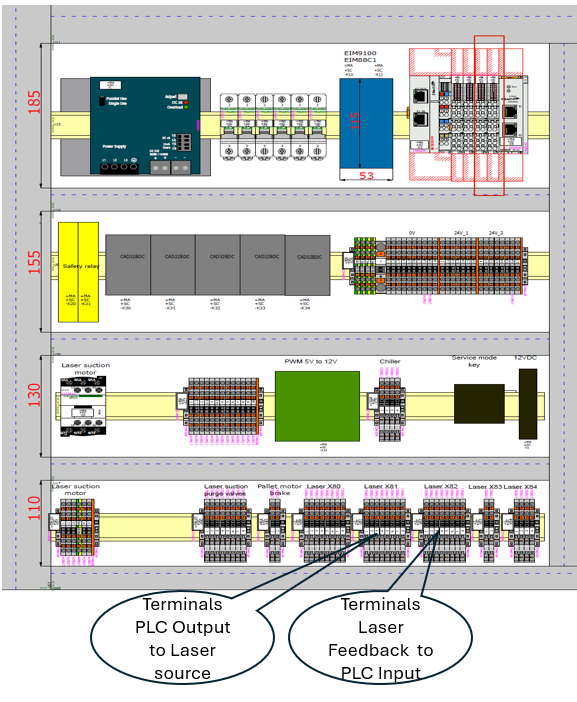

*Error No:*

2.10.7003

*Description*

Axis- Controller Enable Missing

*Causes*

Controller Enable Missing

*Actions*

Check Safety Door is in closed condition.

Check Emergency stop button. Make sure Drive Hardware enable is enabled

*Error No:*

2.10.809

*Description*

Pallet Motion is not Possible

*Causes*

Axis not in safe position for pallet Movement.

*Actions*

Goto Controls page of the Vulcan and select "Goto Park Position “and press start button.

Axis will move to park position and then start moving the pallet

*Error No:*

2.10.829

*Description*

Pallet Feed Hold is active

*Causes*

This error occurs when the pallet movement is interrupted in the middle and try to move the pallet by manual button.

*Actions*

Press Reset Button.

Start the pallet movement by pressing start button available in the Operator box near the pallet or program continue button available in the control panel HMI

*Error No:*

2.10.503

*Description*

NC Not Initialized

*Causes*

This Error occurs when there is mismatch between the PLC and Vulcan HMI Version.

No Communication between the PLC controller and HMI

*Actions*

Check with the manufacturer for correct version combination.

Check for communication between HMI and PLC

*Error No:*

2.10.504

*Description*

NC Wrong Firmware downloaded

*Causes*

This Error occurs when wrong firmware is loaded in the controller.

*Actions*

Check with the manufacturer for correct firmware version.

*Error No:*

2.10.513

*Description*

NC Automatic mode is Active

*Causes*

Auto reference or Move to Zero point is commanded during program running.

*Actions*

Make sure no other function button is pressed during program running

*Error No:*

2.10.514

*Description*

NC Axes not homed to start the Program

*Causes*

Program start button is pressed before doing Homing.

*Actions*

Select Homing in the setup page of the Vulcan and press start button

*Error No:*

2.10.816

*Description*

External Start Stop Btn Activated

*Causes*

The button in the Vulcan Touch is deactivated through the machine configuration.

*Actions*

Reset and start the program with External start button available on the operator panel.

*Error No:*

2.10.817

*Description*

Nitrogen Pressure Low - Program Paused

*Causes*

Nitrogen Valve (External) may be in close condition.

Nitrogen Bundle/Cylinder may be empty

*Actions*

Check nitrogen valve (External) is open

Check Nitrogen Bundle/Cylinder Pressure. Replace the Cylinder/Bundle if required.
